# Technical Specification

# 1. Introduction

## 1.1 EXECUTIVE SUMMARY

### 1.1.1 Project Overview

The **Artifact7** project is a minimal Node.js tutorial application designed to demonstrate the foundational patterns of building an HTTP service using the Node.js runtime. The project exposes exactly one HTTP endpoint, `/hello`, which returns the plain-text response "Hello world" to any calling HTTP client. The originating requirement, captured verbatim from the project sponsor, is: *"Create a Node.js tutorial project that features one endpoint '/hello' that returns 'Hello world' to the calling HTTP client."*

The repository (`github.com/shalini690/Artifact7.git`) is currently in a greenfield state: it contains only a `README.md` file declaring the project title `# Artifact7` and a single git commit titled "Initial commit." Consequently, this Technical Specification is a **forward-looking design document** that defines the system to be built rather than a description of an existing implementation.

The project is deliberately scoped to be the smallest possible runnable example of a Node.js HTTP server. This minimalism is not a limitation but a feature: it allows learners to comprehend every line of code and every architectural decision without the cognitive overhead of incidental complexity.

### 1.1.2 Core Business Problem

Artifact7 does not address a commercial business problem; it addresses a **pedagogical problem**. New developers approaching Node.js often encounter learning materials that either oversimplify (to the point of being non-functional) or overcomplicate (by introducing dependencies, frameworks, and tooling before the fundamentals are clear). Artifact7 occupies the precise middle ground: a fully functional, runnable, and standards-compliant HTTP server that fits comfortably within a single source module.

### 1.1.3 Key Stakeholders and Users

| Stakeholder | Role | Interaction with System |
|---|---|---|
| Novice Developers | Primary learners | Clone, run, and study the source code |
| Technical Instructors | Reference users | Cite or extend the example in coursework |
| HTTP Clients | Runtime consumers | Issue GET requests to `/hello` and receive the response |
| Project Maintainer | Contributor | Authors, maintains, and extends the codebase |

### 1.1.4 Expected Business Impact and Value Proposition

Because Artifact7 is a tutorial artifact rather than a commercial product, "business impact" is measured in educational outcomes rather than revenue or operational efficiency.

| Value Dimension | Description |
|---|---|
| Educational Value | Provides a verifiable "Hello world" baseline in Node.js |
| Extensibility | Serves as a foundation for follow-on tutorials (routing, middleware, persistence) |
| Onboarding Speed | Enables a learner to run a working HTTP server within minutes |
| Reference Quality | Establishes clean code patterns suitable for citation in derivative work |

---

## 1.2 SYSTEM OVERVIEW

### 1.2.1 Project Context

#### 1.2.1.1 Business Context and Market Positioning

Artifact7 is positioned as an **instructional artifact** rather than a commercial product. It does not compete in any market and has no revenue model. Its conceptual "market" is the corpus of educational Node.js resources, where it offers a minimalist, single-endpoint demonstration that complements (rather than replaces) more comprehensive tutorials such as those provided by the Node.js Foundation and the Express.js documentation.

#### 1.2.1.2 Current System Limitations

There is **no predecessor system**. Inspection of the repository confirms that only a `README.md` file exists at the root, containing solely the heading `# Artifact7`. There are no source files, no package manifest, no configuration files, no subdirectories beyond `.git/`, and a git history consisting of a single "Initial commit." Consequently:

- There are no legacy limitations to overcome
- There are no migration considerations
- There are no backward-compatibility constraints
- There is no technical debt to remediate

#### 1.2.1.3 Integration with Existing Enterprise Landscape

The system is **fully standalone**. It has no upstream data sources, no downstream consumers in production, and no integration touchpoints with enterprise services such as identity providers, message brokers, databases, or monitoring platforms. The only "integration" is the HTTP wire-protocol contract between the server and a calling client.

### 1.2.2 High-Level Description

#### 1.2.2.1 Primary System Capabilities

The system delivers the following capabilities, each of which is observable from the perspective of an HTTP client:

| Capability | Description |
|---|---|
| HTTP Listening | Bind to a TCP port and accept incoming HTTP requests |
| Route Resolution | Match the request path `/hello` to a designated handler |
| Response Generation | Emit an HTTP 200 response with the body "Hello world" |
| Process Lifecycle | Start cleanly via a documented command and remain available until terminated |

#### 1.2.2.2 Major System Components

A minimal Node.js HTTP service of this nature is composed of the following conceptual components:

| Component | Responsibility |
|---|---|
| Application Entry Point | Bootstraps the process and initializes the server |
| HTTP Server | Listens for incoming connections on a TCP port |
| Route Handler | Implements the logic for the `/hello` endpoint |
| Package Manifest | Declares project metadata, scripts, and any dependencies |

The following diagram illustrates the conceptual interaction model between the calling client and the Artifact7 process:

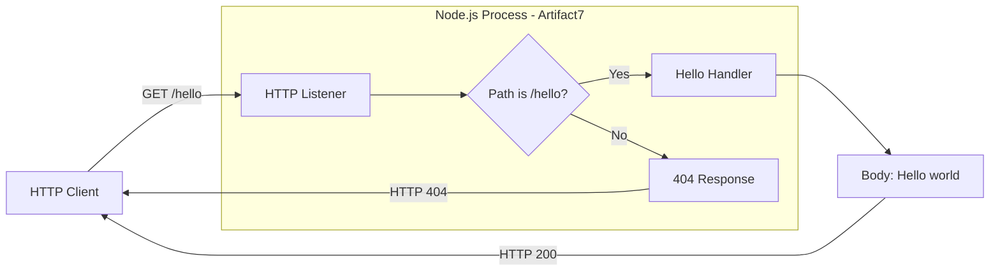

#### 1.2.2.3 Core Technical Approach

The technical approach centers on the **Node.js runtime**, which provides native, asynchronous I/O primitives well-suited to HTTP service implementations. Two viable implementation strategies are available, and the implementation phase will select one:

| Approach | Characteristics | Trade-offs |
|---|---|---|
| Vanilla `http` Module | Built-in Node.js module; zero external dependencies | Maximum transparency; slightly more verbose routing |
| Express.js Framework | Single dependency providing declarative routing | Industry-standard idioms; introduces an abstraction layer |

The user-provided requirement specifies "Node.js" but does **not** mandate a specific framework. Either approach satisfies the literal requirement; subsequent sections of this Technical Specification will document the chosen approach explicitly and justify the selection.

### 1.2.3 Success Criteria

#### 1.2.3.1 Measurable Objectives

| Objective | Target |
|---|---|
| Endpoint Correctness | GET `/hello` returns HTTP 200 with body "Hello world" |
| Startup Success | Server starts via a single documented command without errors |
| Setup Friction | A learner completes clone → install → run in ≤ 5 minutes |
| Source Footprint | Implementation fits within a single conceptual module |

#### 1.2.3.2 Critical Success Factors

The following factors are essential to achieving the project's educational mission:

- **Code Readability**: Source code must be clear and self-documenting, suitable for line-by-line study by a novice developer
- **Minimal Setup**: No environment configuration, secrets, or external services required beyond a Node.js installation
- **Deterministic Behavior**: Response content and status code must be predictable across all valid invocations
- **Cross-Platform Operability**: The server must run on standard developer operating systems (Linux, macOS, Windows) without modification

#### 1.2.3.3 Key Performance Indicators (KPIs)

Because Artifact7 is a tutorial artifact without production telemetry, the following KPIs are framed as **expected targets** for a minimal Node.js HTTP server rather than measured operational metrics. No production SLAs, throughput targets, or user-volume commitments are made.

| KPI | Expected Target | Rationale |
|---|---|---|
| Functional Correctness | 100% | Endpoint must always return the expected response |
| Cold-Start Time | < 1 second | Typical for a minimal Node.js process |
| Tutorial Run Command | Single command | `npm start` or `node <entry>` should suffice |
| External Runtime Dependencies | ≤ 1 | Either zero (vanilla `http`) or one (Express.js) |

---

## 1.3 SCOPE

### 1.3.1 In-Scope Elements

#### 1.3.1.1 Core Features and Functionalities

The following capabilities are explicitly committed to the implementation. They represent the must-have, primary, essential, and key items required by the project sponsor:

| Feature Category | In-Scope Items |
|---|---|
| HTTP Endpoint | A single GET endpoint at the path `/hello` |
| Response Payload | The literal plain-text response "Hello world" |
| Server Lifecycle | Process startup, port binding, and graceful operation |
| Documentation | A `README.md` explaining how to run and call the service |

#### 1.3.1.2 Primary User Workflows

The system supports exactly **one** user-facing workflow, depicted below:

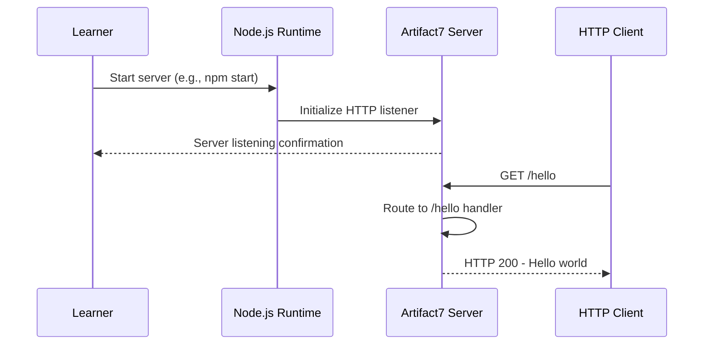

#### 1.3.1.3 Essential Integrations and Technical Requirements

| Requirement Type | Specification |
|---|---|
| Runtime | Node.js (modern LTS version) |
| Transport Protocol | HTTP over TCP |
| External Services | None |
| Persistent Storage | None |

#### 1.3.1.4 Implementation Boundaries

The boundaries of the system define what the implementation is responsible for and the populations it serves:

| Boundary Type | Coverage |
|---|---|
| System Boundary | A single Node.js process listening on one HTTP port |
| User Groups | Tutorial learners and any standards-compliant HTTP clients |
| Geographic Scope | Local development environments; no deployment region specified |
| Data Domain | None — the response is a fixed static string |

### 1.3.2 Out-of-Scope Elements

#### 1.3.2.1 Explicitly Excluded Capabilities

The following capabilities are **deliberately excluded** from the project. Any of them may be appropriate for production systems but would obscure the pedagogical intent of this tutorial:

| Excluded Category | Specific Exclusions |
|---|---|
| Security | Authentication, authorization, HTTPS/TLS, security headers, CORS |
| Additional Endpoints | Any path other than `/hello`; any HTTP method other than GET |
| Data Layer | Databases, caches, file persistence, ORMs, migrations |
| Operational Tooling | Logging frameworks, metrics, distributed tracing, APM |
| Deployment Infrastructure | Docker, Kubernetes, PM2, clustering, load balancers |
| Quality Engineering | Automated test suites, linting configuration, CI/CD pipelines |
| Configuration Management | Environment files, secret stores, feature flags |
| Internationalization | Localized, templated, or content-negotiated responses |
| API Documentation Tooling | OpenAPI/Swagger specifications, generated docs |
| Frontend | Any user interface beyond the HTTP response payload |

#### 1.3.2.2 Future Phase Considerations

While not in the initial scope, the following extensions are natural follow-on tutorials that could be authored after Artifact7 is complete. They are listed here to clarify that their absence is intentional, not an oversight:

| Future Phase | Description |
|---|---|
| Additional Routes | Demonstrate path parameters, query strings, and HTTP method variation |
| Middleware Patterns | Introduce Express middleware composition |
| Automated Testing | Add Jest or Mocha test coverage for the endpoint |
| Containerization | Package the service as a Docker image |
| Structured Logging | Integrate a logging library such as Pino or Winston |

#### 1.3.2.3 Unsupported Use Cases

The following use cases are explicitly **unsupported** and should not be attempted with Artifact7 in its tutorial form:

- Production deployment serving real end users
- Handling of authenticated or session-bearing requests
- Persistent storage of any client-supplied data
- High-throughput or low-latency SLA commitments
- Compliance-regulated workloads (PCI, HIPAA, GDPR-regulated data processing)
- Multi-tenant or multi-region operation
- Integration as a microservice within a larger production system

#### 1.3.2.4 Integration Points Not Covered

Because Artifact7 is fully standalone, the following integration categories are entirely outside the project's responsibility:

| Integration Category | Status |
|---|---|
| External APIs (consumed) | Not in scope — no outbound calls |
| External APIs (exposed beyond `/hello`) | Not in scope — only one endpoint |
| Message Queues / Event Buses | Not in scope — no asynchronous messaging |
| Identity Providers | Not in scope — no authentication |

---

#### References

**Files Examined:**
- `README.md` — Verified to contain only the single-line project title `# Artifact7`; used to confirm the greenfield (pre-implementation) state of the repository and to establish the project identifier
- `/` (repository root) — Confirmed to contain only `README.md` as a tracked file alongside the `.git/` metadata directory; established that no source code, package manifest (`package.json`), configuration files, environment files, Dockerfile, CI/CD definitions, or subdirectories currently exist

**Repository Metadata Consulted:**
- Git history — Single "Initial commit" (`043ff26`); verified the absence of any prior implementation iterations
- Remote origin — `github.com/shalini690/Artifact7.git`; used to establish repository identity
- Default branch — `main`; used to confirm the development trunk

**Authoritative Requirement Source:**
- User-provided functional requirement: *"Can you create a nodejs tutorial project that features one end point '/hello' that returns 'Hello world' to the calling HTTP client?"* — Treated as the canonical source of truth for the system's functional intent, scope boundaries, and the literal endpoint path and response content

# 2. Product Requirements

This section decomposes the **Artifact7** Node.js tutorial project into discrete, testable features, derived from the canonical user requirement: *"Can you create a nodejs tutorial project that features one end point '/hello' that returns 'Hello world' to the calling HTTP client?"* Each feature is captured with full metadata, atomic functional requirements, dependency relationships, and implementation considerations. Because the repository is currently in a greenfield state (only a placeholder `README.md` exists), all requirements documented below are **forward-looking design specifications** for the system to be built, not descriptions of existing behavior.

## 2.1 FEATURE CATALOG

The Artifact7 system comprises four discrete features that collectively satisfy the user-provided functional requirement and align with the in-scope items documented in §1.3.1.1. Features are intentionally minimized in count and surface area to preserve the pedagogical clarity of the tutorial.

### 2.1.1 F-001: HTTP Server Initialization

#### 2.1.1.1 Feature Metadata

| Attribute | Value |
|---|---|
| Unique ID | F-001 |
| Feature Name | HTTP Server Initialization |
| Feature Category | Network / Runtime Infrastructure |
| Priority Level | Critical |
| Status | Proposed |

#### 2.1.1.2 Description

**Overview.** This feature provides the foundational HTTP listener that binds to a TCP port and accepts incoming HTTP connections within the Node.js process. It establishes the network-layer substrate upon which all request handling depends. This capability is enumerated as **HTTP Listening** in the system capabilities table (§1.2.2.1) and is realized by the **HTTP Server** component identified in §1.2.2.2.

**Business Value.** Because Artifact7 is a pedagogical artifact rather than a commercial product, business value is measured in educational outcomes. The HTTP server initialization step is the first concrete demonstration of Node.js's native asynchronous I/O primitives — exposing learners to the core mechanic that distinguishes Node.js from other server runtimes.

**User Benefits.** Novice developers gain a concrete, runnable example of how a Node.js process becomes a network service. Technical instructors gain a citable baseline for explaining the request/response cycle without the cognitive overhead of frameworks, middleware, or configuration.

**Technical Context.** The system delivers this capability via either the built-in `http` module (vanilla Node.js, zero external dependencies) or the Express.js framework (one external dependency, declarative routing). Both approaches satisfy the literal requirement; the implementation phase will document the chosen approach and justify the selection.

#### 2.1.1.3 Dependencies

| Dependency Type | Specification |
|---|---|
| Prerequisite Features | None — F-001 is foundational |
| System Dependencies | Node.js runtime (modern LTS version) |
| External Dependencies | None (vanilla) or Express.js (framework path) |
| Integration Requirements | TCP port availability on the host operating system |

---

### 2.1.2 F-002: Hello World Endpoint (`/hello`)

#### 2.1.2.1 Feature Metadata

| Attribute | Value |
|---|---|
| Unique ID | F-002 |
| Feature Name | Hello World Endpoint |
| Feature Category | HTTP Endpoint / Request Handling |
| Priority Level | Critical |
| Status | Proposed |

#### 2.1.2.2 Description

**Overview.** F-002 is the canonical user-facing feature of Artifact7. It implements route resolution and response generation for exactly one path: `GET /hello`. The endpoint returns an HTTP 200 response carrying the literal plain-text body `Hello world`. Requests to any other path or using any other HTTP method are explicitly out-of-scope and result in a 404 response per the conceptual interaction model in §1.2.2.2.

**Business Value.** This feature is the verbatim, non-negotiable functional requirement issued by the project sponsor. Its correctness is the primary pass/fail criterion for the project's success.

**User Benefits.** HTTP clients receive a deterministic, easily verifiable response that confirms the server is operational and the request-routing logic is correctly wired. Novice developers can observe the smallest possible mapping from URL path to handler function.

**Technical Context.** The endpoint is realized by the **Route Handler** component (§1.2.2.2). It depends entirely on the HTTP listener established by F-001 and contributes no stateful behavior — the response body is a fixed static string, and there is no data domain (§1.3.1.4).

#### 2.1.2.3 Dependencies

| Dependency Type | Specification |
|---|---|
| Prerequisite Features | F-001 (HTTP Server Initialization) |
| System Dependencies | Node.js HTTP request/response APIs |
| External Dependencies | None beyond those introduced by F-001 |
| Integration Requirements | Standards-compliant HTTP/1.1 wire protocol |

---

### 2.1.3 F-003: Process Lifecycle Management

#### 2.1.3.1 Feature Metadata

| Attribute | Value |
|---|---|
| Unique ID | F-003 |
| Feature Name | Process Lifecycle Management |
| Feature Category | Operational / Runtime |
| Priority Level | High |
| Status | Proposed |

#### 2.1.3.2 Description

**Overview.** This feature governs how the Node.js process is started, how it remains available to serve requests, and how it terminates. It corresponds to the **Process Lifecycle** capability described in §1.2.2.1 — *"Start cleanly via a documented command and remain available until terminated."* It also addresses the in-scope item *"Server Lifecycle: Process startup, port binding, and graceful operation"* from §1.3.1.1.

**Business Value.** Reliable startup behavior is the single greatest contributor to a low-friction tutorial experience. The associated success criterion (§1.2.3.1) targets a learner being able to complete the *clone → install → run* sequence in five minutes or fewer.

**User Benefits.** Learners can run the server with a single command (`npm start` or `node <entry>`) without prior knowledge of process supervisors, clustering, or daemonization. The deterministic startup behavior reinforces the principle that minimal Node.js services have minimal operational surface area.

**Technical Context.** This feature is realized primarily by the **Application Entry Point** component (§1.2.2.2), which bootstraps the process and initializes the HTTP server. Production-grade process management (PM2, systemd, Docker, Kubernetes) is explicitly out of scope per §1.3.2.1.

#### 2.1.3.3 Dependencies

| Dependency Type | Specification |
|---|---|
| Prerequisite Features | F-001 (HTTP Server Initialization) |
| System Dependencies | Node.js runtime; host OS shell and process model |
| External Dependencies | npm CLI (only if `npm start` script is used) |
| Integration Requirements | Package manifest (`package.json`) declaring the start script |

---

### 2.1.4 F-004: Project Documentation (README)

#### 2.1.4.1 Feature Metadata

| Attribute | Value |
|---|---|
| Unique ID | F-004 |
| Feature Name | Project Documentation (README) |
| Feature Category | Documentation / Developer Experience |
| Priority Level | High |
| Status | In Development |

#### 2.1.4.2 Description

**Overview.** F-004 covers the `README.md` file that explains how to run Artifact7 and how to call its endpoint. Documentation is explicitly enumerated as an in-scope deliverable in §1.3.1.1 — *"A `README.md` explaining how to run and call the service."*

**Business Value.** Documentation transforms a piece of source code into a tutorial. Without clear run-and-call instructions, the educational value of Artifact7 is severely diminished, regardless of how correctly F-001 and F-002 are implemented.

**User Benefits.** Novice developers and technical instructors can clone the repository and become productive without consulting external materials. Setup friction is minimized in direct service of the *"≤ 5 minutes from clone to run"* success criterion in §1.2.3.1.

**Technical Context.** The repository currently contains a placeholder `README.md` whose entire content is the single line `# Artifact7`. The feature's status is therefore **In Development**: the file exists but does not yet satisfy the requirement.

#### 2.1.4.3 Dependencies

| Dependency Type | Specification |
|---|---|
| Prerequisite Features | F-001, F-002, F-003 (must be defined before being documented) |
| System Dependencies | Markdown rendering on the repository host (GitHub) |
| External Dependencies | None |
| Integration Requirements | Conventional `README.md` placement at repository root |

---

## 2.2 FUNCTIONAL REQUIREMENTS TABLES

Each feature is decomposed into one or more atomic, testable requirements. Requirement IDs follow the format `F-XXX-RQ-YYY`, where `XXX` is the feature identifier and `YYY` is the requirement sequence within that feature.

### 2.2.1 F-001 — HTTP Server Initialization Requirements

#### 2.2.1.1 F-001-RQ-001: TCP Port Binding

| Attribute | Specification |
|---|---|
| Requirement ID | F-001-RQ-001 |
| Description | The server SHALL bind to a TCP port at process startup and accept incoming HTTP connections |
| Acceptance Criteria | After startup, a TCP connection to the bound port succeeds and HTTP requests receive responses |
| Priority | Must-Have |
| Complexity | Low |

| Technical Aspect | Detail |
|---|---|
| Input Parameters | TCP port number (literal or resolved at startup) |
| Output / Response | An open listening socket emitting connection events |
| Performance Criteria | Cold-start time < 1 second (per KPI in §1.2.3.3) |
| Data Requirements | None — no persisted state |

| Validation Aspect | Rule |
|---|---|
| Business Rules | Implementation MUST fit within a single conceptual module |
| Data Validation | Not applicable — feature does not accept user data |
| Security Requirements | None — HTTPS/TLS is explicitly out of scope (§1.3.2.1) |
| Compliance Requirements | None — compliance-regulated workloads are unsupported (§1.3.2.3) |

#### 2.2.1.2 F-001-RQ-002: Cross-Platform Operability

| Attribute | Specification |
|---|---|
| Requirement ID | F-001-RQ-002 |
| Description | The server SHALL start successfully on Linux, macOS, and Windows without source modification |
| Acceptance Criteria | Identical entry-point command produces a listening server on all three operating systems |
| Priority | Must-Have |
| Complexity | Low |

| Technical Aspect | Detail |
|---|---|
| Input Parameters | None beyond the standard start command |
| Output / Response | Equivalent server behavior on all supported OSes |
| Performance Criteria | No measurable behavioral divergence across platforms |
| Data Requirements | None |

| Validation Aspect | Rule |
|---|---|
| Business Rules | Cross-platform operability is a critical success factor (§1.2.3.2) |
| Data Validation | Not applicable |
| Security Requirements | None |
| Compliance Requirements | None |

---

### 2.2.2 F-002 — Hello World Endpoint Requirements

#### 2.2.2.1 F-002-RQ-001: Route `GET /hello` Returns "Hello world"

| Attribute | Specification |
|---|---|
| Requirement ID | F-002-RQ-001 |
| Description | An HTTP GET request to path `/hello` SHALL receive an HTTP 200 response whose body is exactly the string `Hello world` |
| Acceptance Criteria | `curl -i http://<host>:<port>/hello` returns status 200 and body `Hello world` |
| Priority | Must-Have |
| Complexity | Low |

| Technical Aspect | Detail |
|---|---|
| Input Parameters | HTTP method `GET`; request path `/hello` |
| Output / Response | HTTP/1.1 200 OK; body `Hello world`; appropriate `Content-Type` for plain text |
| Performance Criteria | Functional correctness 100% (per KPI in §1.2.3.3) |
| Data Requirements | None — response is a fixed static string |

| Validation Aspect | Rule |
|---|---|
| Business Rules | Response body MUST be the literal string `Hello world` with no localization, templating, or content negotiation (§1.3.2.1) |
| Data Validation | None — endpoint accepts no input payload |
| Security Requirements | None — no authentication, authorization, or session handling (§1.3.2.1) |
| Compliance Requirements | None |

#### 2.2.2.2 F-002-RQ-002: Non-Matching Requests Receive 404

| Attribute | Specification |
|---|---|
| Requirement ID | F-002-RQ-002 |
| Description | HTTP requests to any path other than `/hello` SHALL receive an HTTP 404 response |
| Acceptance Criteria | A GET request to any path other than `/hello` returns HTTP status 404 |
| Priority | Should-Have |
| Complexity | Low |

| Technical Aspect | Detail |
|---|---|
| Input Parameters | Any HTTP request whose path is not `/hello` |
| Output / Response | HTTP 404 status code |
| Performance Criteria | Response generated synchronously with no I/O wait |
| Data Requirements | None |

| Validation Aspect | Rule |
|---|---|
| Business Rules | Only `/hello` is in scope; all other paths are intentionally absent (§1.3.2.1) |
| Data Validation | Path equality check against the literal `/hello` |
| Security Requirements | None — error responses MUST NOT disclose internal implementation details |
| Compliance Requirements | None |

#### 2.2.2.3 F-002-RQ-003: Deterministic Response

| Attribute | Specification |
|---|---|
| Requirement ID | F-002-RQ-003 |
| Description | Repeated invocations of `GET /hello` SHALL return identical status code and body |
| Acceptance Criteria | N consecutive requests to `/hello` produce N identical responses |
| Priority | Must-Have |
| Complexity | Low |

| Technical Aspect | Detail |
|---|---|
| Input Parameters | Any valid `GET /hello` request |
| Output / Response | Bit-identical response body and status across all invocations |
| Performance Criteria | Deterministic behavior is a critical success factor (§1.2.3.2) |
| Data Requirements | None — no source of variability is permitted |

| Validation Aspect | Rule |
|---|---|
| Business Rules | The handler MUST NOT depend on time, randomness, or external state |
| Data Validation | Not applicable |
| Security Requirements | None |
| Compliance Requirements | None |

---

### 2.2.3 F-003 — Process Lifecycle Management Requirements

#### 2.2.3.1 F-003-RQ-001: Single-Command Startup

| Attribute | Specification |
|---|---|
| Requirement ID | F-003-RQ-001 |
| Description | The server SHALL start via a single documented command without manual configuration steps |
| Acceptance Criteria | Executing `npm start` (or the documented equivalent `node <entry>`) starts a listening server with no further input |
| Priority | Must-Have |
| Complexity | Low |

| Technical Aspect | Detail |
|---|---|
| Input Parameters | None beyond the start command itself |
| Output / Response | A running process; readiness signal on stdout (optional but recommended) |
| Performance Criteria | Cold-start time < 1 second |
| Data Requirements | None |

| Validation Aspect | Rule |
|---|---|
| Business Rules | Environment files, secret stores, and feature flags are out of scope (§1.3.2.1) |
| Data Validation | Not applicable |
| Security Requirements | None |
| Compliance Requirements | None |

#### 2.2.3.2 F-003-RQ-002: Persistent Availability

| Attribute | Specification |
|---|---|
| Requirement ID | F-003-RQ-002 |
| Description | After successful startup, the server SHALL remain available to serve requests until explicitly terminated |
| Acceptance Criteria | The server continues to accept requests until the operator terminates the process (e.g., Ctrl+C) |
| Priority | Must-Have |
| Complexity | Low |

| Technical Aspect | Detail |
|---|---|
| Input Parameters | None |
| Output / Response | Continuous request-handling availability |
| Performance Criteria | No unsolicited process termination during normal operation |
| Data Requirements | None |

| Validation Aspect | Rule |
|---|---|
| Business Rules | Clustering, load balancing, and process supervisors are out of scope (§1.3.2.1) |
| Data Validation | Not applicable |
| Security Requirements | None |
| Compliance Requirements | None |

#### 2.2.3.3 F-003-RQ-003: Package Manifest Declares Start Script

| Attribute | Specification |
|---|---|
| Requirement ID | F-003-RQ-003 |
| Description | A `package.json` manifest SHALL declare project metadata and (if `npm start` is the documented command) a `start` script |
| Acceptance Criteria | `npm start` resolves to the entry point and successfully launches the server |
| Priority | Must-Have |
| Complexity | Low |

| Technical Aspect | Detail |
|---|---|
| Input Parameters | None |
| Output / Response | npm-compatible package manifest |
| Performance Criteria | npm script resolution is immediate (sub-second) |
| Data Requirements | Project name, version, entry point path |

| Validation Aspect | Rule |
|---|---|
| Business Rules | External runtime dependencies MUST be ≤ 1 (per KPI in §1.2.3.3) |
| Data Validation | Manifest must be valid JSON conforming to the npm schema |
| Security Requirements | None |
| Compliance Requirements | None |

---

### 2.2.4 F-004 — Project Documentation Requirements

#### 2.2.4.1 F-004-RQ-001: Run and Call Instructions

| Attribute | Specification |
|---|---|
| Requirement ID | F-004-RQ-001 |
| Description | The `README.md` SHALL document how to run the server and how to issue a request to the `/hello` endpoint |
| Acceptance Criteria | A reader following the README can clone, install, run, and successfully call `/hello` within five minutes |
| Priority | Must-Have |
| Complexity | Low |

| Technical Aspect | Detail |
|---|---|
| Input Parameters | Not applicable — documentation artifact |
| Output / Response | Rendered Markdown viewable on the repository host |
| Performance Criteria | Setup friction target ≤ 5 minutes (per §1.2.3.1) |
| Data Requirements | Run command, example request command, expected response |

| Validation Aspect | Rule |
|---|---|
| Business Rules | Documentation MUST be suitable for novice developers (per §1.2.3.2) |
| Data Validation | Commands shown in README must match those actually wired in `package.json` and source |
| Security Requirements | None |
| Compliance Requirements | None |

#### 2.2.4.2 F-004-RQ-002: Repository Identification

| Attribute | Specification |
|---|---|
| Requirement ID | F-004-RQ-002 |
| Description | The `README.md` SHALL identify the project by name (Artifact7) at the top of the document |
| Acceptance Criteria | Top-level heading reads `# Artifact7` |
| Priority | Must-Have |
| Complexity | Low |

| Technical Aspect | Detail |
|---|---|
| Input Parameters | Not applicable |
| Output / Response | Markdown H1 heading present at line 1 |
| Performance Criteria | Not applicable |
| Data Requirements | Project name |

| Validation Aspect | Rule |
|---|---|
| Business Rules | Current placeholder already satisfies this rule and MUST be preserved when the README is expanded |
| Data Validation | Heading text matches the canonical project identifier |
| Security Requirements | None |
| Compliance Requirements | None |

---

## 2.3 FEATURE RELATIONSHIPS

This subsection documents the dependency relationships that are clearly evident from the source material (§1.2.2 and §1.3.1). No relationships beyond those derivable from the specified system capabilities and components are inferred.

### 2.3.1 Feature Dependency Map

The dependency graph among Artifact7's four features is intentionally shallow, reflecting the single-process, single-endpoint design:

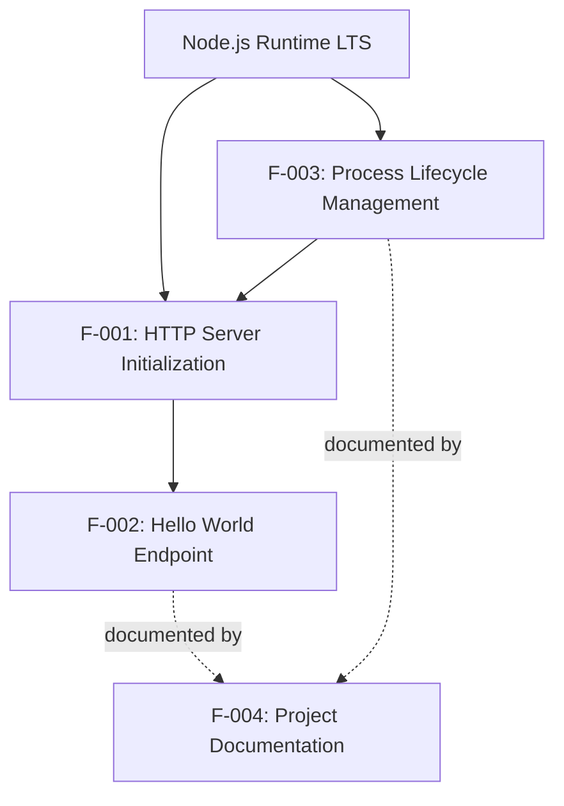

| Relationship | Source Feature | Target Feature | Nature |
|---|---|---|---|
| Hard Dependency | F-002 | F-001 | F-002 cannot resolve a route without a listening server |
| Hard Dependency | F-003 | F-001 | F-003 starts and supervises the HTTP server defined by F-001 |
| Documentation Reference | F-004 | F-002 | README describes how to call the `/hello` endpoint |
| Documentation Reference | F-004 | F-003 | README describes the start command |
| Shared Foundation | All | Node.js Runtime | Every feature depends on the Node.js LTS runtime |

### 2.3.2 Integration Points

| Integration Point | Participants | Description |
|---|---|---|
| HTTP Wire Protocol | F-002 ↔ External HTTP Client | The HTTP/1.1 request/response contract on the bound TCP port |
| TCP Socket | F-001 ↔ Host OS | The listening socket bound by the Node.js process |
| npm Script Resolution | F-003 ↔ npm CLI | The `package.json` `start` script that invokes the entry point |

No additional integration points exist. Per §1.3.2.4, the system does **not** integrate with external APIs (consumed or exposed beyond `/hello`), message queues, event buses, or identity providers.

### 2.3.3 Shared Components

The following components from §1.2.2.2 are shared across features:

| Shared Component | Used By | Role |
|---|---|---|
| Application Entry Point | F-001, F-003 | Bootstraps the process and initializes the server |
| HTTP Server | F-001, F-002 | Provides the listening socket and dispatches incoming requests |
| Package Manifest | F-003, F-004 | Declares metadata, start scripts, and any single allowed dependency |

### 2.3.4 Common Services

Artifact7 has no internal common-service layer beyond what the Node.js runtime itself provides. All four features rely on Node.js's standard library for I/O, the HTTP protocol implementation (either built-in `http` or Express.js), and the JavaScript event loop. No shared logging, configuration, telemetry, or persistence services are introduced — these categories are explicitly excluded by §1.3.2.1.

---

## 2.4 IMPLEMENTATION CONSIDERATIONS

### 2.4.1 Technical Constraints

| Feature | Constraint |
|---|---|
| F-001 | Implementation must use either the built-in `http` module or Express.js (at most one external dependency, per KPI in §1.2.3.3) |
| F-002 | Response body must be the literal string `Hello world` — no localization, templating, or content negotiation (§1.3.2.1) |
| F-003 | Startup must require a single command; no environment files, secrets, or feature flags (§1.3.2.1) |
| F-004 | Must remain a single `README.md` file at the repository root |

Cross-cutting constraints applicable to all features:

- Implementation must fit within a single conceptual module (§1.2.3.1)
- Source code must be readable for line-by-line study by a novice (§1.2.3.2)
- No source files, configuration files, or subdirectories exist in the repository at present; all artifacts must be created as part of the implementation phase

### 2.4.2 Performance Requirements

| Feature | Performance Target |
|---|---|
| F-001 | Cold-start time < 1 second on modern developer hardware |
| F-002 | Functional correctness: 100% of `GET /hello` requests return `Hello world` |
| F-003 | Single-command startup completes without manual intervention |
| F-004 | Reader completes clone → install → run in ≤ 5 minutes |

These targets are framed as **expected targets** for a minimal Node.js HTTP server, not measured operational SLAs. No throughput, latency-percentile, or concurrent-user commitments are made (§1.2.3.3).

### 2.4.3 Scalability Considerations

Scalability is **explicitly out of scope**. Per §1.3.2.1 and §1.3.2.3, the following scaling capabilities are deliberately excluded:

- Clustering (Node.js `cluster` module, PM2, multi-process workers)
- Load balancing
- Horizontal scaling (multi-instance deployment)
- High-throughput or low-latency SLA commitments
- Multi-tenant or multi-region operation

Artifact7 is designed to run as a single Node.js process on a single host (§1.3.1.4). Any production-scale workload should use a different system entirely; Artifact7 must not be deployed as a production microservice (§1.3.2.3).

### 2.4.4 Security Implications

Security capabilities are **deliberately excluded** to preserve the tutorial's pedagogical focus. The following security mechanisms are NOT implemented (§1.3.2.1):

| Excluded Mechanism | Implication |
|---|---|
| Authentication | All requests are anonymous |
| Authorization | No access control is enforced |
| HTTPS/TLS | Transport is plaintext HTTP only |
| Security Headers | No HSTS, CSP, X-Frame-Options, etc. |
| CORS | No cross-origin policy is configured |

Because Artifact7 returns a fixed static string and accepts no input data, the system's attack surface is intrinsically minimal. Nevertheless, the system **must not** be exposed to untrusted networks or used in compliance-regulated contexts (PCI, HIPAA, GDPR), per §1.3.2.3.

### 2.4.5 Maintenance Requirements

| Feature | Maintenance Consideration |
|---|---|
| F-001 | Track Node.js LTS release cadence; verify compatibility on each LTS transition |
| F-002 | Response string and path are immutable contracts — changes would break the canonical requirement |
| F-003 | If the start command changes, both `package.json` and the README must be updated in lockstep |
| F-004 | README must be kept synchronized with actual implementation commands and behavior |

Quality engineering practices that **would** typically support maintenance — automated test suites, linting configuration, CI/CD pipelines — are explicitly out of scope (§1.3.2.1). Future tutorials may add Jest or Mocha coverage as a follow-on phase (§1.3.2.2).

---

## 2.5 TRACEABILITY MATRIX

### 2.5.1 Requirements to Source Sections

| Requirement ID | Originating Specification Section(s) |
|---|---|
| F-001-RQ-001 | §1.2.2.1 (HTTP Listening); §1.3.1.1 (Server Lifecycle) |
| F-001-RQ-002 | §1.2.3.2 (Cross-Platform Operability) |
| F-002-RQ-001 | §1.1.1 (Verbatim Requirement); §1.2.3.1 (Endpoint Correctness) |
| F-002-RQ-002 | §1.2.2.2 (Conceptual Interaction Model — 404 branch) |
| F-002-RQ-003 | §1.2.3.2 (Deterministic Behavior) |
| F-003-RQ-001 | §1.2.3.1 (Startup Success); §1.2.3.3 (Tutorial Run Command KPI) |
| F-003-RQ-002 | §1.2.2.1 (Process Lifecycle) |
| F-003-RQ-003 | §1.2.2.2 (Package Manifest component) |
| F-004-RQ-001 | §1.3.1.1 (Documentation in-scope item) |
| F-004-RQ-002 | §1.1.1 (Repository identifier) |

### 2.5.2 Features to Success Criteria

| Feature | Mapped Success Criterion (§1.2.3.1) |
|---|---|
| F-001 | Startup Success; Source Footprint |
| F-002 | Endpoint Correctness |
| F-003 | Startup Success; Setup Friction |
| F-004 | Setup Friction |

### 2.5.3 Features to Stakeholders

| Feature | Primary Stakeholder(s) (§1.1.3) |
|---|---|
| F-001 | Project Maintainer (authoring); Novice Developers (studying) |
| F-002 | HTTP Clients (consuming); Novice Developers (studying) |
| F-003 | Novice Developers (running); Technical Instructors (citing) |
| F-004 | Novice Developers; Technical Instructors |

### 2.5.4 Features to Out-of-Scope Boundaries

| Feature | Closely Related Out-of-Scope Exclusion (§1.3.2) |
|---|---|
| F-001 | HTTPS/TLS, clustering, deployment infrastructure |
| F-002 | Additional endpoints, additional HTTP methods, internationalization, OpenAPI tooling |
| F-003 | PM2, Docker, environment files, secret stores |
| F-004 | API documentation tooling (OpenAPI/Swagger), generated documentation |

---

## 2.6 ASSUMPTIONS, CONSTRAINTS, AND VERSIONING

### 2.6.1 Assumptions

| ID | Assumption |
|---|---|
| A-001 | A modern Node.js LTS runtime is installed on the host machine before the tutorial is executed |
| A-002 | The TCP port chosen for binding is available and not blocked by host firewall configuration |
| A-003 | The reader has basic familiarity with shell commands and HTTP request tools (e.g., `curl`, a browser) |
| A-004 | The repository will be hosted on GitHub, where Markdown rendering of the README is supported natively |

### 2.6.2 Constraints

| ID | Constraint |
|---|---|
| C-001 | The implementation must be limited to at most one external runtime dependency (§1.2.3.3) |
| C-002 | No production-grade operational tooling may be introduced (§1.3.2.1) |
| C-003 | No persistent storage or data layer may be introduced (§1.3.1.3, §1.3.2.1) |
| C-004 | Only the path `/hello` and only the HTTP `GET` method are supported (§1.3.2.1) |
| C-005 | The response body must be the literal string `Hello world` (§1.1.1) |

### 2.6.3 Requirement Versioning

| Version | Date | Description |
|---|---|---|
| 1.0 | Initial issue | First specification of features F-001 through F-004 derived from the sponsor's verbatim requirement and the forward-looking design captured in §1.1 through §1.3 |

The requirement baseline is anchored to the single git commit `043ff26` ("Initial commit") on the `main` branch. Any subsequent revision will require an updated version row above and a corresponding update to the affected requirement table(s).

### 2.6.4 Related Process Flowcharts and Specifications

The following diagrams and sections in this Technical Specification are directly related to the requirements above and should be consulted for context:

| Reference | Relationship |
|---|---|
| §1.1.1 Project Overview | Source of the verbatim functional requirement |
| §1.2.2.1 Primary System Capabilities | Source of the four-capability decomposition |
| §1.2.2.2 Major System Components | Source of the conceptual interaction Mermaid diagram (request → router → handler → response) |
| §1.2.2.3 Core Technical Approach | Documents the vanilla `http` vs Express.js implementation choice |
| §1.2.3 Success Criteria | Defines the measurable objectives, critical success factors, and KPIs cited above |
| §1.3.1.2 Primary User Workflows | Source of the *Learner → Runtime → Server → Client* sequence diagram |
| §1.3.2 Out-of-Scope Elements | Establishes the exclusion boundaries cited throughout §2.4 |

---

#### References

**Files Examined:**
- `README.md` — Verified to contain only the single-line heading `# Artifact7`; used to confirm the current greenfield state of F-004 (status: In Development) and to anchor F-004-RQ-002
- `/` (repository root) — Confirmed to contain only `README.md` and `.git/` metadata; established that no `package.json`, source modules, or configuration files presently exist, making all requirements forward-looking

**Technical Specification Sections Consulted:**
- §1.1 EXECUTIVE SUMMARY (§1.1.1 Project Overview, §1.1.3 Stakeholders, §1.1.4 Value Proposition) — Source of the canonical verbatim requirement and stakeholder mapping
- §1.2 SYSTEM OVERVIEW (§1.2.2.1 Capabilities, §1.2.2.2 Components, §1.2.2.3 Technical Approach, §1.2.3 Success Criteria) — Source of feature decomposition, component relationships, and KPI targets
- §1.3 SCOPE (§1.3.1 In-Scope Elements, §1.3.2 Out-of-Scope Elements) — Source of feature boundaries, constraints, and exclusions

**Authoritative User-Provided Requirement:**
- *"Can you create a nodejs tutorial project that features one end point '/hello' that returns 'Hello world' to the calling HTTP client?"* — Treated as the canonical source of truth for endpoint path, HTTP method, response body, and project type

**Repository Metadata:**
- Remote origin: `github.com/shalini690/Artifact7.git`
- Default branch: `main`
- Anchor commit: `043ff26` ("Initial commit")

# 3. Technology Stack

This section enumerates every technology component selected for the **Artifact7** Node.js tutorial project, the version baselines applicable as of June 2026, the rationale for each choice, and the categories explicitly excluded by the Technical Specification. The stack is deliberately minimal — consistent with the project's pedagogical mission, the verbatim user requirement (*"Can you create a nodejs tutorial project that features one end point '/hello' that returns 'Hello world' to the calling HTTP client?"*), and the KPI ceiling of **≤ 1 external runtime dependency** established in §1.2.3.3.

## 3.1 TECHNOLOGY STACK OVERVIEW

### 3.1.1 Guiding Principles

The stack composition is governed by five non-negotiable principles drawn directly from §1.2.3 and §2.6.2:

| Principle | Source | Stack Implication |
|---|---|---|
| Minimal external surface | §1.2.3.3 KPI; C-001 | At most one npm dependency; prefer zero |
| Pedagogical transparency | §1.2.3.2 Critical Success Factors | Source readable for line-by-line study |
| Single conceptual module | §1.2.3.1 Measurable Objectives; §2.4.1 | No build pipeline; no transpilation |
| Cross-platform operability | F-001-RQ-002 | Linux, macOS, Windows without modification |
| No production tooling | §1.3.2.1; C-002 | No Docker, no CI/CD, no IaC, no observability stack |

### 3.1.2 Stack-at-a-Glance

The diagram below illustrates the complete layered composition of the technology stack and the mutually exclusive choice between the two permitted implementation paths (vanilla `http` versus Express.js):

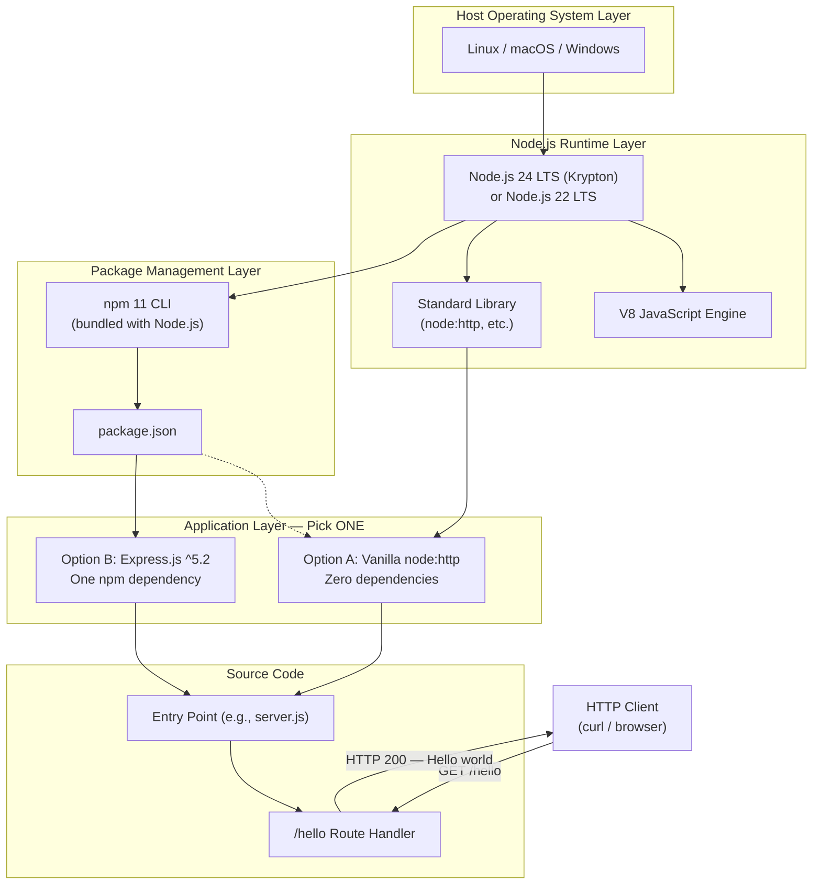

### 3.1.3 Departures from the Default Technology Stack

The agent-default technology stack (Python/Flask, AWS, Docker, Terraform, GitHub Actions, Auth0, MongoDB, Langchain, React/TypeScript, etc.) is **superseded** by the user-provided directive to build a Node.js tutorial and by the explicit out-of-scope declarations in §1.3.2.1. The following table documents each departure and its authoritative justification:

| Default Item | Status in Artifact7 | Authoritative Source |
|---|---|---|
| Python / Flask | Replaced by JavaScript / Node.js | §1.1.1 user mandate; §1.2.2.3 |
| AWS cloud platform | Excluded | §1.2.1.3 fully standalone; §1.3.2.1 |
| Docker containerization | Excluded | §1.3.2.1 Deployment Infrastructure |
| Terraform (IaC) | Excluded | §1.2.1.3; §1.3.2.1 |
| GitHub Actions (CI/CD) | Excluded | §1.3.2.1 Quality Engineering; §2.4.5 |
| Auth0 authentication | Excluded | §1.3.2.1 Security; §2.4.4 |
| MongoDB database | Excluded | §1.3.1.3; C-003 |
| Langchain (AI) | Not applicable | No AI requirement in spec |
| React, TailwindCSS, mobile/native | Not applicable | §1.3.2.1 Frontend exclusion |

## 3.2 PROGRAMMING LANGUAGES

### 3.2.1 Primary Language: JavaScript on the Node.js Runtime

The Artifact7 project is implemented in **JavaScript** executed by the **Node.js runtime**. This is the only programming language used in the project; no TypeScript, no transpiled language, no auxiliary scripting language is introduced (consistent with the single-conceptual-module constraint in §2.4.1).

| Attribute | Specification |
|---|---|
| Language | JavaScript (ECMAScript) |
| Runtime | Node.js (modern LTS) |
| Module System | CommonJS or ECMAScript Modules (`.js` or `.mjs`) — implementation choice |
| Target Operating Systems | Linux, macOS, Windows (F-001-RQ-002) |

### 3.2.2 Selection Criteria and Justification

The selection of JavaScript on Node.js is driven by four converging factors documented in the Technical Specification:

1. **Explicit User Mandate (§1.1.1):** The verbatim sponsor requirement specifies a "nodejs tutorial project," which directly fixes the language and runtime.
2. **Native Asynchronous I/O (§1.2.2.3):** The spec frames Node.js as providing "native, asynchronous I/O primitives well-suited to HTTP service implementations," making it the natural runtime for a pedagogical HTTP server.
3. **Cross-Platform Operability (§1.2.3.2):** Node.js's cross-platform runtime satisfies F-001-RQ-002, which requires startup on Linux, macOS, and Windows without source modification.
4. **Pedagogical Accessibility (§1.2.3.2):** JavaScript's familiarity to web developers supports the "line-by-line study by a novice developer" success factor.

### 3.2.3 Version Baseline and Compatibility

#### 3.2.3.1 Recommended Baseline: Node.js 24 LTS (Krypton)

The recommended baseline for new Artifact7 installations is **Node.js 24 LTS**, codename **"Krypton."** Node.js 24 became Active LTS on October 28, 2025, and is scheduled to remain in Active LTS through October 20, 2026, then move to Maintenance through April 30, 2028. Node.js 24 is the current active LTS line in May 2026, while Node.js 22 is still a supported maintenance LTS line and Node.js 26 is the Current non-LTS line until October 2026.

#### 3.2.3.2 Acceptable Alternative: Node.js 22 LTS

Node.js 22 LTS remains an acceptable runtime for learners on legacy installations. Node 22 remains supported through April 2027. However, Node 24 is the right default; Node 22 is a supported maintenance runtime, not a greenfield choice.

#### 3.2.3.3 Versions to Avoid for Tutorial Use

| Version | Status | Recommendation for Artifact7 |
|---|---|---|
| Node.js 26.x | Current (non-LTS) | Avoid for tutorial baseline until Oct 2026 LTS transition |
| Node.js 23.x / 25.x | Odd-numbered, unsupported after 6 months | Do not use |
| Node.js ≤ 21.x | End-of-Life | Do not use |

The official release post states that Node.js 26 will enter LTS in October 2026. Active LTS receives bug fixes and security patches for 18 months, followed by a Maintenance phase for critical security fixes until end-of-life. Until that transition, Node.js 26 is unsuitable as the documented baseline.

#### 3.2.3.4 Selection Constraints Mapped to Spec

| Constraint ID | Constraint Text | Stack Impact |
|---|---|---|
| C-001 | At most one external runtime dependency | Selects between vanilla `http` and Express only |
| C-002 | No production-grade operational tooling | No PM2, no clustering, no APM agents |
| A-001 | Modern Node.js LTS pre-installed | Learner provides runtime; the project does not ship one |

## 3.3 FRAMEWORKS & LIBRARIES

### 3.3.1 Architectural Decision: Two Permitted Implementation Paths

§1.2.2.3 explicitly enumerates two — and only two — permitted implementation strategies for the HTTP server. Either choice independently satisfies all functional requirements (F-001 and F-002) and complies with the ≤ 1 external dependency KPI. The decision is treated as an implementation-phase choice that **must commit to exactly one path** in the final source tree.

| Approach | Module / Package | External Dependencies | Idiomatic Style |
|---|---|---|---|
| Option A (Vanilla) | `node:http` (built-in) | 0 | Imperative; low-level request/response API |
| Option B (Express) | `express` (npm) | 1 | Declarative routing; middleware chain |

### 3.3.2 Option A — Node.js Built-in `http` Module (Zero-Dependency Path)

This option uses the `node:http` module shipped as part of the Node.js standard library. It is the **maximum-transparency** path, ideal for tutorials that emphasize the bare-metal mechanics of an HTTP listener.

| Attribute | Specification |
|---|---|
| Module identifier | `node:http` (or `http` legacy bare specifier) |
| Source | Node.js standard library (no separate semver) |
| Version | Bundled with the Node.js runtime |
| Registry | Not applicable (built-in) |
| External Runtime Deps Count | 0 |

**Justification:**
- Satisfies the "zero external dependencies" interpretation of the ≤ 1 KPI.
- Demonstrates Node.js's native async I/O primitives directly (§1.2.2.3).
- Maximizes code visibility for novice readers (§1.2.3.2).
- Aligns with the official Node.js homepage example, which uses `createServer` from `node:http` to emit a plaintext response.

### 3.3.3 Option B — Express.js Framework (Single-Dependency Path)

This option introduces **Express.js** as the sole runtime dependency. It is the **industry-idiomatic** path and is appropriate when the tutorial's goal is to expose learners to the dominant Node.js web framework.

| Attribute | Specification |
|---|---|
| Package name | `express` |
| Registry | npm (npmjs.com) |
| Recommended Version Range | `^5.2.0` (latest 5.2.x at install time) |
| Latest stable at June 2026 | `5.2.x` line |
| External Runtime Deps Count (direct) | 1 |

#### 3.3.3.1 Express 5.x Selection Rationale

Express 5.2 shipped December 1, 2025 and is the Technical Committee's endorsed production release. Organizations starting new Node.js backend projects today should use the latest Express 5.2. This makes Express 5.x the correct choice for a greenfield tutorial in 2026; Express 4.x is in Maintenance status and unsuitable as a new-project baseline.

#### 3.3.3.2 Why Not Express 4.x

The Express Technical Committee (TC) has published a target EOL date for Express 4 of no sooner than October 1, 2026, with version 4 having entered formal Maintenance status on April 1, 2025. Starting a new tutorial on a Maintenance branch would directly contradict the maintenance-tracking obligation in §2.4.5.

#### 3.3.3.3 Express 5 Compatibility Requirements

Before installing, download and install Node.js. Node.js 18 or higher is required. If this is a brand new project, make sure to create a package.json first with the npm init command. This Node.js floor is well below the Artifact7 recommended baseline (Node.js 24 LTS) and the acceptable alternative (Node.js 22 LTS), so no compatibility tension exists.

Express 5 now requires Node.js 18 or higher to embrace modern JavaScript features and practices. This shift lets Express replace outdated third-party packages like array-flatten and path-is-absolute with native methods such as Array.flat() and path.isAbsolute().

### 3.3.4 Cross-Component Compatibility Matrix

| Source Component | Target Component | Required Version Floor | Met By Artifact7 Baseline? |
|---|---|---|---|
| Artifact7 source | Node.js | ≥ 22 LTS (≥ 24 LTS recommended) | Yes (A-001) |
| Express 5.x (if chosen) | Node.js | ≥ 18 | Yes |
| Express 5.x (if chosen) | npm | Bundled with Node.js | Yes |
| `node:http` (if chosen) | Node.js | Always available | Yes (built-in) |

### 3.3.5 Deliberately Excluded Library Categories

The following library categories are **prohibited** in the Artifact7 baseline per §1.3.2.1 and §2.4.1. Their absence is intentional and pedagogical, not an oversight:

| Excluded Library Category | Representative Examples | Spec Authority |
|---|---|---|
| Logging frameworks | Pino, Winston, Bunyan | §1.3.2.1 Operational Tooling |
| Metrics / Tracing / APM | prom-client, OpenTelemetry SDK | §1.3.2.1 Operational Tooling |
| Test frameworks & runners | Jest, Mocha, Vitest, Supertest, node:test | §1.3.2.1 Quality Engineering; future-phase per §1.3.2.2 |
| Linters / Formatters | ESLint, Prettier, Standard | §1.3.2.1 Quality Engineering |
| Security middleware | helmet, cors, csurf, express-rate-limit | §1.3.2.1 Security; §2.4.4 |
| Configuration libraries | dotenv, config, convict | §1.3.2.1 Configuration Management |
| Process managers | PM2, forever, nodemon (prod) | §1.3.2.1 Deployment Infrastructure |
| API documentation generators | Swagger, OpenAPI tooling, JSDoc-API | §1.3.2.1 API Documentation Tooling |
| Template engines | Handlebars, EJS, Pug | §1.3.2.1 Internationalization |
| i18n libraries | i18next, formatjs | §1.3.2.1 Internationalization |
| ORMs / Database clients | Mongoose, Prisma, Sequelize, pg, mysql2 | §1.3.1.3; C-003 |
| Validation libraries | Joi, Zod, Ajv | No input data — not needed per F-002-RQ-001 |
| HTTP clients | axios, got, undici (as a dep) | §1.2.1.3 — no outbound calls |

## 3.4 OPEN SOURCE DEPENDENCIES

### 3.4.1 Package Registry: npm

The project's sole package registry is **npm**, the default Node.js package registry, accessed via the **npm CLI** that ships bundled with the Node.js runtime. Node 24 has a newer V8 and npm 11, but app-level throughput depends on workload, dependencies, and deployment shape. Accordingly, Artifact7 inherits the npm 11.x major line by virtue of using Node.js 24 LTS.

| Attribute | Specification |
|---|---|
| Registry | https://registry.npmjs.org |
| Client | npm CLI |
| Client Version (with Node.js 24 LTS) | npm 11.x |
| Client Version (with Node.js 22 LTS) | npm 10.x |
| Manifest Format | `package.json` (JSON, npm schema) |
| Lockfile | `package-lock.json` (only if Express path is chosen) |

### 3.4.2 Runtime Dependency Inventory

The runtime dependency inventory depends entirely on which of the two implementation paths is selected at implementation time:

#### 3.4.2.1 If Option A (Vanilla `http`) Is Chosen

| Dependency | Type | Version | Registry |
|---|---|---|---|
| *(none)* | — | — | — |

The `package.json` file's `dependencies` field is either omitted or set to an empty object. No `package-lock.json` is generated in this configuration since there are no transitive resolutions to lock.

#### 3.4.2.2 If Option B (Express.js) Is Chosen

| Dependency | Type | Version Specifier | Registry |
|---|---|---|---|
| `express` | Runtime (direct) | `^5.2.0` | npm |

Transitive dependencies are resolved automatically by npm and captured in `package-lock.json`. They are out of scope for the tutorial narrative but are pinned through the lockfile for deterministic installation.

### 3.4.3 Development Dependencies

The `devDependencies` section of `package.json` **must remain empty**. Per §2.4.5, *"Quality engineering practices that would typically support maintenance — automated test suites, linting configuration, CI/CD pipelines — are explicitly out of scope (§1.3.2.1)."* Consequently the following `devDependencies` categories are forbidden in the baseline tutorial: test runners, type checkers, linters, formatters, bundlers, and build orchestrators.

### 3.4.4 Manifest Schema Compliance

The `package.json` manifest must:

- Be valid JSON conforming to the npm package manifest schema (per F-003-RQ-003, §2.2.3.3).
- Declare project metadata: `name`, `version`, `description`, `license`.
- Declare a `start` script that invokes the entry point (per §2.3.2 Integration Points).
- Optionally declare an `engines.node` field constraining the runtime to `>=22` (or `>=24` for the recommended baseline).
- Avoid declaring any `devDependencies` (§3.4.3).
- Avoid declaring any `dependencies` if Option A is chosen, or declare exactly `express` if Option B is chosen.

## 3.5 THIRD-PARTY SERVICES

### 3.5.1 Status: Not Applicable

**No third-party services of any kind are integrated into the Artifact7 system.** This is a deliberate architectural decision documented across multiple sections of the Technical Specification, not an omission to be corrected in a future iteration of this document.

### 3.5.2 Rationale and Specification References

§1.2.1.3 declares: *"The system is fully standalone. It has no upstream data sources, no downstream consumers in production, and no integration touchpoints with enterprise services such as identity providers, message brokers, databases, or monitoring platforms."*

Each conventional third-party service category is explicitly excluded as follows:

| Service Category | Status | Spec Authority |
|---|---|---|
| External APIs (consumed) | Not in scope — no outbound HTTP calls | §1.3.2.4 |
| External APIs (exposed beyond `/hello`) | Not in scope — single endpoint only | §1.3.2.4; C-004 |
| Identity Providers (Auth0, Okta, Cognito, Azure AD) | Not in scope — no authentication | §1.3.2.4; §2.4.4 |
| OAuth/OIDC providers | Not in scope — anonymous access | §2.4.4 |
| Message Queues (SQS, RabbitMQ, Kafka) | Not in scope — no async messaging | §1.3.2.4 |
| Event Buses (EventBridge, NATS) | Not in scope | §1.3.2.4 |
| Email providers (SES, SendGrid) | Not applicable | No notification requirement |
| SMS providers (Twilio) | Not applicable | No notification requirement |
| Payment processors (Stripe) | Not applicable | No transactional requirement |
| APM / Monitoring (Datadog, New Relic, Sentry) | Not in scope — no observability stack | §1.3.2.1 Operational Tooling |
| Log aggregation (Splunk, ELK, Loki) | Not in scope — no logging framework | §1.3.2.1 Operational Tooling |
| Cloud platforms (AWS, GCP, Azure) | Not in scope — local development only | §1.2.1.3; §1.3.1.4 |
| Secret managers (Vault, AWS Secrets Manager) | Not in scope — no secrets handled | §1.3.2.1 Configuration Management |
| Feature flag services (LaunchDarkly, Unleash) | Not in scope | §1.3.2.1 Configuration Management |
| CDNs | Not applicable | Local-only delivery |

### 3.5.3 Future-Phase Considerations

§1.3.2.2 names several follow-on tutorials that could legitimately introduce third-party services (e.g., adding structured logging via Pino, adding Docker for containerization). These are deliberately staged for **future tutorials** authored after Artifact7 is complete and are not part of the Artifact7 baseline technology stack.

## 3.6 DATABASES & STORAGE

### 3.6.1 Status: Not Applicable

**No database, cache, object store, file persistence, or session store is included in the Artifact7 system.** The response payload is a fixed static string baked into the source code; no state of any kind crosses the request/response boundary or persists across process lifetimes.

### 3.6.2 Rationale and Constraint References

The "no persistence" posture is enforced by multiple, mutually reinforcing sources in the specification:

| Authoritative Source | Statement |
|---|---|
| §1.3.1.3 Essential Integrations | Persistent Storage: None |
| §1.3.1.4 Implementation Boundaries | Data Domain: None — the response is a fixed static string |
| C-003 (§2.6.2) | No persistent storage or data layer may be introduced |
| §2.2.1.1 F-001-RQ-001 | Data Requirements: None — no persisted state |
| §2.2.2.1 F-002-RQ-001 | Data Requirements: None — response is a fixed static string |
| §1.3.2.1 Data Layer | Databases, caches, file persistence, ORMs, migrations all excluded |

### 3.6.3 Storage Category Exclusion Matrix

| Storage Category | Status | Rationale |
|---|---|---|
| Primary relational DB (PostgreSQL, MySQL) | Excluded | C-003; §1.3.1.3 |
| Primary document DB (MongoDB, DynamoDB) | Excluded | C-003; §1.3.1.3 |
| Key-value store (Redis, Memcached) | Excluded | §1.3.2.1 Data Layer |
| Search engine (Elasticsearch, OpenSearch) | Excluded | §1.3.2.1 Data Layer |
| Object storage (S3, GCS, Azure Blob) | Excluded | §1.3.2.1 Data Layer |
| Local file persistence | Excluded | §1.3.2.1 Data Layer |
| Session store | Excluded | §2.4.4 — no sessions; anonymous requests |
| Migration tooling (Knex, Liquibase, Flyway) | Excluded | C-003 — no schema to migrate |
| ORM / ODM (Prisma, TypeORM, Mongoose) | Excluded | C-003 |

The Default Technology Stack's "MongoDB" entry is **explicitly contradicted** by C-003 and §1.3.1.3 and is therefore not included.

## 3.7 DEVELOPMENT & DEPLOYMENT

### 3.7.1 Required Local Development Toolchain

Learners using Artifact7 require the following tools on their local machines. The repository itself ships only source files, the `README.md`, and the `package.json` manifest; the runtime and CLI tools below are pre-existing assumptions (per A-001 and A-003).

| Tool | Role | Source / Distribution | Spec Authority |
|---|---|---|---|
| Node.js LTS runtime | Executes the server process | nodejs.org official installers, nvm, fnm | A-001; §1.3.1.3 |
| npm CLI | Installs Express (if Option B); resolves `npm start` | Bundled with Node.js | §2.1.3.3; §2.3.2 |
| Git | Clones the repository | git-scm.com / OS package | §1.2.3.1 (clone → install → run flow) |
| `curl` or web browser | Verifies `GET /hello` returns the expected response | OS package / pre-installed | A-003; §2.2.2.1 acceptance |
| Plain text editor or IDE | Inspects/edits source for line-by-line study | Learner's choice (VS Code, Vim, etc.) | §1.2.3.2 |

### 3.7.2 Build System

**No build system is required.** The project does not include a transpilation step, bundling step, or asset compilation step. The Node.js runtime executes the JavaScript source directly. Consequently, the following technologies are explicitly **not used**:

| Tool Category | Examples | Status in Artifact7 |
|---|---|---|
| Module bundlers | Webpack, Rollup, Vite, Parcel, esbuild | Not used |
| Transpilers | Babel, SWC, TypeScript compiler | Not used |
| Task runners | Gulp, Grunt | Not used |
| Monorepo tools | Nx, Turborepo, Lerna | Not applicable |
| Custom build scripts | `make`, `just`, shell pipelines | Not used |

The only npm script required by F-003-RQ-003 is `start`, which invokes `node <entry>`. There is no `build` script.

### 3.7.3 Containerization

**Containerization is explicitly excluded from the Artifact7 baseline.** §1.3.2.1 lists Docker, Kubernetes, PM2, clustering, and load balancers under the "Deployment Infrastructure" exclusion category. No `Dockerfile`, no `docker-compose.yml`, no Kubernetes manifests, no Helm charts, and no container build configuration are part of this project.

§1.3.2.2 explicitly relegates containerization to a **future-phase tutorial**: *"Containerization: Package the service as a Docker image."* This is a deliberate staging decision; future tutorials in this series may add a Docker image, but Artifact7 itself does not.

### 3.7.4 Infrastructure as Code

**No infrastructure-as-code tooling is included.** Because §1.2.1.3 establishes the system as fully standalone with no cloud or enterprise deployment, the following IaC tools have no applicable role and are not part of the stack: Terraform, AWS CloudFormation, Pulumi, Ansible, Chef, Puppet, SaltStack, AWS CDK, CDKTF.

### 3.7.5 CI/CD

**No continuous integration or continuous deployment pipeline is included.** §1.3.2.1 lists "CI/CD pipelines" under the Quality Engineering exclusion category, and §2.4.5 reiterates: *"Quality engineering practices that would typically support maintenance — automated test suites, linting configuration, CI/CD pipelines — are explicitly out of scope (§1.3.2.1)."*

Specifically excluded from the Artifact7 baseline:

| CI/CD Tool | Status |
|---|---|
| GitHub Actions workflows (`.github/workflows/`) | Not present |
| GitLab CI (`.gitlab-ci.yml`) | Not present |
| CircleCI (`.circleci/config.yml`) | Not present |
| Jenkins (`Jenkinsfile`) | Not present |
| Travis CI / Drone / Buildkite | Not present |
| Pre-commit hooks (Husky, lefthook) | Not present |

### 3.7.6 Repository Hosting and Version Control

| Attribute | Value | Source |
|---|---|---|
| Version control system | Git | Implicit; repository contains `.git/` |
| Hosting platform | GitHub | A-004 |
| Repository URL | `github.com/shalini690/Artifact7.git` | §1.1.1 |
| Default branch | `main` | §1.1.1 |
| Anchor commit | `043ff26` ("Initial commit") | §1.1.1; §2.6.3 |
| README rendering | GitHub-flavored Markdown (natively rendered) | A-004 |

GitHub is selected solely because the repository is already hosted there (A-004); no GitHub-specific feature (Actions, Pages, Packages, Codespaces) is exercised by Artifact7.

## 3.8 SECURITY AND INTEGRATION POSTURE

### 3.8.1 Security Implications of Stack Choices

The technology stack's deliberate minimalism has direct security implications that must be transparent to learners. Per §2.4.4, the following security mechanisms are absent **by design**:

| Mechanism | Status | Implication |
|---|---|---|
| Transport Layer Security (HTTPS/TLS) | Not implemented | Wire traffic is plaintext HTTP |
| Authentication | Not implemented | All requests are anonymous |
| Authorization | Not implemented | No access control enforced |
| Security response headers (HSTS, CSP, X-Frame-Options) | Not configured | Browser defenses not engaged |
| CORS policy | Not configured | No cross-origin policy declared |
| Input validation | Not applicable | F-002-RQ-001 — endpoint accepts no input data |
| Rate limiting | Not implemented | No middleware in scope |

Because the response is a fixed static string and the server accepts no input, the intrinsic attack surface is minimal. However, §2.4.4 mandates: *"The system must not be exposed to untrusted networks or used in compliance-regulated contexts (PCI, HIPAA, GDPR), per §1.3.2.3."* The technology stack documented here is suitable **only** for local-host learner environments.

### 3.8.2 Integration Contract

The only integration boundary in the entire stack is the HTTP wire-protocol contract between the Node.js process and a calling HTTP client (per §2.3.2):

| Integration Point | Participants | Contract |
|---|---|---|
| HTTP Wire Protocol | Route handler ↔ HTTP client | HTTP/1.1 request/response on bound TCP port |
| TCP Socket | Node.js runtime ↔ Host OS | Listening socket bound to a configured port |
| npm Script Resolution | `package.json` ↔ npm CLI | `start` script invokes the entry point |

The response contract is fixed by §2.2.2.1: HTTP/1.1 `200 OK`; body `Hello world`; `Content-Type: text/plain` (or `text/plain; charset=utf-8`).

## 3.9 TECHNOLOGY STACK SUMMARY MATRIX

The following matrix consolidates every applicable stack component into a single reference table. Items marked "Not applicable" are documented as such intentionally and trace back to explicit exclusions in the specification.

| Stack Layer | Component | Selection | Version (June 2026) |
|---|---|---|---|
| Language | JavaScript (ECMAScript) | Required | ES2022+ supported by chosen Node.js |
| Runtime | Node.js | Required | 24.x LTS (recommended) / 22.x LTS (acceptable) |
| HTTP Server | `node:http` *OR* `express` | Pick exactly one | Built-in *OR* `^5.2.0` |
| Package Manager | npm | Required (bundled with Node.js) | 11.x (with Node 24) / 10.x (with Node 22) |
| Manifest | `package.json` | Required | npm schema |
| Lockfile | `package-lock.json` | Only if Express path chosen | Generated by npm |
| Build System | — | Not applicable | — |
| Transpiler | — | Not applicable | — |
| Test Runner | — | Not applicable (out of scope, §1.3.2.1) | — |
| Linter / Formatter | — | Not applicable (out of scope, §1.3.2.1) | — |
| Database | — | Not applicable (C-003) | — |
| Cache | — | Not applicable (§1.3.2.1) | — |
| Authentication Service | — | Not applicable (§2.4.4) | — |
| Cloud Platform | — | Not applicable (§1.2.1.3) | — |
| Containerization | — | Not applicable (§1.3.2.1) | — |
| IaC | — | Not applicable (§1.2.1.3) | — |
| CI/CD | — | Not applicable (§2.4.5) | — |
| Monitoring / APM | — | Not applicable (§1.3.2.1) | — |
| Version Control | Git | Required | Any modern version |
| Repository Host | GitHub | Selected per A-004 | — |
| Client Verification Tool | `curl` *or* web browser | Required for acceptance test | — |

## 3.10 References

### 3.10.1 Files Examined

- `README.md` — Verified to contain only the single-line heading `# Artifact7`; used to confirm the greenfield (pre-implementation) state of the repository and to establish that all technology-stack components must be created during implementation.
- `/` (repository root) — Confirmed to contain only `README.md` alongside the `.git/` metadata directory; established the absence of any pre-existing `package.json`, source modules, `Dockerfile`, CI workflow files, or configuration files at the time of authoring.

### 3.10.2 Technical Specification Sections Consulted

- **§1.1 EXECUTIVE SUMMARY** — Source of the canonical user requirement specifying Node.js and the `/hello` → "Hello world" contract.
- **§1.2 SYSTEM OVERVIEW** — Source of the "vanilla `http` vs Express.js" implementation choice (§1.2.2.3), system capabilities decomposition (§1.2.2.1), the standalone-system declaration (§1.2.1.3), critical success factors (§1.2.3.2), and the ≤ 1 external dependency KPI (§1.2.3.3).
- **§1.3 SCOPE** — Source of in-scope items (Node.js LTS, HTTP/TCP, README), out-of-scope items (Docker, CI/CD, auth, DBs, logging, testing, TLS, frontends), and the future-phase staging of containerization, structured logging, and automated testing.
- **§2.1 FEATURE CATALOG** — Source of feature-level technology constraints (F-001: vanilla `http` or Express; F-003: npm CLI dependency).
- **§2.2 FUNCTIONAL REQUIREMENTS TABLES** — Source of the `Content-Type: text/plain` response implication (F-002), cross-platform requirement (F-001-RQ-002), and the `package.json`/npm schema mandate (F-003-RQ-003).
- **§2.3 FEATURE RELATIONSHIPS** — Source of integration points (HTTP wire protocol, TCP socket, npm script resolution).
- **§2.4 IMPLEMENTATION CONSIDERATIONS** — Source of the at-most-one-external-dependency constraint (§2.4.1), scalability exclusions (§2.4.3), security exclusions (§2.4.4), and the explicit exclusion of test suites, linting, and CI/CD pipelines (§2.4.5).
- **§2.6 ASSUMPTIONS, CONSTRAINTS, AND VERSIONING** — Source of assumption A-001 (Node.js LTS pre-installed), A-003 (learner has `curl`/browser), A-004 (GitHub hosting), and hard constraints C-001 through C-005.

### 3.10.3 Web Sources Consulted

- **Node.js Release Working Group** (`github.com/nodejs/Release`) — Verified that Node.js 24 (codename Krypton) became Active LTS on 2025-10-28 and remains in Active LTS through 2026-10-20, then Maintenance through 2028-04-30.
- **Node.js Previous Releases** (`nodejs.org/en/about/previous-releases`) — Verified release lifecycle phases and the 30-month total LTS support guarantee.
- **Node.js 26.0.0 Release Announcement** (`nodejs.org/en/blog/release/v26.0.0`) — Confirmed Node.js 26 entered Current phase on 2026-05-05 and is scheduled to enter LTS in October 2026.
- **PkgPulse "Node 22 vs Node 24 in 2026" Guide** — Verified that as of May 2026, Node.js 24 is the recommended LTS for new projects, Node.js 22 remains supported through April 2027, and Node.js 26 should not be treated as the LTS answer until October 2026.
- **InMotion Hosting "Node.js 26 Released"** — Verified that Node.js 24 is the current Active LTS release and Node.js 22 is in Maintenance LTS.
- **npm Package Page for Express** (`npmjs.com/package/express`) — Confirmed Express requires Node.js 18 or higher and is installed via `npm install express`.
- **HeroDevs "Express 3 is EOL, Express 4 is Next: The 2026 Support Reference"** — Confirmed Express 5.2 shipped December 1, 2025 and is the Express Technical Committee's endorsed production release for new Node.js backend projects.
- **Better Stack "What's New in Express.js v5.0"** — Verified Express 5's Node.js 18+ floor and modernization rationale.
- **NodeSource "Express.js 6 and Beyond"** — Provided context on the Express revitalization program and Express 5 release lineage.

# 4. Process Flowchart

## 4.1 SECTION OVERVIEW

This section translates Artifact7's functional requirements (§2.2) and conceptual interaction model (§1.2.2.2) into a complete catalogue of process flows, state transitions, decision points, integration sequences, and error-handling paths. Because the repository is currently a **greenfield project** containing only `README.md` (with the single line `# Artifact7`) and `.git/` metadata, all flowcharts in this section are **forward-looking specifications** that describe the runtime behavior the implementation must satisfy — they do not document a deployed system.

### 4.1.1 Guiding Principles for the Flowcharts

The flowcharts below adhere to four guiding principles derived from the project's pedagogical mandate (§1.2.3.2) and explicit scope exclusions (§1.3.2.1):

1. **Faithful Minimalism.** Where a category of process (e.g., authentication, persistence, batch processing) is deliberately excluded by the technical specification, this section documents the exclusion as a first-class artifact rather than inventing a placeholder flow.
2. **Implementation-Path Neutrality.** Artifact7 may be implemented either with the built-in `node:http` module (zero dependencies) or with Express.js `^5.2.0` (one dependency), per §3.3. All flowcharts in this section are agnostic to that choice; where the choice materially alters the imperative flow, both branches are shown.
3. **Requirement Traceability.** Every step in every diagram traces back to an atomic requirement (F-001-RQ-001 through F-004-RQ-002), an integration point (§2.3.2), or a documented constraint (§2.6).
4. **No Fabricated SLAs.** The timing annotations herein reflect the expected targets enumerated in §1.2.3.3 and §2.4.2. No throughput, latency-percentile, or concurrent-user commitments are introduced.

### 4.1.2 Relationship to Existing Diagrams

Four diagrams already exist elsewhere in this document and are referenced rather than duplicated here:

| Existing Diagram | Location | Relationship to Section 4 |
|---|---|---|
| Conceptual Interaction Model (flowchart LR) | §1.2.2.2 | High-level baseline expanded with swim lanes in §4.2.1 |
| Primary User Workflow Sequence (sequenceDiagram) | §1.3.1.2 | Expanded into detailed multi-actor sequences in §4.7 |
| Feature Dependency Map (flowchart TD) | §2.3.1 | Provides the dependency invariants honored by §4.3 |
| Stack-at-a-Glance (layered) | §3.1.2 | Defines the technology boundaries crossed in §4.7 |

---

## 4.2 SYSTEM WORKFLOWS

### 4.2.1 High-Level System Workflow (Swim Lanes)

The complete end-to-end workflow spans four actor lanes: the **Learner/Operator**, the **Host OS Shell + npm CLI**, the **Node.js Runtime executing Artifact7's application code**, and the **HTTP Client**. The diagram below renders the full lifecycle from `npm start` through request handling to operator-initiated termination.

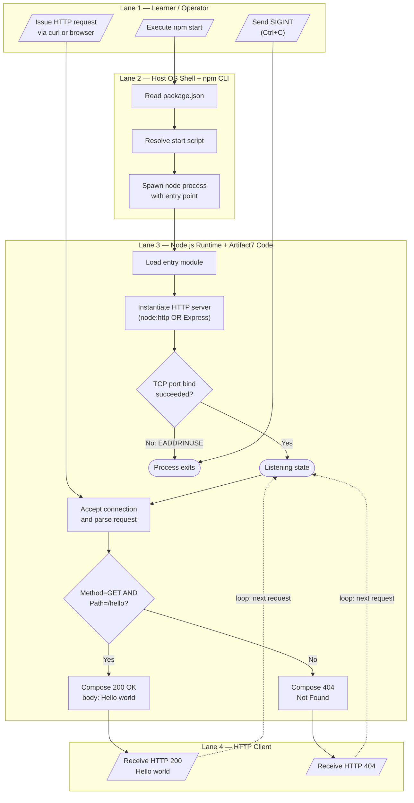

### 4.2.2 Core Business Processes

#### 4.2.2.1 End-to-End User Journey

Artifact7 supports exactly **one** end-to-end user journey: a Learner clones the repository, starts the server, issues a request to `/hello`, and observes the response. The journey is bounded by the success criteria in §1.2.3.1 (setup friction ≤ 5 minutes from clone to first successful response).

| Stage | Actor | Action | Reference |
|---|---|---|---|
| 1. Acquire | Learner | Clone repository from host | §1.2.3.1 |
| 2. Install | Learner | Run `npm install` (no-op if zero dependencies) | F-003-RQ-003 |
| 3. Start | Learner | Execute `npm start` | F-003-RQ-001 |
| 4. Verify | Learner | Issue `curl -i http://<host>:<port>/hello` | F-002-RQ-001 |
| 5. Observe | Learner | Confirm HTTP 200 and body `Hello world` | F-002-RQ-001 |
| 6. Terminate | Learner | Press Ctrl+C (SIGINT) | F-003-RQ-002 |

#### 4.2.2.2 Decision Points Inventory

The runtime contains exactly **two** decision points. Every additional decision class commonly found in production systems (authentication check, authorization check, input validation, rate limit, feature flag, A/B routing) is intentionally absent (§2.4.4, §3.8.1).

| Decision Point | Branches | Outcome | Source |
|---|---|---|---|
| Port-Bind Outcome | Success / Failure (EADDRINUSE, permission denied) | Listening state OR process exit | F-001-RQ-001 |
| Route Match (compound: method + path) | `(GET, /hello)` / anything else | Hello handler OR 404 response | F-002-RQ-001, F-002-RQ-002 |

No further decision diamonds appear in any flow; this is a deliberate design property of the tutorial system.

### 4.2.3 Integration Workflows

#### 4.2.3.1 Data Flow Between Systems

Per §2.3.2 and §3.8.2, the system has exactly three integration points and no intersystem data flows beyond them. The diagram below depicts the complete data-flow surface.

```mermaid
flowchart LR
    subgraph External["External Boundary"]
        Operator[Learner / Operator]
        Client[HTTP Client]
    end

    subgraph OS["Host Operating System"]
        Shell[Shell + npm CLI]
        TCP[TCP/IP Stack]
    end

    subgraph Process["Node.js Process — Artifact7"]
        Manifest[(package.json<br/>manifest)]
        Entry[Entry Point Module]
        Server[HTTP Server]
        Handler[/hello Route Handler]
    end

    Operator -->|"npm start command"| Shell
    Shell -->|"reads start script"| Manifest
    Shell -->|"spawn node entry"| Entry
    Entry -->|"creates"| Server
    Server -->|"binds listening socket"| TCP
    Client -->|"HTTP/1.1 GET /hello"| TCP
    TCP -->|"incoming connection"| Server
    Server -->|"dispatch matched route"| Handler
    Handler -->|"static string Hello world"| Server
    Server -->|"HTTP/1.1 200 OK"| TCP
    TCP -->|"response bytes"| Client
```

#### 4.2.3.2 API Interactions

Artifact7 exposes a single HTTP API surface (`GET /hello`) and consumes **zero** external APIs. The full API-interaction model is therefore:

| Direction | Counterparty | Contract | Authority |
|---|---|---|---|
| Inbound (exposed) | HTTP Client | `GET /hello` → HTTP/1.1 200, `Content-Type: text/plain`, body `Hello world` | §2.2.2.1, §3.8.2 |
| Inbound (exposed, fallthrough) | HTTP Client | Any other request → HTTP/1.1 404 | §2.2.2.2 |
| Outbound (consumed) | — | None | §1.3.2.4, §3.5 |

#### 4.2.3.3 Event Processing and Batch Processing Flows

**Not applicable.** Per §1.3.2.4 and §3.5, Artifact7 has no message queues, event buses, asynchronous messaging, scheduled jobs, batch processors, or stream processors. The synchronous Node.js event loop within the single process is the only "event" surface, and it is internal to the runtime rather than an application-level integration.

This subsection is preserved to make the absence of these flows explicit and traceable, per §1.3.2.4.

---

## 4.3 DETAILED PROCESS FLOWS BY FEATURE

### 4.3.1 F-001 — HTTP Server Initialization Flow

The HTTP server initialization flow expresses the requirements F-001-RQ-001 (TCP port binding) and F-001-RQ-002 (cross-platform operability). The cold-start budget of <1 second (§1.2.3.3, §2.4.2) applies to the full span from process spawn through the listening state.

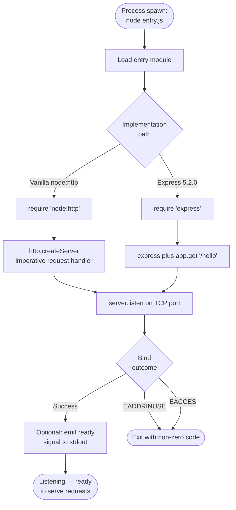

**Performance contract.** The path from `Start` to `Ready` must complete in <1 second on modern developer hardware (F-001 performance criterion in §2.2.1.1).

**Cross-platform contract.** The identical flow must succeed on Linux, macOS, and Windows without source modification (F-001-RQ-002).

### 4.3.2 F-002 — Hello Endpoint Request Handling Flow

The request handling flow expresses F-002-RQ-001 (return `Hello world`), F-002-RQ-002 (404 fallthrough), and F-002-RQ-003 (deterministic response).

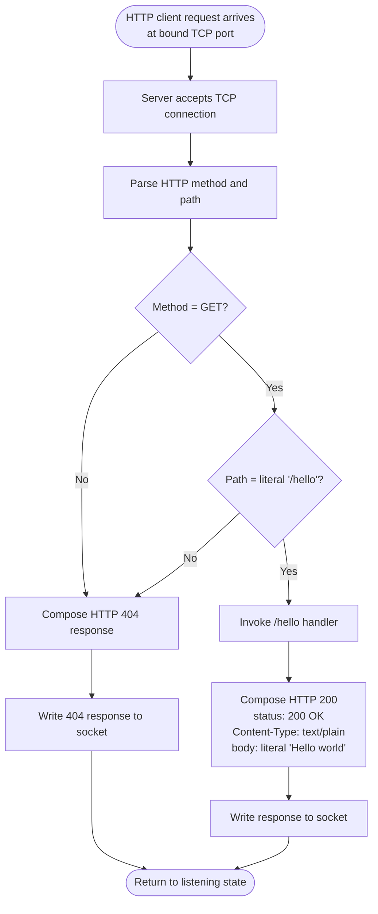

**Determinism contract (F-002-RQ-003).** The handler must produce a bit-identical response on every invocation. The flow contains no sources of variability — no time, randomness, locale, headers, request body, or external state influence the response.

**Synchronous 404 contract (F-002-RQ-002).** The 404 branch must be produced synchronously with no I/O wait, per the performance criteria in §2.2.2.2.

### 4.3.3 F-003 — Process Lifecycle Management Flow

The process lifecycle flow expresses F-003-RQ-001 (single-command startup), F-003-RQ-002 (persistent availability), and F-003-RQ-003 (package manifest declares start script).

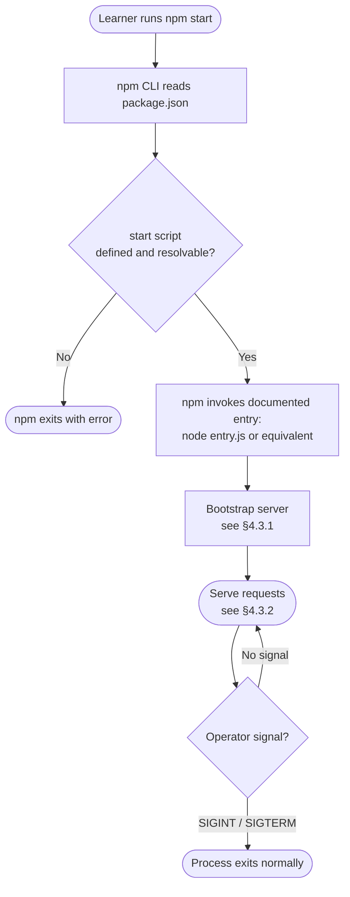

**Persistence-of-availability contract (F-003-RQ-002).** Once in the `Serve` state, the process must not exit spontaneously. Termination is exclusively operator-initiated. Process supervisors (PM2, systemd, Docker `--restart`) are explicitly out of scope per §1.3.2.1.

**No-config contract (F-003-RQ-001).** No environment files, secrets, or feature flags participate in the flow (§2.2.3.1).

### 4.3.4 F-004 — Project Documentation Flow

F-004 (Project Documentation) is a **build-time artifact**, not a runtime process. It has no operational flowchart because the README is a static Markdown file rendered by the repository host. The relevant lifecycle is captured as a maintenance discipline rather than a runtime sequence:

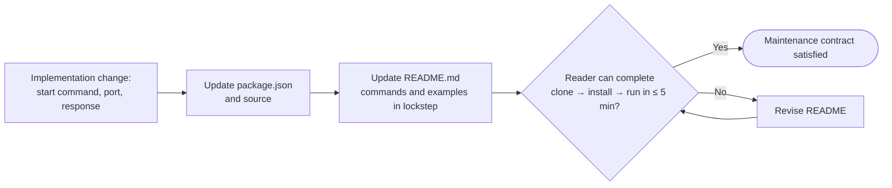

This flow encodes the maintenance requirement that the README and `package.json` remain synchronized (§2.4.5) and that documentation be suitable for novices (§2.2.4.1).

---

## 4.4 VALIDATION AND BUSINESS RULES

### 4.4.1 Business Rules at Each Step

The complete set of business rules applied during any flow is enumerated below. Each rule is invariant — there is no rule that fires conditionally on user input, role, tenant, or environment.

| Flow Step | Business Rule | Source |
|---|---|---|
| Module bootstrap | Implementation must fit within a single conceptual module | §1.2.3.1, §2.4.1 |
| Server creation | At most one external runtime dependency (Express) | F-003-RQ-003, §1.2.3.3 |
| Port binding | Bind must succeed before requests are accepted | F-001-RQ-001 |
| Route match | Path equality is exact and case-sensitive against the literal `/hello` | F-002-RQ-002 |
| Method check | Only GET is matched; other methods route to 404 | C-004, §1.3.2.1 |
| Response composition | Body MUST be the literal string `Hello world` (no localization, templating, content negotiation) | C-005, §2.4.1 |
| Response determinism | No time, randomness, or external state may influence the response | F-002-RQ-003 |
| Lifecycle | Server runs until operator-initiated termination; no auto-shutdown timers | F-003-RQ-002 |
| Documentation | README must remain synchronized with `package.json` and source | §2.4.5 |
| Identity | README's top-level heading must read `# Artifact7` | F-004-RQ-002 |

### 4.4.2 Data Validation Requirements

| Validation Class | Status | Justification |
|---|---|---|
| Request body validation | **Not applicable** | `GET /hello` accepts no payload (§2.2.2.1) |
| Query-string validation | **Not applicable** | No query parameters are recognized (§1.3.2.1) |
| Header validation | **Not applicable** | No header-driven behavior is in scope |
| Path equality check | **Required** | The sole validation step in the entire system (§2.2.2.2) |
| Manifest schema validation | **Required at edit time** | `package.json` must be valid JSON conforming to the npm schema (F-003-RQ-003) |

### 4.4.3 Authorization Checkpoints

**No authorization checkpoints exist in any flow.** Per §2.4.4 and §3.8.1, authentication and authorization are absent by design:

- All requests are anonymous.
- No identity tokens (JWT, session cookies, API keys) are recognized.
- No role-based, attribute-based, or policy-based access control is enforced.
- No identity provider integration exists (§1.3.2.4, §3.5.1).

This is documented as a first-class scope decision and must not be inferred as a defect to remediate within the tutorial's scope (§1.3.2.3).

### 4.4.4 Regulatory Compliance Checks

**No regulatory compliance checks are performed.** Per §1.3.2.3, the system is **not** suitable for compliance-regulated workloads, including but not limited to PCI-DSS, HIPAA, and GDPR processing of personal data. No data-residency, audit-logging, retention, consent-capture, or right-to-erasure flows exist. Deployment to untrusted networks is prohibited by the same section.

---

## 4.5 STATE MANAGEMENT

### 4.5.1 Process State Transitions

The only meaningful state machine in Artifact7 is the **Node.js process lifecycle**. Because the application holds no domain state, no business workflow state, no session state, and no persistent data state, the process-lifecycle states constitute the complete state space.

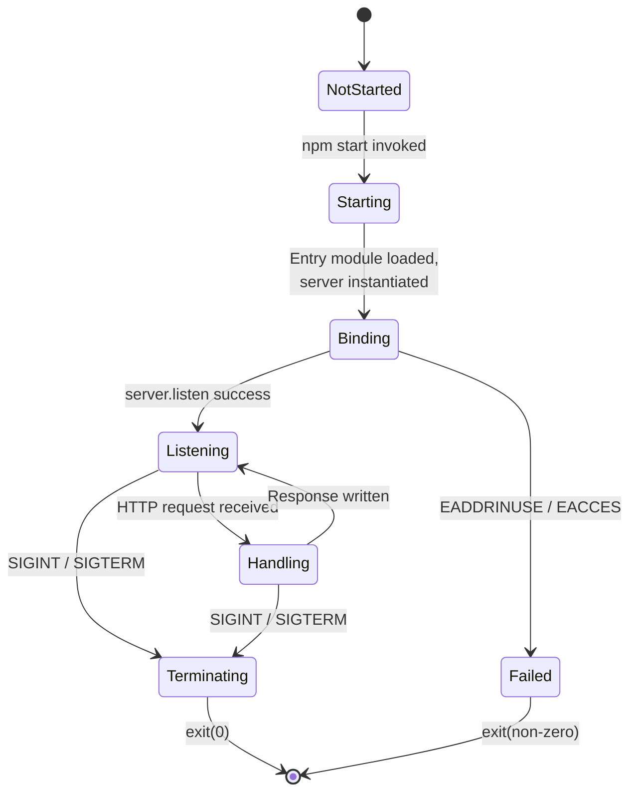

| State | Description | Transition Trigger Out |
|---|---|---|
| `NotStarted` | Process not yet spawned | `npm start` |
| `Starting` | Module loading, server instantiation | Server `listen` invocation |
| `Binding` | TCP listen syscall in flight | OS bind result |
| `Listening` | Bound, idle, ready for requests | Inbound request OR signal |
| `Handling` | Composing response for a single request | Response completion OR signal |
| `Failed` | Bind failed; process exiting | Process termination |
| `Terminating` | Operator signal received; process exiting | Process termination |

### 4.5.2 Data Persistence Points

**None.** Per §3.6 and constraint C-003, the system has no databases, key-value stores, file-based persistence, in-memory caches with cross-request lifetime, or session stores. The response body is a literal compile-time string. Consequently:

- There are no read-from-store steps in any flow.
- There are no write-to-store steps in any flow.
- There are no consistency, durability, or replication considerations.

### 4.5.3 Caching Requirements

**None.** Per §1.3.2.1 (Data Layer) and §3.6, no caching tier exists:

- No client-cache directives are emitted (no `Cache-Control`, `ETag`, `Last-Modified` mandated).
- No reverse-proxy cache is deployed.
- No in-process memoization is used (the response is already a literal constant).
- No CDN integration exists.

### 4.5.4 Transaction Boundaries

**None.** Per constraint C-003, the system has no transactional resources. Every request is handled in isolation by a synchronous handler that produces a response and returns. The unit of "work" is a single HTTP request/response cycle, which is atomic from the client's perspective only by virtue of HTTP/1.1 message framing — not by any application-level transaction manager.

---

## 4.6 ERROR HANDLING

### 4.6.1 Error Surface Inventory

The system's intrinsic error surface is minimal because the runtime accepts no input and consults no external resources. The complete inventory of errors that can occur during normal operation is:

| Error Condition | Trigger | Detection Point | Outcome |
|---|---|---|---|
| Port already in use (EADDRINUSE) | Another process holds the configured port | `server.listen` callback / `error` event | Process exits with non-zero code |
| Insufficient privilege (EACCES) | Attempt to bind privileged port without rights | `server.listen` callback / `error` event | Process exits with non-zero code |
| Path mismatch | Request to any path other than `/hello` | Route resolver | HTTP 404 response |
| Method mismatch | Non-GET request to `/hello` (and other paths) | Route resolver (compound check) | HTTP 404 response |
| Operator-initiated termination | SIGINT / SIGTERM signal | Node.js signal handler (default) | Process exits with code 0 |
| Malformed HTTP request | Invalid HTTP/1.1 framing on the socket | Node.js HTTP parser | Connection closed by runtime (Node.js default behavior) |

### 4.6.2 Error Handling Flowchart

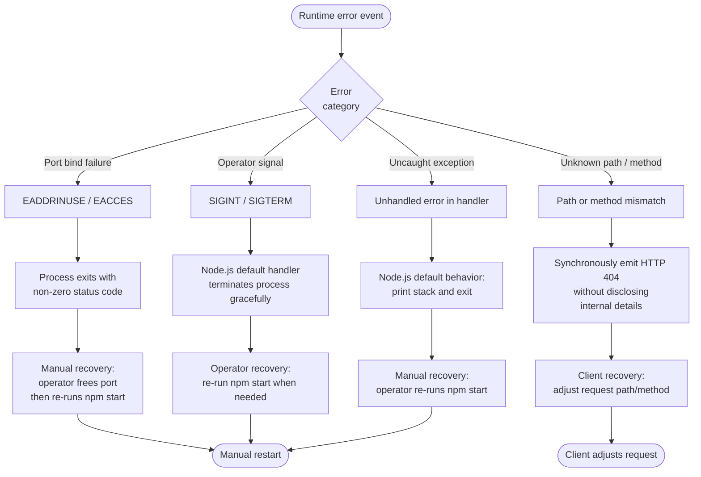

### 4.6.3 Retry, Fallback, Notification, and Recovery Mechanisms

The mechanisms commonly associated with production-grade error handling are **deliberately absent** to preserve the tutorial's pedagogical focus. The table below documents each absence with its authoritative source.

| Mechanism | Status | Authority |
|---|---|---|
| Retry with exponential backoff | Not implemented | §2.4.4, §3.8.1 (no middleware in scope) |
| Circuit breaker | Not implemented | §2.4.3 (scalability out of scope) |
| Fallback response generation | Not implemented | C-005 (response is the literal `Hello world`) |
| Error notification (email, webhook, pager) | Not implemented | §1.3.2.1 (no telemetry / alerting) |
| Centralized logging | Not implemented | §1.3.2.1 (no logging infrastructure) |
| Application performance monitoring (APM) | Not implemented | §1.3.2.1 (no observability stack) |
| Auto-restart on crash (PM2 / systemd / Docker) | Not implemented | §1.3.2.1, §2.4.3 |
| Health-check / liveness / readiness probes | Not implemented | §1.3.2.1 (no Kubernetes / orchestrator) |
| Transaction rollback | Not applicable | No transactional resources exist (§4.5.4) |

**The only "recovery procedure" supported is manual restart by the operator.** This is intentional: the tutorial's value comes from its observable simplicity, and adding any of the mechanisms above would introduce concepts beyond the canonical user requirement.

---

## 4.7 INTEGRATION SEQUENCE DIAGRAMS

The system has three integration boundaries (§2.3.2): the HTTP wire protocol, the TCP socket, and npm script resolution. The four sequence diagrams below cover all observable cross-boundary interactions.

### 4.7.1 Startup Sequence (npm start → Listening)

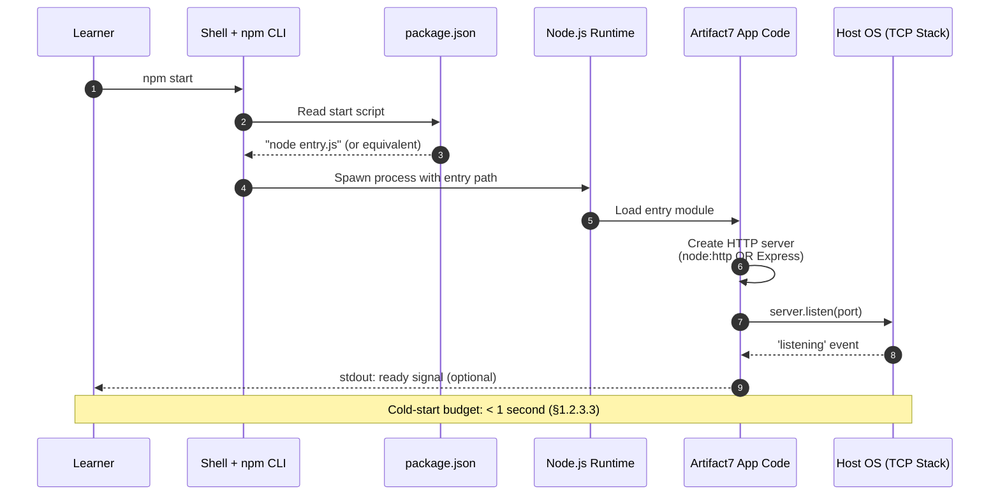

### 4.7.2 Successful Request Sequence (GET /hello)

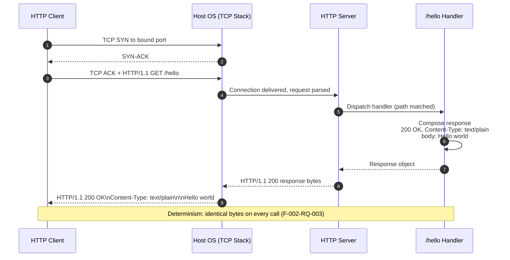

### 4.7.3 Non-Matching Request Sequence (404 Path)

```mermaid
sequenceDiagram
    autonumber
    participant C as HTTP Client
    participant S as HTTP Server
    participant R as Route Resolver

    C->>S: GET /unknown HTTP/1.1
    S->>R: Resolve path '/unknown'
    R->>R: Compound check:<br/>method != GET OR path != '/hello'
    R-->>S: No match
    S-->>C: HTTP/1.1 404 Not Found
    Note over C,R: Synchronous; no I/O wait (§2.2.2.2)
```

### 4.7.4 Termination Sequence (Operator Ctrl+C)

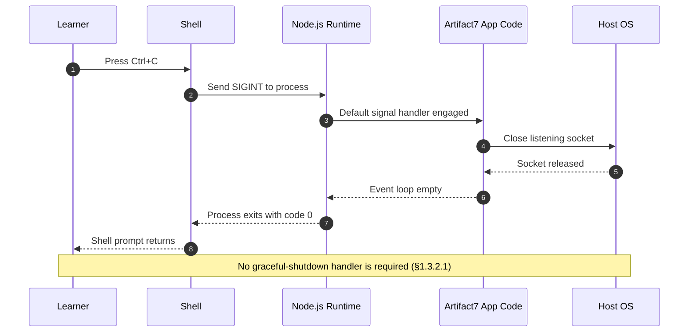

---

## 4.8 TIMING AND SLA CONSIDERATIONS

### 4.8.1 Expected Timing Targets

The technical specification establishes **expected targets**, not measured operational SLAs (§1.2.3.3, §2.4.2). They are summarized below.

| Timing Constraint | Target | Scope | Authority |
|---|---|---|---|
| Cold-start time (process spawn → listening) | < 1 second | F-001 | §1.2.3.3, §2.2.1.1 |
| npm script resolution time | Sub-second (immediate) | F-003 | §2.2.3.3 |
| 404 response generation | Synchronous, no I/O wait | F-002 | §2.2.2.2 |
| Functional correctness for `GET /hello` | 100% (deterministic) | F-002 | §1.2.3.3, F-002-RQ-003 |
| Setup friction (clone → install → run) | ≤ 5 minutes | F-004 | §1.2.3.1, F-004-RQ-001 |

### 4.8.2 What the Targets Do NOT Cover

Per §1.2.3.3, no production-grade SLAs are committed for Artifact7:

- **No throughput targets** (requests per second, peak load).
- **No latency-percentile commitments** (p50/p95/p99 response time).
- **No concurrent-user commitments**.
- **No availability/uptime SLO** (e.g., 99.9%).
- **No mean-time-to-recovery (MTTR)** target.

This absence is intentional. Operators who require any of the above metrics must select a different platform; Artifact7 must not be deployed as a production microservice (§1.3.2.3, §2.4.3).

### 4.8.3 Timing Annotations on Flowcharts

For visual reference, the cold-start budget applies to the F-001 initialization flow (§4.3.1) from the `Start` node to the `Ready` node. The 404 synchronicity requirement applies to the 404 branches in the F-002 request handling flow (§4.3.2) — those branches must not enter any awaitable operation.

---

## 4.9 SUMMARY AND CROSS-REFERENCES

### 4.9.1 Flowchart Coverage Matrix

The matrix below maps each prompt-mandated flowchart category to the diagram(s) that satisfy it within this section.

| Mandated Category | Satisfied By | Location |
|---|---|---|
| High-level system workflow | Swim-lane flowchart (Lanes 1–4) | §4.2.1 |
| Detailed flow for F-001 | F-001 initialization flowchart | §4.3.1 |
| Detailed flow for F-002 | F-002 request handling flowchart | §4.3.2 |
| Detailed flow for F-003 | F-003 lifecycle flowchart | §4.3.3 |
| Detailed flow for F-004 | F-004 maintenance flowchart | §4.3.4 |
| Error handling flowchart | Error classification and recovery flowchart | §4.6.2 |
| Integration sequence diagrams | Four sequence diagrams (startup, success, 404, termination) | §4.7.1–§4.7.4 |
| State transition diagram | Process-lifecycle state diagram | §4.5.1 |
| Data-flow diagram | Integration data-flow diagram | §4.2.3.1 |

### 4.9.2 Cross-References to Related Sections

| Topic | Related Section |
|---|---|
| Conceptual interaction model (baseline diagram) | §1.2.2.2 |
| Primary user workflow (baseline sequence diagram) | §1.3.1.2 |
| Feature dependency map | §2.3.1 |
| Functional requirements (F-001 through F-004) | §2.2 |
| Integration points | §2.3.2, §3.8.2 |
| Implementation constraints | §2.4.1, §2.6 |
| Security posture (exclusions) | §2.4.4, §3.8.1 |
| Scalability exclusions | §2.4.3 |
| Persistence exclusions | §3.6 |
| Third-party-service exclusions | §3.5 |
| Implementation-path options (`node:http` vs Express) | §3.3 |

### 4.9.3 Forward-Looking Note

Because the repository currently contains only `README.md` and `.git/`, all flowcharts above represent target behavior to be realized during implementation. As source files (`package.json`, the entry module, and any handler module) are introduced, the implementation must remain faithful to the flowcharts above; any deviation from the documented decision points, state machine, or error classification would constitute a specification violation rather than an implementation detail.

---

## 4.10 REFERENCES

#### Files Examined

- `README.md` — Confirmed the greenfield state of the repository (single `# Artifact7` heading). Establishes that all flows documented in this section are forward-looking.
- `/` (repository root) — Verified to contain only `README.md` and `.git/` metadata. No `package.json`, source files, or build configuration exist at present.

#### Technical Specification Sections Cross-Referenced

- **§1.1 EXECUTIVE SUMMARY** — Verbatim user requirement and stakeholder identity used to scope the end-to-end user journey (§4.2.2.1).
- **§1.2 SYSTEM OVERVIEW** — System capabilities, conceptual components, and the existing Conceptual Interaction Model that §4.2.1 expands into swim lanes. Source of cold-start performance target.
- **§1.3 SCOPE** — In-scope/out-of-scope boundaries grounding the absences documented in §4.2.3.3, §4.4.3, §4.4.4, and §4.6.3. Source of the existing Primary User Workflow sequence (§1.3.1.2) expanded in §4.7.
- **§2.1 FEATURE CATALOG** — Feature identifiers F-001 through F-004 used as the spine of §4.3.
- **§2.2 FUNCTIONAL REQUIREMENTS TABLES** — Authoritative source for every step, decision, validation, and performance criterion in §4.3 through §4.5. Specifically F-001-RQ-001/002, F-002-RQ-001/002/003, F-003-RQ-001/002/003, and F-004-RQ-001/002.
- **§2.3 FEATURE RELATIONSHIPS** — Feature dependency invariants honored by §4.3 ordering; integration-point enumeration used in §4.2.3.1 and §4.7.
- **§2.4 IMPLEMENTATION CONSIDERATIONS** — Technical constraints, performance targets, scalability exclusions, and security implications underlying §4.4, §4.6.3, and §4.8.
- **§2.5 TRACEABILITY MATRIX** — Requirement-to-section mapping used to verify completeness of §4.3.
- **§2.6 ASSUMPTIONS, CONSTRAINTS, AND VERSIONING** — Constraints C-003 (no persistence), C-004 (only GET), and C-005 (literal response body) anchoring §4.4.1 and §4.5.
- **§3.1 TECHNOLOGY STACK OVERVIEW** — Stack-at-a-Glance layering used to delineate integration boundaries in §4.2.3.1.
- **§3.3 FRAMEWORKS & LIBRARIES** — Vanilla `node:http` vs Express 5.2.0 paths reflected in the implementation-path branch in §4.3.1.
- **§3.5 THIRD-PARTY SERVICES** — Authoritative absence used to mark §4.2.3.3 as Not Applicable.
- **§3.6 DATABASES & STORAGE** — Authoritative absence used to mark §4.5.2, §4.5.3, §4.5.4 as None.
- **§3.8 SECURITY AND INTEGRATION POSTURE** — Integration contract (§3.8.2) and the complete inventory of absent security mechanisms (§3.8.1) underlying §4.4.3, §4.4.4, and §4.6.3.

# 5. System Architecture

## 5.1 HIGH-LEVEL ARCHITECTURE

### 5.1.1 System Overview

#### 5.1.1.1 Architecture Style and Rationale

Artifact7 implements a **single-process, monolithic Node.js HTTP service** architecture. The entire system is realized as one operating-system process running on a single host, listening on one TCP port, exposing one HTTP endpoint, and emitting one fixed response. There are no microservices, no service mesh, no distributed coordination, and no inter-process communication boundaries beyond the wire-protocol contract between the server and a calling HTTP client.

This architectural posture is the **direct, intentional consequence** of the project's pedagogical mission as established in §1.2. The system is positioned as an instructional artifact rather than a commercial product, with no upstream data sources, no downstream consumers in production, and no integration touchpoints with enterprise services such as identity providers, message brokers, databases, or monitoring platforms (§1.2.1.3). Every architectural decision — from the choice of single-process execution to the deliberate exclusion of caching, persistence, security middleware, and observability tooling — exists to maximize source-code transparency for a novice reader studying the artifact line by line.

The architecture style can therefore be classified as:

- **Topology**: Monolith (single deployable unit)
- **Concurrency Model**: Single-threaded Node.js event loop with asynchronous I/O
- **Communication Style**: Synchronous request/response over HTTP/1.1
- **State Model**: Stateless — no domain state, session state, or persistent data state
- **Deployment Granularity**: Local-host developer workstation only

#### 5.1.1.2 Key Architectural Principles and Patterns

The stack composition is governed by five non-negotiable principles drawn directly from §1.2.3 and §2.6.2:

| Principle | Source Authority | Architectural Implication |
|---|---|---|
| Minimal external surface | §1.2.3.3 KPI; C-001 | At most one npm runtime dependency; zero is preferred |
| Pedagogical transparency | §1.2.3.2 Critical Success Factors | Source must be readable line-by-line by a novice |
| Single conceptual module | §1.2.3.1 Measurable Objectives; §2.4.1 | No build pipeline, no transpilation, no bundling |
| Cross-platform operability | F-001-RQ-002 | Must run on Linux, macOS, Windows unmodified |
| No production tooling | §1.3.2.1; C-002 | No Docker, CI/CD, IaC, or observability stack |

The system adheres to a small number of well-known architectural patterns, applied minimally:

- **Front Controller pattern** (implicit): A single HTTP server accepts all incoming requests and dispatches them to a single route handler. In Option B (Express), this is realized through the Express router; in Option A (vanilla `http`), it is realized through an inline path/method comparison.
- **Request/Response pattern**: Each interaction is a discrete, atomic HTTP transaction with no client-server session affinity.
- **Stateless Service pattern**: Every request is handled in complete isolation; the server holds no information about prior requests.
- **Single Source of Truth for Configuration**: All process metadata (name, version, start command) resides in `package.json`.

#### 5.1.1.3 System Boundaries and Major Interfaces

The system's boundaries are tightly drawn and explicitly enumerated in §2.3.2:

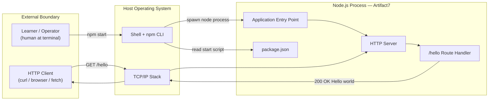

The three — and only three — observable interfaces crossing the boundary of the Node.js process are:

1. **HTTP Wire Protocol** between the route handler and any HTTP client
2. **TCP Socket** between the Node.js runtime and the host operating system
3. **npm Script Resolution** between `package.json` and the npm CLI

No additional interfaces exist or are permitted. Per §1.3.2.4, the system does **not** integrate with external APIs (consumed or exposed beyond `/hello`), message queues, event buses, or identity providers.

### 5.1.2 Core Components

The system is composed of four conceptual components, derived from §1.2.2.2 and elaborated in §2.3.3.

#### 5.1.2.1 Component Responsibilities and Dependencies

| Component Name | Primary Responsibility | Key Dependencies |
|---|---|---|
| Application Entry Point | Bootstraps the process, loads modules, and instantiates the HTTP server | Node.js runtime; the chosen HTTP module (Option A or B) |
| HTTP Server | Listens for incoming TCP connections, parses HTTP/1.1 requests, dispatches matched requests to handlers | Node.js `node:http` built-in **OR** Express.js `^5.2.0` (mutually exclusive) |
| Route Handler | Implements the logic for `GET /hello` — composes and returns the literal `Hello world` body | HTTP Server; no other dependencies |
| Package Manifest | Declares project metadata, the `start` script, and the single permitted dependency (if Express path) | npm CLI for resolution; Node.js runtime for execution |

#### 5.1.2.2 Component Integration and Critical Considerations

| Component Name | Integration Points | Critical Considerations |
|---|---|---|
| Application Entry Point | Spawned by npm/node CLI; instantiates HTTP Server | Must be referenced by the `start` script in `package.json`; single conceptual module per §2.4.1 |
| HTTP Server | Binds to TCP socket via host OS; dispatches to Route Handler | Cold-start budget < 1 second (§4.8.1); cross-platform without source modification |
| Route Handler | Invoked by HTTP Server on compound match (method=GET AND path=`/hello`) | Response is a compile-time literal (C-005); 100% deterministic (F-002-RQ-003); synchronous with no I/O wait |
| Package Manifest | Resolved by npm CLI; declares dependencies for npm install | `devDependencies` must remain empty (§3.4.3); lockfile only if Express path chosen |

The component-to-feature mapping (from §2.3.3) shows the cross-feature reuse:

- **Application Entry Point** is used by F-001 (HTTP Server Initialization) and F-003 (Process Lifecycle Management)
- **HTTP Server** is used by F-001 and F-002 (Hello World Endpoint)
- **Package Manifest** is used by F-003 and F-004 (Project Documentation)

### 5.1.3 Data Flow Description

#### 5.1.3.1 Primary Data Flows Between Components

The system's data flows are intentionally linear and shallow. Two distinct flows account for the entirety of observable system behavior: the **startup flow** (one-time, on process spawn) and the **request flow** (repeated for each inbound HTTP request).

**Startup Flow** (from §4.2.3.1 and §4.7.1):

1. The learner issues `npm start` at the shell prompt.
2. The npm CLI reads the `start` script from `package.json`.
3. The shell spawns a `node` process with the resolved entry path.
4. The entry module loads, requiring either the built-in `http` module or the Express package.
5. The application code creates an HTTP server instance.
6. The server invokes `server.listen(port)`, delegating to the host OS TCP stack.
7. The OS returns a `'listening'` event, signaling readiness.
8. The process transitions to the `Listening` state and waits for requests.

**Request Flow** (from §4.7.2):

1. An HTTP client opens a TCP connection to the bound port.
2. The OS TCP stack delivers the connection to the Node.js HTTP server.
3. The HTTP server parses the HTTP/1.1 request line and headers.
4. The route resolver performs a compound match against `method === 'GET' AND path === '/hello'`.
5. On match, the request is dispatched to the `/hello` handler.
6. The handler composes a response containing status `200 OK`, header `Content-Type: text/plain`, and body `Hello world`.
7. The server serializes the response and transmits it over the TCP socket.
8. The client receives the response bytes and the process returns to the `Listening` state.

#### 5.1.3.2 Integration Patterns and Protocols

All data crossing the process boundary uses **HTTP/1.1** as its application-layer protocol. This protocol is implemented either by the Node.js standard library (`node:http`) or by Express.js layered on top of it. There is no use of:

- HTTP/2 or HTTP/3 (not in scope)
- WebSockets, Server-Sent Events, or long-polling
- gRPC, GraphQL, or any RPC framework
- AMQP, MQTT, or any messaging protocol
- TLS-encrypted transport (HTTPS) — explicitly excluded per §3.8.1

The integration pattern is strictly **synchronous request/response**. Per §4.2.3.3, no asynchronous messaging, event-driven pub/sub, or streaming patterns are used.

#### 5.1.3.3 Data Transformation Points

There are **no data transformation points** in the system. The response body `Hello world` is a compile-time literal string constant baked into the source code. No template rendering, content negotiation, localization, serialization framework, or schema mapping is performed. This is mandated by C-005 and reinforced by §1.3.2.1's exclusion of templating engines.

#### 5.1.3.4 Key Data Stores and Caches

Per §4.5.2, §4.5.3, and constraint C-003, the system has **no data stores or caches of any kind**:

- No relational database (PostgreSQL, MySQL, etc.)
- No document store (MongoDB, etc.)
- No key-value store (Redis, Memcached, etc.)
- No object storage (S3, etc.)
- No filesystem-based persistence
- No in-memory caches with cross-request lifetime
- No session stores
- No client-side cache directives (no `Cache-Control`, `ETag`, `Last-Modified`)
- No reverse-proxy or CDN cache

Consequently, there are no consistency, durability, replication, or cache-invalidation considerations to document.

### 5.1.4 External Integration Points

The complete inventory of external integration boundaries consists of exactly three entries (per §2.3.2 and §3.8.2). No others exist or are permitted.

#### 5.1.4.1 Integration Point Inventory

| System Name | Integration Type | Protocol / Format |
|---|---|---|
| External HTTP Client (curl, browser, fetch) | Inbound synchronous request/response | HTTP/1.1 over plaintext TCP |
| Host Operating System (TCP/IP stack) | Process-to-kernel system calls | POSIX/Windows socket APIs via Node.js runtime |
| npm CLI (script resolution) | Process invocation through `package.json` | npm script protocol; JSON manifest |

#### 5.1.4.2 Data Exchange Patterns and SLAs

| System Name | Data Exchange Pattern | SLA / Expected Target |
|---|---|---|
| External HTTP Client | Stateless one-shot request → response cycle; GET-only on `/hello` | 100% functional correctness; 404 response is synchronous (no I/O wait) |
| Host Operating System | One-time `listen()` call at startup; per-request socket I/O | Cold-start < 1 second (§4.8.1) |
| npm CLI | One-time read of `start` script at process invocation | Sub-second resolution (§4.8.1) |

#### 5.1.4.3 Explicitly Excluded Integration Categories

The following integration categories are explicitly excluded by §1.3.2.4 and §3.5, and their absence is part of the architecture:

- **External APIs (consumed)**: No outbound HTTP, REST, GraphQL, or RPC calls
- **External APIs (exposed)**: No endpoints beyond `GET /hello`
- **Message Queues / Event Buses**: No Kafka, RabbitMQ, SQS, NATS, etc.
- **Identity Providers**: No Auth0, Okta, Cognito, OIDC, SAML, etc.
- **Databases / Storage Services**: None of any kind
- **Monitoring / Logging Services**: No Datadog, New Relic, Sentry, Splunk, ELK, Loki
- **Cloud Platforms**: No AWS, Azure, GCP, or any PaaS/IaaS integration

---

## 5.2 COMPONENT DETAILS

### 5.2.1 Application Entry Point

#### 5.2.1.1 Purpose and Responsibilities

The Application Entry Point is the first JavaScript module loaded when the Node.js process is spawned. It serves as the conductor of process initialization: it imports the chosen HTTP module, instantiates the HTTP server, attaches the route handler (or registers the route in Express), and invokes `server.listen()` to bind the TCP socket. It is the conceptual "main" of the application.

#### 5.2.1.2 Technologies and Frameworks Used

- **Runtime**: Node.js 24 LTS "Krypton" recommended, Node.js 22 LTS acceptable
- **Module system**: Either CommonJS (`.js` with `require`) or ECMAScript Modules (`.mjs` or `.js` with `"type": "module"`) — both are permitted (ADR-004)
- **No transpilation**: Source executes directly in V8; no Babel, SWC, or TypeScript involvement (ADR-003)

#### 5.2.1.3 Key Interfaces and APIs

- **Inbound**: Process spawn from the npm/node CLI via the `start` script in `package.json`
- **Outbound (Option A)**: Calls into `node:http` `createServer()` and the returned server's `listen()` method
- **Outbound (Option B)**: Calls into `express()` factory; uses `app.get('/hello', handler)` and `app.listen()`

#### 5.2.1.4 Data Persistence and Scaling

This component holds no persistent state. There is exactly one instance of the entry point per process, and exactly one process per host. Scaling — clustering, multi-process workers, PM2, horizontal replication — is explicitly out of scope per §2.4.3.

### 5.2.2 HTTP Server

#### 5.2.2.1 Purpose and Responsibilities

The HTTP Server component listens for incoming TCP connections on the configured port, parses HTTP/1.1 wire-format requests, performs route resolution, and dispatches matched requests to handlers. On non-matching requests, it emits an HTTP 404 response synchronously.

#### 5.2.2.2 Technologies and Frameworks Used

The implementation must commit to exactly one of two mutually exclusive paths (per §3.3.1 — "must commit to exactly one path in the final source tree"):

| Attribute | Option A — Vanilla `node:http` | Option B — Express.js |
|---|---|---|
| Module / Package | `node:http` (built-in) | `express` ^5.2.0 (npm) |
| External Runtime Deps | 0 | 1 |
| Idiomatic Style | Imperative; low-level request/response API | Declarative routing; middleware chain |

The Express 5.x choice rationale (§3.3.3.1): Express 5.2 shipped December 1, 2025 and is the Technical Committee's endorsed production release for greenfield projects in 2026; Express 4.x has been in formal Maintenance status since April 1, 2025, with EOL no sooner than October 1, 2026, making it unsuitable as a new-project baseline.

#### 5.2.2.3 Key Interfaces and APIs

- **OS interface**: `server.listen(port)` system call; `'listening'` event emitted by the OS
- **Application interface**: HTTP/1.1 wire-protocol parsing handled by Node.js core regardless of Option chosen
- **Handler dispatch**: Either inline `if (req.method === 'GET' && req.url === '/hello')` (Option A) or Express's path-matching router (Option B)

#### 5.2.2.4 Performance and Scaling Considerations

- **Cold-start performance contract**: Process spawn → listening state in under 1 second on modern developer hardware (§4.8.1)
- **Cross-platform**: Must run on Linux, macOS, and Windows without source modification (F-001-RQ-002)
- **Scaling**: None — single instance, single process, single host. Clustering, load balancing, and horizontal scaling are explicitly excluded (§2.4.3)

### 5.2.3 Route Handler

#### 5.2.3.1 Purpose and Responsibilities

The Route Handler implements the logic for the single supported endpoint: `GET /hello`. Its sole responsibility is to produce an HTTP 200 response with the literal body `Hello world`. The handler accepts no input data, performs no I/O, and consults no external resources.

#### 5.2.3.2 Compound Match Semantics

Route resolution is a **compound match** combining HTTP method and URL path:

- **Match condition**: `method === 'GET' AND path === '/hello'`
- **Match outcome**: Dispatch to handler; emit 200 OK
- **Non-match outcome**: Emit 404 Not Found synchronously

This is documented in §4.6.1, where both "Path mismatch" (any path other than `/hello`) and "Method mismatch" (non-GET request) result in HTTP 404 via the route resolver.

#### 5.2.3.3 Response Contract

Per §3.8.2 and C-005, the response is fixed:

| Field | Value |
|---|---|
| HTTP version | HTTP/1.1 |
| Status code | `200 OK` |
| `Content-Type` header | `text/plain` (or `text/plain; charset=utf-8`) |
| Body | `Hello world` (literal compile-time string) |

#### 5.2.3.4 Determinism and Behavioral Guarantees

The handler must be:

- **Deterministic**: Bit-identical response bytes on every invocation (F-002-RQ-003)
- **Synchronous**: No `await`, no I/O wait, no promise chains that depend on external state
- **Input-independent**: Response is independent of request headers, query strings, or body content (F-002-RQ-001)
- **Stateless**: Carries no state between invocations

#### 5.2.3.5 Data Persistence and Scaling

None. The handler is a pure function of its (empty) input. There is no per-request or cross-request state.

### 5.2.4 Package Manifest

#### 5.2.4.1 Purpose and Responsibilities

The `package.json` file declares project metadata, the `start` script that invokes the entry point, and — in Option B only — the single permitted dependency. It is read by the npm CLI at install time and at script-resolution time.

#### 5.2.4.2 Required Fields and Constraints

- **Required fields**: `name`, `version`, `description`, `license`, and a `start` script under `scripts`
- **Optional fields**: `engines.node` field constraining runtime to `>=22` (or `>=24`)
- **`dependencies`**: Empty (Option A) **OR** one entry `express: ^5.2.0` (Option B)
- **`devDependencies`**: Must remain empty per §3.4.3
- **Lockfile**: `package-lock.json` only if the Express path is chosen

#### 5.2.4.3 Maintenance Contract

Per §2.4.5, if the start command changes, both `package.json` and the README must be updated in lockstep. The `package.json` is also the authoritative source for the Node.js LTS version baseline tracked across release transitions.

### 5.2.5 Component Interaction Diagram

The following diagram illustrates how the four components interact during normal operation:

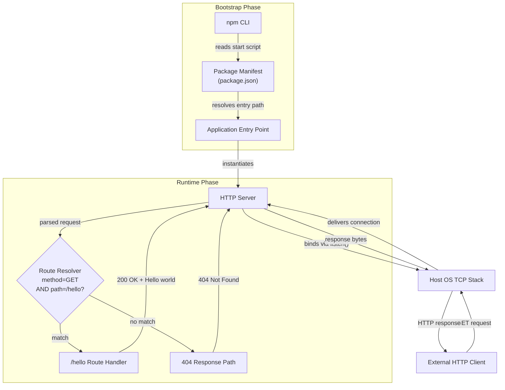

### 5.2.6 Process State Transitions

The only meaningful state machine in Artifact7 is the **Node.js process lifecycle** (§4.5.1). Because the application holds no domain state, no business workflow state, no session state, and no persistent data state, the process-lifecycle states constitute the complete state space.


| State | Description | Transition Trigger Out |
|---|---|---|
| `NotStarted` | Process not yet spawned | `npm start` issued |
| `Starting` | Module loading; server instantiation | Server `listen()` invocation |
| `Binding` | TCP `listen` syscall in flight | OS bind result (success or error) |
| `Listening` | Bound; idle; ready for requests | Inbound request OR signal |
| `Handling` | Composing response for a single request | Response completion OR signal |
| `Failed` | Bind failed; process exiting | Process termination |
| `Terminating` | Operator signal received; process exiting | Process termination |

### 5.2.7 Sequence Diagrams for Key Flows

#### 5.2.7.1 Startup Sequence

This sequence covers the path from `npm start` to the `Listening` state. The cold-start budget of less than one second (§4.8.1) applies to the entirety of this sequence.

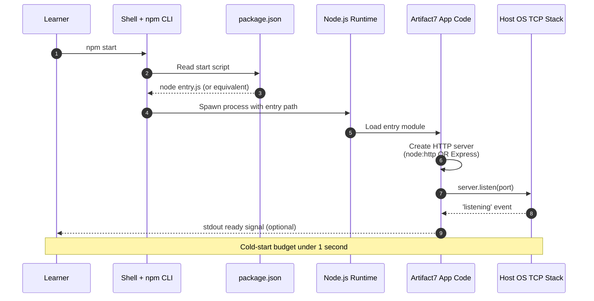

#### 5.2.7.2 Successful Request Sequence

This sequence covers a `GET /hello` request from a remote HTTP client through the OS, the server, and the route handler, terminating with the bytes of the 200 OK response delivered back to the client.

```mermaid
sequenceDiagram
    autonumber
    participant C as HTTP Client
    participant OS as Host OS TCP Stack
    participant S as HTTP Server
    participant H as /hello Handler

    C->>OS: TCP SYN to bound port
    OS-->>C: SYN-ACK
    C->>OS: TCP ACK + HTTP/1.1 GET /hello
    OS->>S: Connection delivered, request parsed
    S->>H: Dispatch handler (path matched)
    H->>H: Compose response<br/>200 OK, Content-Type text/plain<br/>body Hello world
    H-->>S: Response object
    S-->>OS: HTTP/1.1 200 response bytes
    OS-->>C: 200 OK with Hello world body
    Note over C,H: Bit-identical bytes on every call
```

#### 5.2.7.3 Non-Matching Request (404) Sequence

This sequence covers any request that fails the compound match (method != GET OR path != `/hello`). The 404 response is generated synchronously without entering any awaitable operation, per §2.2.2.2.

```mermaid
sequenceDiagram
    autonumber
    participant C as HTTP Client
    participant S as HTTP Server
    participant R as Route Resolver

    C->>S: GET /unknown HTTP/1.1
    S->>R: Resolve path /unknown
    R->>R: Compound check:<br/>method != GET OR path != /hello
    R-->>S: No match
    S-->>C: HTTP/1.1 404 Not Found
    Note over C,R: Synchronous; no I/O wait
```

#### 5.2.7.4 Termination Sequence

This sequence covers operator-initiated termination via SIGINT (Ctrl+C) or SIGTERM. No custom graceful-shutdown handler is required; Node.js's default signal handling is sufficient (§1.3.2.1).

```mermaid
sequenceDiagram
    autonumber
    participant L as Learner
    participant Sh as Shell
    participant N as Node.js Runtime
    participant App as Artifact7 App Code
    participant OS as Host OS

    L->>Sh: Press Ctrl+C
    Sh->>N: Send SIGINT to process
    N->>App: Default signal handler engaged
    App->>OS: Close listening socket
    OS-->>App: Socket released
    App-->>N: Event loop empty
    N-->>Sh: Process exits with code 0
    Sh-->>L: Shell prompt returns
```

---

## 5.3 TECHNICAL DECISIONS

### 5.3.1 Architecture Style Decision

#### 5.3.1.1 Decision

The system is implemented as a **monolithic single-process Node.js server**. There is no service decomposition, no asynchronous orchestration, and no distributed coordination.

#### 5.3.1.2 Trade-offs

| Dimension | Benefit of Monolithic Choice | Cost of Monolithic Choice |
|---|---|---|
| Pedagogical clarity | Maximum — entire system fits in one source file | None — clarity is the goal |
| Operational complexity | Zero — no orchestration required | None — complexity is excluded |
| Horizontal scalability | N/A — explicitly out of scope (§2.4.3) | Cannot scale beyond one process |
| Fault isolation | N/A — single process | A process crash terminates all service |

This trade-off matrix is consistent with the principle that any production-scale workload should use a different system entirely; Artifact7 must not be deployed as a production microservice (§1.3.2.3).

#### 5.3.1.3 Departures from the Default Technology Stack

The agent-default stack (Python/Flask, AWS, Docker, Terraform, GitHub Actions, Auth0, MongoDB, etc.) is **superseded** by the user-provided directive to build a Node.js tutorial. The following departures are authoritatively justified:

| Default Item | Status in Artifact7 | Authoritative Source |
|---|---|---|
| Python / Flask | Replaced by JavaScript / Node.js | §1.1.1 user mandate; §1.2.2.3 |
| AWS cloud platform | Excluded | §1.2.1.3; §1.3.2.1 |
| Docker containerization | Excluded | §1.3.2.1 Deployment Infrastructure |
| Terraform (IaC) | Excluded | §1.2.1.3; §1.3.2.1 |
| GitHub Actions (CI/CD) | Excluded | §1.3.2.1 Quality Engineering; §2.4.5 |
| Auth0 authentication | Excluded | §1.3.2.1 Security; §2.4.4 |
| MongoDB database | Excluded | §1.3.1.3; C-003 |
| React / TailwindCSS | Not applicable | §1.3.2.1 Frontend exclusion |

### 5.3.2 Communication Pattern Choice

The system uses **synchronous HTTP/1.1 request/response** as its sole communication pattern. The rationale is fourfold:

- **HTTP/1.1 is the canonical protocol** demonstrated by the Node.js homepage example (referenced in §3.3.2)
- **Synchronous semantics** maximize transparency: a learner can trace a single request through the source line by line
- **No asynchronous patterns** (queues, event buses, streams) are used per §4.2.3.3
- **Single endpoint** means no API versioning, content negotiation, or routing complexity is needed

The exclusion of HTTP/2, HTTP/3, WebSockets, Server-Sent Events, gRPC, GraphQL, and all message-broker protocols is intentional and is documented in §1.3.2.4.

### 5.3.3 Data Storage Solution Rationale

The system uses **no data storage of any kind** (per constraint C-003). The rationale is that the response body is a compile-time literal constant; therefore no data domain exists to model, persist, or query.

| Storage Category | Status | Why Excluded |
|---|---|---|
| Relational databases (PostgreSQL, MySQL) | Excluded | No relational data model exists |
| Document stores (MongoDB) | Excluded | No documents to persist |
| Key-value stores (Redis) | Excluded | No keys or values exist beyond the literal response |
| Object storage (S3) | Excluded | No binary objects |
| ORMs / migrations / schemas | Excluded | No data model to manage |

### 5.3.4 Caching Strategy Justification

**No caching tier exists** (per §4.5.3). The justification follows directly from the absence of any data store: there is nothing to cache. Specifically:

- **No client-cache directives**: The response does not include `Cache-Control`, `ETag`, or `Last-Modified` headers
- **No reverse-proxy cache**: There is no nginx, Varnish, or HAProxy in the deployment topology
- **No in-process memoization**: The response is already a literal constant; memoization would be redundant
- **No CDN integration**: The system is local-host only

### 5.3.5 Security Mechanism Selection

#### 5.3.5.1 Decision

**No security mechanisms** are implemented, deliberately and by design (per §2.4.4 and §3.8.1). The system is suitable only for local-host learner environments and must not be exposed to untrusted networks or used in compliance-regulated contexts (PCI, HIPAA, GDPR).

#### 5.3.5.2 Exclusion Inventory and Implications

| Mechanism | Status | Implication |
|---|---|---|
| Transport Layer Security (HTTPS/TLS) | Not implemented | Wire traffic is plaintext HTTP |
| Authentication | Not implemented | All requests are anonymous |
| Authorization | Not implemented | No access control enforced |
| Security response headers (HSTS, CSP, X-Frame-Options) | Not configured | Browser defenses not engaged |
| CORS policy | Not configured | No cross-origin policy declared |
| Input validation | Not applicable | The endpoint accepts no input data (F-002-RQ-001) |
| Rate limiting | Not implemented | No middleware in scope |

Because the response is a fixed static string and the server accepts no input, the intrinsic attack surface is minimal — but the architecture intentionally avoids depending on that property as a substitute for real security controls in any production context.

### 5.3.6 Architecture Decision Records (ADRs)

The following ADRs capture the foundational architectural choices.

#### 5.3.6.1 ADR-001 — Vanilla `node:http` vs Express.js

| Field | Value |
|---|---|
| Status | Accepted (with deferred implementation choice) |
| Context | Need an HTTP server; ≤ 1 external dependency mandated by C-001 |
| Options | Option A: `node:http` (0 deps); Option B: `express` ^5.2.0 (1 dep) |
| Decision | Either option is acceptable; the source tree must commit to exactly one |
| Consequences | Option A maximizes transparency; Option B introduces an industry-standard abstraction |

Both options satisfy F-001 and F-002 and comply with the ≤ 1 external-dependency KPI. If Express is chosen, version `^5.2.0` is mandated because Express 4.x has been in formal Maintenance status since April 1, 2025 and is unsuitable for new projects.

#### 5.3.6.2 ADR-002 — Node.js Version Baseline

| Field | Value |
|---|---|
| Status | Accepted |
| Recommended | Node.js 24 LTS "Krypton" (Active LTS Oct 28, 2025 → Oct 20, 2026) |
| Acceptable | Node.js 22 LTS (Maintenance through April 2027) |
| Rejected | Node.js 26.x (Current, non-LTS); all odd-numbered versions; EOL versions |
| Rationale | LTS commitment aligns with §2.4.5 maintenance-tracking obligation |

#### 5.3.6.3 ADR-003 — No Build System

| Field | Value |
|---|---|
| Status | Accepted |
| Context | Single conceptual module requirement (§1.2.3.1, §2.4.1) |
| Decision | No transpilation, no bundling, no asset compilation |
| Excluded Tools | Webpack, Rollup, Vite, Parcel, esbuild, Babel, SWC, TypeScript |
| Consequences | Source executes directly in V8; setup friction minimized |

#### 5.3.6.4 ADR-004 — JavaScript Module System

| Field | Value |
|---|---|
| Status | Accepted (implementation choice) |
| Options | CommonJS (`.js` + `require`) OR ECMAScript Modules (`.mjs` / `"type": "module"`) |
| Decision | Either is permitted; no preference mandated |
| Rationale | Both module systems are stable, native, and zero-cost in modern Node.js LTS |

#### 5.3.6.5 Decision Tree for Implementation Path Selection

```mermaid
flowchart TD
    Start([Implementation Phase Begins]) --> Q1{Tutorial goal:<br/>maximum transparency<br/>or industry idiom?}
    Q1 -->|Maximum<br/>transparency| OptA[Option A:<br/>node:http<br/>0 dependencies]
    Q1 -->|Industry<br/>idiom| OptB[Option B:<br/>Express ^5.2.0<br/>1 dependency]

    OptA --> CheckA{Express features<br/>needed later?}
    OptB --> CheckB{Stay on<br/>Express 5.x?}

    CheckA -->|No| ProceedA[Implement with<br/>node:http]
    CheckA -->|Yes| Reconsider1[Reconsider<br/>Option B upfront]

    CheckB -->|Yes| ProceedB[Implement with<br/>Express ^5.2.0]
    CheckB -->|No, Express 4| Reject[Reject — Express 4<br/>is in Maintenance]

    ProceedA --> Commit([Commit single<br/>implementation path<br/>to source tree])
    ProceedB --> Commit
    Reconsider1 --> Q1
    Reject --> Q1
```

### 5.3.7 Runtime Decision Points

The runtime contains only **two decision points** during normal operation (per §1.5):

1. **Port-Bind Outcome** — Success transitions the process to `Listening`; failure (EADDRINUSE / EACCES) transitions to `Failed` and exits non-zero
2. **Route Match** — A compound check (method = GET AND path = `/hello`) determines whether a request is dispatched to the handler or routed to a 404 response

No other branches, feature flags, configuration toggles, or runtime decisions exist.

---

## 5.4 CROSS-CUTTING CONCERNS

### 5.4.1 Monitoring and Observability Approach

#### 5.4.1.1 Status

**No monitoring or observability stack is provisioned.** This is an explicit exclusion per §1.3.2.1 and §3.5, not an oversight.

#### 5.4.1.2 Excluded Capabilities

| Capability Category | Representative Tools | Status |
|---|---|---|
| Application Performance Monitoring | Datadog, New Relic, Sentry | Not implemented |
| Metrics collection | prom-client, OpenTelemetry SDK | Not implemented |
| Distributed tracing | Jaeger, Zipkin, OpenTelemetry traces | Not implemented |
| Health probes | Liveness, readiness, startup endpoints | Not implemented |
| Synthetic monitoring | Pingdom, uptime checks | Not implemented |

The system's observable surface is limited to its stdout/stderr streams (as produced by Node.js's default behavior) and its HTTP responses on `/hello`.

### 5.4.2 Logging and Tracing Strategy

#### 5.4.2.1 Status

**No logging frameworks or tracing infrastructure are used.** Per §1.3.2.1 and the framework exclusion list in §3.3.5, Pino, Winston, Bunyan, and similar libraries are prohibited from the baseline.

#### 5.4.2.2 Operational Output

The only operational output the system produces is whatever Node.js writes to stdout and stderr by default (e.g., an uncaught exception stack trace before process exit). No structured logs, log levels, log rotation, or aggregation are configured.

### 5.4.3 Error Handling Patterns

#### 5.4.3.1 Error Surface Inventory

The system's intrinsic error surface is minimal because the runtime accepts no input and consults no external resources. The complete inventory (per §4.6.1) is:

| Error Condition | Detection Point | Outcome |
|---|---|---|
| Port already in use (EADDRINUSE) | `server.listen` callback / `error` event | Process exits with non-zero code |
| Insufficient privilege (EACCES) | `server.listen` callback / `error` event | Process exits with non-zero code |
| Path mismatch | Route resolver | HTTP 404 response |
| Method mismatch | Route resolver (compound check) | HTTP 404 response |
| Operator-initiated termination | Node.js default signal handler | Process exits with code 0 |
| Malformed HTTP request | Node.js HTTP parser | Connection closed by runtime |

#### 5.4.3.2 Error Handling Flow

The runtime classifies errors into four branches, each with its own response and recovery semantics:

```mermaid
flowchart TD
    Start([Runtime error event]) --> Classify{Error<br/>category}
    Classify -->|Port bind failure| PortPath[EADDRINUSE / EACCES]
    Classify -->|Unknown path / method| RoutePath[Path or method mismatch]
    Classify -->|Operator signal| SigPath[SIGINT / SIGTERM]
    Classify -->|Uncaught exception| CrashPath[Unhandled error in handler]

    PortPath --> PortAct[Process exits with<br/>non-zero status code]
    PortAct --> PortRec[Manual recovery:<br/>operator frees port<br/>then re-runs npm start]

    RoutePath --> RouteAct[Synchronously emit HTTP 404<br/>without disclosing<br/>internal details]
    RouteAct --> RouteRec[Client recovery:<br/>adjust request path/method]

    SigPath --> SigAct[Node.js default handler<br/>terminates process gracefully]
    SigAct --> SigRec[Operator recovery:<br/>re-run npm start when needed]

    CrashPath --> CrashAct[Node.js default behavior:<br/>print stack and exit]
    CrashAct --> CrashRec[Manual recovery:<br/>operator re-runs npm start]

    PortRec --> EndManual([Manual restart])
    SigRec --> EndManual
    CrashRec --> EndManual
    RouteRec --> EndClient([Client adjusts request])
```

#### 5.4.3.3 Deliberately Absent Recovery Mechanisms

The mechanisms commonly associated with production-grade error handling are **deliberately absent** to preserve the tutorial's pedagogical focus (per §4.6.3):

| Mechanism | Status | Authority |
|---|---|---|
| Retry with exponential backoff | Not implemented | §2.4.4, §3.8.1 |
| Circuit breaker | Not implemented | §2.4.3 |
| Fallback response generation | Not implemented | C-005 |
| Error notification (email, webhook, pager) | Not implemented | §1.3.2.1 |
| Auto-restart on crash (PM2 / systemd / Docker) | Not implemented | §1.3.2.1, §2.4.3 |
| Health-check / liveness / readiness probes | Not implemented | §1.3.2.1 |
| Transaction rollback | Not applicable | No transactional resources exist |

**The only "recovery procedure" supported is manual restart by the operator.**

### 5.4.4 Authentication and Authorization Framework

**No authentication or authorization framework is in place** (per §2.4.4 and §3.8.1). This is a deliberate design choice with two consequences:

- All requests are anonymous; the system cannot identify or distinguish callers
- No access control is enforced; any HTTP client that can reach the bound port can invoke `/hello`

No identity providers (Auth0, Okta, Cognito, Keycloak), federation protocols (OAuth 2.0, OIDC, SAML), or session-management mechanisms are integrated. The mandate from §2.4.4 — that the system must not be exposed to untrusted networks — is the architectural mitigation for this absence.

### 5.4.5 Performance Requirements and SLAs

#### 5.4.5.1 Expected Timing Targets

The technical specification establishes **expected targets**, not measured operational SLAs (§1.2.3.3, §2.4.2, §4.8.1):

| Timing Constraint | Expected Target | Authority |
|---|---|---|
| Cold-start time (process spawn → listening) | < 1 second | §1.2.3.3, §2.2.1.1 |
| npm script resolution time | Sub-second (immediate) | §2.2.3.3 |
| 404 response generation | Synchronous, no I/O wait | §2.2.2.2 |
| Functional correctness for `GET /hello` | 100% (deterministic) | §1.2.3.3, F-002-RQ-003 |
| Setup friction (clone → install → run) | ≤ 5 minutes | §1.2.3.1, F-004-RQ-001 |
| External runtime dependencies | ≤ 1 | §1.2.3.3 |

#### 5.4.5.2 What the Targets Do NOT Cover

Per §4.8.2, no production-grade SLAs are committed:

- **No throughput targets** (requests per second, peak load)
- **No latency-percentile commitments** (p50/p95/p99 response time)
- **No concurrent-user commitments**
- **No availability/uptime SLO** (e.g., 99.9%)
- **No mean-time-to-recovery (MTTR) target**

Operators who require any of the above metrics must select a different platform.

### 5.4.6 Disaster Recovery Procedures

**Disaster recovery is not applicable** to Artifact7. The justification rests on three facts:

- There is no persistent state to recover (per §4.5.2 and constraint C-003)
- There is no production deployment target (per §1.3.2.3 and §2.4.3)
- The "recovery procedure" for any process-loss event is simply `npm start`

Consequently, there is no backup strategy, no replication topology, no failover plan, no recovery point objective (RPO), and no recovery time objective (RTO) to document.

### 5.4.7 Scalability

**Scalability is explicitly out of scope** (per §2.4.3). The following scaling capabilities are deliberately excluded from the architecture:

- Clustering (Node.js `cluster` module, PM2, multi-process workers)
- Load balancing (HAProxy, nginx, cloud load balancers)
- Horizontal scaling (multi-instance deployment)
- High-throughput or low-latency SLA commitments
- Multi-tenant or multi-region operation

Artifact7 is designed to run as a single Node.js process on a single host (§1.3.1.4). Any production-scale workload should use a different system entirely.

### 5.4.8 Maintenance Strategy

Per §2.4.5, the following maintenance obligations apply across the four features:

| Feature | Maintenance Consideration |
|---|---|
| F-001 (HTTP Server Init) | Track Node.js LTS release cadence; verify compatibility on each LTS transition |
| F-002 (Hello Endpoint) | Response string and path are immutable contracts; changes would break the canonical requirement |
| F-003 (Process Lifecycle) | If the start command changes, both `package.json` and the README must update in lockstep |
| F-004 (Documentation) | README must remain synchronized with implementation commands and behavior |

Quality engineering practices that would typically support maintenance — automated test suites, linting configuration, CI/CD pipelines — are explicitly out of scope per §1.3.2.1, though they may be added in a follow-on phase per §1.3.2.2.

---

## 5.5 References

### 5.5.1 Repository Files Examined

- `/README.md` — Confirmed sole content is the heading `# Artifact7`, verifying the greenfield state of the repository and the absence of any source code, manifest, or configuration files

### 5.5.2 Repository Folders Explored

- `/` (root, depth 0) — Confirmed that the repository contains only `README.md` with no source code, no `package.json`, and no subdirectories beyond `.git/`

### 5.5.3 Technical Specification Sections Referenced

- **§1.1 EXECUTIVE SUMMARY** — Project overview, business problem, stakeholders, and value proposition
- **§1.2 SYSTEM OVERVIEW** — Project context, high-level description (capabilities, components, technical approach), and success criteria with KPIs
- **§1.3 SCOPE** — In-scope and out-of-scope elements; boundaries; exclusions
- **§2.1 FEATURE CATALOG** — Features F-001 through F-004 with metadata and descriptions
- **§2.3 FEATURE RELATIONSHIPS** — Feature dependency map, integration points, shared components
- **§2.4 IMPLEMENTATION CONSIDERATIONS** — Technical constraints, performance, scalability (excluded), security (excluded), maintenance
- **§2.6 ASSUMPTIONS, CONSTRAINTS, AND VERSIONING** — Assumptions A-001 to A-004 and constraints C-001 to C-005
- **§3.1 TECHNOLOGY STACK OVERVIEW** — Guiding principles, stack diagram, departures from default
- **§3.3 FRAMEWORKS & LIBRARIES** — Two permitted implementation paths (vanilla `http` vs Express 5.2.0)
- **§3.5 THIRD-PARTY SERVICES** — Explicit exclusion matrix
- **§3.6 DATABASES & STORAGE** — Explicit storage exclusion matrix
- **§3.8 SECURITY AND INTEGRATION POSTURE** — Security exclusions and integration contract inventory
- **§4.2 SYSTEM WORKFLOWS** — High-level swim-lane workflow and core process flows
- **§4.3 DETAILED PROCESS FLOWS BY FEATURE** — F-001 init, F-002 request handling, F-003 lifecycle, F-004 documentation
- **§4.5 STATE MANAGEMENT** — Process state transitions, no data persistence, no caching, no transactions
- **§4.6 ERROR HANDLING** — Error surface inventory, error handling flowchart, absent recovery mechanisms
- **§4.7 INTEGRATION SEQUENCE DIAGRAMS** — Four sequence diagrams (startup, success, 404, termination)
- **§4.8 TIMING AND SLA CONSIDERATIONS** — Expected targets, and what targets do NOT cover

# 6. SYSTEM COMPONENTS DESIGN

## 6.1 Core Services Architecture

### 6.1.1 Applicability Assessment

**Core Services Architecture is not applicable for this system.**

Artifact7 is a single-process, monolithic Node.js tutorial application whose entire runtime, request-handling, and lifecycle responsibilities are contained within one operating-system process executing on one host. None of the structural prerequisites for a Core Services Architecture — service decomposition, inter-service communication boundaries, distributed coordination, horizontal scaling fabric, or production-grade resilience tiering — are present in or permitted by this system's scope.

This applicability assessment is grounded in three reinforcing pieces of authoritative evidence from the Technical Specification:

| Source | Authoritative Statement |
|---|---|
| §5.1.1.1 | "Artifact7 implements a single-process, monolithic Node.js HTTP service architecture… There are no microservices, no service mesh, no distributed coordination, and no inter-process communication boundaries beyond the wire-protocol contract." |
| §5.3.1.1 | "The system is implemented as a monolithic single-process Node.js server. There is no service decomposition, no asynchronous orchestration, and no distributed coordination." |
| §1.3.2.3 | "Artifact7 must not be deployed as a production microservice." |

#### 6.1.1.1 Architectural Posture Summary

The architecture is characterised by the following dimensional values (per §5.1.1.1). Each value precludes the constructs that a Core Services Architecture section would normally document.

| Dimension | Value | Effect on Core Services Architecture |
|---|---|---|
| Topology | Monolith (single deployable unit) | No service decomposition exists |
| Concurrency Model | Single-threaded Node.js event loop | No multi-process service fabric |
| Communication Style | Synchronous HTTP/1.1 request/response | No inter-service messaging |
| State Model | Stateless — no domain, session, or persistent state | No state replication or sharding |
| Deployment Granularity | Local-host developer workstation only | No clustered or distributed deployment |

#### 6.1.1.2 Driving Constraints

Five binding constraints from §2.6.2 collectively make every Core Services Architecture concept inadmissible in this implementation. These are not soft preferences; they are scope-defining requirements.

| Constraint ID | Constraint Summary | Impact on Core Services Architecture |
|---|---|---|
| C-001 | At most one external runtime dependency permitted | Forbids service mesh, discovery, circuit-breaker libraries |
| C-002 | No production-grade operational tooling | Forbids orchestrators, load balancers, APM, auto-restart |
| C-003 | No persistent storage or data layer | Removes need for replication, redundancy, DR |
| C-004 | Only `GET /hello` is supported | Single endpoint precludes service decomposition |
| C-005 | Response body must be the literal `Hello world` | Removes need for fallback or degraded responses |

#### 6.1.1.3 Components Are Modules, Not Services

The system contains four conceptual components (per §5.1.2.1), but the Technical Specification deliberately classifies them as **modules within a single process**, not as services. None of them can be independently deployed, discovered, load-balanced, circuit-broken, or scaled.

| Component | Role | Process Boundary |
|---|---|---|
| Application Entry Point | Bootstraps the process and instantiates the HTTP server | In-process module |
| HTTP Server | Listens on a TCP port, parses HTTP/1.1, dispatches requests | In-process module |
| Route Handler | Implements the `GET /hello` response logic | In-process function |
| Package Manifest | Declares the `start` script and dependency (if Express path) | Static JSON file |

Because every component lives inside the same Node.js process, integration between them occurs through ordinary in-language function and module calls — not over the network — and consequently none of them present the surface that Core Services Architecture documentation describes.

---

### 6.1.2 Service Components Analysis — Not Applicable

Each topic mandated by the Core Services Architecture template is treated below. Every topic resolves to "Not Applicable" or "Excluded", with the authoritative source clearly cited.

#### 6.1.2.1 Service Boundaries and Inter-Service Communication

| Required Topic | Status | Authoritative Source |
|---|---|---|
| Service boundaries and responsibilities | Not Applicable — single process, single module | §5.1.1.1; §5.3.1.1 |
| Inter-service communication patterns | Not Applicable — no inter-service boundary exists | §5.1.1.1; §5.3.2 |
| Asynchronous messaging / event bus | Excluded — synchronous HTTP/1.1 is the sole pattern | §5.3.2; §1.3.2.4 |
| RPC frameworks (gRPC, GraphQL) | Excluded | §5.1.3.2 |

The only protocol crossing any process boundary is **HTTP/1.1 between the route handler and an external HTTP client** — and that client is outside the system, not a peer service. As stated in §5.3.2, the system uses synchronous HTTP/1.1 request/response as its sole communication pattern, and the exclusion of HTTP/2, HTTP/3, WebSockets, Server-Sent Events, gRPC, GraphQL, and all message-broker protocols is intentional.

#### 6.1.2.2 Service Discovery, Load Balancing, and Resilience Patterns

| Required Topic | Status | Authoritative Source |
|---|---|---|
| Service discovery mechanisms | Excluded — no services to discover | §5.1.4.3; §1.3.2.4 |
| Load balancing strategy | Excluded — explicitly out of scope | §2.4.3; §5.4.7 |
| Circuit breaker patterns | Not Implemented | §4.6.3; §5.4.3.3 |
| Retry with exponential backoff | Not Implemented | §4.6.3; §5.4.3.3 |
| Fallback mechanisms | Not Implemented — response is the literal `Hello world` | §4.6.3 (C-005) |

Per §2.4.3, load balancing is one of the explicitly excluded scaling capabilities. Per §5.4.7, the excluded category is reinforced to include HAProxy, nginx, and cloud load balancers. Per §4.6.3, both retry-with-exponential-backoff and circuit-breaker patterns are "Not implemented" with explicit authority citations.

#### 6.1.2.3 The Sole Inter-Process Interface

The system exposes exactly three observable interfaces crossing the boundary of the Node.js process (per §5.1.1.3). None of them constitute service-to-service communication:

| Interface | Counterparty | Classification |
|---|---|---|
| HTTP/1.1 wire protocol | External HTTP Client (curl, browser, fetch) | Client/server, not service/service |
| TCP socket | Host operating system kernel | Process-to-kernel, not service-to-service |
| npm script resolution | npm CLI reading `package.json` | One-time process bootstrap |

---

### 6.1.3 Scalability Design Analysis — Not Applicable

#### 6.1.3.1 Scaling Approach Topics

Scalability is explicitly out of scope per §2.4.3, which deliberately excludes clustering (Node.js `cluster` module, PM2, multi-process workers), load balancing, horizontal scaling (multi-instance deployment), high-throughput or low-latency SLA commitments, and multi-tenant or multi-region operation. The same posture is reaffirmed in §5.4.7, where the specification states that Artifact7 is designed to run as a single Node.js process on a single host and that any production-scale workload should use a different system entirely.

| Required Topic | Status | Authoritative Source |
|---|---|---|
| Horizontal scaling approach | Excluded — single process, single host | §2.4.3; §5.4.7; §1.3.1.4 |
| Vertical scaling approach | Not Specified — single Node.js process | §5.4.7 |
| Clustering (`cluster`, PM2, workers) | Excluded | §2.4.3; §5.4.7 |
| Multi-instance deployment | Excluded | §2.4.3 |
| Multi-region operation | Excluded | §2.4.3; §1.3.2.3 |

#### 6.1.3.2 Auto-Scaling, Triggers, and Capacity Planning

| Required Topic | Status | Authoritative Source |
|---|---|---|
| Auto-scaling triggers and rules | Not Applicable — no orchestrator | §1.3.2.1 (Deployment Infrastructure excluded) |
| Resource allocation strategy | Not Applicable — single process on developer hardware | §5.4.7 |
| Capacity planning guidelines | Not Applicable — no SLA commitments | §4.8.2; §5.4.5.2 |
| Throughput targets (req/sec) | Not Committed | §4.8.2; §5.4.5.2 |
| Latency-percentile commitments (p50/p95/p99) | Not Committed | §4.8.2; §5.4.5.2 |

#### 6.1.3.3 Performance Optimisation Posture

The only performance-related expectations established by the specification are framed as **expected targets** rather than measured operational SLAs. Per §2.4.2 and §5.4.5.1, these targets describe minimum-viable behaviour of a trivial Node.js HTTP server, not engineered scalability characteristics.

| Expected Target | Value | Source |
|---|---|---|
| Cold-start time (spawn → listening) | < 1 second | §2.4.2; §5.4.5.1 |
| Functional correctness for `GET /hello` | 100% (deterministic) | §2.4.2; §5.4.5.1 |
| 404 response generation | Synchronous, no I/O wait | §5.4.5.1 |
| Setup friction (clone → install → run) | ≤ 5 minutes | §5.4.5.1 |

No throughput, concurrent-user, availability, or MTTR targets are specified. Per §5.4.5.2, "Operators who require any of the above metrics must select a different platform."

---

### 6.1.4 Resilience Patterns Analysis — Not Applicable

#### 6.1.4.1 Fault Tolerance and Failover

Per §5.3.1.2, the trade-off matrix explicitly records that fault isolation is N/A because the system is a single process — and that a process crash terminates all service. There is no failover topology, no redundant instance, and no fault-tolerant peer to absorb load on failure.

| Required Topic | Status | Authoritative Source |
|---|---|---|
| Fault tolerance mechanisms | Not Implemented — process crash terminates service | §5.3.1.2 |
| Failover configurations | Not Configured | §5.4.7; §5.4.6 |
| Auto-restart on crash (PM2 / systemd / Docker) | Not Implemented | §4.6.3; §5.4.3.3 |
| Health-check / liveness / readiness probes | Not Implemented | §4.6.3; §5.4.3.3 |
| Transaction rollback | Not Applicable — no transactional resources | §4.6.3; §4.5.4 |

#### 6.1.4.2 Disaster Recovery and Data Redundancy

Per §5.4.6, disaster recovery is not applicable to Artifact7. The justification given is threefold: there is no persistent state to recover (per §4.5.2 and constraint C-003), there is no production deployment target (per §1.3.2.3 and §2.4.3), and the recovery procedure for any process-loss event is simply `npm start`.

| Required Topic | Status | Authoritative Source |
|---|---|---|
| Disaster recovery procedures | Not Applicable | §5.4.6 |
| Recovery point objective (RPO) | Not Defined — no state to recover | §5.4.6 |
| Recovery time objective (RTO) | Not Defined | §5.4.6 |
| Data redundancy / replication | Not Applicable — no data persisted | §4.5.2; §5.3.3 |
| Backup strategy | Not Applicable | §5.4.6 |

#### 6.1.4.3 Service Degradation Policy

Because the system has exactly one endpoint with a compile-time-literal response (per constraint C-005), there is **no meaningful graceful-degradation path**. The system is either fully operational (returning `Hello world` for `GET /hello`) or not running at all.

| Degradation Scenario | System Behaviour | Authoritative Source |
|---|---|---|
| Port already in use (EADDRINUSE) | Process exits with non-zero code; manual operator recovery | §5.4.3.2; §4.6.1 |
| Insufficient privilege (EACCES) | Process exits with non-zero code; manual operator recovery | §5.4.3.2; §4.6.1 |
| Path mismatch or method mismatch | HTTP 404 response synchronously emitted | §4.6.1 |
| Operator signal (SIGINT / SIGTERM) | Process exits cleanly with code 0 | §4.6.1 |
| Uncaught exception in handler | Node.js default behaviour — print stack and exit | §5.4.3.2 |

The complete error-handling flow (per §4.6.2 and §5.4.3.2) shows that every non-trivial failure path terminates in **manual restart by the operator** rather than in automated recovery. Per §5.4.3.3, this is explicit policy: "The only 'recovery procedure' supported is manual restart by the operator."

#### 6.1.4.4 Deliberately Absent Recovery Mechanisms

The following table is reproduced from §5.4.3.3 (and is consistent with §4.6.3) to enumerate, with authoritative sources, every recovery mechanism that has been deliberately excluded from the architecture.

| Mechanism | Status | Authority |
|---|---|---|
| Retry with exponential backoff | Not Implemented | §2.4.4, §3.8.1 |
| Circuit breaker | Not Implemented | §2.4.3 |
| Fallback response generation | Not Implemented | C-005 |
| Error notification (email, webhook, pager) | Not Implemented | §1.3.2.1 |
| Auto-restart on crash (PM2 / systemd / Docker) | Not Implemented | §1.3.2.1, §2.4.3 |
| Health-check / liveness / readiness probes | Not Implemented | §1.3.2.1 |
| Transaction rollback | Not Applicable | No transactional resources exist |

---

### 6.1.5 Topology Diagram and Excluded Patterns

#### 6.1.5.1 Actual Deployment Topology

Because the Core Services Architecture template's prescribed diagrams (service interaction, scalability architecture, resilience pattern implementations) all assume a multi-service topology that this system does not have, the following diagram documents the **actual** topology of Artifact7 alongside the explicit set of patterns that are excluded from its architecture.

```mermaid
flowchart LR
    Client["HTTP Client<br/>(curl / browser / fetch)"]

    subgraph SingleHost["Single Developer Host"]
        subgraph SingleProcess["Single Node.js Process — Artifact7 Monolith"]
            Entry["Application<br/>Entry Point"]
            Server["HTTP Server<br/>(node:http OR Express ^5.2.0)"]
            Handler["GET /hello<br/>Route Handler"]
            Entry --> Server
            Server --> Handler
        end
    end

    Client -->|"HTTP/1.1 GET /hello"| Server
    Handler -->|"200 OK Hello world"| Client

    subgraph ExcludedPatterns["Patterns Explicitly Excluded by Specification"]
        Excluded["Service Mesh — Load Balancer<br/>Service Discovery — Circuit Breaker<br/>Auto-Scaler — Replica Set<br/>Disaster Recovery Site — Health Probes<br/>Retry/Backoff — Auto-Restart Supervisor"]
    end

    classDef excluded fill:#fee,stroke:#c33,stroke-dasharray: 5 5,color:#600
    class ExcludedPatterns,Excluded excluded
```

The left half of the diagram shows the complete observable system: a single host running a single Node.js process containing the four in-process modules from §5.1.2.1, communicating with a single external HTTP client over plaintext HTTP/1.1. The right half enumerates the categories of infrastructure that a Core Services Architecture section would normally document — every one of which is explicitly excluded.

#### 6.1.5.2 Pattern Exclusion Map

| Core Services Architecture Concept | Status in Artifact7 | Definitive Authority |
|---|---|---|
| Microservices decomposition | Excluded — monolith | §5.1.1.1; §5.3.1.1 |
| Service mesh / sidecar proxies | Excluded | §5.1.1.1 |
| Service discovery | Excluded | §5.1.4.3 |
| Load balancing | Excluded | §2.4.3; §5.4.7 |
| Circuit breaker | Not Implemented | §4.6.3; §5.4.3.3 |
| Retry / fallback | Not Implemented | §4.6.3; §5.4.3.3 |
| Horizontal / vertical scaling | Excluded | §2.4.3; §5.4.7 |
| Auto-scaling | Excluded | §1.3.2.1; §5.4.7 |
| Disaster recovery | Not Applicable | §5.4.6 |
| Data redundancy / replication | Not Applicable | §4.5.2; §5.3.3 |
| Failover configuration | Not Configured | §5.4.6; §5.4.7 |
| Service degradation policy | Not Applicable — one literal response | C-005; §5.4.3.3 |

#### 6.1.5.3 Cross-References to Authoritative Sections

For the reader who needs to verify any exclusion in this section against its source, the following cross-reference table provides direct pointers:

| Topic | Primary Authoritative Section |
|---|---|
| Out-of-scope deployment infrastructure | §1.3.2.1, §1.3.2.3 |
| Out-of-scope scalability | §2.4.3, §5.4.7 |
| Out-of-scope integrations | §1.3.2.4, §5.1.4.3 |
| Architecture style decision | §5.1.1.1, §5.3.1.1 |
| Monolithic trade-off matrix | §5.3.1.2 |
| Communication pattern decision | §5.3.2 |
| State and persistence (none) | §4.5.2, §4.5.3, §4.5.4, §5.3.3 |
| Error surface and recovery | §4.6.1, §4.6.3, §5.4.3 |
| Disaster recovery (N/A) | §5.4.6 |
| Performance targets vs. SLAs | §4.8.1, §4.8.2, §5.4.5 |

---

### 6.1.6 Conclusion

Per §1.3.2.3, Artifact7 must not be deployed as a production microservice. The system's architecture is deliberately reduced to a single Node.js process on a single host so that a novice can study every line of source code and trace a single HTTP request from `npm start` to a `Hello world` response without encountering any distributed-systems concept. Consequently, every topic mandated by the Core Services Architecture template — service decomposition, inter-service communication, service discovery, load balancing, circuit breakers, retry and fallback, horizontal scaling, auto-scaling, capacity planning, fault tolerance, disaster recovery, data redundancy, failover, and service degradation — is either not applicable or has been deliberately excluded by an authoritative section of the Technical Specification.

Readers requiring a system that legitimately exhibits Core Services Architecture characteristics must select a different platform; this is the explicit guidance of §5.4.5.2, §5.4.7, and §1.3.2.3.

---

### 6.1.7 References

#### 6.1.7.1 Repository Artifacts Examined

- `README.md` — Contains only the single line `# Artifact7`; used to confirm the greenfield (pre-implementation) state of the repository, which makes the architecture entirely a forward-looking design rather than an in-place implementation
- `/` (repository root) — Confirmed to contain only `README.md` as a tracked file; established that no source code, `package.json`, configuration, Dockerfile, or subdirectories currently exist, reinforcing the single-process, single-module posture mandated by §2.4.1

#### 6.1.7.2 Technical Specification Sections Consulted

- **§1.2 SYSTEM OVERVIEW** — Established the tutorial nature of the system and the absence of any integration touchpoints
- **§1.3 SCOPE** — Provided the authoritative in-scope/out-of-scope partition that excludes deployment infrastructure, load balancers, clustering, multi-region operation, and microservice deployment
- **§2.4 IMPLEMENTATION CONSIDERATIONS** — §2.4.3 supplied the verbatim statement that scalability is explicitly out of scope with itemised exclusions
- **§2.6 ASSUMPTIONS, CONSTRAINTS, AND VERSIONING** — Supplied constraints C-001 through C-005 that bound the implementation
- **§3.1 TECHNOLOGY STACK OVERVIEW** — Confirmed the ≤ 1 npm dependency principle and the prohibition on production tooling
- **§4.5 STATE MANAGEMENT** — Established that the only state machine is the process lifecycle and that no persistence, caching, or transactions exist
- **§4.6 ERROR HANDLING** — §4.6.1 and §4.6.3 provided the complete error-surface inventory and the verbatim "Not Implemented" table for circuit breakers, retries, fallbacks, health checks, auto-restart, and notifications
- **§4.8 TIMING AND SLA CONSIDERATIONS** — §4.8.2 confirmed the absence of throughput, latency, availability, and MTTR SLA commitments
- **§5.1 HIGH-LEVEL ARCHITECTURE** — §5.1.1.1 provided the foundational statement that the system has no microservices, no service mesh, and no distributed coordination; §5.1.2.1 enumerated the four in-process modules
- **§5.2 COMPONENT DETAILS** — Provided the in-process component breakdown that contrasts with services
- **§5.3 TECHNICAL DECISIONS** — §5.3.1.1 supplied the verbatim "monolithic single-process Node.js server" decision; §5.3.1.2 provided the monolithic trade-off matrix; §5.3.2 supplied the synchronous-HTTP communication-pattern decision
- **§5.4 CROSS-CUTTING CONCERNS** — §5.4.3.3 supplied the deliberately-absent-recovery-mechanisms table; §5.4.6 supplied the verbatim "Disaster recovery is not applicable" statement; §5.4.7 supplied the verbatim "Scalability is explicitly out of scope" statement

## 6.2 Database Design

### 6.2.1 Applicability Assessment

**Database Design is not applicable to this system.**

Artifact7 is a single-process, monolithic Node.js tutorial application whose sole observable behavior is the synchronous emission of a compile-time string literal in response to a single HTTP route. **No database, cache, object store, file persistence, or session store is included in the Artifact7 system.** Per §3.6.1, the response payload is a fixed static string baked into the source code; no state of any kind crosses the request/response boundary or persists across process lifetimes. The structural prerequisites for a Database Design section — a data domain, an entity model, a schema, persistent records, indices, transactions, replication peers, or backup artifacts — are neither present in nor permitted by the system's authoritative scope.

This applicability assessment is grounded in convergent, mutually reinforcing evidence drawn from the Technical Specification, expressed across at least five distinct authoritative perspectives: scope-level exclusion (§1.3), binding constraint (§2.6.2 C-003), implementation-flow-level exclusion (§4.5.2 through §4.5.4), architecture-level exclusion (§5.1.3.4, §5.3.3, §5.3.4), and stack-level exclusion (§3.6 in its entirety).

#### 6.2.1.1 Authoritative Evidence Summary

The "no persistence" posture is enforced by multiple, mutually reinforcing sources in the specification. Each statement below is a direct, verbatim authority that independently mandates the "Not Applicable" determination for Database Design.

| Authoritative Source | Verbatim Statement |
|---|---|
| §3.6.1 | "No database, cache, object store, file persistence, or session store is included in the Artifact7 system." |
| §1.3.1.3 Essential Integrations | "Persistent Storage: None" |
| §1.3.1.4 Implementation Boundaries | "Data Domain: None — the response is a fixed static string" |
| §1.3.2.1 Data Layer | "Databases, caches, file persistence, ORMs, migrations" — all excluded |
| §4.5.2 Data Persistence Points | "None... no read-from-store steps... no write-to-store steps... no consistency, durability, or replication considerations." |
| §5.1.3.4 Key Data Stores and Caches | "The system has no data stores or caches of any kind" |
| §5.3.3 Data Storage Solution Rationale | "The system uses no data storage of any kind (per constraint C-003)" |
| §5.4.6 Disaster Recovery | "There is no persistent state to recover (per §4.5.2 and constraint C-003)" |

#### 6.2.1.2 Driving Constraints

Five binding constraints from §2.6.2 collectively forbid every concept that a Database Design section would normally document. Among them, **C-003 is the dispositive constraint**: it directly proscribes the introduction of any persistent storage or data layer.

| Constraint ID | Constraint Summary | Impact on Database Design |
|---|---|---|
| C-001 | At most one external runtime dependency permitted | Forbids ORM/ODM clients, database drivers, cache clients |
| C-002 | No production-grade operational tooling | Forbids backup/restore tooling, migration runners, replication tooling |
| C-003 | **No persistent storage or data layer may be introduced** | Direct, dispositive prohibition on all database constructs |
| C-004 | Only `GET /hello` is supported | Single read-only endpoint precludes any CRUD model |
| C-005 | Response body must be the literal `Hello world` | Removes any need to derive the payload from a data source |

#### 6.2.1.3 Pedagogical Rationale

The deliberate exclusion of all data-layer constructs is a positive design choice, not an oversight. The architecture is reduced to a single Node.js process running on one host so that a novice can study every line of source code and trace a single HTTP request from `npm start` to a `Hello world` response without encountering any persistence concept. The state-management posture is summarized authoritatively in §5.1.1.1: the system's state model is **stateless — no domain state, session state, or persistent data state**. Every architectural decision — including the deliberate exclusion of caching, persistence, security middleware, and observability tooling — exists to maximize source-code transparency for a learner studying the artifact line by line.

---

### 6.2.2 Storage Category Exclusion Matrix

The Technical Specification enumerates every storage category that has been excluded from the system, together with the authoritative source mandating each exclusion. The matrix below is reproduced from §3.6.3 to provide the comprehensive, exhaustive scope of the "Not Applicable" determination.

#### 6.2.2.1 Excluded Storage Categories

| Storage Category | Status | Rationale |
|---|---|---|
| Primary relational DB (PostgreSQL, MySQL) | Excluded | C-003; §1.3.1.3 |
| Primary document DB (MongoDB, DynamoDB) | Excluded | C-003; §1.3.1.3 |
| Key-value store (Redis, Memcached) | Excluded | §1.3.2.1 Data Layer |
| Search engine (Elasticsearch, OpenSearch) | Excluded | §1.3.2.1 Data Layer |
| Object storage (S3, GCS, Azure Blob) | Excluded | §1.3.2.1 Data Layer |
| Local file persistence | Excluded | §1.3.2.1 Data Layer |
| Session store | Excluded | §2.4.4 — no sessions; anonymous requests |
| Migration tooling (Knex, Liquibase, Flyway) | Excluded | C-003 — no schema to migrate |
| ORM / ODM (Prisma, TypeORM, Mongoose) | Excluded | C-003 |

#### 6.2.2.2 Departure from the Default Technology Stack

The agent-default technology stack includes **MongoDB** as the canonical document store. Per §5.3.1.3, this default is explicitly **superseded** by the user-provided directive to build a Node.js tutorial, and the MongoDB selection is authoritatively excluded by C-003 and §1.3.1.3. As recorded in §3.6.3, "The Default Technology Stack's 'MongoDB' entry is **explicitly contradicted** by C-003 and §1.3.1.3 and is therefore not included." This is the single most important departure from the default stack from a data-architecture perspective, and it cascades into the exclusion of every ancillary data-layer construct (drivers, ODMs, migrations, schemas, indices, backups).

| Default Stack Item | Status in Artifact7 | Authority |
|---|---|---|
| MongoDB database | Excluded | §1.3.1.3; C-003 |
| Mongoose ODM | Excluded | C-003 |
| Database migration tooling | Excluded | C-003 |
| Connection-pooling layer | Excluded | C-003 |
| Database backup automation | Excluded | C-002; §5.4.6 |

---

### 6.2.3 Schema Design — Not Applicable

Each topic mandated by the Schema Design subsection of the Database Design template is treated below. Every topic resolves to "Not Applicable" with the authoritative source clearly cited. This treatment mirrors the structural pattern established by §6.1 for analogous "Not Applicable" sections.

#### 6.2.3.1 Entity Relationships and Data Models

| Required Topic | Status | Authoritative Source |
|---|---|---|
| Entity relationships | Not Applicable — no entities exist | §1.3.1.4 ("Data Domain: None") |
| Data models and structures | Not Applicable — no data domain to model | §5.3.3 ("no data domain exists to model, persist, or query") |
| Schema definition language (SQL DDL, JSON schema) | Not Applicable | C-003; §1.3.2.1 Data Layer |
| Foreign-key / referential constraints | Not Applicable | §3.6.1 (no database) |
| Validation constraints (NOT NULL, CHECK) | Not Applicable | §3.6.1 (no database) |

Because the system accepts no input data (F-002-RQ-001) and the response payload is a compile-time string literal, there is no domain object, no aggregate, no record, no row, no document, and no key-value pair to model. Per §5.1.3.3, there are no data transformation points in the system. The response body `Hello world` is a compile-time literal string constant baked into the source code, and no template rendering, content negotiation, localization, serialization framework, or schema mapping is performed.

#### 6.2.3.2 Indexing Strategy

| Required Topic | Status | Authoritative Source |
|---|---|---|
| Primary key index | Not Applicable — no tables or collections | §3.6.1 |
| Secondary index | Not Applicable | §3.6.1 |
| Composite / covering index | Not Applicable | §3.6.1 |
| Full-text index | Not Applicable | §1.3.2.1 (search engines excluded) |
| Geospatial index | Not Applicable | §3.6.1 |

There exists no database in which to define indexes. Per §3.6.3, every relational, document, key-value, and search-engine storage category is enumerated as Excluded with an authoritative rationale, and consequently no index design — primary, secondary, composite, covering, full-text, or geospatial — is in scope.

#### 6.2.3.3 Partitioning Approach

| Required Topic | Status | Authoritative Source |
|---|---|---|
| Horizontal partitioning (sharding) | Not Applicable | §4.5.2; §3.6.1 |
| Vertical partitioning | Not Applicable | §3.6.1 |
| Range / hash / list partitioning | Not Applicable | §3.6.1 |
| Time-series partitioning | Not Applicable | §3.6.1 |

Per §4.5.2, the system has no read-from-store or write-to-store steps in any flow, and "there are no consistency, durability, or replication considerations." Partitioning, which is a strategy for distributing a data set across storage nodes, presupposes the existence of a data set; that prerequisite is unmet.

#### 6.2.3.4 Replication Configuration

| Required Topic | Status | Authoritative Source |
|---|---|---|
| Primary/replica topology | Not Applicable | §4.5.2; §5.3.3 |
| Multi-primary topology | Not Applicable | §4.5.2 |
| Synchronous vs asynchronous replication | Not Applicable | §4.5.2 |
| Replication lag SLO | Not Applicable | §5.4.5.2 (no SLAs) |
| Quorum / consensus protocol (Raft, Paxos) | Not Applicable | §5.1.1.1 (no distributed coordination) |

The statement from §4.5.2 is dispositive: "There are no consistency, durability, or replication considerations." Per §5.1.1.1, there is no distributed coordination of any kind, no service mesh, and no inter-process communication boundary beyond the wire-protocol contract between the server and a calling HTTP client. Replication, a property of a distributed data tier, has no place to attach.

#### 6.2.3.5 Backup Architecture

| Required Topic | Status | Authoritative Source |
|---|---|---|
| Backup schedule (full / incremental / differential) | Not Applicable | §5.4.6 |
| Point-in-time recovery (PITR) | Not Applicable | §5.4.6 |
| Backup retention policy | Not Applicable | §5.4.6 |
| Backup storage location (offsite, cross-region) | Not Applicable | §5.4.6 |
| Restore-test cadence | Not Applicable | §5.4.6 |

Per §5.4.6, disaster recovery is not applicable to Artifact7, and consequently "there is no backup strategy, no replication topology, no failover plan, no recovery point objective (RPO), and no recovery time objective (RTO) to document." The recovery procedure for any process-loss event is simply `npm start`.

---

### 6.2.4 Data Management — Not Applicable

Each topic mandated by the Data Management subsection is treated below.

#### 6.2.4.1 Migration Procedures

| Required Topic | Status | Authoritative Source |
|---|---|---|
| Schema migration runner (Knex, Liquibase, Flyway) | Excluded | §3.6.3; C-003 |
| Forward / backward migration scripts | Not Applicable | C-003 (no schema) |
| Migration versioning table | Not Applicable | C-003 |
| Online / zero-downtime migration strategy | Not Applicable | C-003; §2.4.3 |

Per §3.6.3, "Migration tooling (Knex, Liquibase, Flyway) — Excluded" with authority C-003. Since no schema exists, there is no schema to migrate.

#### 6.2.4.2 Versioning Strategy

| Required Topic | Status | Authoritative Source |
|---|---|---|
| Schema version table | Not Applicable | C-003 |
| Backward-compatibility policy | Not Applicable | C-003 |
| Wire/contract versioning (e.g., `v1`/`v2` collections) | Not Applicable | C-003 |
| Field deprecation policy | Not Applicable | C-003 |

C-003 forecloses every database-level versioning artifact. Note that this exclusion is distinct from project-level requirement versioning, which is addressed in §2.6.3 of the Technical Specification.

#### 6.2.4.3 Archival Policies

| Required Topic | Status | Authoritative Source |
|---|---|---|
| Hot/warm/cold tier policy | Not Applicable | §4.5.2 |
| Archive storage target (Glacier, Coldline) | Not Applicable | §1.3.2.1 (object storage excluded) |
| Archive retention window | Not Applicable | §4.5.2 |
| Restore-from-archive procedure | Not Applicable | §5.4.6 |

Per §4.5.2, no data ever persists across the request/response boundary or across process lifetimes, so there is no candidate data set to archive.

#### 6.2.4.4 Data Storage and Retrieval Mechanisms

| Required Topic | Status | Authoritative Source |
|---|---|---|
| Storage write path | Not Applicable | §4.5.2 |
| Storage read path | Not Applicable | §4.5.2 |
| Query language (SQL / Mongo Query / KV API) | Not Applicable | §3.6.1 |
| Driver / connection client | Excluded (would violate C-001) | C-001; §3.6.3 |

Per §3.6.1, "No database, cache, object store, file persistence, or session store is included in the Artifact7 system." Per §4.5.2, there are no read-from-store steps and no write-to-store steps in any flow. The complete request flow (per §5.1.3.1) shows the route handler composing a response from a compile-time literal — never from a stored record.

#### 6.2.4.5 Caching Policies

| Required Topic | Status | Authoritative Source |
|---|---|---|
| Application-tier cache (in-process LRU) | Not Implemented | §5.3.4 |
| Distributed cache (Redis, Memcached) | Excluded | §1.3.2.1; §3.6.3 |
| Reverse-proxy / CDN cache | Excluded | §5.3.4 |
| Client cache directives (`Cache-Control`, `ETag`, `Last-Modified`) | Not Emitted | §4.5.3; §5.3.4 |

Per §5.3.4, the justification follows directly from the absence of any data store: there is nothing to cache. Specifically, no client-cache directives are emitted, no reverse-proxy cache is deployed, no in-process memoization is used (the response is already a literal constant, so memoization would be redundant), and no CDN integration exists.

---

### 6.2.5 Compliance Considerations — Not Applicable

Each topic mandated by the Compliance Considerations subsection is treated below. Because the system collects, processes, and persists **no** data, every compliance topic resolves to "Not Applicable" by absence-of-subject-matter rather than by waiver or exemption.

#### 6.2.5.1 Data Retention Rules

| Required Topic | Status | Authoritative Source |
|---|---|---|
| User-data retention window | Not Applicable — no user data accepted | §1.3.2.1; F-002-RQ-001 |
| Audit-log retention | Not Applicable — no logging framework | §5.4.2.1 |
| Right-to-erasure handling (GDPR Article 17) | Not Applicable — no data to erase | §4.5.2 |
| Tombstoning / soft-delete | Not Applicable — no records exist | §4.5.2 |

Per §1.3.2.3, "Compliance-regulated workloads (PCI, HIPAA, GDPR-regulated data processing)" is enumerated as an explicitly unsupported use case. The architecture is intrinsically unable to retain anything because, per §4.5.2, "no state of any kind crosses the request/response boundary or persists across process lifetimes."

#### 6.2.5.2 Backup and Fault-Tolerance Policies

| Required Topic | Status | Authoritative Source |
|---|---|---|
| Backup policy | Not Applicable | §5.4.6 |
| Replication / redundancy policy | Not Applicable | §4.5.2; §5.3.3 |
| RPO / RTO commitments | Not Defined | §5.4.6 |
| Failover policy | Not Configured | §5.4.6 |

Per §5.4.6, disaster recovery is not applicable to Artifact7 because there is no persistent state to recover, there is no production deployment target, and the "recovery procedure" for any process-loss event is simply `npm start`.

#### 6.2.5.3 Privacy Controls

| Required Topic | Status | Authoritative Source |
|---|---|---|
| PII collection inventory | Not Applicable — no PII collected | §1.3.2.1; F-002-RQ-001 |
| Field-level encryption | Not Applicable — no data fields | §4.5.2 |
| Tokenization / anonymization | Not Applicable | §4.5.2 |
| Consent management | Not Applicable | §1.3.2.3 |

Per §5.3.5.2, "Input validation — Not applicable — The endpoint accepts no input data (F-002-RQ-001)." Because the endpoint accepts no input data and the response is invariant, no personal, sensitive, or regulated data ever enters the runtime. Privacy controls therefore have no subject matter to govern.

#### 6.2.5.4 Audit Mechanisms

| Required Topic | Status | Authoritative Source |
|---|---|---|
| Database audit log | Not Applicable — no database | §3.6.1 |
| Change-data-capture (CDC) | Not Applicable | §4.5.2 |
| Access-log retention | Not Applicable — no logging framework | §5.4.2.1 |
| Tamper-evident audit trail | Not Applicable | §5.4.2.1 |

Per §5.4.2.1, "No logging frameworks or tracing infrastructure are used." Per §3.3.5, libraries such as Pino, Winston, and Bunyan are prohibited from the baseline. The system's observable surface is limited to stdout/stderr streams produced by Node.js's default behavior — none of which constitute an audit mechanism in the compliance sense.

#### 6.2.5.5 Access Controls

| Required Topic | Status | Authoritative Source |
|---|---|---|
| Database authentication | Not Applicable — no database | §3.6.1 |
| Database role-based access control (RBAC) | Not Applicable | §3.6.1 |
| Row-level security | Not Applicable | §3.6.1 |
| Network ACL / VPC / SG | Not Applicable | §1.3.2.1; §5.4.4 |

Per §5.4.4, no authentication or authorization framework is in place. All requests are anonymous, no access control is enforced, and no identity providers, federation protocols, or session-management mechanisms are integrated. The architectural mitigation for this absence is the mandate (per §2.4.4) that the system must not be exposed to untrusted networks.

---

### 6.2.6 Performance Optimization — Not Applicable

Each topic mandated by the Performance Optimization subsection is treated below.

#### 6.2.6.1 Query Optimization Patterns

| Required Topic | Status | Authoritative Source |
|---|---|---|
| Query plan analysis (EXPLAIN / `.explain()`) | Not Applicable — no queries | §5.3.3 |
| Slow-query log review | Not Applicable | §5.4.2.1 |
| Index-usage validation | Not Applicable | §3.6.1 |
| Denormalization patterns | Not Applicable | §1.3.1.4 |

Per §5.3.3, "no data domain exists to model, persist, or query." Per §5.1.3.3, there are no data transformation points in the system. The single endpoint's response is a compile-time constant, not the result of any query.

#### 6.2.6.2 Caching Strategy

| Required Topic | Status | Authoritative Source |
|---|---|---|
| Read-through cache | Not Applicable | §5.3.4 |
| Write-through / write-behind cache | Not Applicable | §5.3.4 |
| Cache-aside (lazy loading) | Not Applicable | §5.3.4 |
| Cache invalidation strategy | Not Applicable | §5.3.4 |
| Cache eviction policy (LRU, LFU, TTL) | Not Applicable | §5.3.4 |

Per §5.3.4, no caching tier exists. The response is already a literal constant, so memoization would be redundant; no reverse-proxy or CDN cache participates in the topology; no client-cache directives are emitted.

#### 6.2.6.3 Connection Pooling

| Required Topic | Status | Authoritative Source |
|---|---|---|
| Connection pool sizing | Not Applicable — no database connections | §3.6.1 |
| Pool warming on startup | Not Applicable | §3.6.1 |
| Idle-connection timeout | Not Applicable | §3.6.1 |
| Per-request connection acquisition | Not Applicable | §3.6.1 |

No outbound database, cache, or service connections are made. Per §1.3.2.4, no integration with external APIs (consumed) occurs, and per §5.1.4.3, message queues, identity providers, and external storage services are all explicitly excluded. The Node.js process opens exactly one inbound listener (the HTTP server's TCP socket) and no outbound persistent connections at all.

#### 6.2.6.4 Read/Write Splitting

| Required Topic | Status | Authoritative Source |
|---|---|---|
| Primary/replica read routing | Not Applicable | §4.5.2 |
| Reader endpoint configuration | Not Applicable | §4.5.2 |
| Stale-read tolerance window | Not Applicable | §4.5.2 |
| Write-after-read consistency handling | Not Applicable | §4.5.2 |

Per §4.5.2, there are no reads-from-store or writes-to-store. Read/write splitting, which directs read traffic to replica nodes while routing writes to a primary, has no traffic to split.

#### 6.2.6.5 Batch Processing Approach

| Required Topic | Status | Authoritative Source |
|---|---|---|
| Bulk insert / upsert pipeline | Not Applicable | §4.5.2 |
| ETL / ELT batch job | Not Applicable | §5.1.3.2 |
| Scheduled batch window | Not Applicable | §4.2.3.3 |
| Streaming ingestion (Kafka, Kinesis) | Excluded | §1.3.2.4; §5.1.4.3 |

Per §5.1.3.2, the integration pattern is strictly synchronous request/response and no asynchronous messaging, event-driven pub/sub, or streaming patterns are used. The system has no batch path, no scheduled jobs, no ETL pipelines, and no ingestion infrastructure.

---

### 6.2.7 Actual Data-Handling Topology

Because the Database Design template's prescribed diagrams (entity-relationship, replication architecture, schema migration flow) all assume a persistence tier that this system does not possess, the diagrams below document the **actual** data-handling topology of Artifact7 alongside the explicit set of data-architecture patterns that are excluded.

#### 6.2.7.1 Stateless Request Flow Without Persistence

The following diagram replaces a traditional ERD with an "Absence of Persistence" data-flow view. It shows every observable data path in the system, demonstrating that the response payload originates from a compile-time literal and that no storage tier participates in the request lifecycle.

```mermaid
flowchart LR
    Client["HTTP Client<br/>(curl / browser / fetch)"]

    subgraph SingleHost["Single Developer Host"]
        subgraph SingleProcess["Single Node.js Process — Artifact7"]
            Server["HTTP Server<br/>(node:http OR Express ^5.2.0)"]
            Router["Route Resolver<br/>method = GET AND path = /hello"]
            Handler["GET /hello Handler"]
            Literal["Compile-Time String Literal<br/>'Hello world'"]
            Server --> Router
            Router --> Handler
            Handler -.-> Literal
        end
    end

    Client -->|"HTTP/1.1 GET /hello"| Server
    Handler -->|"200 OK<br/>Content-Type: text/plain<br/>Body: Hello world"| Client

    subgraph AbsentTier["Persistence Tier — DELIBERATELY ABSENT"]
        NoDB["No Relational DB<br/>No Document DB<br/>No Key-Value Store<br/>No Object Storage<br/>No Filesystem Persistence<br/>No Session Store<br/>No Cache Layer"]
    end

    classDef absent fill:#fee,stroke:#c33,stroke-dasharray: 5 5,color:#600
    class AbsentTier,NoDB absent
```

The left half of the diagram shows the complete observable system: an HTTP client communicating with a single Node.js process whose route handler composes a response directly from a compile-time string literal. The right half enumerates, with visual emphasis (dashed red border), the categories of persistence that a Database Design section would normally document — every one of which is explicitly excluded from this system's architecture.

#### 6.2.7.2 Stateless Process Lifecycle

The following state diagram (reproduced conceptually from §4.5.1) underscores that the only state machine in Artifact7 is the **process lifecycle itself** — there is no entity lifecycle, no record lifecycle, no transaction lifecycle, and no replication-set membership lifecycle.

```mermaid
stateDiagram-v2
    [*] --> NotStarted
    NotStarted --> Starting: npm start
    Starting --> Binding: server instantiated
    Binding --> Listening: server.listen success
    Binding --> Failed: EADDRINUSE / EACCES
    Listening --> Handling: HTTP request received
    Handling --> Listening: response written<br/>(no state retained)
    Listening --> Terminating: SIGINT / SIGTERM
    Handling --> Terminating: SIGINT / SIGTERM
    Terminating --> [*]: exit(0)
    Failed --> [*]: exit(non-zero)
```

The transition `Handling --> Listening` carries no payload: no record is written, no cache is warmed, no audit log is appended. The process holds exactly the same memory contents before and after each request — confirming that the system is stateless in the strongest possible sense.

#### 6.2.7.3 Pattern Exclusion Map

The table below consolidates, for the reader's reference, every Database Design concept that has been excluded by the Technical Specification.

| Database Design Concept | Status in Artifact7 | Definitive Authority |
|---|---|---|
| Entity-relationship model | Not Applicable | §1.3.1.4; §5.3.3 |
| Schema (DDL / collections) | Not Applicable | C-003; §3.6.1 |
| Indexing | Not Applicable | §3.6.1 |
| Partitioning / sharding | Not Applicable | §4.5.2 |
| Replication | Not Applicable | §4.5.2; §5.3.3 |
| Backup / restore | Not Applicable | §5.4.6 |
| Disaster recovery for data | Not Applicable | §5.4.6 |
| Schema migrations | Excluded | §3.6.3; C-003 |
| Data versioning | Not Applicable | C-003 |
| Archival / cold storage | Not Applicable | §4.5.2 |
| Caching (any tier) | Not Implemented | §5.3.4; §4.5.3 |
| Transactions | Not Applicable | §4.5.4 |
| Query optimization | Not Applicable | §5.3.3 |
| Connection pooling | Not Applicable | §3.6.1 |
| Read/write splitting | Not Applicable | §4.5.2 |
| Batch processing | Not Applicable | §5.1.3.2 |
| Data-retention policy | Not Applicable | §1.3.2.1 |
| Privacy / PII handling | Not Applicable | F-002-RQ-001; §1.3.2.3 |
| Audit log | Not Applicable | §5.4.2.1 |
| Database access controls | Not Applicable | §5.4.4 |

#### 6.2.7.4 Required Diagrams — Not Producible

The section prompt requests three specific diagram types. Each is replaced by an authoritatively justified alternative, in keeping with the pattern established by §6.1.5.

| Requested Diagram | Why Not Producible | Alternative Provided |
|---|---|---|
| Database schema (ERD) | §1.3.1.4: No data domain exists; §5.3.3: nothing to model | §6.2.7.1 — Stateless Request Flow Without Persistence |
| Data flow diagram | §5.1.3.3: No data transformation points | §6.2.7.1 — Stateless Request Flow Without Persistence |
| Replication architecture | §4.5.2: No replication considerations | §6.2.7.3 — Pattern Exclusion Map (consolidated) |

---

### 6.2.8 Cross-References to Authoritative Sections

The following cross-reference table allows the reader to verify any exclusion in this section against its primary source. This is provided in the same spirit as §6.1.5.3.

| Topic | Primary Authoritative Section |
|---|---|
| Persistence exclusion (foundational) | §3.6.1 |
| Storage category exclusion matrix | §3.6.3 |
| Constraint mandating exclusion | §2.6.2 (C-003) |
| Data domain absence | §1.3.1.4 |
| Persistent storage absence | §1.3.1.3 |
| Data layer out-of-scope | §1.3.2.1 |
| No persistence in flows | §4.5.2 |
| No caching | §4.5.3, §5.3.4 |
| No transactions | §4.5.4 |
| Stateless architecture model | §5.1.1.1 |
| No data stores or caches | §5.1.3.4 |
| Data storage rationale | §5.3.3 |
| Disaster recovery not applicable | §5.4.6 |
| No logging / audit | §5.4.2.1 |
| No authentication / access control | §5.4.4 |
| Compliance-regulated workloads unsupported | §1.3.2.3 |
| MongoDB explicitly excluded from default stack | §5.3.1.3; §3.6.3 |
| Parallel "Not Applicable" pattern (template) | §6.1 |

---

### 6.2.9 Conclusion

Per the verbatim user requirement — *"Can you create a nodejs tutorial project that features one end point '/hello' that returns 'Hello world' to the calling HTTP client?"* — and per the cascading authoritative exclusions in §3.6, §1.3, §2.6.2 (C-003), §4.5, §5.1, §5.3, and §5.4, Artifact7's architecture contains no data layer of any kind. Every topic mandated by the Database Design template — entity relationships, data models, indexing, partitioning, replication, backup, migration, versioning, archival, storage and retrieval, caching, retention, privacy, audit, access control, query optimization, connection pooling, read/write splitting, and batch processing — is either Not Applicable (no subject matter exists) or Excluded (the technology has been authoritatively forbidden by C-003 or the §3.6.3 exclusion matrix).

This determination is consistent with the parallel "Not Applicable" treatment of §6.1 Core Services Architecture, with which it shares both authoritative grounding (§2.6.2 constraints) and pedagogical motivation (§1.2 SYSTEM OVERVIEW). Readers requiring a system that legitimately exhibits Database Design characteristics — schemas, persistence, replication, backups, or any of the other concepts catalogued above — must select a different platform; this guidance is the same that §5.4.5.2, §5.4.7, and §1.3.2.3 supply for analogous out-of-scope concerns.

---

### 6.2.10 References

#### 6.2.10.1 Repository Artifacts Examined

- `README.md` — Contains only the single line `# Artifact7`; used to confirm the greenfield (pre-implementation) state of the repository and the consequent absence of any schema files, migration scripts, ORM configuration, connection-string configuration, or data fixtures
- `/` (repository root) — Confirmed to contain only `README.md` alongside `.git/` metadata; established that no `package.json`, source modules, configuration files, environment files, Dockerfile, or subdirectories presently exist, which independently corroborates the "no database, no cache, no storage" determination

#### 6.2.10.2 Technical Specification Sections Consulted

- **§1.2 SYSTEM OVERVIEW** — Established the pedagogical context (§1.2.1) and the no-integration posture that underlies the persistence exclusions
- **§1.3 SCOPE** — Supplied the in-scope/out-of-scope partition: §1.3.1.3 ("Persistent Storage: None"), §1.3.1.4 ("Data Domain: None"), §1.3.2.1 (Data Layer exclusions enumerating databases, caches, file persistence, ORMs, and migrations), §1.3.2.3 (compliance-regulated workloads unsupported), and §1.3.2.4 (no external integration with storage services or message buses)
- **§2.4 IMPLEMENTATION CONSIDERATIONS** — Provided the cross-cutting implementation constraints on the data layer
- **§2.6 ASSUMPTIONS, CONSTRAINTS, AND VERSIONING** — Supplied the five binding constraints (C-001 through C-005), with C-003 ("No persistent storage or data layer may be introduced") serving as the dispositive authority for this section
- **§3.6 DATABASES & STORAGE** — **Primary evidence.** Supplied §3.6.1 ("No database, cache, object store, file persistence, or session store is included"), §3.6.2 (Rationale and Constraint References), and §3.6.3 (Storage Category Exclusion Matrix) — the latter reproduced verbatim in §6.2.2.1 of this section
- **§4.5 STATE MANAGEMENT** — §4.5.1 supplied the process-lifecycle state diagram reproduced conceptually in §6.2.7.2; §4.5.2 supplied the verbatim "no read-from-store steps... no write-to-store steps... no consistency, durability, or replication considerations" statement; §4.5.3 supplied the "No caching tier" statement; §4.5.4 supplied the "No transaction boundaries" statement
- **§5.1 HIGH-LEVEL ARCHITECTURE** — §5.1.1.1 supplied the "Stateless — no domain state, session state, or persistent data state" classification; §5.1.3.3 supplied the "no data transformation points" statement; §5.1.3.4 supplied the comprehensive "no data stores or caches of any kind" enumeration; §5.1.4.3 supplied the explicitly-excluded integration categories
- **§5.3 TECHNICAL DECISIONS** — §5.3.1.3 supplied the verbatim exclusion of MongoDB from the default stack; §5.3.3 supplied the data-storage rationale ("no data domain exists to model, persist, or query"); §5.3.4 supplied the caching-strategy justification ("No caching tier exists")
- **§5.4 CROSS-CUTTING CONCERNS** — §5.4.2.1 supplied the "No logging frameworks or tracing infrastructure" statement; §5.4.4 supplied the "No authentication or authorization framework" statement; §5.4.6 supplied the "Disaster recovery is not applicable" statement with its three-part justification
- **§6.1 CORE SERVICES ARCHITECTURE** — Provided the structural template for "Not Applicable" sections of this Technical Specification, with which §6.2 maintains structural parity (applicability assessment → exclusion matrix → sub-topic walkthrough → topology diagram → pattern-exclusion map → cross-references → conclusion → references)

#### 6.2.10.3 Authoritative User-Provided Requirement

- *"Can you create a nodejs tutorial project that features one end point '/hello' that returns 'Hello world' to the calling HTTP client?"* — Treated as the canonical source of truth for system intent; the absence of any persistence requirement in this statement is the original basis from which C-003 and the §3.6 exclusions cascade

#### 6.2.10.4 Repository Metadata

- Remote origin: `github.com/shalini690/Artifact7.git`
- Default branch: `main`
- Anchor commit: `043ff26` ("Initial commit")

## 6.3 Integration Architecture

### 6.3.1 Applicability Assessment

**Integration Architecture is not applicable for this system.**

Artifact7 is a single-process, monolithic Node.js tutorial application whose entire runtime is contained within one operating-system process on a single host. It exposes no API surface beyond a single inbound HTTP endpoint, consumes no external APIs, integrates with no third-party services, and exchanges no messages with any queue, bus, stream, or batch system. The structural prerequisites for an Integration Architecture section — multiple integrating systems, asynchronous messaging fabric, gateway tier, identity federation, external service contracts, or legacy interface adapters — are neither present in nor permitted by the authoritative scope of this Technical Specification.

This applicability assessment is grounded in convergent, mutually reinforcing authoritative evidence drawn from at least six distinct perspectives in the Technical Specification: scope-level exclusion (§1.3.2.4), system-overview-level standalone declaration (§1.2.1.3), third-party-services-level total exclusion (§3.5.1), security-and-integration-posture-level single-boundary mandate (§3.8.2), architecture-level enumeration of exactly three process boundaries (§5.1.4), and constraint-level binding prohibitions (§2.6.2, especially C-001, C-002, and C-004).

#### 6.3.1.1 Authoritative Evidence Summary

The "fully standalone" posture is enforced by multiple, mutually reinforcing sources in the specification. Each statement below is a direct, verbatim authority that independently mandates the "Not Applicable" determination for Integration Architecture.

| Authoritative Source | Verbatim Statement |
|---|---|
| §1.2.1.3 | "The system is fully standalone. It has no upstream data sources, no downstream consumers in production, and no integration touchpoints with enterprise services such as identity providers, message brokers, databases, or monitoring platforms." |
| §3.5.1 | "No third-party services of any kind are integrated into the Artifact7 system." |
| §3.8.2 | "The only integration boundary in the entire stack is the HTTP wire-protocol contract between the Node.js process and a calling HTTP client." |
| §5.1.3.2 | "The integration pattern is strictly synchronous request/response. No asynchronous messaging, event-driven pub/sub, or streaming patterns are used." |
| §5.3.2 | "Single endpoint means no API versioning, content negotiation, or routing complexity is needed." |
| §5.4.4 | "No authentication or authorization framework is in place… All requests are anonymous; the system cannot identify or distinguish callers. No access control is enforced; any HTTP client that can reach the bound port can invoke `/hello`." |
| §4.6.3 | "The only 'recovery procedure' supported is manual restart by the operator." |
| §1.3.2.3 | "Artifact7 must not be deployed as a production microservice." |

#### 6.3.1.2 Driving Constraints

Five binding constraints from §2.6.2 collectively forbid every concept that an Integration Architecture section would normally document. Among them, C-001, C-002, and C-004 are dispositive for integration concerns; C-005 forecloses content negotiation, and C-003 (although primarily a data-layer constraint) cascades into eliminating database connectivity, cache integration, and external storage clients.

| Constraint ID | Constraint Summary | Impact on Integration Architecture |
|---|---|---|
| C-001 | At most one external runtime dependency permitted | Forbids API gateway SDKs, service mesh agents, broker clients, identity SDKs |
| C-002 | No production-grade operational tooling | Forbids API gateways, BFF servers, rate limiters, traffic shapers |
| C-003 | No persistent storage or data layer | Forbids database drivers, cache clients, object-storage SDKs |
| C-004 | Only `GET /hello` is supported | Single endpoint precludes API versioning, routing schemes, content negotiation |
| C-005 | Response body must be the literal `Hello world` | Removes all content negotiation, transformation, or templating |

#### 6.3.1.3 The Sole Integration Boundary

The Technical Specification (per §5.1.4.1 and §3.8.2) enumerates the complete inventory of observable interfaces crossing the boundary of the Node.js process. There are exactly three — and only three — interfaces, and none of them constitutes inter-service integration in the conventional sense:

| Integration Point | Counterparty | Classification |
|---|---|---|
| HTTP/1.1 wire protocol | External HTTP Client (curl, browser, fetch) | Client/server, not service/service |
| TCP socket | Host operating system kernel | Process-to-kernel, not service-to-service |
| npm script resolution | npm CLI reading `package.json` | One-time process bootstrap, not runtime integration |

Per the classification analysis in §6.1.2.3, the HTTP/1.1 wire protocol is a client/server boundary (the calling client is outside the system, not a peer service), the TCP socket is a process-to-kernel boundary (not a peer in any sense), and npm script resolution is a one-time bootstrap event that completes before steady-state operation begins. Consequently, Artifact7's integration surface is reduced to a single inbound HTTP contract — described in detail in §6.3.2.7 — and the remainder of this section enumerates the comprehensive set of integration patterns that are explicitly excluded.

---

### 6.3.2 API Design — Not Applicable

Each topic mandated by the API Design subsection of the Integration Architecture template is treated below. Every topic resolves to "Not Applicable" or "Excluded" with the authoritative source cited inline, in keeping with the structural pattern established by §6.1 and §6.2 for sibling "Not Applicable" sections. A single subsection (§6.3.2.7) documents the one inbound HTTP contract that does exist, since it is the sole integration artifact for which API-style documentation can be expressed.

#### 6.3.2.1 Protocol Specifications

The system supports exactly one application-layer protocol: HTTP/1.1 over plaintext TCP. Every other protocol that an Integration Architecture section might document is explicitly excluded by §5.1.3.2 and §3.8.1.

| Protocol | Status | Authoritative Source |
|---|---|---|
| HTTP/1.1 over plaintext TCP | Supported (sole protocol) | §3.8.2; §5.1.3.2 |
| HTTP/2 | Excluded | §5.1.3.2 |
| HTTP/3 / QUIC | Excluded | §5.1.3.2 |
| HTTPS / TLS-encrypted transport | Excluded | §3.8.1; §5.3.5.2 |
| WebSockets | Excluded | §5.1.3.2 |
| Server-Sent Events (SSE) | Excluded | §5.1.3.2 |
| Long-polling | Excluded | §5.1.3.2 |
| gRPC | Excluded | §5.1.3.2 |
| GraphQL | Excluded | §5.1.3.2 |
| AMQP / MQTT / messaging protocols | Excluded | §5.1.3.2 |

Per §5.1.3.2, the choice of HTTP/1.1 is intentional: it is the canonical protocol demonstrated by the Node.js homepage example and maximises pedagogical transparency by allowing a learner to trace a single request through the source code line by line.

#### 6.3.2.2 Authentication Methods

Per §5.4.4 and §3.8.1, **no authentication framework is implemented**. All requests are anonymous; the system cannot identify or distinguish callers. The architectural mitigation for this absence is the mandate from §2.4.4 that the system must not be exposed to untrusted networks.

| Authentication Mechanism | Status | Authoritative Source |
|---|---|---|
| API keys | Not Implemented | §3.8.1; §5.4.4 |
| Bearer tokens / JWT | Not Implemented | §5.3.5.2 |
| Basic / Digest auth | Not Implemented | §3.8.1 |
| Mutual TLS (mTLS) | Not Implemented | §3.8.1 (HTTPS excluded) |
| OAuth 2.0 / OIDC | Excluded | §5.3.5.2; §1.3.2.4 |
| SAML federation | Excluded | §5.3.5.2 |
| Identity providers (Auth0, Okta, Cognito, Keycloak, Azure AD) | Excluded | §5.3.5.2; §3.5.2 |
| Session management (cookies, server-side sessions) | Excluded | §5.3.5.2; §6.2.2.1 (session store excluded) |

#### 6.3.2.3 Authorization Framework

Per §5.4.4, **no authorization framework is in place**. No access control is enforced; any HTTP client that can reach the bound port can invoke `/hello`. Because no authentication exists (per §6.3.2.2), no identity can be propagated to an authorization layer, and consequently every authorization construct is moot.

| Authorization Construct | Status | Authoritative Source |
|---|---|---|
| Role-based access control (RBAC) | Not Implemented | §5.4.4 |
| Attribute-based access control (ABAC) | Not Implemented | §5.4.4 |
| Policy engines (OPA, Cedar, Casbin) | Excluded | §5.4.4; C-001 |
| Scopes / claims enforcement | Not Implemented | §5.4.4 |
| Per-route authorization middleware | Not Implemented | §3.8.1; §3.3.5 |
| Resource-level permission checks | Not Applicable — no resources | C-003; §6.2 |

#### 6.3.2.4 Rate Limiting Strategy

Per §3.8.1 and §3.3.5, **no rate limiting middleware is in scope**. The library `express-rate-limit` is explicitly enumerated among the prohibited middleware categories in §3.3.5, and §5.3.5.2 records rate limiting as "Not implemented — No middleware in scope."

| Rate-Limiting Concept | Status | Authoritative Source |
|---|---|---|
| Token-bucket / leaky-bucket limiter | Not Implemented | §3.8.1 |
| Fixed-window / sliding-window limiter | Not Implemented | §3.8.1 |
| Per-IP / per-key throttling | Not Implemented | §5.4.4 (no identity to key on) |
| Distributed rate limiting (Redis-backed) | Excluded | §6.2 (no Redis); C-001 |
| `express-rate-limit` library | Excluded | §3.3.5 |
| API gateway throttling | Excluded | §1.3.2.1 (no gateway) |

#### 6.3.2.5 Versioning Approach

Per §5.3.2, **no API versioning is in scope**. The verbatim rationale is: "Single endpoint means no API versioning, content negotiation, or routing complexity is needed." Constraint C-004 binds the system to a single path (`/hello`) and a single HTTP method (`GET`), removing any need for multiple concurrent versions of an API surface.

| Versioning Pattern | Status | Authoritative Source |
|---|---|---|
| URI path versioning (`/v1/hello`) | Not Applicable | §5.3.2; C-004 |
| Header-based versioning (`Accept: application/vnd…v2`) | Not Applicable | §5.3.2 |
| Query-parameter versioning (`?version=2`) | Not Applicable | §5.3.2 |
| Content-negotiation versioning | Not Applicable | C-005 (literal response body) |
| Deprecation policy / `Sunset` header | Not Applicable | C-004; F-002-RQ-001 |

#### 6.3.2.6 Documentation Standards

Per §1.3.2.1, "API Documentation Tooling: OpenAPI/Swagger specifications, generated docs" is explicitly enumerated as an excluded category. Per §3.3.5, API documentation generators (Swagger, OpenAPI tooling, JSDoc-API) are likewise prohibited from the baseline technology stack.

| Documentation Mechanism | Status | Authoritative Source |
|---|---|---|
| OpenAPI 3.x / Swagger specification | Excluded | §1.3.2.1; §3.3.5 |
| RAML / API Blueprint | Excluded | §1.3.2.1 |
| Postman collection / HAR | Excluded | §1.3.2.1 |
| Generated SDK / client stubs | Excluded | §1.3.2.1 |
| In-source JSDoc-API annotations | Excluded | §3.3.5 |
| `README.md` describing how to call the endpoint | In Scope — sole documentation artifact | §1.3.1.1 (F-004) |

The single documentation artifact that **is** in scope is the `README.md` file (F-004 in §1.3.1.1), which provides natural-language instructions for running and calling the service. The README is not a machine-readable API specification.

#### 6.3.2.7 The Sole Inbound HTTP Contract

For completeness, the one inbound HTTP contract that exists is documented below. This is the entirety of the system's API surface — there are no other endpoints, no alternate response shapes, and no negotiated content variants. The contract is fixed by F-002-RQ-001, F-002-RQ-002, and F-002-RQ-003, and is reproduced from §3.8.2 and §2.2.2.1.

##### 6.3.2.7.1 `GET /hello` — Success Path

| Element | Specification |
|---|---|
| HTTP Method | `GET` (only) |
| Request Path | `/hello` (literal, case-sensitive) |
| Request Body | None (no input accepted, per F-002-RQ-001) |
| Request Headers | None required |

| Response Element | Specification |
|---|---|
| Status Line | `HTTP/1.1 200 OK` |
| `Content-Type` Header | `text/plain` (or `text/plain; charset=utf-8`) |
| Response Body | Literal string `Hello world` (per C-005) |
| Determinism | Identical bytes on every call (per F-002-RQ-003) |

##### 6.3.2.7.2 Non-Matching Request Path — 404 Behaviour

Per F-002-RQ-002 and the route-resolver behaviour in §4.7.3, any request that does not satisfy the compound match (method = `GET` AND path = `/hello`) results in a synchronous HTTP 404 response without further processing.

| Element | Specification |
|---|---|
| Trigger | `method != GET` OR `path != /hello` |
| Status Line | `HTTP/1.1 404 Not Found` |
| Detection Point | Route resolver (compound check) |
| Side Effects | None — synchronous; no I/O wait (per §2.2.2.2) |

---

### 6.3.3 Message Processing — Not Applicable

Each topic mandated by the Message Processing subsection is treated below. The unifying authority for the entirety of this subsection is §5.1.3.2: *"The integration pattern is strictly synchronous request/response. No asynchronous messaging, event-driven pub/sub, or streaming patterns are used."* Every messaging concept therefore resolves to "Not Applicable" or "Excluded" by absence of subject matter rather than by waiver.

#### 6.3.3.1 Event Processing Patterns

| Event Pattern | Status | Authoritative Source |
|---|---|---|
| Event-driven architecture (EDA) | Excluded | §5.1.3.2 |
| Publish/subscribe (pub/sub) | Excluded | §5.1.3.2 |
| Event sourcing | Excluded | §4.5.2 (no state to project) |
| Command Query Responsibility Segregation (CQRS) | Excluded | C-003; §6.2 |
| Saga / process-manager orchestration | Excluded | §5.3.1.1 (no orchestration) |
| Domain events / integration events | Excluded | §1.3.1.4 (no data domain) |
| Webhook emission / consumption | Excluded | §1.3.2.4 (no outbound HTTP) |

Because the system exposes one synchronous endpoint that responds with a compile-time constant, no event has any subject matter to carry, and no subscriber has any reason to exist.

#### 6.3.3.2 Message Queue Architecture

Per §1.3.2.4 and §3.5.2, **no message queue or event bus is in scope**. Every conventional broker product is explicitly enumerated as out of scope.

| Broker / Queue Product | Status | Authoritative Source |
|---|---|---|
| Amazon SQS / SNS | Excluded | §3.5.2 |
| RabbitMQ | Excluded | §3.5.2 |
| Apache Kafka | Excluded | §3.5.2 |
| Amazon EventBridge | Excluded | §3.5.2 |
| NATS / NATS JetStream | Excluded | §3.5.2 |
| Azure Service Bus / Google Pub/Sub | Excluded | §3.5.2 |
| Redis Streams / Redis Pub/Sub | Excluded | §6.2 (no Redis) |
| In-process EventEmitter as inter-service bus | Not Applicable | §5.1.1.1 (single process) |

The complete enumeration of integration boundaries (§5.1.4.1) contains no broker, no queue, no topic, and no subscription. The system makes exactly one inbound TCP listen call and no outbound persistent connections of any kind (per §6.2.6.3).

#### 6.3.3.3 Stream Processing Design

Per §5.1.3.2 and §6.2.6.5, **no streaming patterns are used**. The system has no stream producers, no stream consumers, no checkpointing strategy, no watermark management, and no windowing semantics.

| Streaming Construct | Status | Authoritative Source |
|---|---|---|
| Streaming ingestion (Kafka, Kinesis, Pub/Sub) | Excluded | §1.3.2.4; §5.1.4.3; §6.2.6.5 |
| Stream-processing framework (Flink, Spark Streaming, Beam) | Excluded | §1.3.2.1; C-001 |
| Change Data Capture (CDC) | Not Applicable | §6.2.5.4 (no database) |
| Stream-to-stream join / windowing | Not Applicable | §5.1.3.2 |
| Server-Sent Events / HTTP streaming response | Excluded | §5.1.3.2 |

#### 6.3.3.4 Batch Processing Flows

Per §6.2.6.5, every batch-processing concept is explicitly enumerated as Not Applicable. The system has no scheduled jobs, no ETL pipelines, no ingestion windows, and no bulk-write paths.

| Batch Construct | Status | Authoritative Source |
|---|---|---|
| Bulk insert / upsert pipeline | Not Applicable | §6.2.6.5 |
| ETL / ELT batch job | Not Applicable | §6.2.6.5 |
| Scheduled batch window (cron, scheduler) | Not Applicable | §6.2.6.5; §4.2.3.3 |
| Workflow orchestrator (Airflow, Step Functions, Argo) | Excluded | §1.3.2.1; C-002 |
| File-ingest pipeline / drop-zone watcher | Not Applicable | §6.2 (no filesystem persistence) |

#### 6.3.3.5 Error Handling Strategy

The complete error surface for the integration boundary is enumerated in §4.6.1 and reinforced in §5.4.3.1. Because the system has only one inbound interface (HTTP/1.1 on a bound TCP port) and zero outbound integrations, the integration-related error surface is correspondingly minimal.

##### 6.3.3.5.1 Integration-Boundary Error Surface

| Error Condition | Detection Point | Outcome |
|---|---|---|
| Port already in use (EADDRINUSE) | `server.listen` callback / `error` event | Process exits with non-zero code |
| Insufficient privilege (EACCES) | `server.listen` callback / `error` event | Process exits with non-zero code |
| Path mismatch (any path ≠ `/hello`) | Route resolver | Synchronous HTTP 404 response |
| Method mismatch (non-`GET` on `/hello`) | Route resolver (compound check) | Synchronous HTTP 404 response |
| Operator-initiated termination (SIGINT/SIGTERM) | Node.js default signal handler | Process exits with code 0 |
| Malformed HTTP request | Node.js HTTP parser | Connection closed by runtime |

##### 6.3.3.5.2 Deliberately Absent Recovery Mechanisms

The mechanisms commonly associated with production-grade integration error handling are **deliberately absent**. The table below is reproduced from §4.6.3 and §5.4.3.3 to enumerate, with authoritative sources, every recovery mechanism that has been excluded from the architecture.

| Mechanism | Status | Authority |
|---|---|---|
| Retry with exponential backoff | Not Implemented | §2.4.4, §3.8.1 |
| Circuit breaker | Not Implemented | §2.4.3 |
| Fallback response generation | Not Implemented | C-005 |
| Dead-letter queue (DLQ) | Not Applicable | §6.3.3.2 (no queues exist) |
| Poison-message handling | Not Applicable | §6.3.3.2 (no queues exist) |
| Error notification (email, webhook, pager) | Not Implemented | §1.3.2.1 |
| Centralized logging | Not Implemented | §5.4.2.1 |
| Application Performance Monitoring (APM) | Not Implemented | §5.4.1.1 |
| Auto-restart on crash (PM2 / systemd / Docker) | Not Implemented | §1.3.2.1, §2.4.3 |
| Health-check / liveness / readiness probes | Not Implemented | §5.4.1.2 |
| Transaction rollback / saga compensation | Not Applicable | §4.5.4 |

Per §4.6.3 and §5.4.3.3, the only "recovery procedure" supported is **manual restart by the operator**. This is intentional: the tutorial's value comes from observable simplicity, and adding any of the mechanisms above would introduce concepts beyond the canonical user requirement.

---

### 6.3.4 External Systems — Not Applicable

Each topic mandated by the External Systems subsection is treated below. The unifying authority is §3.5.1: *"No third-party services of any kind are integrated into the Artifact7 system. This is a deliberate architectural decision documented across multiple sections of the Technical Specification, not an omission to be corrected in a future iteration of this document."*

#### 6.3.4.1 Third-Party Integration Patterns

The full exclusion matrix below is reproduced from §3.5.2 and consolidated with §5.1.4.3 for the reader's reference. Every conventional category of third-party integration is explicitly enumerated as out of scope.

| Service Category | Status | Spec Authority |
|---|---|---|
| External APIs (consumed via outbound HTTP) | Not in scope | §1.3.2.4 |
| External APIs (exposed beyond `/hello`) | Not in scope | §1.3.2.4; C-004 |
| Identity providers (Auth0, Okta, Cognito, Azure AD) | Not in scope | §1.3.2.4; §2.4.4 |
| OAuth / OIDC providers | Not in scope | §2.4.4 |
| Message queues (SQS, RabbitMQ, Kafka) | Not in scope | §1.3.2.4 |
| Event buses (EventBridge, NATS) | Not in scope | §1.3.2.4 |
| Email providers (SES, SendGrid) | Not applicable | §3.5.2 (no notification requirement) |
| SMS providers (Twilio) | Not applicable | §3.5.2 (no notification requirement) |
| Payment processors (Stripe) | Not applicable | §3.5.2 (no transactional requirement) |
| APM / Monitoring (Datadog, New Relic, Sentry) | Not in scope | §1.3.2.1; §5.4.1.2 |
| Log aggregation (Splunk, ELK, Loki) | Not in scope | §1.3.2.1; §5.4.2.1 |
| Cloud platforms (AWS, GCP, Azure) | Not in scope | §1.2.1.3; §1.3.1.4 |
| Secret managers (Vault, AWS Secrets Manager) | Not in scope | §1.3.2.1 |
| Feature flag services (LaunchDarkly, Unleash) | Not in scope | §1.3.2.1 |
| Content Delivery Networks (CDNs) | Not applicable | §3.5.2 (local-only delivery) |

Per §3.5.3, several of the above categories are appropriate subjects for follow-on tutorials (e.g., adding Pino for structured logging, adding Docker for containerization), but they are deliberately staged for **future tutorials** authored after Artifact7 is complete and are not part of the Artifact7 baseline.

#### 6.3.4.2 Legacy System Interfaces

Per §1.2 and the greenfield repository state recorded in §6.2.10.1, **there is no predecessor system**. The repository (`github.com/shalini690/Artifact7.git`) contains only a `README.md` file at anchor commit `043ff26` ("Initial commit"). Consequently:

| Legacy-Integration Concern | Status | Authoritative Source |
|---|---|---|
| Predecessor / legacy system to interface with | None | §1.2.1.2; repository state |
| Backward-compatibility constraints | None | §1.2.1.2 |
| Migration / data-bridging requirements | None | §1.2.1.2; C-003 |
| Anti-corruption layer pattern | Not Applicable | No legacy domain to translate |
| Strangler-fig migration topology | Not Applicable | No system to strangle |
| Legacy protocol adapters (SOAP, EDI, FIX, AS2) | Not Applicable | No legacy peers |

#### 6.3.4.3 API Gateway Configuration

Per §1.3.2.1, deployment infrastructure including "Docker, Kubernetes, PM2, clustering, load balancers" is excluded. Per §3.3.5, gateway-style Express middleware libraries (`helmet`, `cors`, `csurf`, `express-rate-limit`) are likewise prohibited. Per §5.4.7, load-balancing devices and software (HAProxy, nginx, cloud load balancers) are excluded. The system therefore has **no API gateway layer of any kind**.

| Gateway / Edge Construct | Status | Authoritative Source |
|---|---|---|
| Cloud-managed API gateway (AWS API Gateway, Azure APIM, Apigee) | Excluded | §1.2.1.3; §3.5.2 |
| Kubernetes Ingress controller (nginx-ingress, Traefik, Contour) | Excluded | §1.3.2.1 |
| Service mesh ingress (Istio, Linkerd, Consul) | Excluded | §5.1.1.1 |
| Self-managed reverse proxy (nginx, HAProxy, Envoy) | Excluded | §5.4.7 |
| Web Application Firewall (WAF) | Excluded | §3.8.1 (no security middleware) |
| Backend-for-Frontend (BFF) tier | Excluded | C-002; §5.1.1.1 |
| Express security middleware (`helmet`, `cors`, `csurf`) | Excluded | §3.3.5 |
| Rate-limiting middleware (`express-rate-limit`) | Excluded | §3.3.5 |

The Node.js process listens directly on its bound TCP port; no upstream proxy, load balancer, gateway, or edge device participates in the topology.

#### 6.3.4.4 External Service Contracts

**No external service contracts exist.** Per §1.3.2.4 and §5.1.4.3, no external APIs are consumed and no APIs beyond `/hello` are exposed. There is therefore no upstream contract to honour and no downstream contract to publish.

| Contract Type | Status | Authoritative Source |
|---|---|---|
| Consumed external API contracts (OpenAPI, WSDL, Protobuf) | None | §1.3.2.4 |
| Published API contracts beyond `/hello` | None | §1.3.2.4; C-004 |
| Consumer-Driven Contract tests (Pact, Spring Cloud Contract) | Not Applicable | §1.3.2.1 (no automated test suite) |
| Service Level Agreements with external counterparties | None | §5.4.5.2 (no SLAs) |
| Webhook subscription contracts | None | §6.3.3.1 |
| Inter-service authentication contracts (mTLS certs, JWT issuers) | None | §6.3.2.2 |

---

### 6.3.5 Actual Integration Topology

Because the Integration Architecture template's prescribed diagrams (integration flow diagram, API architecture diagram, message flow diagram) all assume a multi-system topology that this system does not have, the diagrams below document the **actual** integration topology of Artifact7 alongside the explicit set of integration patterns that are excluded. This treatment mirrors the structural pattern established by §6.1.5 and §6.2.7 for analogous "Not Applicable" sections.

#### 6.3.5.1 Single Integration Boundary Diagram

The following flowchart replaces the traditional integration-flow diagram with a "Single Boundary" view. It shows every observable integration path in the system, demonstrating that the only integration in the architecture is the inbound HTTP/1.1 wire-protocol contract between an external HTTP client and the Node.js process.

```mermaid
flowchart LR
    Client["HTTP Client<br/>(curl / browser / fetch)"]

    subgraph SingleHost["Single Developer Host"]
        TCP["TCP/IP Stack<br/>(OS Kernel)"]
        subgraph SingleProcess["Single Node.js Process — Artifact7"]
            Server["HTTP Server<br/>(node:http OR Express ^5.2.0)"]
            Router["Route Resolver<br/>method = GET AND path = /hello"]
            Handler["GET /hello Handler"]
            Literal["Compile-Time Literal<br/>'Hello world'"]
            Server --> Router
            Router -->|"match"| Handler
            Router -->|"no match"| NotFound["HTTP 404 Response"]
            Handler -.-> Literal
        end
    end

    Client -->|"HTTP/1.1 GET /hello"| TCP
    TCP --> Server
    Handler -->|"200 OK<br/>Content-Type: text/plain<br/>Body: Hello world"| TCP
    NotFound -->|"404 Not Found"| TCP
    TCP --> Client

    subgraph ExcludedIntegrations["Integration Patterns — DELIBERATELY ABSENT"]
        NoExt["No External APIs (consumed)<br/>No Identity Providers<br/>No Message Queues / Event Buses<br/>No Stream Processors<br/>No Batch Schedulers<br/>No API Gateway / Load Balancer<br/>No Service Mesh / Sidecars<br/>No Webhook Subscribers<br/>No Third-Party SaaS Integrations"]
    end

    classDef absent fill:#fee,stroke:#c33,stroke-dasharray: 5 5,color:#600
    class ExcludedIntegrations,NoExt absent
```

The left half of the diagram shows the complete observable system: an HTTP client communicating with a single Node.js process whose route resolver dispatches matched requests to a handler that composes a response from a compile-time string literal. The right half enumerates, with visual emphasis (dashed red border), the categories of integration that an Integration Architecture section would normally document — every one of which is explicitly excluded from this system's architecture.

#### 6.3.5.2 API Architecture Diagram

The following diagram replaces the traditional API architecture diagram (which would normally depict gateways, routers, authentication layers, rate limiters, and version routing) with a minimal stack that reflects the system's single endpoint, absence of middleware, and lack of edge tier.

```mermaid
flowchart TD
    Client["HTTP Client"]
    DirectBind["Direct TCP Bind<br/>(no gateway, no proxy)"]
    Listener["HTTP/1.1 Listener<br/>node:http OR Express ^5.2.0"]
    Match{"Compound Match<br/>method = GET AND<br/>path = /hello?"}
    Success["200 OK<br/>text/plain<br/>'Hello world'"]
    Fail["404 Not Found"]

    Client --> DirectBind
    DirectBind --> Listener
    Listener --> Match
    Match -->|"Yes"| Success
    Match -->|"No"| Fail
    Success --> Client
    Fail --> Client

    subgraph AbsentLayers["API Layers — NOT PRESENT"]
        L1["No API Gateway"]
        L2["No WAF / Edge Security"]
        L3["No Load Balancer"]
        L4["No Auth Middleware"]
        L5["No Rate Limiter"]
        L6["No Version Router (v1, v2, …)"]
        L7["No Content Negotiator"]
        L8["No OpenAPI Spec / Generated Docs"]
    end

    classDef absent fill:#fee,stroke:#c33,stroke-dasharray: 5 5,color:#600
    class AbsentLayers,L1,L2,L3,L4,L5,L6,L7,L8 absent
```

#### 6.3.5.3 Message Flow Diagram (Synchronous Request/Response)

Because the system uses no message queues, no event buses, and no streaming patterns (per §5.1.3.2), there is no asynchronous message flow to depict. The diagram below documents the only message flow that exists — a synchronous HTTP request/response cycle — and is reproduced from §4.7.2 for completeness.

```mermaid
sequenceDiagram
    autonumber
    participant C as HTTP Client
    participant OS as Host OS (TCP Stack)
    participant S as HTTP Server
    participant H as /hello Handler

    C->>OS: TCP SYN to bound port
    OS-->>C: SYN-ACK
    C->>OS: TCP ACK + HTTP/1.1 GET /hello
    OS->>S: Connection delivered, request parsed
    S->>H: Dispatch handler (path matched)
    H->>H: Compose response<br/>200 OK, Content-Type: text/plain<br/>body: Hello world
    H-->>S: Response object
    S-->>OS: HTTP/1.1 200 response bytes
    OS-->>C: HTTP/1.1 200 OK\nContent-Type: text/plain\n\nHello world
    Note over C,H: Determinism: identical bytes on every call (F-002-RQ-003)
```

For completeness, the non-matching-path flow (the only other observable message-flow variant) is reproduced from §4.7.3:

```mermaid
sequenceDiagram
    autonumber
    participant C as HTTP Client
    participant S as HTTP Server
    participant R as Route Resolver

    C->>S: GET /unknown HTTP/1.1
    S->>R: Resolve path '/unknown'
    R->>R: Compound check:<br/>method != GET OR path != '/hello'
    R-->>S: No match
    S-->>C: HTTP/1.1 404 Not Found
    Note over C,R: Synchronous; no I/O wait (§2.2.2.2)
```

#### 6.3.5.4 Pattern Exclusion Map

The table below consolidates, for the reader's reference, every Integration Architecture concept that has been excluded by the Technical Specification. This treatment is parallel to the consolidated exclusion maps in §6.1.5.2 and §6.2.7.3.

| Integration Architecture Concept | Status in Artifact7 | Definitive Authority |
|---|---|---|
| Outbound external API calls | Excluded | §1.3.2.4 |
| Additional inbound endpoints (beyond `/hello`) | Excluded | C-004; §1.3.2.4 |
| HTTP/2, HTTP/3, WebSockets, SSE | Excluded | §5.1.3.2 |
| gRPC, GraphQL, RPC frameworks | Excluded | §5.1.3.2 |
| HTTPS / TLS transport | Excluded | §3.8.1 |
| Authentication framework | Not Implemented | §5.4.4; §3.8.1 |
| Authorization framework | Not Implemented | §5.4.4; §3.8.1 |
| Identity provider integration | Excluded | §3.5.2 |
| Rate limiting | Not Implemented | §3.8.1; §3.3.5 |
| API versioning | Not Applicable | §5.3.2; C-004 |
| OpenAPI / Swagger documentation | Excluded | §1.3.2.1; §3.3.5 |
| Event-driven architecture (EDA) | Excluded | §5.1.3.2 |
| Publish/subscribe messaging | Excluded | §5.1.3.2 |
| Message queues (SQS, Rabbit, Kafka) | Excluded | §1.3.2.4; §3.5.2 |
| Event buses (EventBridge, NATS) | Excluded | §3.5.2 |
| Stream processing | Excluded | §5.1.3.2; §6.2.6.5 |
| Batch processing / ETL | Not Applicable | §6.2.6.5 |
| Webhook emission / consumption | Excluded | §1.3.2.4 |
| API gateway (managed or self-hosted) | Excluded | §1.3.2.1; §5.4.7 |
| Service mesh / sidecar proxies | Excluded | §5.1.1.1 |
| Load balancers (HAProxy, nginx, cloud LB) | Excluded | §5.4.7 |
| Reverse proxies (Varnish, nginx, Traefik) | Excluded | §5.3.4 |
| Retry / circuit breaker / DLQ | Not Implemented | §4.6.3; §5.4.3.3 |
| External service contracts | None | §1.3.2.4; §5.1.4.3 |
| Legacy system interfaces | Not Applicable | §1.2.1.2 (no predecessor) |
| Third-party SaaS integrations | Excluded | §3.5.1 |
| Cloud platform integrations | Excluded | §1.2.1.3; §3.5.2 |
| APM / log-aggregation integrations | Excluded | §1.3.2.1; §5.4.1.2 |

#### 6.3.5.5 Required Diagrams — Not Producible

The section prompt requests three specific diagram types. Each is replaced by an authoritatively justified alternative, in keeping with the pattern established by §6.2.7.4.

| Requested Diagram | Why Not Producible in Conventional Form | Alternative Provided |
|---|---|---|
| Integration flow diagram | §3.5.1: No third-party services are integrated; §1.3.2.4: no external integration points beyond `/hello` exist | §6.3.5.1 — Single Integration Boundary Diagram |
| API architecture diagram | §5.3.2: Single endpoint precludes API versioning, content negotiation, routing complexity; §1.3.2.1: no API gateway / OpenAPI tooling | §6.3.5.2 — Minimal API Architecture (Absent Layers) |
| Message flow diagram | §5.1.3.2: No asynchronous messaging, event-driven pub/sub, or streaming patterns are used | §6.3.5.3 — Synchronous Request/Response Sequence (from §4.7.2 and §4.7.3) |

---

### 6.3.6 Cross-References to Authoritative Sections

The following cross-reference table allows the reader to verify any exclusion in this section against its primary source. It is provided in the same spirit as §6.1.5.3 and §6.2.8 to support traceability and auditability of every "Not Applicable" determination.

| Topic | Primary Authoritative Section |
|---|---|
| Fully-standalone system declaration | §1.2.1.3 |
| Greenfield repository state (no predecessor) | §1.2.1.2 |
| Out-of-scope integration points table | §1.3.2.4 |
| Out-of-scope API documentation tooling | §1.3.2.1 |
| Compliance-regulated workloads unsupported | §1.3.2.3 |
| Production microservice deployment prohibition | §1.3.2.3 |
| Binding constraints (C-001 through C-005) | §2.6.2 |
| Single endpoint requirement (F-002-RQ-001) | §2.2; C-004 |
| Sole inbound contract specification | §2.2.2.1; §3.8.2 |
| Third-party services exclusion matrix | §3.5.1, §3.5.2 |
| Prohibited library categories (gateway, auth, rate-limit, OpenAPI) | §3.3.5 |
| Security mechanism exclusion table | §3.8.1; §5.3.5.2 |
| Sole integration contract statement | §3.8.2 |
| Synchronous-only integration pattern | §5.1.3.2 |
| Three integration boundaries enumeration | §5.1.4.1; §2.3.2 |
| Explicitly excluded integration categories | §5.1.4.3 |
| Communication-pattern rationale | §5.3.2 |
| No authentication / authorization | §5.4.4 |
| No observability / monitoring stack | §5.4.1 |
| No logging / tracing infrastructure | §5.4.2 |
| Error surface inventory | §4.6.1; §5.4.3.1 |
| Deliberately absent recovery mechanisms | §4.6.3; §5.4.3.3 |
| Integration sequence diagrams (reusable) | §4.7.1 – §4.7.4 |
| No load balancers / scalability fabric | §5.4.7 |
| Parallel "Not Applicable" template (Core Services) | §6.1 |
| Parallel "Not Applicable" template (Database) | §6.2 |

---

### 6.3.7 Conclusion

Per the verbatim user requirement — *"Can you create a nodejs tutorial project that features one end point '/hello' that returns 'Hello world' to the calling HTTP client?"* — and per the cascading authoritative exclusions in §1.2.1.3, §1.3.2.4, §2.6.2 (C-001, C-002, C-004), §3.5, §3.8, §5.1.3.2, §5.1.4.3, §5.3.2, §5.3.5, and §5.4.4, Artifact7's architecture contains no integration tier of any kind beyond the single inbound HTTP/1.1 contract on `/hello`. Every topic mandated by the Integration Architecture template — protocol specifications beyond HTTP/1.1, authentication, authorization, rate limiting, versioning, OpenAPI documentation, event processing, message queues, stream processing, batch processing, integration-level error recovery, third-party integration patterns, legacy interfaces, API gateways, and external service contracts — is either Not Applicable (no subject matter exists) or Excluded (the technology has been authoritatively forbidden by §1.3.2, §2.6.2 constraints, or the §3.5.2 / §3.3.5 exclusion matrices).

This determination is consistent with the parallel "Not Applicable" treatments of §6.1 Core Services Architecture and §6.2 Database Design, with which §6.3 shares both authoritative grounding (the same five §2.6.2 constraints and the same §1.2/§1.3 scope partition) and pedagogical motivation (preservation of source-code transparency for a novice reader). The three sub-sections of Section 6 collectively establish that Artifact7 is a strictly self-contained tutorial artifact whose entire system surface fits within one source file, one process, one host, and one inbound HTTP endpoint.

Readers requiring a system that legitimately exhibits Integration Architecture characteristics — multi-protocol APIs, identity federation, gateways, asynchronous messaging, stream processing, batch pipelines, third-party integrations, or external service contracts — must select a different platform. This guidance is the same that §5.4.5.2, §5.4.7, and §1.3.2.3 supply for analogous out-of-scope concerns.

---

### 6.3.8 References

#### 6.3.8.1 Repository Artifacts Examined

- `README.md` — Contains only the single line `# Artifact7`; used to confirm the greenfield (pre-implementation) state of the repository and the consequent absence of any source modules, route handlers, middleware configuration, API specifications, broker clients, gateway configuration, or integration adapters. The forward-looking nature of all integration design follows from this state.
- `/` (repository root) — Confirmed to contain only `README.md` alongside `.git/` metadata; established that no `package.json`, source modules, configuration files, environment files, Dockerfile, OpenAPI specifications, Postman collections, or subdirectories presently exist. This independently corroborates the "fully standalone, no integration" determination by absence of any integration artifact.

#### 6.3.8.2 Technical Specification Sections Consulted

- **§1.2 SYSTEM OVERVIEW** — §1.2.1.2 supplied the verbatim "no predecessor system… no legacy limitations to overcome… no migration considerations… no backward-compatibility constraints" statement; §1.2.1.3 supplied the canonical "fully standalone" declaration that anchors this section
- **§1.3 SCOPE** — §1.3.1.3 supplied the "Essential Integrations: None" enumeration; §1.3.2.1 supplied the API Documentation Tooling exclusion and the broader Operational Tooling exclusions; §1.3.2.3 supplied the production-microservice-deployment prohibition; §1.3.2.4 supplied the **Integration Points Not Covered** table reproduced as authoritative source throughout this section
- **§2.3 FEATURE RELATIONSHIPS** — §2.3.2 enumerated the three (and only three) integration points: HTTP wire protocol, TCP socket, npm script resolution
- **§2.4 IMPLEMENTATION CONSIDERATIONS** — §2.4.3 supplied the scalability exclusions cited as authority for the absence of gateway, load-balancer, and clustering integration; §2.4.4 supplied the security exclusions cited as authority for the absence of authentication, authorization, and HTTPS
- **§2.6 ASSUMPTIONS, CONSTRAINTS, AND VERSIONING** — Supplied the five binding constraints (C-001 through C-005), among which C-001, C-002, and C-004 serve as the dispositive integration-related authorities
- **§3.3 FRAMEWORKS & LIBRARIES** — §3.3.5 supplied the prohibited-library categories enumerating Express security middleware (`helmet`, `cors`, `csurf`), rate-limiting middleware (`express-rate-limit`), and API documentation generators (Swagger, OpenAPI tooling, JSDoc-API) as Excluded from the baseline
- **§3.5 THIRD-PARTY SERVICES** — **Primary evidence.** §3.5.1 supplied the verbatim "No third-party services of any kind are integrated" declaration; §3.5.2 supplied the comprehensive exclusion matrix (External APIs, Identity Providers, Message Queues, Event Buses, Email/SMS/Payment providers, APM, Log aggregation, Cloud platforms, Secret managers, Feature flags, CDNs) reproduced verbatim in §6.3.4.1
- **§3.8 SECURITY AND INTEGRATION POSTURE** — §3.8.1 supplied the security-mechanism absence table (Authentication: Not implemented; Authorization: Not implemented; Rate limiting: Not implemented; HTTPS/TLS: Not implemented); §3.8.2 supplied the foundational statement "The only integration boundary in the entire stack is the HTTP wire-protocol contract between the Node.js process and a calling HTTP client"
- **§4.6 ERROR HANDLING** — §4.6.1 supplied the error-surface inventory reproduced in §6.3.3.5.1; §4.6.3 supplied the deliberately-absent-recovery-mechanisms table (retry, circuit breaker, fallback, notification, auto-restart, health probes) reproduced in §6.3.3.5.2; supplied the verbatim "the only 'recovery procedure' supported is manual restart by the operator" statement
- **§4.7 INTEGRATION SEQUENCE DIAGRAMS** — §4.7.2 supplied the successful-request sequence diagram reused in §6.3.5.3; §4.7.3 supplied the 404 sequence diagram reused in §6.3.5.3
- **§5.1 HIGH-LEVEL ARCHITECTURE** — §5.1.1.1 supplied the monolithic architecture-style declaration; §5.1.3.2 supplied the verbatim "strictly synchronous request/response… no asynchronous messaging, event-driven pub/sub, or streaming patterns" statement; §5.1.4.1 enumerated the three integration boundaries; §5.1.4.3 supplied the explicitly-excluded integration categories enumeration
- **§5.3 TECHNICAL DECISIONS** — §5.3.2 supplied the communication-pattern rationale including the verbatim "Single endpoint means no API versioning, content negotiation, or routing complexity is needed" statement; §5.3.5.2 supplied the security-mechanism exclusion inventory reproduced in §6.3.2.2 and §6.3.2.3
- **§5.4 CROSS-CUTTING CONCERNS** — §5.4.1 supplied the monitoring-and-observability exclusion; §5.4.2 supplied the logging-and-tracing exclusion; §5.4.3.3 supplied the deliberately-absent-recovery-mechanisms table; §5.4.4 supplied the verbatim "No authentication or authorization framework is in place" statement and the "any HTTP client that can reach the bound port can invoke `/hello`" consequence; §5.4.7 supplied the scalability exclusions including HAProxy, nginx, and cloud load balancers
- **§6.1 Core Services Architecture** — Provided the structural template for "Not Applicable" sections of this Technical Specification; §6.1.2.3 supplied the classification of the three integration boundaries; §6.1.5 supplied the topology-diagram-and-exclusion-map pattern
- **§6.2 DATABASE DESIGN** — Second precedent for the "Not Applicable" treatment; §6.2.6.3 supplied the "no outbound persistent connections" statement; §6.2.6.5 supplied the batch-processing exclusion matrix; §6.2.7.4 supplied the "Required Diagrams — Not Producible" pattern reused in §6.3.5.5

#### 6.3.8.3 Authoritative User-Provided Requirement

- *"Can you create a nodejs tutorial project that features one end point '/hello' that returns 'Hello world' to the calling HTTP client?"* — Treated as the canonical source of truth for system intent. The absence of any reference to integration with external systems, message brokers, identity providers, or other services in this requirement is the original basis from which the §1.2.1.3 standalone declaration, the §3.5.1 third-party-services exclusion, and the §3.8.2 single-boundary mandate cascade.

#### 6.3.8.4 Repository Metadata

- Remote origin: `github.com/shalini690/Artifact7.git`
- Default branch: `main`
- Anchor commit: `043ff26` ("Initial commit")

## 6.4 Security Architecture

### 6.4.1 Applicability Assessment

**Detailed Security Architecture is not applicable for this system.**

Artifact7 is a single-process, monolithic Node.js tutorial application whose entire runtime is contained within one operating-system process on a single developer host. No security mechanisms are implemented — **deliberately and by design** — and this exclusion is enforced by multiple, mutually reinforcing authoritative sections of the Technical Specification. The structural prerequisites for a Security Architecture section — identity stores, authentication middleware, session managers, token issuers, policy decision points, audit log infrastructure, transport encryption, secret managers, or compliance control plane — are neither present in nor permitted by the authoritative scope of this Technical Specification.

This applicability assessment is consistent with the parallel "Not Applicable" treatments of §6.1 Core Services Architecture, §6.2 Database Design, and §6.3 Integration Architecture. All four §6.x sections share the same authoritative grounding (the five §2.6.2 constraints and the §1.2 / §1.3 scope partition) and the same pedagogical motivation (preservation of source-code transparency for a novice reader who must trace a single HTTP request from `npm start` to a `Hello world` response without encountering any production-grade complexity).

#### 6.4.1.1 Authoritative Evidence Summary

The "no security mechanisms" posture is enforced by multiple, mutually reinforcing sources in the specification. Each statement below is a direct, verbatim authority that independently mandates the "Not Applicable" determination for Security Architecture.

| Authoritative Source | Verbatim Statement |
|---|---|
| §1.3.2.1 (Excluded Capabilities) | "Security: Authentication, authorization, HTTPS/TLS, security headers, CORS" — explicitly enumerated as an excluded category |
| §1.3.2.3 (Unsupported Use Cases) | "Handling of authenticated or session-bearing requests"; "Compliance-regulated workloads (PCI, HIPAA, GDPR-regulated data processing)" |
| §2.4.4 (Security Implications) | "Security capabilities are deliberately excluded to preserve the tutorial's pedagogical focus" |
| §2.4.4 (Mandate) | "The system must not be exposed to untrusted networks or used in compliance-regulated contexts (PCI, HIPAA, GDPR)" |
| §3.8.1 (Stack Security Implications) | "The technology stack documented here is suitable only for local-host learner environments" |
| §5.3.5.1 (Security Mechanism Selection) | "No security mechanisms are implemented, deliberately and by design" |
| §5.4.4 (Authentication & Authorization) | "No authentication or authorization framework is in place… All requests are anonymous… any HTTP client that can reach the bound port can invoke `/hello`" |

#### 6.4.1.2 Driving Constraints

Five binding constraints from §2.6.2 collectively forbid every concept that a Security Architecture section would normally document. Among them, C-001 and C-002 are dispositive for the absence of security middleware and identity-provider SDKs; C-003 eliminates all data-at-rest concerns; C-004 reduces the input surface to a single zero-argument endpoint; and C-005 eliminates response-side data exposure.

| Constraint ID | Constraint Summary | Impact on Security Architecture |
|---|---|---|
| C-001 | At most one external runtime dependency permitted | Forbids identity SDKs, security middleware, crypto libraries |
| C-002 | No production-grade operational tooling | Forbids secret managers, WAFs, key management systems |
| C-003 | No persistent storage or data layer | No data-at-rest exists to encrypt or mask |
| C-004 | Only `GET /hello` is supported | No resources to authorize; no input to validate |
| C-005 | Response body must be the literal `Hello world` | No data masking, tokenization, or encryption required |

#### 6.4.1.3 Pedagogical Rationale

Per §2.4.4, security capabilities are deliberately excluded to preserve the tutorial's pedagogical focus. Per §3.8.1, the response is a fixed static string and the server accepts no input, so the intrinsic attack surface is minimal — but the architecture intentionally avoids depending on that property as a substitute for real security controls in any production context. Per §5.3.5.2, the same exclusion is reaffirmed: the architecture intentionally avoids depending on minimal-attack-surface properties as a substitute for real security controls in any production context.

The unifying mandate from §2.4.4 — *"The system must not be exposed to untrusted networks or used in compliance-regulated contexts"* — is the **sole architectural mitigation** for the absence of every security control documented as Not Applicable in this section.

#### 6.4.1.4 Standard Security Practices Followed Instead

Although no security architecture is implemented, the specification establishes the following standard hygiene practices that bound the system's safe-operating envelope. These are operational and design-time practices, not runtime security controls.

| Standard Practice | Statement | Authoritative Source |
|---|---|---|
| Operator-Enforced Network Isolation | System must not be exposed to untrusted networks; local-host execution only | §2.4.4; §3.8.1 |
| Node.js LTS Baseline | Use of Active or Maintenance LTS versions to receive upstream security patches | §5.3.6.2 (ADR-002) |
| Minimal Dependency Surface | At most one npm dependency, reducing supply-chain attack surface | C-001; §1.2.3.3 |
| Compliance Boundary Declaration | Explicit prohibition on PCI/HIPAA/GDPR-regulated workloads | §1.3.2.3; §2.4.4 |
| Error Message Hygiene | 404 responses must not disclose internal implementation details | §4.6.3 (per F-002-RQ-002) |
| Deterministic Response | Identical bytes on every call; eliminates timing-based information disclosure | F-002-RQ-003; §5.4.5.1 |
| No Secrets In Repository | No environment variables, secret files, or credentials required to run | F-003-RQ-001; §1.3.2.1 |

---

### 6.4.2 Authentication Framework — Not Applicable

Each topic mandated by the Authentication Framework subsection of the Security Architecture template is treated below. Every topic resolves to "Not Applicable" or "Excluded" with the authoritative source cited inline, in keeping with the structural pattern established by §6.1, §6.2, and §6.3 for sibling "Not Applicable" sections.

The unifying authority for the entirety of this subsection is §5.4.4: *"No authentication or authorization framework is in place… All requests are anonymous; the system cannot identify or distinguish callers."* Per §3.8.1, this absence is reinforced as a stack-level property: Authentication is *"Not implemented"* with the explicit implication that *"All requests are anonymous."*

#### 6.4.2.1 Identity Management

**No identity management subsystem exists.** Per §5.4.4, the system cannot identify or distinguish callers. Per §3.5.2 and §5.3.5.2, every conventional identity-provider product is enumerated as out of scope, and federation protocols (OAuth 2.0, OIDC, SAML) are likewise excluded.

| Identity Management Construct | Status | Authoritative Source |
|---|---|---|
| Local user directory / user table | Not Implemented — C-003 forbids persistence | §6.2; C-003 |
| Identity providers (Auth0, Okta, Cognito) | Excluded | §3.5.2; §5.3.5.2 |
| Enterprise directory (Keycloak, Azure AD, LDAP) | Excluded | §3.5.2; §5.3.5.2 |
| Federation protocols (OAuth 2.0, OIDC, SAML) | Excluded | §5.3.5.2; §1.3.2.4 |
| User registration / sign-up flow | Not Applicable — no identity domain | §5.4.4 |
| Account recovery / password reset | Not Applicable — no credentials accepted | F-002-RQ-001 |

#### 6.4.2.2 Multi-Factor Authentication

**No multi-factor authentication is implemented.** Because no first factor of authentication exists (per §6.4.2.1), there is no authentication step upon which a second factor could be layered.

| MFA Construct | Status | Authoritative Source |
|---|---|---|
| TOTP / HOTP (RFC 6238 / RFC 4226) | Not Implemented | §5.4.4 |
| SMS / Voice OTP | Not Implemented | §3.5.2 (no SMS provider) |
| WebAuthn / FIDO2 / passkey | Not Implemented | §5.4.4 |
| Hardware token (YubiKey, smartcard) | Not Implemented | §5.4.4 |
| Push-based authentication (Duo, Authy) | Not Implemented | §3.5.2 |
| Step-up authentication / adaptive MFA | Not Applicable — no baseline auth | §5.4.4 |

#### 6.4.2.3 Session Management

**No session management mechanism exists.** Per §5.3.5.2, no session store, cookie-based session, or server-side session is in scope. Per §6.2 (Database Design — Not Applicable), no session store of any kind (Redis, in-memory, database-backed) exists. Per §6.3.2.2, session management is enumerated among the excluded authentication mechanisms.

| Session Management Construct | Status | Authoritative Source |
|---|---|---|
| Server-side session store (Redis, memcached) | Excluded — no data layer | §6.2; C-003 |
| Cookie-based session identifiers | Not Implemented | §5.3.5.2; §6.3.2.2 |
| Session timeout / idle timeout policy | Not Applicable | §5.4.4 |
| Concurrent session limits | Not Applicable | §5.4.4 |
| Session fixation / regeneration controls | Not Applicable | §5.4.4 |
| Logout endpoints / session invalidation | Not Applicable | §5.4.4; C-004 |

#### 6.4.2.4 Token Handling

**No token-based authentication is implemented.** Per §5.3.5.2 and §6.3.2.2, every conventional token format is excluded.

| Token Construct | Status | Authoritative Source |
|---|---|---|
| JSON Web Tokens (JWT) | Not Implemented | §5.3.5.2; §6.3.2.2 |
| Opaque bearer tokens | Not Implemented | §5.3.5.2 |
| API keys | Not Implemented | §3.8.1; §5.4.4 |
| Refresh-token rotation | Not Applicable — no access tokens | §5.4.4 |
| Token signing / verification keys | Not Applicable — no tokens | §6.4.4.2 |
| Token revocation list / introspection | Not Applicable | §5.4.4 |

#### 6.4.2.5 Password Policies

**No password policies are defined because no credentials are accepted.** Per F-002-RQ-001, the `/hello` endpoint accepts no input data; per C-005, the response body is a compile-time literal. Consequently, there is no credential ever transmitted by, stored by, or rotated by the system.

| Password-Policy Construct | Status | Authoritative Source |
|---|---|---|
| Password complexity rules (length, character class) | Not Applicable — no passwords accepted | F-002-RQ-001 |
| Password hashing (bcrypt, scrypt, Argon2) | Not Applicable — no credentials stored | §6.2; C-003 |
| Password rotation / expiration policy | Not Applicable | §5.4.4 |
| Password history / reuse prevention | Not Applicable | §5.4.4 |
| Brute-force lockout / throttling | Not Applicable — no auth endpoint | §6.3.2.4 |
| Breached-credential check (HIBP integration) | Not Applicable | §3.5.2 |

#### 6.4.2.6 Authentication Mechanism Exclusion Matrix

The table below consolidates, for the reader's reference, every authentication mechanism that has been excluded by the Technical Specification.

| Authentication Mechanism | Status | Authoritative Source |
|---|---|---|
| Anonymous access (sole supported mode) | Sole Operating Mode | §5.4.4; §3.8.1 |
| API keys | Not Implemented | §3.8.1; §5.4.4 |
| Bearer tokens / JWT | Not Implemented | §5.3.5.2; §6.3.2.2 |
| Basic / Digest auth | Not Implemented | §3.8.1; §6.3.2.2 |
| Mutual TLS (mTLS) | Not Implemented — HTTPS itself excluded | §3.8.1 |
| OAuth 2.0 / OIDC | Excluded | §5.3.5.2; §1.3.2.4 |
| SAML federation | Excluded | §5.3.5.2 |
| Identity providers (Auth0, Okta, Cognito, Azure AD) | Excluded | §3.5.2; §5.3.5.2 |
| Multi-factor authentication | Not Implemented | §3.8.1 |
| Session cookies | Excluded | §5.3.5.2; §6.3.2.2 |
| Password-based authentication | Not Applicable — no credentials | F-002-RQ-001 |

#### 6.4.2.7 Authentication Flow Diagram — Anonymous Request Flow

The Security Architecture template requests an authentication flow diagram. Because no authentication framework exists (§5.4.4), no identity flow is producible in conventional form. The diagram below substitutes the **actual** request flow, which demonstrates that every inbound HTTP request bypasses any conceptual authentication step and reaches the handler as an anonymous request.

```mermaid
sequenceDiagram
    autonumber
    participant C as Anonymous HTTP Client
    participant TCP as TCP Listener (bound port)
    participant S as HTTP Server
    participant R as Route Resolver
    participant H as /hello Handler

    Note over C,H: NO AUTHENTICATION STEP EXISTS (per §5.4.4)
    C->>TCP: TCP connect (no client cert, no credentials)
    TCP->>S: Plaintext HTTP/1.1 GET /hello
    Note over S: No identity extraction — no Authorization header parsed
    Note over S: No session lookup — no cookie or token introspection
    S->>R: Dispatch with no caller identity context
    R->>H: Match (GET AND /hello) — direct dispatch
    H-->>C: 200 OK, body: "Hello world"
    Note over C,H: Caller remains unidentified end-to-end (§3.8.1)
```

The diagram makes explicit what §5.4.4 and §3.8.1 mandate: there is no identity extraction step, no session lookup, no token introspection, and no credential validation anywhere in the request pipeline. The architectural mitigation for this absence — per §2.4.4 — is the operator-enforced requirement that the system must not be exposed to untrusted networks.

---

### 6.4.3 Authorization System — Not Applicable

Each topic mandated by the Authorization System subsection is treated below. The unifying authority is §5.4.4: *"No access control is enforced; any HTTP client that can reach the bound port can invoke `/hello`."* Because no authentication exists (per §6.4.2), no identity can be propagated to an authorization layer, and consequently every authorization construct is moot.

#### 6.4.3.1 Role-Based Access Control

**No role-based access control (RBAC) is implemented.** Per §5.4.4 and §6.3.2.3, no role taxonomy, role-binding mechanism, or role-claim propagation exists.

| RBAC Construct | Status | Authoritative Source |
|---|---|---|
| Role taxonomy / role catalog | Not Implemented | §5.4.4; §6.3.2.3 |
| Role-to-permission bindings | Not Applicable | §5.4.4 |
| Role hierarchies / inheritance | Not Applicable | §5.4.4 |
| Role-claim propagation (token claims) | Not Applicable — no tokens | §6.4.2.4 |
| Admin / user / guest distinction | Not Applicable — anonymous-only | §5.4.4; §3.8.1 |
| Role assignment audit | Not Applicable | §6.4.3.5 |

#### 6.4.3.2 Permission Management

**No permission management subsystem exists.** Per §5.4.4 and §6.3.2.3, no permission taxonomy, scope, or claim is enforced anywhere in the request pipeline.

| Permission Construct | Status | Authoritative Source |
|---|---|---|
| Attribute-based access control (ABAC) | Not Implemented | §5.4.4; §6.3.2.3 |
| Permission taxonomy / scopes | Not Implemented | §5.4.4; §6.3.2.3 |
| OAuth 2.0 scope enforcement | Not Applicable — no OAuth | §5.3.5.2 |
| OpenID Connect claim enforcement | Not Applicable — no OIDC | §5.3.5.2 |
| Capability-based security tokens | Not Implemented | §5.4.4 |
| Permission revocation / propagation | Not Applicable | §5.4.4 |

#### 6.4.3.3 Resource Authorization

**Resource-level authorization is not applicable.** Per constraint C-003 (no persistent storage) and §6.2 (Database Design — Not Applicable), no resource exists to authorize beyond the single endpoint itself. Per C-004 and §6.3.2.7, only one URL path (`/hello`) and one HTTP method (`GET`) constitute the entire API surface — and access to that endpoint is unrestricted.

| Resource Authorization Construct | Status | Authoritative Source |
|---|---|---|
| Per-resource ownership checks | Not Applicable — no resources | C-003; §6.2 |
| Object-level access lists (ACL) | Not Applicable — no objects | C-003; §6.2 |
| Multi-tenant isolation / tenant ID checks | Not Applicable — no tenancy model | §1.3.2.3 |
| Row-level / column-level access controls | Not Applicable — no database | §6.2; C-003 |
| Resource-scoped tokens | Not Applicable — no tokens | §6.4.2.4 |
| Cross-resource permission inheritance | Not Applicable | C-003 |

#### 6.4.3.4 Policy Enforcement Points

**No policy enforcement points (PEPs) exist in the request pipeline.** Per §3.3.5, per-route authorization middleware is among the prohibited Express middleware categories. Per §3.8.1, no authorization middleware of any kind is in scope. Per §6.3.2.3, no policy engine (OPA, Cedar, Casbin) is integrated.

| Policy Enforcement Construct | Status | Authoritative Source |
|---|---|---|
| Per-route authorization middleware | Not Implemented | §3.8.1; §3.3.5 |
| Policy engines (Open Policy Agent, Cedar, Casbin) | Excluded | §5.4.4; C-001 |
| Policy decision point (PDP) service | Not Implemented | §5.4.4 |
| Policy administration point (PAP) console | Not Implemented | §5.4.4 |
| Inline guard clauses in handler | Not Implemented — direct dispatch only | §5.3.7; §4.7.2 |
| Centralized policy bundle distribution | Not Applicable | §3.5.2 |

#### 6.4.3.5 Audit Logging

**No audit logging subsystem exists.** Per §5.4.2.1, no logging framework is used; Pino, Winston, Bunyan, and similar libraries are prohibited from the baseline. Per §5.4.2.2, the only operational output the system produces is whatever Node.js writes to stdout and stderr by default. Per §3.5.2 and §6.3.4.1, log aggregation platforms (Splunk, ELK, Loki) are explicitly out of scope.

| Audit Logging Construct | Status | Authoritative Source |
|---|---|---|
| Structured audit log records | Not Implemented | §5.4.2.1 |
| Access log per request (authn / authz outcomes) | Not Implemented | §5.4.2.1 |
| Tamper-evident audit log (hash chain, WORM store) | Not Applicable | §6.2; C-003 |
| Centralized log aggregation (Splunk, ELK, Loki) | Excluded | §3.5.2; §6.3.4.1 |
| SIEM integration (Sentinel, Chronicle, QRadar) | Excluded | §3.5.2 |
| Log retention policy (regulatory minimums) | Not Applicable | §1.3.2.3 |

#### 6.4.3.6 Authorization Construct Exclusion Matrix

| Authorization Construct | Status | Authoritative Source |
|---|---|---|
| Role-based access control (RBAC) | Not Implemented | §5.4.4; §6.3.2.3 |
| Attribute-based access control (ABAC) | Not Implemented | §5.4.4; §6.3.2.3 |
| Policy engines (OPA, Cedar, Casbin) | Excluded | §5.4.4; C-001 |
| Permission management / Scopes / Claims | Not Implemented | §5.4.4 |
| Resource-level permission checks | Not Applicable — no resources | C-003; §6.2 |
| Policy enforcement points (PEP) | Not Implemented | §3.8.1; §3.3.5 |
| Per-route authorization middleware | Not Implemented | §3.3.5 |
| Audit logging | Not Implemented | §5.4.2.1 |
| Tamper-evident audit storage | Not Applicable | §6.2; C-003 |

#### 6.4.3.7 Authorization Flow Diagram — No-Op Authorization

The Security Architecture template requests an authorization flow diagram. Because no authorization framework exists (§5.4.4), no policy decision flow is producible in conventional form. The diagram below substitutes the **actual** dispatch flow, which demonstrates that every matched request goes from route resolver directly to handler with no intervening authorization step.

```mermaid
flowchart TD
    Req["Anonymous HTTP/1.1 Request"]
    RouteCheck{"Compound Match:<br/>method = GET AND<br/>path = /hello?"}
    NoAuthZ["No Policy Decision Point<br/>No PEP — No PDP — No PAP<br/>(per §3.8.1, §5.4.4)"]
    Handler["/hello Handler<br/>Direct Dispatch"]
    Respond["200 OK<br/>text/plain<br/>'Hello world'"]
    NotFound["404 Not Found<br/>(no internal disclosure)"]

    Req --> RouteCheck
    RouteCheck -->|"Yes"| NoAuthZ
    NoAuthZ --> Handler
    Handler --> Respond
    RouteCheck -->|"No"| NotFound

    subgraph AbsentAuthZTier["Authorization Tier — DELIBERATELY ABSENT"]
        A1["No RBAC Role Resolution"]
        A2["No ABAC Attribute Evaluation"]
        A3["No Scope / Claim Inspection"]
        A4["No Policy Engine Evaluation"]
        A5["No Resource ACL Lookup"]
        A6["No Tenant Boundary Check"]
        A7["No Audit Log Emission"]
    end

    classDef absent fill:#fee,stroke:#c33,stroke-dasharray: 5 5,color:#600
    class AbsentAuthZTier,A1,A2,A3,A4,A5,A6,A7,NoAuthZ absent
```

The diagram makes explicit what §5.4.4 mandates: the path from a matched request to the response handler is a direct, single-step dispatch with no authorization tier interposed. Every authorization construct that a conventional Security Architecture section would document — RBAC role resolution, ABAC attribute evaluation, scope or claim inspection, policy engine evaluation, resource ACL lookup, tenant boundary check, audit log emission — is deliberately absent from the architecture.

---

### 6.4.4 Data Protection — Not Applicable

Each topic mandated by the Data Protection subsection is treated below. The unifying authority for the entirety of this subsection is constraint C-003 (no persistent storage) and constraint C-005 (literal response body): together, these two constraints establish that there is no data at rest, no data in transit beyond a fixed string literal, and no sensitive data subject of any kind.

#### 6.4.4.1 Encryption Standards

**No encryption is implemented at any layer.** Wire traffic is plaintext HTTP/1.1 (per §3.8.1 and §5.3.5.2); no data-at-rest encryption is applicable because no data is persisted (per C-003 and §6.2).

| Encryption Topic | Status | Authoritative Source |
|---|---|---|
| Transport Layer Security (HTTPS / TLS) | Not Implemented — plaintext HTTP/1.1 | §3.8.1; §5.3.5.2 |
| TLS 1.2 / TLS 1.3 cipher suite policy | Not Applicable — no TLS terminator | §3.8.1 |
| Data-at-rest encryption (AES-256, ChaCha20) | Not Applicable — no data persisted | C-003; §6.2 |
| Field-level encryption | Not Applicable — no data fields | §6.2.5.3 |
| Database transparent data encryption (TDE) | Not Applicable — no database | §6.2; C-003 |
| Filesystem-level encryption (LUKS, BitLocker) | Out of System Scope — operator concern | §1.3.1.4 |

#### 6.4.4.2 Key Management

**No key management infrastructure exists.** Per §1.3.2.1, secret managers are explicitly enumerated as an excluded category of operational tooling. Per §3.5.2 and §6.3.4.1, every conventional secret-management service (HashiCorp Vault, AWS Secrets Manager, Azure Key Vault) is out of scope.

| Key Management Construct | Status | Authoritative Source |
|---|---|---|
| Hardware Security Modules (HSM) | Not Applicable — no keys exist | §1.3.2.1 |
| Cloud key management services (AWS KMS, Azure Key Vault) | Excluded | §1.3.2.1; §3.5.2 |
| Secret managers (HashiCorp Vault, AWS Secrets Manager) | Excluded | §1.3.2.1; §6.3.4.1 |
| Envelope encryption / DEK-KEK hierarchy | Not Applicable — no keys | §6.4.4.1 |
| Key rotation policy | Not Applicable | §1.3.2.1 |
| Bring-Your-Own-Key (BYOK) / Hold-Your-Own-Key (HYOK) | Not Applicable | §1.3.2.1 |

#### 6.4.4.3 Data Masking Rules

**No data masking rules apply because no sensitive data subject exists.** Per C-005, the entire response body is the literal string `Hello world`. Per F-002-RQ-001, the endpoint accepts no input. Per C-003 and §6.2.5.3, no PII, no payment data, no health information, and no regulated data of any kind is ever collected, stored, or processed.

| Data Masking Topic | Status | Authoritative Source |
|---|---|---|
| Personally Identifiable Information (PII) inventory | Not Applicable — no PII collected | §6.2.5.3; F-002-RQ-001 |
| Field-level masking / redaction rules | Not Applicable — no data fields | §6.2.5.3 |
| Tokenization / format-preserving encryption | Not Applicable — no data to tokenize | C-005 |
| Anonymization / pseudonymization | Not Applicable — no subject data | §6.2.5.3 |
| Log scrubbing (PII removal from logs) | Not Applicable — no logging framework | §5.4.2.1 |
| Response-payload masking | Not Applicable — literal response | C-005 |

#### 6.4.4.4 Secure Communication

**No secure communication channel is configured.** Per §3.8.1, transport is plaintext HTTP only. Per §5.3.5.2, the wire traffic is plaintext HTTP. Per §6.3.2.1, HTTPS / TLS-encrypted transport is enumerated as Excluded from the supported protocol set.

| Secure Communication Topic | Status | Authoritative Source |
|---|---|---|
| HTTPS / TLS server termination | Excluded | §3.8.1; §5.3.5.2; §6.3.2.1 |
| TLS termination at reverse proxy / load balancer | Not Applicable — no proxy / LB | §5.4.7; §6.3.4.3 |
| Mutual TLS (mTLS) between caller and server | Not Implemented | §3.8.1 |
| Outbound TLS (to external services) | Not Applicable — no outbound calls | §1.2.1.3; §6.3.4.1 |
| Certificate management (Let's Encrypt, ACME) | Not Applicable | §3.5.2 |
| HTTP Strict Transport Security (HSTS) | Not Configured | §3.8.1; §5.3.5.2 |

#### 6.4.4.5 Compliance Controls

**No regulatory compliance is supported.** Per §1.3.2.3, *"Compliance-regulated workloads (PCI, HIPAA, GDPR-regulated data processing)"* is enumerated as an explicitly unsupported use case. Per §2.4.4, *"The system must not be exposed to untrusted networks or used in compliance-regulated contexts (PCI, HIPAA, GDPR)."*

The table below documents the compliance posture for the principal regulatory frameworks. In every case, the determination is that Artifact7 is **not designed for, not certified for, and explicitly prohibited from** deployment into the regulated workload.

| Compliance Framework | Status | Authoritative Source |
|---|---|---|
| PCI DSS (Payment Card Industry Data Security Standard) | Not Supported — explicit prohibition | §1.3.2.3; §2.4.4 |
| HIPAA (Health Insurance Portability and Accountability Act) | Not Supported — explicit prohibition | §1.3.2.3; §2.4.4 |
| GDPR (EU General Data Protection Regulation) | Not Supported — explicit prohibition | §1.3.2.3; §2.4.4 |
| SOC 2 Type II | Not Applicable — no controls implemented | §1.3.2.1; §1.3.2.3 |
| ISO/IEC 27001 | Not Applicable — no ISMS in scope | §1.3.2.1 |
| FedRAMP / FISMA | Not Applicable — no federal deployment | §1.3.2.3 |
| CCPA / CPRA (California consumer privacy) | Not Applicable — no PII collected | F-002-RQ-001; §6.2.5.3 |
| Right-to-erasure (GDPR Art. 17) | Not Applicable — no data to erase | C-003; §6.2 |
| Consent management | Not Applicable — no PII collected | §6.2.5.3 |

---

### 6.4.5 Additional Security Controls — Excluded

The Technical Specification additionally excludes a range of security controls that are commonly associated with hardened HTTP services. The table below consolidates these exclusions, each with its authoritative source.

#### 6.4.5.1 Security Response Headers

Per §3.8.1 and §5.3.5.2, no security response headers are configured. Browser-side defenses that depend on these headers are therefore not engaged.

| Security Response Header | Status | Authoritative Source |
|---|---|---|
| `Strict-Transport-Security` (HSTS) | Not Configured | §3.8.1; §5.3.5.2 |
| `Content-Security-Policy` (CSP) | Not Configured | §3.8.1; §5.3.5.2 |
| `X-Frame-Options` (clickjacking defense) | Not Configured | §3.8.1; §5.3.5.2 |
| `X-Content-Type-Options: nosniff` | Not Configured | §3.8.1 |
| `Referrer-Policy` | Not Configured | §3.8.1 |
| `Permissions-Policy` (formerly Feature-Policy) | Not Configured | §3.8.1 |
| `Cross-Origin-Opener-Policy` (COOP) | Not Configured | §3.8.1 |

#### 6.4.5.2 Cross-Origin and Edge Controls

Per §3.3.5, the libraries that would typically configure these controls (`helmet`, `cors`, `csurf`) are explicitly prohibited from the baseline. Per §6.3.4.3, no API gateway, no reverse proxy, no Web Application Firewall, and no edge security device participates in the topology.

| Control | Status | Authoritative Source |
|---|---|---|
| CORS policy | Not Configured | §3.8.1; §5.3.5.2 |
| CSRF protection middleware | Not Implemented | §3.3.5 |
| `helmet` middleware bundle | Excluded | §3.3.5 |
| Web Application Firewall (WAF) | Excluded | §3.8.1; §6.3.4.3 |
| Reverse proxy security layer (nginx, Envoy) | Excluded | §5.4.7; §6.3.4.3 |
| Bot protection / CAPTCHA | Excluded | §3.5.2 |

#### 6.4.5.3 Input, Rate, and Network Controls

| Control | Status | Authoritative Source |
|---|---|---|
| Input validation | Not Applicable — endpoint accepts no input | F-002-RQ-001; §5.3.5.2 |
| Schema validation (JSON Schema, AJV, Joi, Zod) | Not Applicable — no input schema | F-002-RQ-001 |
| Rate limiting (`express-rate-limit`, token bucket) | Not Implemented | §3.8.1; §3.3.5; §6.3.2.4 |
| Per-IP throttling | Not Implemented — no identity to key on | §5.4.4; §6.3.2.4 |
| Network ACLs / Security Groups / VPC | Not Applicable — local-host only | §1.3.2.1; §5.4.4 |
| IP allow-listing | Not Implemented | §3.8.1 |

---

### 6.4.6 Intrinsic Attack-Surface Reduction Properties

Although no security controls are implemented, the architecture has the following **intrinsic** attack-surface-reduction properties that arise from the system's constraints. Per §3.8.1 and §5.3.5.2, these properties are **NOT a substitute for real security controls** in any production context; they are listed here for completeness so that a reader can understand the safe-operating envelope established by §2.4.4.

| Intrinsic Property | Effect | Source |
|---|---|---|
| Server accepts no input data | Eliminates injection / fuzzing attack class | F-002-RQ-001 |
| Response is a fixed compile-time literal | No data exfiltration risk | C-005 |
| No outbound network calls | No SSRF (Server-Side Request Forgery) risk | §1.2.1.3; §6.3.4.1 |
| No persistent storage | No data-at-rest exposure | C-003; §6.2 |
| No environment variables / secrets | No secrets to leak | F-003-RQ-001; §1.3.2.1 |
| 404 must not disclose internal details | No path/handler enumeration via errors | §4.6.3 (per F-002-RQ-002) |
| Deterministic response | No timing-based information leak | F-002-RQ-003 |
| Zero or one external runtime dependency | Minimal supply-chain attack surface | C-001 |

The unifying caveat — per §3.8.1 and §5.3.5.2 — is that the system *"intentionally avoids depending on that property as a substitute for real security controls in any production context."* The architectural mitigation for the absence of all security controls remains the operator-enforced mandate from §2.4.4 that the system must not be exposed to untrusted networks.

---

### 6.4.7 Security Topology Diagrams

Because the Security Architecture template's prescribed diagrams (authentication flow, authorization flow, security zone) all assume a multi-zone, multi-control topology that this system does not have, the diagrams below document the **actual** security topology of Artifact7 alongside the explicit set of security patterns that are excluded. This treatment mirrors the structural pattern established by §6.1.5, §6.2.7, and §6.3.5 for analogous "Not Applicable" sections. The authentication flow diagram appears in §6.4.2.7; the authorization flow diagram appears in §6.4.3.7; the security zone diagram appears below.

#### 6.4.7.1 Local-Host Trust Boundary Diagram

The following diagram replaces the conventional multi-zone security diagram (which would normally depict DMZ / application / data tiers separated by firewalls, WAFs, and identity brokers) with a single-zone "Local-Host Trust Boundary" view. It documents the entirety of the security topology that exists in the system and contrasts it with the categories of zone-separation that are deliberately absent.

```mermaid
flowchart LR
    LocalClient["Local HTTP Client<br/>(curl / browser / fetch)<br/>SAME developer machine"]

    subgraph TrustZone["Single Trust Zone: Operator Workstation (Local-Host Only)"]
        TCP["TCP/IP Stack<br/>(OS Kernel — loopback)"]
        subgraph NodeProcess["Single Node.js Process — Artifact7"]
            Listener["HTTP/1.1 Listener<br/>plaintext on bound port"]
            Router["Route Resolver<br/>(GET AND /hello)"]
            Handler["/hello Handler<br/>literal: 'Hello world'"]
        end
        Listener --> Router
        Router --> Handler
    end

    LocalClient -->|"plaintext HTTP/1.1"| TCP
    TCP --> Listener
    Handler -->|"200 OK Hello world"| TCP
    TCP --> LocalClient

    UntrustedZone["UNTRUSTED ZONE<br/>(remote networks, public internet,<br/>compliance-regulated tenants)"]
    Prohibition["EXPOSURE PROHIBITED<br/>per §2.4.4 mandate:<br/>system must not be exposed<br/>to untrusted networks"]

    UntrustedZone -.->|"FORBIDDEN PATH"| Prohibition
    Prohibition -.->|"DO NOT BRIDGE"| TrustZone

    subgraph AbsentControls["Security Controls — DELIBERATELY ABSENT"]
        C1["No TLS Terminator / Cert Store"]
        C2["No WAF / Edge Firewall"]
        C3["No Identity Broker / IdP"]
        C4["No API Gateway / Auth Middleware"]
        C5["No Rate Limiter / Bot Defense"]
        C6["No Audit Sink / SIEM"]
        C7["No Secret Manager / KMS / HSM"]
        C8["No Network ACL / Security Group"]
    end

    classDef absent fill:#fee,stroke:#c33,stroke-dasharray: 5 5,color:#600
    classDef forbidden fill:#fdd,stroke:#900,stroke-width:2px,color:#600
    class AbsentControls,C1,C2,C3,C4,C5,C6,C7,C8 absent
    class UntrustedZone,Prohibition forbidden
```

The diagram demonstrates that **only one trust zone exists** — the operator's developer workstation — and that the entire system (client, kernel, process, handler) lives inside that single zone. The diagonal-hatched red region in the upper right enumerates the categories of network and tenant that the §2.4.4 mandate explicitly prohibits from accessing the system. The lower-right enumerates the categories of security control that would normally separate zones — all of which are deliberately absent from this architecture.

#### 6.4.7.2 Pattern Exclusion Map

The table below consolidates every Security Architecture concept that has been excluded by the Technical Specification, parallel to the consolidated exclusion maps in §6.1.5.2, §6.2.7.3, and §6.3.5.4.

| Security Architecture Concept | Status in Artifact7 | Definitive Authority |
|---|---|---|
| Identity management subsystem | Not Implemented | §5.4.4; §3.5.2 |
| Multi-factor authentication | Not Implemented | §3.8.1; §5.4.4 |
| Session management | Excluded | §5.3.5.2; §6.3.2.2 |
| Token issuance / verification (JWT) | Not Implemented | §5.3.5.2; §6.3.2.2 |
| Password policies | Not Applicable — no credentials | F-002-RQ-001 |
| Role-based access control (RBAC) | Not Implemented | §5.4.4; §6.3.2.3 |
| Attribute-based access control (ABAC) | Not Implemented | §5.4.4; §6.3.2.3 |
| Policy engines (OPA, Cedar, Casbin) | Excluded | §5.4.4; C-001 |
| Policy enforcement points (PEP) | Not Implemented | §3.8.1; §3.3.5 |
| Audit logging | Not Implemented | §5.4.2.1 |
| HTTPS / TLS transport | Excluded | §3.8.1; §5.3.5.2 |
| Mutual TLS (mTLS) | Not Implemented | §3.8.1 |
| Data-at-rest encryption | Not Applicable | C-003; §6.2 |
| Field-level encryption / tokenization | Not Applicable | §6.2.5.3 |
| Key management (HSM, KMS, Vault) | Excluded | §1.3.2.1; §6.3.4.1 |
| Secret managers | Excluded | §1.3.2.1; §6.3.4.1 |
| Security response headers (HSTS, CSP, XFO) | Not Configured | §3.8.1; §5.3.5.2 |
| CORS policy | Not Configured | §3.8.1; §5.3.5.2 |
| CSRF protection | Not Implemented | §3.3.5 |
| Web Application Firewall (WAF) | Excluded | §3.8.1; §6.3.4.3 |
| Rate limiting | Not Implemented | §3.8.1; §3.3.5; §6.3.2.4 |
| Input validation | Not Applicable | F-002-RQ-001 |
| Network ACL / Security Group / VPC | Not Applicable | §1.3.2.1; §5.4.4 |
| PCI DSS compliance | Not Supported | §1.3.2.3; §2.4.4 |
| HIPAA compliance | Not Supported | §1.3.2.3; §2.4.4 |
| GDPR-regulated workloads | Not Supported | §1.3.2.3; §2.4.4 |
| SIEM integration | Excluded | §3.5.2; §6.3.4.1 |

#### 6.4.7.3 Required Diagrams — Not Producible

The section prompt requests three specific diagram types. Each is replaced by an authoritatively justified alternative, in keeping with the pattern established by §6.2.7.4 and §6.3.5.5.

| Requested Diagram | Why Not Producible in Conventional Form | Alternative Provided |
|---|---|---|
| Authentication flow diagram | §5.4.4: No authentication framework exists; no identity flow | §6.4.2.7 — Anonymous Request Flow |
| Authorization flow diagram | §5.4.4: No authorization framework; no policy decision points | §6.4.3.7 — No-Op Authorization Flow |
| Security zone diagram | Single process on a single host; no network segmentation | §6.4.7.1 — Local-Host Trust Boundary |

---

### 6.4.8 Cross-References to Authoritative Sections

The following cross-reference table allows the reader to verify any exclusion in this section against its primary source. It is provided in the same spirit as §6.1.5.3, §6.2.8, and §6.3.6 to support traceability and auditability of every "Not Applicable" determination.

| Security Topic | Primary Authoritative Section |
|---|---|
| Deliberate exclusion of security mechanisms | §2.4.4; §5.3.5 |
| Excluded security capabilities (top-level scope) | §1.3.2.1 |
| Unsupported compliance use cases (PCI, HIPAA, GDPR) | §1.3.2.3 |
| Operator-enforced network-isolation mandate | §2.4.4 |
| Local-host-only deployment guidance | §3.8.1; §5.4.7 |
| Binding constraints C-001 through C-005 | §2.6.2 |
| Security mechanism status table | §3.8.1 |
| Security mechanism exclusion inventory | §5.3.5.2 |
| Authentication and authorization framework (absence) | §5.4.4 |
| No identity providers / federation protocols | §3.5.2; §5.3.5.2 |
| No security middleware (helmet / cors / csurf / rate-limit) | §3.3.5 |
| No third-party security services (WAF, SIEM, KMS) | §3.5.2; §6.3.4.1 |
| No logging / audit infrastructure | §5.4.2 |
| No monitoring / observability infrastructure | §5.4.1 |
| No data persistence (no data-at-rest) | §6.2; C-003 |
| Single inbound HTTP contract (sole boundary) | §3.8.2; §6.3.2.7 |
| 404 must not disclose internal details | §4.6 (per F-002-RQ-002) |
| No input accepted (intrinsic input-validation N/A) | F-002-RQ-001 |
| Literal compile-time response body | C-005 |
| Parallel "Not Applicable" template (Core Services) | §6.1 |
| Parallel "Not Applicable" template (Database) | §6.2 |
| Parallel "Not Applicable" template (Integration) | §6.3 |

---

### 6.4.9 Conclusion

Per the verbatim user requirement — *"Can you create a nodejs tutorial project that features one end point '/hello' that returns 'Hello world' to the calling HTTP client?"* — and per the cascading authoritative exclusions in §1.3.2.1, §1.3.2.3, §2.4.4, §2.6.2 (C-001 through C-005), §3.3.5, §3.5.2, §3.8.1, §5.3.5, §5.4.2, §5.4.4, §6.2, and §6.3, Artifact7's architecture contains no security mechanisms of any kind beyond the operator-enforced mandate that the system must not be exposed to untrusted networks. Every topic mandated by the Security Architecture template — identity management, multi-factor authentication, session management, token handling, password policies, role-based access control, permission management, resource authorization, policy enforcement points, audit logging, transport encryption, data-at-rest encryption, key management, data masking, secure communication, and regulatory compliance — is either Not Applicable (no subject matter exists) or Excluded (the technology has been authoritatively forbidden by §1.3.2, §2.6.2 constraints, or the §3.5.2 / §3.3.5 exclusion matrices).

This determination is consistent with the parallel "Not Applicable" treatments of §6.1 Core Services Architecture, §6.2 Database Design, and §6.3 Integration Architecture. The four §6.x sections together establish that Artifact7 is a strictly self-contained tutorial artifact whose entire system surface fits within one source file, one process, one host, one inbound HTTP endpoint, and one trust zone — and whose safe-operating envelope is bounded entirely by operator-enforced network isolation rather than by any in-system security control.

Readers who require a system that legitimately exhibits Security Architecture characteristics — identity federation, multi-factor authentication, RBAC/ABAC enforcement, TLS-encrypted transport, key management, audit logging, SIEM integration, or regulatory compliance posture (PCI, HIPAA, GDPR) — must select a different platform. This guidance is the same that §5.4.5.2, §5.4.7, and §1.3.2.3 supply for analogous out-of-scope concerns.

---

### 6.4.10 References

#### 6.4.10.1 Repository Artifacts Examined

- `README.md` — Contains only the single line `# Artifact7`; used to confirm the greenfield (pre-implementation) state of the repository and the consequent absence of any security configuration, secret store, TLS material, authentication middleware, authorization policy, or audit-logging source code. The forward-looking nature of all security-architecture design follows from this state.
- `/` (repository root) — Confirmed to contain only `README.md` alongside `.git/` metadata; established that no `package.json`, source modules, environment files, `.env`, secret files, certificate stores, TLS keys, security configuration files, or subdirectories presently exist. This independently corroborates the "no security mechanisms" determination by absence of any security artifact.

#### 6.4.10.2 Technical Specification Sections Consulted

- **§1.2 SYSTEM OVERVIEW** — §1.2.1.3 supplied the canonical "fully standalone" declaration; §1.2.1.2 supplied the greenfield posture establishing all security design as forward-looking
- **§1.3 SCOPE** — §1.3.2.1 supplied the **Excluded Capabilities** table including the verbatim Security row: *"Authentication, authorization, HTTPS/TLS, security headers, CORS"*; §1.3.2.3 supplied the unsupported-use-cases list including *"Handling of authenticated or session-bearing requests"* and *"Compliance-regulated workloads (PCI, HIPAA, GDPR-regulated data processing)"*
- **§2.2 FUNCTIONAL REQUIREMENTS TABLES** — F-002-RQ-001 established no input is accepted; F-002-RQ-002 established 404 responses must not disclose internal details; F-002-RQ-003 established response determinism
- **§2.4 IMPLEMENTATION CONSIDERATIONS** — **Primary evidence.** §2.4.4 supplied the verbatim *"Security capabilities are deliberately excluded to preserve the tutorial's pedagogical focus"* statement and the *"must not be exposed to untrusted networks or used in compliance-regulated contexts (PCI, HIPAA, GDPR)"* mandate
- **§2.6 ASSUMPTIONS, CONSTRAINTS, AND VERSIONING** — Supplied the five binding constraints C-001 through C-005; C-001 (≤ 1 npm dependency), C-002 (no production tooling), C-003 (no persistence), C-004 (single endpoint), C-005 (literal response) collectively bound the security-architecture-exclusion determination
- **§3.3 FRAMEWORKS & LIBRARIES** — §3.3.5 enumerated prohibited library categories including security middleware (`helmet`, `cors`, `csurf`), rate-limiting middleware (`express-rate-limit`), API documentation generators, and logging frameworks
- **§3.5 THIRD-PARTY SERVICES** — §3.5.2 supplied the exclusion matrix enumerating identity providers (Auth0, Okta, Cognito, Azure AD), OAuth/OIDC providers, secret managers, APM, log aggregation, and CDN platforms as out of scope
- **§3.8 SECURITY AND INTEGRATION POSTURE** — **Primary evidence.** §3.8.1 supplied the comprehensive Security Mechanism Status table (Authentication: Not implemented; Authorization: Not implemented; HTTPS/TLS: Not implemented; Security headers: Not configured; CORS: Not configured; Input validation: Not applicable; Rate limiting: Not implemented) and the *"suitable only for local-host learner environments"* guidance; §3.8.2 established the single inbound HTTP boundary
- **§5.3 TECHNICAL DECISIONS** — §5.3.5.1 supplied the verbatim *"No security mechanisms are implemented, deliberately and by design"* declaration; §5.3.5.2 supplied the security-mechanism exclusion inventory reproduced in §6.4.2.6 and §6.4.3.6; §5.3.6.2 (ADR-002) supplied the Node.js LTS baseline supporting upstream-patch hygiene
- **§5.4 CROSS-CUTTING CONCERNS** — **Primary evidence.** §5.4.2.1 supplied the verbatim *"No logging frameworks or tracing infrastructure are used"* statement; §5.4.4 supplied the verbatim *"No authentication or authorization framework is in place"* statement with the *"any HTTP client that can reach the bound port can invoke `/hello`"* consequence
- **§4.6 ERROR HANDLING** — Supplied the error-surface inventory and the requirement that 404 responses must not disclose internal implementation details
- **§4.7 INTEGRATION SEQUENCE DIAGRAMS** — Provided the canonical request/response sequence used as the structural baseline for the §6.4.2.7 anonymous request flow diagram
- **§6.1 Core Services Architecture** — Provided the structural template for "Not Applicable" sections; §6.1.5 provided the pattern-exclusion-map and topology-diagram convention
- **§6.2 Database Design** — Provided the second precedent for "Not Applicable" treatment; §6.2.5 (Compliance Considerations) established that PII / audit / access controls are Not Applicable; §6.2.7.4 provided the *"Required Diagrams — Not Producible"* pattern reused in §6.4.7.3
- **§6.3 INTEGRATION ARCHITECTURE** — Third precedent for "Not Applicable" treatment; §6.3.2.2 (Authentication Methods) and §6.3.2.3 (Authorization Framework) supplied the exclusion matrices reused in §6.4.2 and §6.4.3; §6.3.4 supplied the third-party-services exclusion matrix reused in §6.4.4.2 and §6.4.4.5

#### 6.4.10.3 Authoritative User-Provided Requirement

- *"Can you create a nodejs tutorial project that features one end point '/hello' that returns 'Hello world' to the calling HTTP client?"* — Treated as the canonical source of truth for system intent. The absence of any reference to authentication, authorization, encryption, compliance, or identity in this requirement is the original basis from which the §1.3.2.1 security exclusion, the §2.4.4 deliberate-exclusion declaration, and the §5.3.5 *"No security mechanisms"* decision cascade.

#### 6.4.10.4 Repository Metadata

- Remote origin: `github.com/shalini690/Artifact7.git`
- Default branch: `main`
- Anchor commit: `043ff26` ("Initial commit")

## 6.5 Monitoring and Observability

### 6.5.1 Applicability Assessment

**Detailed Monitoring Architecture is not applicable for this system.**

Artifact7 is a single-process, monolithic Node.js tutorial application whose entire runtime is contained within one operating-system process on a single developer host. No monitoring or observability stack is provisioned — **deliberately and by design** — and this exclusion is enforced by multiple, mutually reinforcing authoritative sections of the Technical Specification. The structural prerequisites for a Monitoring Architecture section — metrics collectors, time-series databases, log aggregators, distributed tracers, alert managers, on-call rotation, paging integrations, dashboard renderers, or service-level-objective control plane — are neither present in nor permitted by the authoritative scope of this Technical Specification.

This applicability assessment is consistent with the parallel "Not Applicable" treatments of §6.1 Core Services Architecture, §6.2 Database Design, §6.3 Integration Architecture, and §6.4 Security Architecture. All five §6.x sections share the same authoritative grounding (the five §2.6.2 constraints and the §1.2 / §1.3 scope partition) and the same pedagogical motivation (preservation of source-code transparency for a novice reader who must trace a single HTTP request from `npm start` to a `Hello world` response without encountering any production-grade complexity).

In place of a full monitoring architecture, this section documents the **basic operational visibility practices** that the system does follow — namely, default Node.js stdout/stderr streaming, process exit codes, and HTTP response inspection — and enumerates each excluded monitoring concept against its authoritative source.

#### 6.5.1.1 Authoritative Evidence Summary

The "no monitoring or observability stack" posture is enforced by multiple, mutually reinforcing sources in the specification. Each statement below is a direct, verbatim authority that independently mandates the "Not Applicable" determination for Monitoring Architecture.

| Authoritative Source | Verbatim Statement |
|---|---|
| §5.4.1.1 | "No monitoring or observability stack is provisioned. This is an explicit exclusion per §1.3.2.1 and §3.5, not an oversight." |
| §5.4.2.1 | "No logging frameworks or tracing infrastructure are used… Pino, Winston, Bunyan, and similar libraries are prohibited from the baseline." |
| §5.4.2.2 | "The only operational output the system produces is whatever Node.js writes to stdout and stderr by default… No structured logs, log levels, log rotation, or aggregation are configured." |
| §1.3.2.1 (Excluded Capabilities) | "Operational Tooling: Logging frameworks, metrics, distributed tracing, APM" |
| §1.2.1.3 | "no integration touchpoints with enterprise services such as identity providers, message brokers, databases, or monitoring platforms" |
| §4.6.3 | "The only 'recovery procedure' supported is manual restart by the operator." |
| §5.4.5.2 | "Operators who require any of the above metrics must select a different platform." |

#### 6.5.1.2 Driving Constraints

Five binding constraints from §2.6.2 collectively forbid every concept that a Monitoring Architecture section would normally document. Among them, C-001 and C-002 are dispositive for the absence of metrics agents, telemetry SDKs, and dashboard infrastructure; C-003 eliminates all metrics-store / log-store / trace-backend concerns; C-004 forecloses the possibility of dedicated health, readiness, and metrics endpoints; and C-005 eliminates the instrumentable response surface.

| Constraint ID | Constraint Summary | Impact on Monitoring & Observability |
|---|---|---|
| C-001 | At most one external runtime dependency permitted | Forbids `prom-client`, OpenTelemetry SDK, APM agents, log-shipping clients |
| C-002 | No production-grade operational tooling | Forbids monitoring infrastructure, dashboards, alert managers, paging systems |
| C-003 | No persistent storage or data layer | No metrics store, log store, or trace backend exists |
| C-004 | Only `GET /hello` is supported | Precludes `/health`, `/ready`, `/live`, `/metrics` endpoints |
| C-005 | Response body must be the literal `Hello world` | No instrumented response payload, no embedded telemetry headers |

#### 6.5.1.3 Pedagogical Rationale

Per §4.6.3, the mechanisms commonly associated with production-grade operational visibility are deliberately absent to preserve the tutorial's pedagogical focus. Adding centralized logging, APM agents, distributed tracing exporters, or health-probe endpoints would introduce concepts beyond the canonical user requirement — *"Can you create a nodejs tutorial project that features one end point '/hello' that returns 'Hello world' to the calling HTTP client?"* — and would compromise the source-code transparency that is the artifact's primary educational value.

The unifying mandate from §5.4.5.2 — *"Operators who require any of the above metrics must select a different platform"* — is the architectural disposition for every monitoring concept enumerated as Not Applicable in this section.

#### 6.5.1.4 Basic Monitoring Practices Followed Instead

Although no monitoring or observability architecture is implemented, the specification establishes the following basic operational-visibility practices that bound the system's observable surface. These are passive, default-runtime behaviours and operator-side inspection techniques, not active monitoring infrastructure.

| Basic Monitoring Practice | Mechanism | Authoritative Source |
|---|---|---|
| Standard output streaming | Node.js writes startup messages and runtime output to `stdout` by default | §5.4.2.2 |
| Standard error streaming | Node.js writes uncaught exception stack traces to `stderr` before process exit | §5.4.2.2 |
| HTTP response inspection | Operator uses `curl -v` / browser developer tools to verify status code and body | §6.3.2.7; F-002-RQ-003 |
| Process exit-code observation | Shell `$?` exposes 0 (clean) or non-zero (failure) after process termination | §4.6.1; §5.4.3.2 |
| Listening-event confirmation | The `'listening'` event signals server readiness; operator observes startup message | §5.1.3.1 (per §5.4.1.2) |
| TCP-level reachability check | Operator may use `nc -z` or `curl -I` against the bound port | §3.8.2 (sole boundary) |
| Determinism verification | Repeat-call comparison validates that response bytes are identical on every call | F-002-RQ-003 |

The unifying caveat is that **these practices are operator-side inspection techniques**, not in-system monitoring mechanisms. There is no automated alerting, no historical retention, no aggregation, no querying, and no programmatic introspection surface produced by Artifact7 itself.

---

### 6.5.2 Monitoring Infrastructure — Not Applicable

Each topic mandated by the Monitoring Infrastructure subsection of the Monitoring and Observability template is treated below. Every topic resolves to "Not Applicable" or "Excluded" with the authoritative source cited inline, in keeping with the structural pattern established by §6.1, §6.2, §6.3, and §6.4 for sibling "Not Applicable" sections.

The unifying authority for the entirety of this subsection is §5.4.1.1: *"No monitoring or observability stack is provisioned. This is an explicit exclusion per §1.3.2.1 and §3.5, not an oversight."*

#### 6.5.2.1 Metrics Collection

**No metrics collection subsystem exists.** Per §5.4.1.2, every conventional metrics-collection mechanism — including `prom-client`, the OpenTelemetry SDK, and APM agents — is enumerated as "Not implemented." Per §1.3.2.1, metrics tooling is explicitly excluded at the scope level. Per C-001, the system permits at most one external runtime dependency, leaving no budget for a metrics SDK.

| Metrics Collection Construct | Status | Authoritative Source |
|---|---|---|
| Prometheus client library (`prom-client`) | Not Implemented | §5.4.1.2 |
| OpenTelemetry SDK (metrics) | Not Implemented | §5.4.1.2 |
| StatsD / Telegraf agent integration | Excluded | §1.3.2.1; C-001 |
| APM agents (Datadog, New Relic, Dynatrace) | Excluded | §3.5.2; §5.4.1.2 |
| Custom in-process counters / histograms | Not Implemented | §5.4.1.1 |
| `/metrics` Prometheus scrape endpoint | Not Applicable — C-004 forbids additional endpoints | C-004; §5.4.1.2 |
| Time-series database (Prometheus, InfluxDB, M3DB) | Excluded | C-003; §3.5.2 |
| Push-gateway / pushgateway-style emission | Excluded | §1.3.2.4 (no outbound HTTP) |

#### 6.5.2.2 Log Aggregation

**No log aggregation subsystem exists.** Per §5.4.2.1, no logging framework is used at all; structured-logging libraries (Pino, Winston, Bunyan) are prohibited from the baseline. Per §5.4.2.2, the only operational output the system produces is whatever Node.js writes to stdout and stderr by default. Per §3.5.2, log-aggregation platforms (Splunk, ELK, Loki) are out of scope.

| Log Aggregation Construct | Status | Authoritative Source |
|---|---|---|
| Structured logging library (Pino, Winston, Bunyan) | Excluded | §5.4.2.1; §3.3.5 |
| Log levels (DEBUG, INFO, WARN, ERROR, FATAL) | Not Implemented | §5.4.2.2 |
| Log rotation (logrotate, `pino-rotating-file`) | Not Configured | §5.4.2.2 |
| Centralized aggregation (Splunk, ELK, Loki, Graylog) | Excluded | §3.5.2; §5.4.2.1 |
| Log shippers (Fluentd, Fluent Bit, Vector, Filebeat) | Excluded | §1.3.2.1; §3.5.2 |
| Cloud-managed log services (CloudWatch Logs, Stackdriver) | Excluded | §1.2.1.3; §3.5.2 |
| SIEM integration (Sentinel, Chronicle, QRadar, Splunk ES) | Excluded | §3.5.2 |
| Structured log schema (JSON envelope, ECS, OpenTelemetry Logs) | Not Implemented | §5.4.2.1 |
| Log scrubbing / PII redaction | Not Applicable — no PII collected | §6.4.4.3; F-002-RQ-001 |

#### 6.5.2.3 Distributed Tracing

**No distributed tracing infrastructure exists.** Per §5.4.1.2, Jaeger, Zipkin, and OpenTelemetry traces are explicitly enumerated as "Not implemented." Per §5.4.2.1, tracing infrastructure is bundled into the same prohibition as logging frameworks. Per §5.1.1.1, the system is a single-process monolith with no inter-service calls, so the analytic premise of distributed tracing (correlating spans across service boundaries) has no subject matter.

| Distributed Tracing Construct | Status | Authoritative Source |
|---|---|---|
| OpenTelemetry tracing SDK | Not Implemented | §5.4.1.2; §5.4.2.1 |
| Jaeger agent / collector | Excluded | §5.4.1.2; §3.5.2 |
| Zipkin client / collector | Excluded | §5.4.1.2; §3.5.2 |
| AWS X-Ray / Google Cloud Trace / Azure Application Insights | Excluded | §3.5.2 |
| Trace context propagation (W3C Trace Context, B3 headers) | Not Implemented | §5.4.1.2; C-004 |
| Span sampling / tail-based sampling | Not Applicable | §5.4.1.2 |
| Service-graph generation | Not Applicable — single process | §5.1.1.1 |
| Trace storage backend (Tempo, Elasticsearch, Cassandra) | Excluded | C-003; §3.5.2 |

#### 6.5.2.4 Alert Management

**No alert management subsystem exists.** Per §1.3.2.1, "telemetry / alerting" is excluded. Per §4.6.3, error notification mechanisms (email, webhook, pager) are enumerated as "Not implemented" with the same §1.3.2.1 authority. The system has no surface upon which alerts could be defined, evaluated, routed, or acknowledged.

| Alert Management Construct | Status | Authoritative Source |
|---|---|---|
| Alertmanager (Prometheus) / Grafana Alerting | Excluded | §1.3.2.1; §5.4.1.2 |
| PagerDuty / Opsgenie / VictorOps integration | Excluded | §1.3.2.1; §3.5.2 |
| Email / SMS / webhook alert delivery | Not Implemented | §4.6.3; §3.5.2 |
| Cloud-native alert services (CloudWatch Alarms, Azure Monitor Alerts) | Excluded | §3.5.2 |
| Alert deduplication / grouping / inhibition rules | Not Applicable | §4.6.3 |
| Alert acknowledgment / silencing workflow | Not Applicable | §4.6.3 |
| Synthetic / blackbox uptime monitoring (Pingdom, UptimeRobot, Datadog Synthetics) | Not Implemented | §5.4.1.2 |
| Anomaly-detection-driven alerting | Not Applicable | §5.4.1.1 |

#### 6.5.2.5 Dashboard Design

**No dashboard infrastructure exists.** Because no metrics, logs, or traces are collected (per §6.5.2.1, §6.5.2.2, §6.5.2.3), there is nothing to render in a dashboard, and no dashboard tool is in scope. Per C-002, no production-grade operational tooling — which includes dashboard renderers — may be introduced.

| Dashboard Construct | Status | Authoritative Source |
|---|---|---|
| Grafana / Kibana / Datadog dashboards | Excluded | C-002; §3.5.2 |
| Custom in-app dashboard endpoint | Not Applicable — C-004 forbids additional endpoints | C-004 |
| Service-level-objective (SLO) dashboard | Not Applicable — no SLAs committed | §5.4.5.2 |
| Real-time TUI / curses-style monitor | Not Implemented | §5.4.1.1 |
| Per-customer / per-tenant dashboards | Not Applicable — single-tenant local-host | §1.3.2.3 |
| Status page (Statuspage.io, Atlassian Statuspage) | Not Applicable | §3.5.2; §1.3.2.3 |
| Service catalogue UI (Backstage, OpsLevel) | Excluded | §1.3.2.1 |

The **sole "dashboard" available** is the operator's terminal window, which displays the default stdout/stderr stream from the Node.js process. This is documented as a substitution diagram in §6.5.6.3.

#### 6.5.2.6 Monitoring Infrastructure Exclusion Matrix

The table below consolidates, for the reader's reference, every Monitoring Infrastructure concept that has been excluded by the Technical Specification.

| Monitoring Infrastructure Concept | Status in Artifact7 | Definitive Authority |
|---|---|---|
| Metrics collection (Prometheus, OTel, StatsD) | Not Implemented | §5.4.1.2 |
| APM agents (Datadog, New Relic, Sentry, Dynatrace) | Excluded | §3.5.2; §5.4.1.2 |
| Time-series database backend | Excluded | C-003; §3.5.2 |
| Structured-logging frameworks (Pino, Winston, Bunyan) | Excluded | §5.4.2.1; §3.3.5 |
| Log aggregation platforms (Splunk, ELK, Loki, Graylog) | Excluded | §3.5.2; §5.4.2.1 |
| Log shippers (Fluentd, Vector, Filebeat) | Excluded | §1.3.2.1; §3.5.2 |
| Distributed tracing (Jaeger, Zipkin, OTel traces) | Not Implemented | §5.4.1.2 |
| Trace storage backends (Tempo, X-Ray, Cloud Trace) | Excluded | C-003; §3.5.2 |
| Alert managers (Alertmanager, Grafana Alerting) | Excluded | §1.3.2.1; §4.6.3 |
| Paging integrations (PagerDuty, Opsgenie, VictorOps) | Excluded | §1.3.2.1; §3.5.2 |
| Synthetic monitoring (Pingdom, Datadog Synthetics, UptimeRobot) | Not Implemented | §5.4.1.2 |
| Dashboard tools (Grafana, Kibana, Datadog) | Excluded | C-002; §3.5.2 |
| Status pages (Statuspage.io) | Not Applicable | §3.5.2; §1.3.2.3 |
| SIEM integration (Sentinel, Chronicle, QRadar) | Excluded | §3.5.2; §6.4.3.5 |

#### 6.5.2.7 Monitoring Architecture Diagram — Observable Surface

The Monitoring and Observability template requests a "monitoring architecture" diagram. Because no monitoring stack exists (per §5.4.1.1), no architecture is producible in conventional form. The diagram below substitutes the **actual observable surface** of Artifact7 — limited to default Node.js stdout/stderr streams and HTTP responses on `/hello` (per §5.4.1.2) — and contrasts it with the categories of monitoring infrastructure that are deliberately absent. This treatment mirrors the structural pattern established by §6.1.5.1, §6.3.5.1, and §6.4.7.1.

```mermaid
flowchart LR
    Operator["Operator / Developer<br/>(Terminal Session)"]

    subgraph SingleHost["Single Developer Host"]
        subgraph SingleProcess["Single Node.js Process — Artifact7"]
            App["Application Entry Point<br/>+ HTTP Server<br/>+ /hello Handler"]
            StdOut["stdout stream<br/>(default Node.js)"]
            StdErr["stderr stream<br/>(default Node.js)"]
            ExitCode["Process Exit Code<br/>0 = clean / non-zero = failure"]
            App --> StdOut
            App --> StdErr
            App --> ExitCode
        end
    end

    HTTPClient["HTTP Client<br/>(curl -v / browser devtools)"]
    Terminal["Operator Terminal<br/>(sole 'dashboard')"]

    StdOut --> Terminal
    StdErr --> Terminal
    ExitCode --> Terminal
    HTTPClient -.->|"GET /hello"| App
    App -.->|"200 OK / 404"| HTTPClient
    Operator --> Terminal
    Operator --> HTTPClient

    subgraph AbsentMonitoring["Monitoring & Observability Stack — DELIBERATELY ABSENT"]
        M1["No Metrics Collector<br/>(prom-client / OTel SDK)"]
        M2["No Log Aggregator<br/>(Splunk / ELK / Loki)"]
        M3["No Distributed Tracer<br/>(Jaeger / Zipkin / OTel)"]
        M4["No APM Agent<br/>(Datadog / New Relic / Sentry)"]
        M5["No Alert Manager<br/>(Alertmanager / PagerDuty)"]
        M6["No Dashboard Renderer<br/>(Grafana / Kibana)"]
        M7["No Synthetic Monitor<br/>(Pingdom / UptimeRobot)"]
        M8["No Health-Probe Endpoints<br/>(/health, /ready, /live, /metrics)"]
        M9["No Trace / Log / Metric<br/>Storage Backend"]
    end

    classDef absent fill:#fee,stroke:#c33,stroke-dasharray: 5 5,color:#600
    class AbsentMonitoring,M1,M2,M3,M4,M5,M6,M7,M8,M9 absent
```

The left half of the diagram shows the **complete observable surface** of Artifact7: three default-runtime output channels (`stdout`, `stderr`, process exit code), one inbound HTTP interface, and a single operator terminal acting as the de-facto "dashboard." The right half enumerates, with visual emphasis (dashed red border), the categories of monitoring stack that a conventional Monitoring Architecture diagram would normally document — every one of which is deliberately absent from this system.

---

### 6.5.3 Observability Patterns — Not Applicable

Each topic mandated by the Observability Patterns subsection is treated below. The unifying authority for the entirety of this subsection is the combination of §5.4.1.1 (no observability stack), §5.4.1.2 (no health probes, no metrics collection, no synthetic monitoring), and §5.4.5.2 (no production-grade SLAs).

#### 6.5.3.1 Health Checks

**No health-check endpoints are implemented.** Per §5.4.1.2, liveness, readiness, and startup probes are enumerated as "Not implemented." Per C-004, only `GET /hello` is supported — additional paths such as `/health`, `/healthz`, `/ready`, or `/livez` are categorically forbidden by the binding constraint. Per §1.3.2.1, there is no Kubernetes / orchestrator that would consume such probes even if they existed.

| Health-Check Construct | Status | Authoritative Source |
|---|---|---|
| Kubernetes liveness probe (`/livez`) | Not Implemented — C-004 forbids additional endpoints | C-004; §5.4.1.2 |
| Kubernetes readiness probe (`/readyz`) | Not Implemented — C-004 forbids additional endpoints | C-004; §5.4.1.2 |
| Kubernetes startup probe | Not Implemented — no Kubernetes deployment | §1.3.2.1 |
| Docker `HEALTHCHECK` directive | Not Implemented — no Dockerfile | §1.3.2.1; §3.7 |
| AWS ELB / GCP LB target-group health check | Not Applicable — no load balancer | §5.4.7 |
| TCP-level connectivity check (operator-side) | Available — via `nc -z` / `curl -I` against bound port | §6.3.2.7 |
| Application self-test endpoint | Not Implemented | C-004 |
| Dependency health check (database, queue, cache) | Not Applicable — no external dependencies | §1.2.1.3 |

The **functional equivalent of a health check**, within the bounds of C-004 and C-005, is to issue `GET /hello` and verify that the response is HTTP 200 with body `Hello world` (per F-002-RQ-003). This is an operator-side inspection technique, not an in-system probe endpoint.

#### 6.5.3.2 Performance Metrics

**No performance metrics are collected.** Per §5.4.1.1 and §5.4.1.2, no metrics-collection mechanism exists; no counters, gauges, histograms, or summaries are emitted by the application. Per §4.8.2, no latency-percentile commitments (p50/p95/p99), throughput targets (RPS), or availability SLOs are committed.

| Performance Metric | Status | Authoritative Source |
|---|---|---|
| Request rate (requests / second) | Not Measured | §4.8.2; §5.4.5.2 |
| Latency percentiles (p50, p95, p99) | Not Measured — no latency-percentile commitments | §4.8.2; §5.4.5.2 |
| Error rate (4xx / 5xx ratio) | Not Measured | §5.4.1.1 |
| Throughput (concurrent requests) | Not Measured — no concurrent-user commitments | §4.8.2 |
| CPU utilisation per process | Not Measured by application — operator may use `top` / `htop` | §5.4.1.1 |
| Memory utilisation (RSS, heap used) | Not Measured by application — Node.js `process.memoryUsage()` not instrumented | §5.4.1.1 |
| Event loop lag | Not Measured — no `perf_hooks` instrumentation | §5.4.1.1 |
| Garbage collection pause time | Not Measured | §5.4.1.1 |

#### 6.5.3.3 Business Metrics

**Business metrics are not applicable to this system.** Per §1.3.1.4, the data domain is "None — the response is a fixed static string." Per C-005, the response body must be the literal `Hello world`, which means there is no business logic, no transactional event, no domain entity, and no business KPI that the system could meaningfully measure. The four conceptual components in §5.1.2 (Application Entry Point, HTTP Server, Route Handler, Package Manifest) are infrastructure components, not business-domain components.

| Business Metric Category | Status | Authoritative Source |
|---|---|---|
| Active users / DAU / MAU | Not Applicable — no user identity model | §5.4.4; §6.4.2.1 |
| Conversion / funnel metrics | Not Applicable — no business workflow | §1.3.1.4; C-005 |
| Revenue / transaction metrics | Not Applicable — no transactional resources | §4.5.4; §6.2 |
| Feature-usage metrics | Not Applicable — single endpoint, single response | C-004; C-005 |
| Customer-experience metrics (NPS, CSAT, CES) | Not Applicable — no customer model | §1.3.2.3 |
| Funnel / cohort analysis | Not Applicable — no domain events | §6.3.3.1 |
| A/B test exposure / experiment metrics | Not Applicable — no feature-flag service | §1.3.2.1; §3.5.2 |

#### 6.5.3.4 SLA Monitoring

**SLA monitoring is not applicable to this system because no SLAs have been committed.** Per §4.8.2 and §5.4.5.2, the specification establishes **expected targets**, not measured operational SLAs. The expected-targets table is reproduced in §6.5.5.1 below for documentation completeness, but the reader should note that none of those values represents a committed Service Level Agreement, a Service Level Objective, or a Service Level Indicator with measurement infrastructure.

| SLA-Monitoring Construct | Status | Authoritative Source |
|---|---|---|
| Service Level Indicator (SLI) instrumentation | Not Implemented | §5.4.5.2 |
| Service Level Objective (SLO) definition | Not Defined | §4.8.2; §5.4.5.2 |
| Service Level Agreement (SLA) with consumers | None — no consumers / contracts | §6.3.4.4 |
| Error budget tracking and burn-rate alerts | Not Applicable | §5.4.5.2 |
| Availability / uptime SLO (e.g., 99.9%) | Not Committed | §4.8.2 |
| MTTR / MTBF tracking | Not Committed | §4.8.2 |
| Latency-percentile SLOs (p95 < N ms) | Not Committed | §4.8.2 |
| Throughput SLOs (RPS sustained) | Not Committed | §4.8.2 |

Per §5.4.5.2 verbatim: *"Operators who require any of the above metrics must select a different platform."*

#### 6.5.3.5 Capacity Tracking

**Capacity tracking is not applicable to this system.** Per §2.4.3 and §5.4.7, scalability is explicitly out of scope: clustering, load balancing, horizontal scaling, multi-instance deployment, and multi-region operation are all deliberately excluded. With no scaling fabric, there is no capacity envelope to monitor, no headroom to project, and no auto-scaling controller to feed.

| Capacity-Tracking Construct | Status | Authoritative Source |
|---|---|---|
| Concurrent connection capacity tracking | Not Implemented | §5.4.7; §4.8.2 |
| Queue depth / backlog monitoring | Not Applicable — no queues | §6.3.3.2 |
| Connection-pool saturation metrics | Not Applicable — no connection pools | C-003; §6.2 |
| Disk-space / inode utilisation | Not Tracked by application — operator-side OS concern | §1.3.1.4 |
| File-descriptor exhaustion monitoring | Not Tracked by application | §5.4.1.1 |
| Worker / process / pod count metrics | Not Applicable — single process | §5.1.1.1 |
| Auto-scaling trigger thresholds | Not Applicable — no auto-scaler | §1.3.2.1; §5.4.7 |
| Capacity-planning forecast / what-if modelling | Not Applicable | §4.8.2 |

#### 6.5.3.6 Observability Construct Exclusion Matrix

| Observability Construct | Status in Artifact7 | Authoritative Source |
|---|---|---|
| Health-check endpoints (liveness/readiness/startup) | Not Implemented | §5.4.1.2; C-004 |
| Performance metrics collection | Not Implemented | §5.4.1.1 |
| Business / domain metrics | Not Applicable | §1.3.1.4; C-005 |
| Service Level Objectives (SLOs) | Not Defined | §4.8.2; §5.4.5.2 |
| Error budget tracking | Not Applicable | §5.4.5.2 |
| Latency-percentile measurement (p50/p95/p99) | Not Measured | §4.8.2 |
| Throughput / RPS measurement | Not Measured | §4.8.2 |
| Availability / uptime measurement | Not Measured | §4.8.2 |
| MTTR / MTBF tracking | Not Tracked | §4.8.2 |
| Capacity / saturation metrics | Not Tracked | §5.4.7 |
| Auto-scaling triggers | Not Applicable | §5.4.7 |
| Anomaly detection | Not Applicable | §5.4.1.1 |

---

### 6.5.4 Incident Response — Not Applicable

Each topic mandated by the Incident Response subsection is treated below. The unifying authority is §4.6.3: *"The only 'recovery procedure' supported is manual restart by the operator. This is intentional: the tutorial's value comes from its observable simplicity, and adding any of the mechanisms above would introduce concepts beyond the canonical user requirement."*

Because the system runs only on a developer workstation (per §1.3.1.4), there is no production environment in which incidents can occur in the operational sense, and consequently no incident-response process is defined.

#### 6.5.4.1 Alert Routing

**No alert routing exists.** Per §4.6.3, error notification (email, webhook, pager) is enumerated as "Not implemented" with §1.3.2.1 authority. The system emits no alerts at all, so there is no signal to route, no recipient pool to dispatch to, and no notification channel to maintain.

| Alert-Routing Construct | Status | Authoritative Source |
|---|---|---|
| Alert routing rules (label-based, severity-based) | Not Applicable — no alerts | §4.6.3 |
| On-call rotation / paging schedule | Not Applicable — no on-call team | §1.3.2.3 |
| Notification channels (email, SMS, Slack, PagerDuty) | Not Implemented | §4.6.3; §3.5.2 |
| Webhook receivers for alert delivery | Not Implemented | §4.6.3 |
| Inhibition / dependency-based suppression | Not Applicable | §4.6.3 |
| Time-based routing (business-hours / after-hours) | Not Applicable | §1.3.2.3 |

#### 6.5.4.2 Escalation Procedures

**No escalation procedures exist.** Per §1.3.2.3, Artifact7 must not be deployed as a production microservice. With no production deployment target, there is no production incident, no production support team, and no escalation pathway from L1 to L2 to L3 engineering.

| Escalation Construct | Status | Authoritative Source |
|---|---|---|
| Tiered support model (L1 / L2 / L3) | Not Applicable | §1.3.2.3 |
| Severity classification (Sev-1 / Sev-2 / Sev-3) | Not Applicable | §1.3.2.3 |
| Time-to-acknowledge (TTA) targets | Not Applicable — no SLAs | §4.8.2 |
| Time-to-engage / time-to-mitigate targets | Not Applicable | §4.8.2 |
| Incident commander role / war-room procedures | Not Applicable | §1.3.2.3 |
| Customer communication / status-page update workflow | Not Applicable — no status page | §6.5.2.5 |
| Executive escalation path | Not Applicable | §1.3.2.3 |

#### 6.5.4.3 Runbooks

**No runbook library is in scope.** Per §4.6.3 and §5.4.3.3, the only recovery procedure supported is **manual restart by the operator** (`npm start`). The four error conditions enumerated in §4.6.1 each map to a single deterministic recovery step, documented in the table below as a flat substitute for a multi-runbook library.

| Operational Condition | Sole Recovery Procedure | Authoritative Source |
|---|---|---|
| Port already in use (EADDRINUSE) | Operator frees the port, then re-runs `npm start` | §4.6.1; §5.4.3.2 |
| Insufficient privilege (EACCES) | Operator chooses a non-privileged port (≥ 1024), then re-runs `npm start` | §4.6.1; §5.4.3.2 |
| Uncaught exception (process crash) | Operator re-runs `npm start` | §4.6.2; §5.4.3.2 |
| Operator-initiated termination (SIGINT/SIGTERM) | Operator re-runs `npm start` when the server is needed again | §4.6.2; §5.4.3.2 |
| 4xx response (path / method mismatch) | **Client-side recovery**: caller adjusts request method/path | §4.6.2; §5.4.3.2 |

No multi-step runbook, no decision tree, no diagnostic-script library, and no triage flowchart beyond the §4.6.2 error-handling flowchart is in scope.

#### 6.5.4.4 Post-Mortem Processes

**No post-mortem process is defined.** Per §1.3.2.3, production deployment serving real end users is an unsupported use case; consequently, no production incident can occur for which a post-mortem would be appropriate. Per §1.3.2.2, formal quality engineering (including incident retrospectives) is staged as a future-phase consideration, not part of the Artifact7 baseline.

| Post-Mortem Construct | Status | Authoritative Source |
|---|---|---|
| Blameless post-mortem template | Not Applicable — no production incidents | §1.3.2.3 |
| Root-cause analysis (RCA) workflow | Not Applicable | §1.3.2.3 |
| Timeline reconstruction tooling | Not Applicable | §1.3.2.3; §5.4.2.1 |
| Action-item tracking system (Jira, Linear) | Not Applicable | §1.3.2.1 |
| Post-mortem document repository | Not Applicable | §1.3.2.3 |
| Customer-facing incident report (RCA letter) | Not Applicable — no customers | §1.3.2.3 |

#### 6.5.4.5 Improvement Tracking

**No formal improvement-tracking process is defined.** Per §2.4.5 (Maintenance Strategy), only four lightweight maintenance considerations apply across features F-001 through F-004, none of which involves continuous-improvement metrics. The repository state (greenfield, anchor commit `043ff26`) does not include issue trackers, kanban boards, or improvement backlogs that would normally support such a process.

| Improvement-Tracking Construct | Status | Authoritative Source |
|---|---|---|
| Continuous-improvement backlog (Jira, GitHub Projects) | Not Tracked in scope | §1.3.2.1 |
| KPI / OKR-style improvement metrics | Not Defined | §1.3.2.1 |
| Reliability-improvement roadmap | Not Applicable | §5.4.7 |
| Post-incident action-item closure tracking | Not Applicable — no post-mortems | §6.5.4.4 |
| Toil reduction / automation backlog | Not Applicable | §1.3.2.1 |
| Quarterly reliability review | Not Applicable | §1.3.2.3 |

The applicable maintenance practices that **do** exist are the four §2.4.5 considerations (Node.js LTS tracking for F-001, immutable response contract for F-002, lockstep `package.json` ↔ README updates for F-003, README synchronisation with implementation for F-004). These are lightweight maintenance obligations, not formal improvement-tracking processes.

#### 6.5.4.6 Alert Flow Diagram — No-Op Alert Flow

The Monitoring and Observability template requests an alert-flow diagram. Because no alerting infrastructure exists (per §4.6.3 and §1.3.2.1), no alert flow is producible in conventional form. The diagram below substitutes the **actual fault-handling flow**, which demonstrates that every error terminates either in a synchronous HTTP 404 response (for routing errors) or in a process exit with manual operator restart (for runtime errors). This treatment mirrors §6.4.3.7 and is consistent with the error-handling flowchart in §4.6.2 and §5.4.3.2.

```mermaid
flowchart TD
    Event(["Runtime / Request Event"])
    Classify{"Event<br/>Category"}

    PortBind["EADDRINUSE / EACCES<br/>(port bind failure)"]
    PathFail["Path / Method<br/>Mismatch"]
    Signal["SIGINT / SIGTERM<br/>(operator signal)"]
    Crash["Uncaught Exception<br/>in Handler"]

    Event --> Classify
    Classify -->|"Bind error"| PortBind
    Classify -->|"Route mismatch"| PathFail
    Classify -->|"Operator signal"| Signal
    Classify -->|"Crash"| Crash

    StderrTrace["stderr:<br/>Node.js default<br/>error output"]
    StdoutLog["stdout:<br/>Node.js default<br/>output"]
    Http404["HTTP 404 Response<br/>(synchronous)"]
    ExitNonZero["Process Exit<br/>non-zero code"]
    ExitZero["Process Exit<br/>code 0"]

    PortBind --> StderrTrace
    PortBind --> ExitNonZero
    PathFail --> Http404
    Signal --> ExitZero
    Crash --> StderrTrace
    Crash --> ExitNonZero
    StdoutLog -.->|"startup<br/>messages"| OperatorEye

    OperatorEye["Operator Visually<br/>Observes Terminal"]
    ManualRestart["Manual Recovery:<br/>operator re-runs<br/>npm start"]

    StderrTrace --> OperatorEye
    ExitNonZero --> OperatorEye
    ExitZero --> OperatorEye
    OperatorEye --> ManualRestart
    Http404 -.->|"client-side<br/>recovery"| ClientFix["Client Adjusts<br/>Request"]

    subgraph AbsentAlerting["Alert Pipeline — DELIBERATELY ABSENT"]
        A1["No Alert Manager"]
        A2["No Notification Router"]
        A3["No Paging Integration<br/>(PagerDuty / Opsgenie)"]
        A4["No Email / SMS / Slack Channel"]
        A5["No On-Call Rotation"]
        A6["No Escalation Policy"]
        A7["No Auto-Restart Supervisor"]
        A8["No Incident Tracker"]
    end

    classDef absent fill:#fee,stroke:#c33,stroke-dasharray: 5 5,color:#600
    class AbsentAlerting,A1,A2,A3,A4,A5,A6,A7,A8 absent
```

The diagram makes explicit what §4.6.3 and §1.3.2.1 mandate: every fault path terminates in **human observation** of the operator's terminal followed by **manual restart**, not in an automated alert pipeline. The dashed-red subgraph enumerates the categories of alert / notification / supervisor / tracker infrastructure that a conventional alert-flow diagram would normally document — every one of which is deliberately absent from this system.

---

## 6.5 EXPECTED TARGETS AND THRESHOLD MATRICES

> **Editorial note.** Numbered as §6.5.5 within this section. The following subsections document **expected targets** (per §4.8.1 and §5.4.5.1) and the alert-threshold matrix mandated by the section prompt, with the standing caveat that no measurement infrastructure exists and no operator-grade SLA is committed.

#### 6.5.5.1 SLA Requirements — Expected Targets, Not Committed SLAs

Per §4.8.1, §4.8.2, §5.4.5.1, and §5.4.5.2, the Technical Specification establishes the following **expected targets** for the system. The reader is reminded that these are **not measured operational SLAs**: they describe minimum-viable behaviour of a trivial Node.js HTTP server, not engineered service-level commitments. No measurement, retention, alerting, or reporting infrastructure exists to validate them at runtime.

| Expected Target | Value | Authority |
|---|---|---|
| Cold-start time (spawn → listening) | < 1 second | §4.8.1; §1.2.3.3 |
| npm script resolution time | Sub-second (immediate) | §4.8.1; §2.2.3.3 |
| 404 response generation | Synchronous, no I/O wait | §4.8.1; §2.2.2.2 |
| Functional correctness for `GET /hello` | 100% (deterministic) | §4.8.1; F-002-RQ-003 |
| Setup friction (clone → install → run) | ≤ 5 minutes | §4.8.1; F-004-RQ-001 |
| External runtime dependencies | ≤ 1 | §1.2.3.3; C-001 |

**Explicit non-commitments** (per §4.8.2 and §5.4.5.2):

| Metric Category | Commitment | Authority |
|---|---|---|
| Throughput (requests per second, peak load) | None — not committed | §4.8.2 |
| Latency percentiles (p50 / p95 / p99) | None — not committed | §4.8.2 |
| Concurrent-user capacity | None — not committed | §4.8.2 |
| Availability / uptime SLO (e.g., 99.9 %) | None — not committed | §4.8.2 |
| Mean time to recovery (MTTR) | None — not committed | §4.8.2 |

#### 6.5.5.2 Alert Threshold Matrix — Hypothetical Reference Only

The section prompt mandates an alert-threshold matrix. Because no alerting infrastructure exists (per §4.6.3 and §6.5.2.4), no operative thresholds are defined or evaluated by Artifact7. The matrix below is provided **as a reference baseline only** for operators who choose to deploy similar tutorial code into a non-tutorial environment — in which case, per §5.4.5.2, those operators must select a different platform with real monitoring capabilities. **None of the thresholds below is actively monitored, alarmed, or routed in Artifact7.**

| Hypothetical Condition | Reference Threshold | Severity (if measured) |
|---|---|---|
| Cold-start time exceeds expected target | > 1 s (per §4.8.1) | Informational — would warrant investigation |
| Process exit with non-zero code | Any single occurrence (EADDRINUSE / EACCES / crash) | Critical (operator-observed; no auto-alert) |
| `/hello` returns non-200 status | Any single occurrence | Critical (operator-observed; no auto-alert) |
| `/hello` response body ≠ `Hello world` | Any single occurrence | Critical — violates F-002-RQ-003 determinism |
| Server fails to emit `'listening'` event | After process spawn within 1 s | Critical — startup failure |
| HTTP 404 rate (per §4.6.1 path/method mismatch) | N/A — expected client error | Not Alarmable |
| Any of the above on a production deployment | N/A — production deployment is unsupported | §1.3.2.3 prohibits |

The right-most column expresses what a notional severity classification **would** look like if measurement existed; it is **not** an actual alerting policy. Per §6.5.4.1 and §6.5.4.2, no alert routing or escalation procedure is in place to act on any of these conditions.

#### 6.5.5.3 Performance Metrics Definitions — Reference Only

The section prompt mandates that metrics definitions be documented in Markdown tables. The table below enumerates the conventional performance metrics that a similar system might publish, alongside their explicit "Not Measured" status in Artifact7. None of these metrics is collected, exposed, or retained by the application; the column **Measurement Status** records the authoritative disposition for each.

| Metric Name | Conventional Definition | Measurement Status |
|---|---|---|
| `http_requests_total` | Cumulative count of inbound HTTP requests | Not Collected (§5.4.1.2) |
| `http_request_duration_seconds` | Per-request latency histogram | Not Collected (§5.4.1.2) |
| `http_responses_total{status}` | Response count by status code (200, 404, …) | Not Collected (§5.4.1.2) |
| `process_uptime_seconds` | Wall-clock seconds since `'listening'` event | Not Collected (§5.4.1.2) |
| `process_cpu_seconds_total` | Cumulative CPU time consumed by the Node.js process | Not Collected (§5.4.1.1) |
| `process_resident_memory_bytes` | Resident set size (RSS) of the process | Not Collected (§5.4.1.1) |
| `nodejs_eventloop_lag_seconds` | Event-loop lag (latency of `setImmediate`) | Not Collected (§5.4.1.1) |
| `nodejs_gc_pause_seconds` | GC pause duration histogram | Not Collected (§5.4.1.1) |

#### 6.5.5.4 Business and Operational Metrics Definitions — Not Applicable

| Metric Name | Conventional Definition | Status in Artifact7 |
|---|---|---|
| `business_active_users` | Distinct users in a rolling time window | Not Applicable — no user identity (§6.4.2.1) |
| `business_conversion_rate` | Ratio of business-outcome events to attempts | Not Applicable — no business workflow (§1.3.1.4) |
| `business_transaction_value` | Monetary or unit value of completed transactions | Not Applicable — no transactional resources (§4.5.4) |
| `slo_error_budget_remaining` | Remaining error budget against an SLO target | Not Applicable — no SLO defined (§5.4.5.2) |
| `slo_burn_rate` | Rate of error-budget consumption over the SLO window | Not Applicable — no SLO defined (§5.4.5.2) |
| `incident_mttr_seconds` | Rolling mean time to recovery | Not Applicable — no MTTR target (§4.8.2) |
| `feature_usage_count{feature}` | Per-feature usage counter | Not Applicable — single endpoint (C-004) |

---

### 6.5.6 Monitoring Topology Diagrams

The section prompt mandates three diagram types: a monitoring architecture diagram, an alert flow diagram, and a dashboard layout. Each is treated below with an authoritatively justified substitution, in keeping with the pattern established by §6.2.7.4, §6.3.5.5, and §6.4.7.3.

The monitoring architecture diagram appears in §6.5.2.7 (Observable Surface). The alert flow diagram appears in §6.5.4.6 (No-Op Alert Flow). The dashboard layout substitution appears below.

#### 6.5.6.1 Dashboard Layout — Operator Terminal View

Because no dashboard infrastructure is in scope (per §6.5.2.5) and no metrics are collected (per §6.5.2.1), no Grafana / Kibana / Datadog dashboard panel can be rendered. The sole observable "dashboard" available to the operator is the **terminal window in which `npm start` was invoked**, which receives the Node.js default stdout/stderr streams. The diagram below documents the conceptual layout of that terminal-as-dashboard, with annotations indicating what the operator can observe.

```mermaid
flowchart TB
    subgraph Terminal["Operator Terminal Window — sole 'dashboard'"]
        direction TB
        Pane1["Pane 1: Startup Output<br/>(stdout)<br/>~ 'Server listening on port N'<br/>or equivalent startup line"]
        Pane2["Pane 2: Steady-State Output<br/>(stdout / stderr)<br/>~ usually silent<br/>~ Node.js default behaviour"]
        Pane3["Pane 3: Error Output<br/>(stderr)<br/>~ uncaught exception stack trace<br/>~ printed before process exit"]
        Pane4["Pane 4: Shell Prompt<br/>(after process exit)<br/>~ '$?' exposes exit code<br/>~ 0 = clean / non-zero = failure"]
        Pane1 --> Pane2
        Pane2 --> Pane3
        Pane3 --> Pane4
    end

    HttpInspect["Out-of-Band Inspection:<br/>operator-driven<br/>curl -v http://localhost:N/hello"]

    Terminal -.->|"operator switches<br/>to another shell"| HttpInspect

    subgraph AbsentDashboards["Dashboard Tier — DELIBERATELY ABSENT"]
        D1["No Grafana / Kibana / Datadog Panel"]
        D2["No SLO / Error-Budget Panel"]
        D3["No Latency Heatmap"]
        D4["No Throughput Chart"]
        D5["No Real-Time TUI / curses Display"]
        D6["No Status Page (Statuspage.io)"]
        D7["No Service-Catalogue UI (Backstage)"]
    end

    classDef absent fill:#fee,stroke:#c33,stroke-dasharray: 5 5,color:#600
    class AbsentDashboards,D1,D2,D3,D4,D5,D6,D7 absent
```

The diagram demonstrates that the operator's terminal is the **complete dashboard surface** for Artifact7: a single window that displays startup, steady-state, and error output from the Node.js process, plus the post-exit shell prompt that exposes the process exit code. Out-of-band HTTP inspection (`curl -v`) supplements this by allowing the operator to verify response content. The dashed-red subgraph enumerates the dashboard categories that a conventional monitoring deployment would feature — every one of which is deliberately absent.

#### 6.5.6.2 Required Diagrams — Not Producible

The section prompt requests three specific diagram types. Each is replaced by an authoritatively justified alternative, in keeping with the pattern established by §6.2.7.4, §6.3.5.5, and §6.4.7.3.

| Requested Diagram | Why Not Producible in Conventional Form | Alternative Provided |
|---|---|---|
| Monitoring architecture diagram | §5.4.1.1: No monitoring or observability stack exists | §6.5.2.7 — Observable Surface (stdout/stderr + HTTP only) |
| Alert flow diagram | §4.6.3: No alerting infrastructure; manual restart is sole recovery | §6.5.4.6 — No-Op Alert Flow (with absent-alerting subgraph) |
| Dashboard layout | §6.5.2.5: No dashboard infrastructure; terminal is the sole "dashboard" | §6.5.6.1 — Operator Terminal View |

#### 6.5.6.3 Pattern Exclusion Map

The table below consolidates every Monitoring & Observability concept that has been excluded by the Technical Specification, parallel to the consolidated exclusion maps in §6.1.5.2, §6.2.7.3, §6.3.5.4, and §6.4.7.2.

| Monitoring & Observability Concept | Status in Artifact7 | Definitive Authority |
|---|---|---|
| Metrics collection (Prometheus / OTel / StatsD) | Not Implemented | §5.4.1.2 |
| APM agents (Datadog / New Relic / Sentry / Dynatrace) | Excluded | §3.5.2; §5.4.1.2 |
| Structured-logging frameworks (Pino / Winston / Bunyan) | Excluded | §5.4.2.1; §3.3.5 |
| Log aggregation (Splunk / ELK / Loki / Graylog) | Excluded | §3.5.2; §5.4.2.1 |
| Log shippers (Fluentd / Vector / Filebeat) | Excluded | §1.3.2.1; §3.5.2 |
| Distributed tracing (Jaeger / Zipkin / OTel traces) | Not Implemented | §5.4.1.2 |
| Trace storage backends (Tempo / X-Ray / Cloud Trace) | Excluded | C-003; §3.5.2 |
| Alert managers (Alertmanager / Grafana Alerting) | Excluded | §1.3.2.1; §4.6.3 |
| Paging integrations (PagerDuty / Opsgenie / VictorOps) | Excluded | §1.3.2.1; §3.5.2 |
| Synthetic monitoring (Pingdom / Datadog Synthetics) | Not Implemented | §5.4.1.2 |
| Dashboard tools (Grafana / Kibana / Datadog) | Excluded | C-002; §3.5.2 |
| Status pages (Statuspage.io) | Not Applicable | §3.5.2; §1.3.2.3 |
| SIEM integration (Sentinel / Chronicle / QRadar) | Excluded | §3.5.2; §6.4.3.5 |
| Health-check endpoints (`/health`, `/ready`, `/live`) | Not Implemented | C-004; §5.4.1.2 |
| Metrics scrape endpoint (`/metrics`) | Not Implemented | C-004; §5.4.1.2 |
| Performance metrics (latency, throughput, error rate) | Not Measured | §4.8.2; §5.4.1.1 |
| Business metrics (DAU, conversion, revenue) | Not Applicable | §1.3.1.4; C-005 |
| Service Level Objectives (SLO) | Not Defined | §4.8.2; §5.4.5.2 |
| Error budgets / burn-rate alerts | Not Applicable | §5.4.5.2 |
| Availability / uptime SLO | Not Committed | §4.8.2 |
| MTTR / MTBF tracking | Not Tracked | §4.8.2 |
| Capacity / saturation metrics | Not Tracked | §5.4.7 |
| Auto-scaling triggers | Not Applicable | §1.3.2.1; §5.4.7 |
| Anomaly-detection alerting | Not Applicable | §5.4.1.1 |
| Alert routing rules | Not Applicable | §4.6.3 |
| On-call rotation / escalation procedures | Not Applicable | §1.3.2.3 |
| Runbook library | Not Applicable beyond `npm start` | §4.6.3; §5.4.3.3 |
| Post-mortem process | Not Applicable | §1.3.2.3 |
| Improvement-tracking backlog | Not Applicable | §1.3.2.1 |
| Auto-restart on crash (PM2 / systemd / Docker) | Not Implemented | §4.6.3; §5.4.3.3 |
| Error notification (email / webhook / pager) | Not Implemented | §4.6.3 |

---

### 6.5.7 Cross-References to Authoritative Sections

The following cross-reference table allows the reader to verify any exclusion in this section against its primary source. It is provided in the same spirit as §6.1.5.3, §6.2.8, §6.3.6, and §6.4.8 to support traceability and auditability of every "Not Applicable" determination.

| Monitoring / Observability Topic | Primary Authoritative Section |
|---|---|
| Verbatim "No monitoring or observability stack" declaration | §5.4.1.1 |
| Excluded monitoring capability matrix | §5.4.1.2 |
| Verbatim "No logging frameworks or tracing infrastructure" declaration | §5.4.2.1 |
| Default stdout/stderr as sole operational output | §5.4.2.2 |
| Excluded operational tooling categories | §1.3.2.1 |
| Fully-standalone (no monitoring platforms) declaration | §1.2.1.3 |
| Excluded third-party monitoring services | §3.5.2 |
| Unsupported use cases (incl. production deployment) | §1.3.2.3 |
| Binding constraints C-001 through C-005 | §2.6.2 |
| Deliberately absent recovery mechanisms (incl. health probes, APM) | §4.6.3; §5.4.3.3 |
| Manual restart as sole recovery procedure | §4.6.3 |
| Error surface inventory | §4.6.1 |
| Error-handling flowchart (basis for §6.5.4.6) | §4.6.2; §5.4.3.2 |
| Expected targets vs. operational SLAs | §4.8.1; §5.4.5.1 |
| Verbatim "no throughput / latency / availability / MTTR commitments" | §4.8.2; §5.4.5.2 |
| Verbatim "select a different platform" guidance | §5.4.5.2 |
| Disaster recovery not applicable | §5.4.6 |
| Scalability out of scope (no capacity tracking) | §2.4.3; §5.4.7 |
| Single-process / monolithic architecture | §5.1.1.1; §5.3.1.1 |
| In-process modules vs. services classification | §5.1.2; §6.1.1.3 |
| Three integration boundaries (no monitoring boundary) | §5.1.4.1 |
| Prohibited library categories (logging, security middleware) | §3.3.5 |
| Single-endpoint contract (`GET /hello` only) | §3.8.2; §6.3.2.7; C-004 |
| Pedagogical-focus rationale | §4.6.3; §6.4.1.3 |
| Parallel "Not Applicable" template (Core Services) | §6.1 |
| Parallel "Not Applicable" template (Database) | §6.2 |
| Parallel "Not Applicable" template (Integration) | §6.3 |
| Parallel "Not Applicable" template (Security) | §6.4 |

---

### 6.5.8 Conclusion

Per the verbatim user requirement — *"Can you create a nodejs tutorial project that features one end point '/hello' that returns 'Hello world' to the calling HTTP client?"* — and per the cascading authoritative exclusions in §1.2.1.3, §1.3.2.1, §1.3.2.3, §2.6.2 (C-001 through C-005), §3.3.5, §3.5.2, §4.6.3, §4.8.2, §5.4.1, §5.4.2, §5.4.3.3, §5.4.5, §5.4.6, and §5.4.7, Artifact7's architecture contains no monitoring, logging, tracing, or alerting infrastructure of any kind beyond the default Node.js stdout/stderr streams, HTTP response inspection, and process exit codes. Every topic mandated by the Monitoring and Observability template — metrics collection, log aggregation, distributed tracing, alert management, dashboard design, health checks, performance metrics, business metrics, SLA monitoring, capacity tracking, alert routing, escalation procedures, runbook libraries, post-mortem processes, and improvement tracking — is either Not Applicable (no subject matter exists) or Excluded (the technology has been authoritatively forbidden by §1.3.2, §2.6.2 constraints, or the §3.5.2 / §3.3.5 exclusion matrices).

The **basic monitoring practices** that the system **does follow** are limited to passive default-runtime behaviours: Node.js writes startup and uncaught-exception output to stdout/stderr; the process exit code (0 / non-zero) is exposed to the operator shell after termination; the operator may issue `curl -v http://localhost:<port>/hello` to verify response correctness; and the operator may inspect TCP-level reachability with standard tools such as `nc -z`. These practices constitute operator-side inspection techniques rather than in-system monitoring infrastructure; they require no configuration, no dependencies, and no additional code beyond the single Node.js process itself.

This determination is consistent with the parallel "Not Applicable" treatments of §6.1 Core Services Architecture, §6.2 Database Design, §6.3 Integration Architecture, and §6.4 Security Architecture. The five §6.x sections together establish that Artifact7 is a strictly self-contained tutorial artifact whose entire system surface fits within one source file, one process, one host, one inbound HTTP endpoint, one trust zone — and one operator terminal acting as the de-facto "dashboard."

Readers who require a system that legitimately exhibits Monitoring and Observability characteristics — metrics collection with retention, structured-log aggregation, distributed tracing across service boundaries, alert routing with on-call rotation, SLO-driven error budgets, capacity tracking, or post-incident retrospective workflows — must select a different platform. This guidance is the same that §5.4.5.2, §5.4.7, and §1.3.2.3 supply for analogous out-of-scope concerns.

---

### 6.5.9 References

#### 6.5.9.1 Repository Artifacts Examined

- `README.md` — Contains only the single line `# Artifact7`; used to confirm the greenfield (pre-implementation) state of the repository and the consequent absence of any monitoring configuration, observability instrumentation, dashboard definitions, alert rules, runbook documents, or post-mortem artifacts. The forward-looking nature of all monitoring-architecture exclusions follows from this state.
- `/` (repository root) — Confirmed to contain only `README.md` alongside `.git/` metadata; established that no `package.json`, source modules, monitoring configuration files (e.g., `prometheus.yml`, `alertmanager.yml`, `grafana.json`), log shipper configurations (e.g., `fluentd.conf`, `vector.toml`), Dockerfile, Kubernetes manifests (which would supply liveness/readiness probes), or CI/CD definitions presently exist. This independently corroborates the "no monitoring or observability stack" determination by absence of any monitoring artifact.

#### 6.5.9.2 Technical Specification Sections Consulted

- **§1.2 SYSTEM OVERVIEW** — §1.2.1.3 supplied the canonical "fully standalone" declaration enumerating *"monitoring platforms"* among the integration touchpoints the system does **not** have; established the baseline for the §6.5.1.1 evidence summary
- **§1.3 SCOPE** — **Primary evidence.** §1.3.2.1 supplied the *"Operational Tooling: Logging frameworks, metrics, distributed tracing, APM"* exclusion row reproduced as the foundational authority throughout §6.5.2; §1.3.2.3 supplied the unsupported-use-cases list including *"Production deployment serving real end users"* and *"High-throughput or low-latency SLA commitments"* which mandate the §6.5.3.4 and §6.5.4 dispositions
- **§2.4 IMPLEMENTATION CONSIDERATIONS** — §2.4.3 supplied the scalability exclusions cited as authority for the absence of capacity tracking and auto-scaling triggers; §2.4.5 supplied the four-feature maintenance-considerations table reproduced as the basis for §6.5.4.5
- **§2.6 ASSUMPTIONS, CONSTRAINTS, AND VERSIONING** — Supplied the five binding constraints C-001 through C-005; C-001 (≤ 1 npm dependency), C-002 (no production tooling), C-003 (no persistence), C-004 (single endpoint), C-005 (literal response) collectively bound the monitoring-architecture-exclusion determination throughout §6.5.1.2
- **§3.3 FRAMEWORKS & LIBRARIES** — §3.3.5 enumerated prohibited library categories including structured-logging frameworks (Pino, Winston, Bunyan) and security middleware, reproduced in §6.5.2.2 and §6.5.6.3
- **§3.5 THIRD-PARTY SERVICES** — Supplied the exclusion matrix enumerating APM (Datadog, New Relic, Sentry), log aggregation (Splunk, ELK, Loki), and SIEM (Sentinel, Chronicle, QRadar) services as out of scope; reproduced verbatim in §6.5.2.1, §6.5.2.2, §6.5.2.3, §6.5.2.4, and §6.5.6.3
- **§4.5 STATE MANAGEMENT** — Established that the only state machine is the process lifecycle and that no persistent metrics / logs / traces store can exist (per C-003); reinforced the §6.5.3.5 capacity-tracking determination
- **§4.6 ERROR HANDLING** — **Primary evidence.** §4.6.1 supplied the error-surface inventory reproduced in §6.5.4.3 (runbook-substitute table); §4.6.2 supplied the error-handling flowchart that served as the structural template for the §6.5.4.6 no-op-alert-flow diagram; §4.6.3 supplied the verbatim *"Not implemented"* rows for Centralized logging, APM, Health-check probes, Error notification, and Auto-restart on crash — together with the verbatim *"manual restart by the operator"* statement that anchors §6.5.4.3 and §6.5.8
- **§4.8 TIMING AND SLA CONSIDERATIONS** — **Primary evidence.** §4.8.1 supplied the expected-targets table reproduced in §6.5.5.1; §4.8.2 supplied the verbatim *"No throughput targets / No latency-percentile commitments / No concurrent-user commitments / No availability/uptime SLO / No mean-time-to-recovery (MTTR) target"* enumeration reproduced as the foundational authority for §6.5.3.4 and §6.5.5.1
- **§5.1 HIGH-LEVEL ARCHITECTURE** — §5.1.1.1 supplied the single-process / monolithic posture supporting the §6.5.2.3 disposition that distributed tracing has no subject matter; §5.1.2 enumerated the four in-process modules (not services) supporting §6.5.3.3
- **§5.3 TECHNICAL DECISIONS** — §5.3.1 supplied the monolithic-architecture decision reinforcing §6.5.2.3; §5.3.2 supplied the single-endpoint, synchronous-HTTP-only decision reinforcing §6.5.3.1
- **§5.4 CROSS-CUTTING CONCERNS** — **Primary evidence.** §5.4.1.1 supplied the verbatim *"No monitoring or observability stack is provisioned"* statement that is the foundational authority for this section; §5.4.1.2 supplied the excluded-capabilities table (APM, Metrics, Distributed tracing, Health probes, Synthetic monitoring) reproduced in §6.5.2.1 through §6.5.2.5; §5.4.2.1 supplied the verbatim *"No logging frameworks or tracing infrastructure are used"* statement; §5.4.2.2 supplied the verbatim *"only operational output… stdout and stderr by default"* statement that anchors the §6.5.1.4 basic-practices table and the §6.5.2.7 observable-surface diagram; §5.4.3.3 supplied the deliberately-absent-recovery-mechanisms table reproduced in §6.5.4 throughout; §5.4.5.2 supplied the verbatim *"Operators who require any of the above metrics must select a different platform"* guidance reproduced in §6.5.3.4 and §6.5.8; §5.4.6 supplied the disaster-recovery-not-applicable determination; §5.4.7 supplied the scalability-out-of-scope determination reproduced in §6.5.3.5
- **§6.1 Core Services Architecture** — Provided the structural template for "Not Applicable" sections of this Technical Specification; §6.1.5.1 supplied the topology-diagram-with-excluded-patterns convention reused in §6.5.2.7
- **§6.2 Database Design** — Second precedent for "Not Applicable" treatment; §6.2.7.4 supplied the *"Required Diagrams — Not Producible"* pattern reused in §6.5.6.2
- **§6.3 Integration Architecture** — Third precedent for "Not Applicable" treatment; §6.3.5.5 supplied the diagram-substitution pattern reused in §6.5.6.2
- **§6.4 Security Architecture** — Fourth precedent for "Not Applicable" treatment; §6.4.1.4 supplied the *"Standard Practices Followed Instead"* table pattern reused in §6.5.1.4; §6.4.7.1 supplied the trust-boundary diagram convention informing §6.5.2.7

#### 6.5.9.3 Authoritative User-Provided Requirement

- *"Can you create a nodejs tutorial project that features one end point '/hello' that returns 'Hello world' to the calling HTTP client?"* — Treated as the canonical source of truth for system intent. The absence of any reference to monitoring, observability, alerting, dashboards, SLAs, or incident response in this requirement is the original basis from which the §1.3.2.1 operational-tooling exclusion, the §5.4.1.1 *"No monitoring or observability stack"* declaration, the §5.4.2.1 *"No logging frameworks or tracing infrastructure"* declaration, and the §4.6.3 *"manual restart by the operator"* recovery policy cascade.

#### 6.5.9.4 Repository Metadata

- Remote origin: `github.com/shalini690/Artifact7.git`
- Default branch: `main`
- Anchor commit: `043ff26` ("Initial commit")
- Working-tree state at the time of authoring: greenfield (single `README.md` containing the line `# Artifact7`; no source code, no `package.json`, no monitoring artifacts of any kind)

## 6.6 Testing Strategy

### 6.6.1 Applicability Assessment

**Detailed Testing Strategy is not applicable for this system.**

Artifact7 is a single-process, monolithic Node.js tutorial application whose entire runtime is contained within one operating-system process on a single developer host. No automated test suites, no test framework, no continuous integration pipeline, and no test environment infrastructure are provisioned — **deliberately and by design** — and this exclusion is enforced by multiple, mutually reinforcing authoritative sections of the Technical Specification. The structural prerequisites for a Testing Strategy section — test runners, assertion libraries, mocking frameworks, fixture managers, coverage instrumentors, CI workflow files, parallel test executors, flaky-test detectors, or quality-gate enforcement engines — are neither present in nor permitted by the authoritative scope of this Technical Specification.

This applicability assessment is consistent with the parallel "Not Applicable" treatments of §6.1 Core Services Architecture, §6.2 Database Design, §6.3 Integration Architecture, §6.4 Security Architecture, and §6.5 Monitoring and Observability. All six §6.x sections share the same authoritative grounding (the five §2.6.2 constraints and the §1.2 / §1.3 scope partition) and the same pedagogical motivation (preservation of source-code transparency for a novice reader who must trace a single HTTP request from `npm start` to a `Hello world` response without encountering any production-grade complexity).

In place of a full testing strategy, this section documents the **manual verification practices** that the system does follow — namely, README-driven acceptance criteria, `curl` smoke verification, stdout/stderr inspection, and cross-platform run-checks — and enumerates each excluded testing concept against its authoritative source. The section prompt itself acknowledges this disposition: *"If the system is a simple library, tool, or does not require comprehensive testing, clearly state 'Detailed Testing Strategy is not applicable for this system'."*

#### 6.6.1.1 Authoritative Evidence Summary

The "no automated testing" posture is enforced by multiple, mutually reinforcing sources in the specification. Each statement below is a direct, verbatim authority that independently mandates the "Not Applicable" determination for Testing Strategy.

| Authoritative Source | Verbatim Statement |
|---|---|
| §1.3.2.1 (Excluded Capabilities) | "Quality Engineering: Automated test suites, linting configuration, CI/CD pipelines" — enumerated as an excluded category |
| §1.3.2.2 (Future Phase Considerations) | "Automated Testing: Add Jest or Mocha test coverage for the endpoint" — staged for future tutorials |
| §2.4.5 (Maintenance Requirements) | "Quality engineering practices that would typically support maintenance — automated test suites, linting configuration, CI/CD pipelines — are explicitly out of scope (§1.3.2.1)." |
| §3.3.5 (Excluded Library Categories) | "Test frameworks & runners: Jest, Mocha, Vitest, Supertest, node:test — §1.3.2.1 Quality Engineering; future-phase per §1.3.2.2" |
| §3.3.5 (Excluded Library Categories) | "Linters / Formatters: ESLint, Prettier, Standard — §1.3.2.1 Quality Engineering" |
| §3.7.5 (CI/CD) | "No continuous integration or continuous deployment pipeline is included." |
| §4.8.2 (per §5.4.5.2 verbatim) | "Operators who require any of the above metrics must select a different platform." |

#### 6.6.1.2 Driving Constraints

Five binding constraints from §2.6.2 collectively forbid every concept that a Testing Strategy section would normally document. Among them, C-001 is dispositive for the absence of test-framework dependencies; C-002 forecloses the introduction of CI/CD runners, coverage tooling, and flaky-test dashboards; C-003 eliminates the database-integration testing premise; C-004 collapses the API testing matrix to a single endpoint whose correctness is verified by direct manual inspection; and C-005 eliminates response-variant tests entirely.

| Constraint ID | Constraint Summary | Impact on Testing Strategy |
|---|---|---|
| C-001 | At most one external runtime dependency permitted | Forbids Jest, Mocha, Vitest, Supertest, `node:test`-shipped fixtures budget |
| C-002 | No production-grade operational tooling | Forbids CI/CD platforms, coverage tools, mutation testers, flaky-test dashboards |
| C-003 | No persistent storage or data layer | No database integration tests possible (no DB exists to integrate against) |
| C-004 | Only `GET /hello` is supported | Single endpoint precludes API test-matrix combinatorics |
| C-005 | Response body must be the literal `Hello world` | Eliminates response-variant testing; assertions reduce to single-string equality |

#### 6.6.1.3 Pedagogical Rationale

Per §2.4.5, automated test suites are deliberately staged as a future-phase consideration to preserve the tutorial's pedagogical focus on the bare-minimum source-code path from `npm start` to a `Hello world` response. Per §1.3.2.2, automated testing is itself enumerated as a natural follow-on tutorial ("Add Jest or Mocha test coverage for the endpoint"), clarifying that its absence is **staging, not oversight**.

Adding a test framework, coverage instrumentation, CI workflow files, or parallel-execution scaffolding would introduce concepts beyond the canonical user requirement — *"Can you create a nodejs tutorial project that features one end point '/hello' that returns 'Hello world' to the calling HTTP client?"* — and would compromise the source-code transparency that is the artifact's primary educational value. The acceptance criteria carried by each `F-XXX-RQ-YYY` requirement (per §2.2) substitute for what would otherwise be a battery of unit, integration, and end-to-end test cases.

#### 6.6.1.4 Manual Verification Practices Followed Instead

Although no automated testing infrastructure is implemented, the specification establishes the following manual verification practices that bound the system's quality-assurance surface. These are operator-side acceptance checks and design-time validations performed against the §2.2 acceptance criteria, not in-system automated test fixtures.

| Manual Verification Practice | Procedure | Authoritative Source |
|---|---|---|
| Endpoint smoke verification | `curl -i http://<host>:<port>/hello` returns status 200 and body `Hello world` | F-002-RQ-001 (§2.2.2.1) |
| 404 contract verification | A GET request to any path other than `/hello` returns HTTP status 404 | F-002-RQ-002 (§2.2.2.2) |
| Determinism check (N-call equivalence) | N consecutive requests to `/hello` produce N identical responses | F-002-RQ-003 (§2.2.2.3) |
| Cold-start observation | After startup, a TCP connection to the bound port succeeds and HTTP requests receive responses | F-001-RQ-001 (§2.2.1.1) |
| Cross-platform run-check | Identical entry-point command produces a listening server on Linux, macOS, Windows | F-001-RQ-002 (§2.2.1.2) |
| Single-command startup validation | Executing `npm start` (or `node <entry>`) starts a listening server with no further input | F-003-RQ-001 (§2.2.3.1) |
| Persistent-availability check | The server continues to accept requests until the operator terminates the process | F-003-RQ-002 (§2.2.3.2) |
| Manifest start-script resolution | `npm start` resolves to the entry point and successfully launches the server | F-003-RQ-003 (§2.2.3.3) |
| README walkthrough timing | A reader following the README can clone, install, run, and successfully call `/hello` within five minutes | F-004-RQ-001 (§2.2.4.1) |
| Repository identification | Top-level heading reads `# Artifact7` | F-004-RQ-002 (§2.2.4.2) |

The unifying caveat is that **these practices are operator-side acceptance checks**, not automated test executions. There is no programmatic assertion, no test harness, no automated runner, no coverage measurement, and no pass/fail report produced by Artifact7 itself.

---

### 6.6.2 Testing Approach — Unit Testing — Not Applicable

Each topic mandated by the Unit Testing subsection of the Testing Strategy template is treated below. Every topic resolves to "Not Applicable" or "Excluded" with the authoritative source cited inline, in keeping with the structural pattern established by §6.1 through §6.5 for sibling "Not Applicable" sections.

The unifying authority is §3.3.5: *"Test frameworks & runners: Jest, Mocha, Vitest, Supertest, node:test"* are enumerated among **prohibited library categories** with the spec-authority citation *"§1.3.2.1 Quality Engineering; future-phase per §1.3.2.2."*

#### 6.6.2.1 Testing Frameworks and Tools

**No testing framework is installed or in scope.** Per §3.3.5, every conventional JavaScript test framework — including the Node.js built-in `node:test` module — is enumerated as Excluded. Per §3.4.3, the `devDependencies` section of `package.json` must remain empty in the baseline tutorial.

| Testing Framework Category | Status | Authoritative Source |
|---|---|---|
| Jest | Excluded | §3.3.5; §1.3.2.1 |
| Mocha (with Chai/Sinon) | Excluded | §3.3.5; §1.3.2.1 |
| Vitest | Excluded | §3.3.5; §1.3.2.1 |
| `node:test` (built-in Node.js test runner) | Excluded | §3.3.5; §1.3.2.1 |
| Tap / Tape | Excluded | §3.3.5 |
| Ava | Excluded | §3.3.5 |
| Jasmine | Excluded | §3.3.5 |
| Supertest (HTTP assertion library) | Excluded | §3.3.5 |
| Sinon (spies/stubs/mocks) | Excluded | §3.3.5 |
| Chai / `assert` strict expectation libraries | Excluded | §3.3.5 |
| `nyc` / `c8` coverage instrumentation | Excluded | §1.3.2.1; §3.3.5 |
| Mutation testers (Stryker) | Excluded | §1.3.2.1 |

#### 6.6.2.2 Test Organization Structure

**No test directory exists in the repository.** Per the greenfield repository state (anchor commit `043ff26`), the repository contains only `README.md`; no `test/`, `tests/`, `__tests__/`, `spec/`, or `e2e/` subdirectory is present, and none is permitted by §3.4.3 (empty `devDependencies` precludes any test runner that would consume such directories).

| Test Organization Convention | Status | Authoritative Source |
|---|---|---|
| `test/` directory (Mocha convention) | Not Present | §3.4.3; §3.7.5 |
| `__tests__/` directory (Jest convention) | Not Present | §3.4.3; §3.3.5 |
| Co-located `*.test.js` / `*.spec.js` files | Not Present | §3.4.3; §3.3.5 |
| `e2e/` end-to-end directory | Not Present | §3.4.3 |
| `fixtures/` directory | Not Applicable — no test data domain | C-005 |
| Test-tier separation (unit / integration / e2e) | Not Applicable | §3.3.5 |

#### 6.6.2.3 Mocking Strategy

**No mocking strategy is applicable.** Per §1.2.1.3, the system has *"no integration touchpoints with enterprise services such as identity providers, message brokers, databases, or monitoring platforms"* — therefore there is nothing to mock. Per §3.3.5, Sinon and similar mocking libraries are categorically prohibited.

| Mocking / Test-Double Construct | Status | Authoritative Source |
|---|---|---|
| Spy / stub / mock libraries (Sinon, Jest mocks) | Excluded | §3.3.5 |
| HTTP server mocking (`nock`, MSW) | Not Applicable — no outbound HTTP calls | §1.2.1.3; §6.3.4.1 |
| Database mocking / in-memory DB substitutes | Not Applicable — no database | C-003; §6.2 |
| Identity-provider mocking (mock OAuth, OIDC) | Not Applicable — no authentication | §5.4.4; §6.4.2 |
| Message-broker mocking | Not Applicable — no async messaging | §1.3.2.4; §6.3.3 |
| Time/clock mocking (fake timers) | Not Applicable — handler is time-independent | F-002-RQ-003 |
| Filesystem mocking (`mock-fs`, `memfs`) | Not Applicable — no FS I/O at runtime | §1.3.2.1 |
| Hand-rolled test doubles | Not Implemented — no test framework to host them | §3.3.5 |

#### 6.6.2.4 Code Coverage Requirements

**No code-coverage target is defined and no coverage instrumentation is in scope.** Per §1.3.2.1, automated test suites are excluded; consequently, no coverage report can be produced. Per §3.3.5, coverage instrumentors (`nyc`, `c8`, `istanbul`) are excluded by the same Quality Engineering category that excludes test runners themselves.

| Code Coverage Construct | Status | Authoritative Source |
|---|---|---|
| Line / statement coverage target | Not Defined | §1.3.2.1 |
| Branch coverage target | Not Defined | §1.3.2.1 |
| Function coverage target | Not Defined | §1.3.2.1 |
| Coverage thresholds in CI (`jest --coverage`) | Not Applicable — no CI | §3.7.5 |
| Coverage upload to Codecov / Coveralls | Excluded | §3.5.2; §3.7.5 |
| Coverage badge in README | Not Configured | §1.3.2.1 |
| Mutation score targets (Stryker) | Not Defined | §1.3.2.1 |

#### 6.6.2.5 Test Naming Conventions

**No test naming convention is defined because no tests exist.** Per §3.4.3, the empty-`devDependencies` rule precludes any test runner that would impose a naming convention. The substitute "test name" — i.e., the human-readable handle by which a quality check is identified — is the **acceptance criterion text** for the corresponding `F-XXX-RQ-YYY` requirement (per §2.2).

| Test Naming Concept | Status | Authoritative Source |
|---|---|---|
| `describe / it` block hierarchy (Jest/Mocha) | Not Applicable — no test framework | §3.3.5 |
| BDD-style `Given/When/Then` naming | Not Applicable | §3.3.5 |
| `test_<unit>_<scenario>` snake-case (Python convention) | Not Applicable | §3.2 |
| File-naming convention (`*.test.js`, `*.spec.js`) | Not Applicable — no test files | §3.4.3 |
| Requirement-traceable test IDs | Substituted by F-XXX-RQ-YYY in §2.2 | §2.2; §2.5 |

#### 6.6.2.6 Test Data Management

**No test data management is applicable.** Per C-005, the response body is the compile-time literal `Hello world`; per F-002-RQ-001, the endpoint accepts no input. The system has no data domain (per §1.3.1.4: *"None — the response is a fixed static string"*), so there is no test data to seed, fixture to load, factory to construct, or snapshot to compare.

| Test Data Construct | Status | Authoritative Source |
|---|---|---|
| Fixture files (JSON / YAML / SQL) | Not Applicable — no data domain | §1.3.1.4; C-005 |
| Factory libraries (Faker.js, factory-bot) | Not Applicable | C-005; F-002-RQ-001 |
| Database seed scripts | Not Applicable — no database | C-003; §6.2 |
| Snapshot testing (`jest --snapshot`) | Not Applicable | §3.3.5 |
| Test data cleanup / teardown hooks | Not Applicable — no shared state | §4.5; F-002-RQ-003 |
| Synthetic PII generators | Not Applicable — no PII collected | §6.4.4.3; F-002-RQ-001 |
| Anonymized production dumps | Not Applicable — no production data | §1.3.2.3 |

---

### 6.6.3 Testing Approach — Integration Testing — Not Applicable

Each topic mandated by the Integration Testing subsection is treated below. The unifying authority for the entirety of this subsection is the combination of §1.2.1.3 (*"no integration touchpoints"*), C-003 (no persistence), and §6.3 (Integration Architecture — Not Applicable). Because the system has no service integrations, no database integration tests, no external service mocks, and no test environments to manage are within scope.

#### 6.6.3.1 Service Integration Test Approach

**No service integration tests are applicable.** Per §5.1.1.1, the system is a single-process monolith with no inter-service calls. Per §6.3 (Integration Architecture — Not Applicable), there are no integration patterns of any kind — no synchronous service-to-service calls, no asynchronous messaging, no event streams, no shared state — to integration-test.

| Service Integration Test Construct | Status | Authoritative Source |
|---|---|---|
| Inter-service contract tests (Pact, Spring Cloud Contract) | Not Applicable — single process | §5.1.1.1; §6.3 |
| Service-mesh integration tests (Istio, Linkerd) | Not Applicable — no service mesh | §5.4.7; §6.3.4.3 |
| Cross-service trace assertions | Not Applicable — no distributed tracing | §6.5.2.3 |
| Message-broker integration tests | Not Applicable — no broker | §1.3.2.4; §6.3.3 |
| gRPC stub integration tests | Not Applicable — no gRPC | §6.3.2.1 |
| GraphQL schema-stitching tests | Not Applicable — no GraphQL | §6.3.2.1 |

#### 6.6.3.2 API Testing Strategy

**API testing reduces to the §6.6.1.4 manual verification practices.** Per C-004, only `GET /hello` is supported, collapsing what would normally be an API test matrix (methods × paths × parameters × headers × bodies) to a single (method, path) pair against which the three F-002 requirements (`200 + Hello world`, `404 elsewhere`, `deterministic`) are the entire acceptance contract.

| API Testing Construct | Status | Authoritative Source |
|---|---|---|
| Supertest / `node:test` HTTP assertions | Excluded | §3.3.5 |
| Postman / Newman collections | Not Implemented | §3.5.2; §3.7.5 |
| Karate / REST Assured | Not Implemented | §3.5.2 |
| OpenAPI contract validation (Dredd, Schemathesis) | Not Applicable — no OpenAPI spec | §1.3.2.1 (API documentation excluded) |
| Hypothesis / fuzz testing of request payloads | Not Applicable — endpoint accepts no input | F-002-RQ-001 |
| Status-code matrix sweep (4xx / 5xx coverage) | Substituted by F-002-RQ-001 + F-002-RQ-002 manual verification | §2.2.2 |
| Header-set assertion suites | Not Applicable — minimal response headers | §3.8.1 |

#### 6.6.3.3 Database Integration Testing

**Database integration testing is not applicable.** Per C-003 and §6.2 (Database Design — Not Applicable), no database, cache, ORM, persistent file store, or in-memory data layer exists. There is no schema to migrate, no transaction to verify, no connection pool to saturate, and no integrity constraint to assert against.

| Database Integration Test Construct | Status | Authoritative Source |
|---|---|---|
| Testcontainers (ephemeral Postgres / MySQL / Mongo) | Not Applicable — no database | C-003; §6.2 |
| In-memory database substitutes (SQLite, MongoMemoryServer) | Not Applicable | C-003; §6.2 |
| Migration round-trip tests (up/down) | Not Applicable — no migrations | §6.2 |
| Transaction rollback / isolation tests | Not Applicable — no transactions | §6.2 |
| ORM query-shape tests (Prisma, Sequelize, TypeORM) | Not Applicable — no ORM | §3.3.5 |
| Connection-pool exhaustion tests | Not Applicable — no connection pool | §6.5.3.5 |
| Data-fixture seeding and teardown | Not Applicable — no data | §1.3.1.4; C-005 |

#### 6.6.3.4 External Service Mocking

**No external services exist, so no service mocking is applicable.** Per §1.2.1.3, the system has no integration touchpoints with enterprise services. Per §3.5 (Third-Party Services — none), and per §6.3.4 (no third-party-service integrations), there is no external dependency whose unavailability would be simulated by a mock during testing.

| External Service Mock Construct | Status | Authoritative Source |
|---|---|---|
| WireMock / MockServer (stand-alone HTTP mock) | Not Applicable — no outbound HTTP | §1.2.1.3 |
| `nock` (in-process HTTP interceptor) | Not Applicable — no outbound HTTP | §1.2.1.3 |
| MSW (Mock Service Worker) | Not Applicable | §1.2.1.3 |
| Identity-provider mock (mock-oauth2-server) | Not Applicable — no auth | §6.4.2 |
| Stripe / payment-provider sandbox | Not Applicable — no payments | §1.3.2.3 |
| Email / SMS provider sandbox (Mailtrap, Twilio test creds) | Not Applicable | §3.5.2 |
| Cloud-SDK fakes (`aws-sdk-mock`, Azurite) | Not Applicable | §3.5.2 |

#### 6.6.3.5 Test Environment Management

**No test environments exist or are managed.** Per §3.7.5, no CI/CD pipeline is included, so there is no automation that would provision dev / qa / staging / pre-prod environments. Per §3.7.3, containerization is excluded, so there is no ephemeral test environment surface. Per §3.7.4, infrastructure-as-code tooling has no applicable role.

| Test Environment Construct | Status | Authoritative Source |
|---|---|---|
| Dedicated `dev` / `qa` / `staging` / `pre-prod` environments | Not Provisioned | §1.3.1.4; §3.7.5 |
| Ephemeral environment per pull request (Vercel, Heroku Review Apps) | Not Configured | §3.7.5 |
| Docker Compose test stack | Not Applicable — no Docker | §3.7.3 |
| Kubernetes test namespace | Not Applicable — no Kubernetes | §1.3.2.1; §3.7.3 |
| Terraform-provisioned test infra | Not Applicable — no IaC | §3.7.4 |
| Test-database refresh / reset jobs | Not Applicable — no database | C-003; §6.2 |
| Test-data anonymization pipelines | Not Applicable | §6.4.4.3 |

The **sole verification environment** is the operator's developer workstation, on which `npm start` followed by `curl http://<host>:<port>/hello` constitutes the entire executable acceptance flow (per F-003-RQ-001 + F-002-RQ-001).

---

### 6.6.4 Testing Approach — End-to-End Testing — Not Applicable

Each topic mandated by the End-to-End Testing subsection is treated below. The unifying authority is §1.3.2.1, which excludes the *"Frontend: Any user interface beyond the HTTP response payload"* — eliminating the structural premise (a UI to drive) of every conventional E2E framework. Per F-002-RQ-001, the endpoint accepts no input, further collapsing the input-permutation surface of an E2E scenario to a single GET request.

#### 6.6.4.1 E2E Test Scenarios

**E2E test scenarios collapse to the single F-002 acceptance contract.** Because the system exposes one endpoint with no input parameters, no session state, and no multi-step workflow, there is no multi-step scenario to script. The §1.3.1.2 *"Primary User Workflows"* sequence diagram is itself the entire user-facing workflow.

| E2E Scenario Category | Status | Authoritative Source |
|---|---|---|
| Multi-step user journey scenarios | Not Applicable — single endpoint | C-004; §1.3.1.2 |
| Login / signup / logout flows | Not Applicable — no authentication | §6.4.2; §5.4.4 |
| Checkout / order-placement flows | Not Applicable — no transactional domain | §1.3.1.4 |
| Admin-vs-user role-segregated scenarios | Not Applicable — no RBAC | §6.4.3 |
| Stateful workflow (cart, draft, wizard) scenarios | Not Applicable — no session state | §6.4.2.3 |
| Smoke-test of `/hello` happy path | Substituted by F-002-RQ-001 manual verification | §2.2.2.1 |

#### 6.6.4.2 UI Automation Approach

**UI automation is not applicable because no UI exists.** Per §1.3.2.1, the *"Frontend: Any user interface beyond the HTTP response payload"* category is explicitly excluded. There is no DOM, no SPA, no rendered page, and no user-input control surface to drive.

| UI Automation Tool | Status | Authoritative Source |
|---|---|---|
| Cypress | Not Applicable — no UI | §1.3.2.1 |
| Playwright | Not Applicable — no UI | §1.3.2.1 |
| Selenium WebDriver | Not Applicable — no UI | §1.3.2.1 |
| Puppeteer | Not Applicable — no UI | §1.3.2.1 |
| WebdriverIO | Not Applicable — no UI | §1.3.2.1 |
| TestCafe | Not Applicable — no UI | §1.3.2.1 |
| Appium (mobile UI automation) | Not Applicable — no mobile client | §1.3.2.1 |

#### 6.6.4.3 Test Data Setup / Teardown

**Test data setup and teardown are not applicable.** Per §4.5 (State Management) and F-002-RQ-003, the system holds no per-request, per-session, or per-test state. There is nothing to set up before a verification and nothing to clean up afterwards beyond stopping the server process (Ctrl+C, per F-003-RQ-002).

| Setup / Teardown Construct | Status | Authoritative Source |
|---|---|---|
| Pre-test database seed | Not Applicable — no database | C-003; §6.2 |
| Per-test transaction rollback | Not Applicable — no transactions | §6.2 |
| Test-tenant provisioning / cleanup | Not Applicable — single-tenant | §1.3.2.3 |
| Feature-flag set/reset before/after each test | Not Applicable — no feature flags | §1.3.2.1 |
| Browser session storage cleanup | Not Applicable — no browser session | §6.4.2.3 |
| Process restart between scenarios | Substituted by manual `Ctrl+C` + `npm start` | F-003-RQ-002 |

#### 6.6.4.4 Performance Testing Requirements

**Performance testing requirements are not defined because no Service Level Agreements are committed.** Per §4.8.2 and §5.4.5.2, the specification establishes **expected targets**, not measured operational SLAs. Per §5.4.5.2 verbatim: *"Operators who require any of the above metrics must select a different platform."* The expected targets are reproduced in §6.6.6.3 for documentation completeness, but the reader should note that none of those values is validated by any automated performance test.

| Performance Testing Construct | Status | Authoritative Source |
|---|---|---|
| Load testing (k6, JMeter, Gatling, Locust) | Not In Scope | §4.8.2; §5.4.5.2 |
| Stress testing (find break-point RPS) | Not In Scope | §4.8.2; §5.4.5.2 |
| Soak / endurance testing | Not In Scope | §4.8.2 |
| Spike testing | Not In Scope | §4.8.2 |
| Latency-percentile SLO validation (p50/p95/p99) | Not Committed | §4.8.2; §5.4.5.2 |
| Throughput target validation (RPS) | Not Committed | §4.8.2 |
| Concurrent-user target validation | Not Committed | §4.8.2 |
| Cold-start time observation | Expected target only (< 1 s), not measured | §4.8.1; F-001 (§2.4.2) |

#### 6.6.4.5 Cross-Browser Testing Strategy

**Cross-browser testing is not applicable because no browser-rendered UI exists.** Per §1.3.2.1, the system has no frontend. The system serves a `text/plain` response that is correctly interpreted by every standards-compliant HTTP client (per §1.3.1.4 *"Tutorial learners and any standards-compliant HTTP clients"*).

| Cross-Browser Testing Construct | Status | Authoritative Source |
|---|---|---|
| BrowserStack / Sauce Labs grids | Not Applicable — no UI | §1.3.2.1 |
| Headless Chrome / Firefox / WebKit matrix | Not Applicable | §1.3.2.1 |
| Visual regression testing (Percy, Chromatic, Applitools) | Not Applicable | §1.3.2.1 |
| Accessibility / a11y testing (axe-core, pa11y) | Not Applicable — no UI | §1.3.2.1 |
| Mobile-device emulation matrix | Not Applicable | §1.3.2.1 |
| HTTP client interoperability sweep | Substituted by F-002-RQ-001 (any "standards-compliant HTTP client") | §1.3.1.4 |

---

### 6.6.5 Test Automation — Not Applicable

Each topic mandated by the Test Automation subsection is treated below. The unifying authority is §3.7.5: *"No continuous integration or continuous deployment pipeline is included."* Per §3.7.5, the GitHub Actions / GitLab CI / CircleCI / Jenkins / Travis CI / Drone / Buildkite / Husky / lefthook surfaces are **explicitly absent** from the repository.

#### 6.6.5.1 CI/CD Integration

**No CI/CD pipeline exists.** Per §3.7.5 (table), every conventional CI tool is enumerated as Not Present. Per §2.4.5, CI/CD pipelines are restated as *"explicitly out of scope (§1.3.2.1)."*

| CI/CD Tool | Status | Authoritative Source |
|---|---|---|
| GitHub Actions workflows (`.github/workflows/`) | Not Present | §3.7.5 |
| GitLab CI (`.gitlab-ci.yml`) | Not Present | §3.7.5 |
| CircleCI (`.circleci/config.yml`) | Not Present | §3.7.5 |
| Jenkins (`Jenkinsfile`) | Not Present | §3.7.5 |
| Travis CI / Drone / Buildkite | Not Present | §3.7.5 |
| Pre-commit hooks (Husky, lefthook) | Not Present | §3.7.5 |
| Tekton / Argo Workflows | Not Present | §3.7.5 |
| AWS CodeBuild / Azure Pipelines / Google Cloud Build | Not Present | §3.7.5 |

#### 6.6.5.2 Automated Test Triggers

**No automated test triggers exist because no automated tests exist.** Per §3.7.5, there is no CI to which a trigger could be wired. The substitute "trigger" is the operator's own decision to issue `curl http://<host>:<port>/hello` after `npm start`, per F-002-RQ-001 and F-003-RQ-001.

| Test Trigger Construct | Status | Authoritative Source |
|---|---|---|
| On-push trigger (`push` event) | Not Configured | §3.7.5 |
| On-pull-request trigger | Not Configured | §3.7.5 |
| Scheduled / cron-style trigger (nightly) | Not Configured | §3.7.5 |
| Tag / release trigger | Not Configured | §3.7.5 |
| Manual `workflow_dispatch` trigger | Not Configured | §3.7.5 |
| Webhook-based external trigger | Not Configured | §3.7.5 |

#### 6.6.5.3 Parallel Test Execution

**Parallel test execution is not applicable because no test executions exist.** Per §3.3.5, no test runner is in scope, so there is no executor budget over which to parallelise; per §3.7.5, no CI runner pool exists.

| Parallel Execution Construct | Status | Authoritative Source |
|---|---|---|
| Jest `--maxWorkers` / worker-pool parallelism | Not Applicable — no Jest | §3.3.5 |
| Mocha `--parallel` mode | Not Applicable — no Mocha | §3.3.5 |
| CI matrix-strategy fan-out (per Node version / OS) | Not Applicable — no CI | §3.7.5 |
| Sharded execution (split N suites across M runners) | Not Applicable — no suites | §3.3.5 |
| Container-based isolation per test worker | Not Applicable — no containers | §3.7.3 |

#### 6.6.5.4 Test Reporting

**No test reports are produced.** Per §3.3.5, no test runner is in scope; per §1.3.2.1, no Quality Engineering surface exists into which a report would be emitted.

| Test Reporting Construct | Status | Authoritative Source |
|---|---|---|
| JUnit XML report (`junit.xml`) | Not Produced | §3.3.5 |
| HTML report (Jest HTML reporter, Mochawesome) | Not Produced | §3.3.5 |
| TAP-formatted output | Not Produced | §3.3.5 |
| Allure report aggregation | Not Configured | §3.7.5 |
| GitHub Actions test summary annotations | Not Configured | §3.7.5 |
| Slack / Teams test-result notifications | Not Configured | §3.5.2; §6.5.4.1 |
| Coverage report (`coverage/lcov.info`) | Not Produced | §6.6.2.4 |

#### 6.6.5.5 Failed Test Handling

**Failed test handling is not applicable because no automated test outcomes are generated.** The substitute concept is the manual recovery flow documented in §6.5.4.3 (operator observes terminal, then re-runs `npm start`), which applies to startup failures (`EADDRINUSE` / `EACCES`) and uncaught exceptions, not to test failures (none exist).

| Failed Test Handling Construct | Status | Authoritative Source |
|---|---|---|
| Auto-retry of failed assertions (`jest --retries`) | Not Applicable | §3.3.5 |
| Hard CI failure on first-test-failure policy | Not Applicable | §3.7.5 |
| Quarantine pool for known-failing tests | Not Applicable | §3.3.5 |
| Auto-creation of bug-tracker issues on failure | Not Applicable | §1.3.2.1 |
| Slack / email failure notifications | Not Applicable | §6.5.4.1 |
| Bisect-on-regression automation | Not Applicable | §3.7.5 |

#### 6.6.5.6 Flaky Test Management

**Flaky test management is not applicable because no tests exist.** Per F-002-RQ-003 (Deterministic Response), the system itself is required to be deterministic — the handler must not depend on time, randomness, or external state — which means the **acceptance check itself** would never be flaky if it existed.

| Flaky Test Management Construct | Status | Authoritative Source |
|---|---|---|
| Flaky-test detection dashboard (Datadog CI Visibility, BuildPulse) | Not Applicable | §1.3.2.1; §3.5.2 |
| Auto-quarantine / mute-on-flake | Not Applicable | §3.3.5 |
| Statistical flake-rate tracking | Not Applicable | §3.3.5 |
| Deterministic-clock injection for time-flakes | Not Applicable — handler is time-independent | F-002-RQ-003 |
| Network-isolation policy for outbound-call flakes | Not Applicable — no outbound calls | §1.2.1.3 |

---

### 6.6.6 Quality Metrics — Not Applicable

Each topic mandated by the Quality Metrics subsection is treated below. The unifying authority is §1.3.2.1, §2.4.5, §3.7.5, and §4.8.2 — which together establish that no automated test outcomes exist, no SLAs are committed, and no CI quality gates are configured.

#### 6.6.6.1 Code Coverage Targets

**No code coverage target is defined.** Per §6.6.2.4 (above), no coverage instrumentor is in scope. Per §3.3.5 and §1.3.2.1, the entire Quality Engineering category — including coverage tooling — is excluded from the baseline.

| Code Coverage Target | Status | Authoritative Source |
|---|---|---|
| Line coverage ≥ X% | Not Defined | §1.3.2.1; §6.6.2.4 |
| Branch coverage ≥ X% | Not Defined | §1.3.2.1; §6.6.2.4 |
| Function coverage ≥ X% | Not Defined | §1.3.2.1; §6.6.2.4 |
| Per-package or per-module coverage thresholds | Not Defined | §6.6.2.4 |
| Coverage delta gates (PR may not decrease coverage by Y) | Not Configured | §3.7.5 |
| Mutation score targets (Stryker) | Not Defined | §6.6.2.1 |

#### 6.6.6.2 Test Success Rate Requirements

**Test success rate requirements are not applicable because no tests exist.** Per §6.6.2 and §6.6.3, no automated tests are executed; consequently, no pass-rate, no failure-rate, and no flake-rate can be measured or required.

| Success-Rate Metric | Status | Authoritative Source |
|---|---|---|
| Unit-test pass rate ≥ X% | Not Applicable — no unit tests | §6.6.2 |
| Integration-test pass rate ≥ X% | Not Applicable — no integration tests | §6.6.3 |
| E2E-test pass rate ≥ X% | Not Applicable — no E2E tests | §6.6.4 |
| First-attempt-green rate (no retries) | Not Applicable | §6.6.5.6 |
| Required-checks pass-rate threshold | Not Applicable — no CI | §3.7.5 |

#### 6.6.6.3 Performance Test Thresholds

**No performance test thresholds are enforced.** Per §4.8.2 and §5.4.5.2, the specification distinguishes between **expected targets** (informally bounded by the tutorial's minimal scope) and **measured operational SLAs** (none committed). The table below reproduces the expected targets for documentation completeness; the reader should note that none of these values is validated by any automated performance test.

| Expected Target (Informational Only) | Value | Authoritative Source |
|---|---|---|
| Cold-start time (spawn → listening) | < 1 second | §2.4.2 (F-001); §4.8.1 |
| npm script resolution time | Sub-second | §2.2.3.3 (F-003-RQ-003) |
| 404 response generation | Synchronous, no I/O wait | §2.2.2.2 (F-002-RQ-002) |
| Functional correctness for `GET /hello` | 100% (deterministic) | §2.2.2.3 (F-002-RQ-003) |
| Setup friction (clone → install → run) | ≤ 5 minutes | §2.4.2 (F-004); §2.2.4.1 |
| External runtime dependencies | ≤ 1 | §1.2.3.3; C-001 |

The **architectural disposition** for any consumer that requires these to be measured operational SLAs is provided verbatim by §5.4.5.2: *"Operators who require any of the above metrics must select a different platform."*

#### 6.6.6.4 Quality Gates

**No quality gates are configured.** Per §3.7.5, no CI/CD pipeline exists; therefore, no gate at which a build can be blocked exists. Per §1.3.2.1, the Quality Engineering category in its entirety — which includes static analysis gates, security-scan gates, and license-scan gates — is excluded.

| Quality Gate Construct | Status | Authoritative Source |
|---|---|---|
| Required pre-merge checks (CI green) | Not Configured | §3.7.5 |
| Coverage delta gate | Not Configured | §6.6.2.4 |
| Linter clean-build gate (ESLint, Prettier) | Not Configured | §3.3.5 |
| Static-analysis gate (SonarQube, CodeQL) | Not Configured | §1.3.2.1 |
| Dependency-vulnerability gate (npm audit, Snyk, Dependabot) | Not Configured | §1.3.2.1; §3.7.5 |
| License-compliance gate | Not Configured | §1.3.2.1 |
| SBOM-generation gate | Not Configured | §1.3.2.1 |
| Branch-protection rule enforcing reviews | Not Configured in spec scope | §3.7.6 |

#### 6.6.6.5 Documentation Requirements

**Quality-related documentation requirements are limited to the README acceptance criteria.** Per F-004-RQ-001, the `README.md` must enable a reader to clone, install, run, and successfully call `/hello` within five minutes. This is the **sole documentation quality bar** that the system commits to.

| Documentation Construct | Status | Authoritative Source |
|---|---|---|
| README run-and-call instructions | Required | F-004-RQ-001 (§2.2.4.1) |
| Repository identification heading (`# Artifact7`) | Required | F-004-RQ-002 (§2.2.4.2) |
| OpenAPI / Swagger spec | Excluded | §1.3.2.1 (API Documentation Tooling) |
| Architecture Decision Records as test artifacts | Not Applicable — ADRs are §5.3 content, not test deliverables | §5.3 |
| Per-test documentation (`describe` strings as living docs) | Not Applicable — no tests | §6.6.2.5 |
| Test plan document | Not Applicable | §1.3.2.1 |

---

### 6.6.7 Security Testing — Not Applicable

The section prompt includes *"Include security testing requirements"* as a Notes item. Per §6.4 (Security Architecture — Not Applicable), no security mechanisms exist in the system; consequently, there is no security control upon which a security test could meaningfully assert. The architectural mitigation — per §2.4.4 — is the operator-enforced mandate that the system must not be exposed to untrusted networks.

| Security Testing Construct | Status | Authoritative Source |
|---|---|---|
| SAST (static application security testing — SonarQube, CodeQL, Semgrep) | Not Configured | §1.3.2.1; §3.7.5 |
| DAST (dynamic application security testing — OWASP ZAP, Burp Suite) | Not Configured | §3.7.5; §6.4 |
| SCA (software composition analysis — Snyk, Dependabot, npm audit gates) | Not Configured | §1.3.2.1 |
| Penetration testing | Not In Scope | §1.3.2.3; §2.4.4 |
| Fuzz testing of request inputs | Not Applicable — endpoint accepts no input | F-002-RQ-001; §6.4.5.3 |
| Injection-attack test suites (SQLi, XSS, command injection) | Not Applicable — no input surface and no data layer | F-002-RQ-001; C-003 |
| Authentication / authorization bypass test cases | Not Applicable — no auth implemented | §5.4.4; §6.4.2 |
| TLS-configuration test suites (testssl.sh, sslyze) | Not Applicable — no TLS | §3.8.1; §6.4.4.1 |
| CORS / CSRF bypass test cases | Not Applicable — no CORS / CSRF policy | §6.4.5.2 |
| Compliance-regulated audit testing (PCI scan, HIPAA controls audit) | Not Applicable — prohibited workload | §1.3.2.3; §2.4.4 |

Because the system has no input data surface (F-002-RQ-001), no data-at-rest (C-003), no outbound network calls (§1.2.1.3), no environment variables or secrets (F-003-RQ-001), and no authentication / authorization surface (§6.4.2 / §6.4.3), the **entire conventional attack-class taxonomy that security testing would normally enumerate** has no subject matter within Artifact7's boundary.

---

### 6.6.8 Required Diagrams — Manual Verification Substitutes

The section prompt requests three specific diagram types — **test execution flow, test environment architecture, test data flow** — each of which presumes a test infrastructure that this system does not have. Each requested diagram is replaced by an authoritatively justified alternative, in keeping with the pattern established by §6.2.7.4, §6.3.5.5, §6.4.7.3, and §6.5.2.7.

| Requested Diagram | Why Not Producible in Conventional Form | Alternative Provided |
|---|---|---|
| Test execution flow | §3.3.5 forbids test frameworks; §3.7.5 forbids CI/CD — no test execution mechanism exists | §6.6.8.1 — Manual Verification Flow |
| Test environment architecture | §3.4.3 mandates empty `devDependencies`; §3.7.5 forbids CI; §3.7.3 forbids containers — no test environment exists | §6.6.8.2 — Single-Host Manual Verification Topology |
| Test data flow diagrams | C-003 forbids persistence; C-005 fixes the response literal — no test data domain exists | §6.6.8.3 — Static Acceptance-Criteria Verification Flow |

#### 6.6.8.1 Manual Verification Flow (Substitute for "Test Execution Flow")

The diagram below documents the **actual sequence of operator-side acceptance checks** that take the place of an automated test execution. The flow corresponds one-to-one with the F-XXX-RQ-YYY acceptance criteria in §2.2 and the manual verification practices enumerated in §6.6.1.4.

```mermaid
flowchart TD
    Start(["Operator opens terminal"])
    Clone["git clone github.com/shalini690/Artifact7.git"]
    Install["npm install<br/>(0 or 1 dependency)"]
    Manifest{"Does npm start<br/>resolve to entry?<br/>(F-003-RQ-003)"}
    Startup["npm start"]
    Listening{"Server emits<br/>listening event?<br/>(F-001-RQ-001)"}
    SmokeCall["curl -i http://&lt;host&gt;:&lt;port&gt;/hello"]
    HelloAssert{"Status 200 AND<br/>body = Hello world?<br/>(F-002-RQ-001)"}
    NotFoundCall["curl -i http://&lt;host&gt;:&lt;port&gt;/other"]
    NotFoundAssert{"Status 404?<br/>(F-002-RQ-002)"}
    DetCall["Repeat curl /hello N times"]
    DetAssert{"All N responses<br/>bit-identical?<br/>(F-002-RQ-003)"}
    PlatformCheck{"Same on Linux,<br/>macOS, Windows?<br/>(F-001-RQ-002)"}
    Pass(["Acceptance Achieved"])
    Fail(["Manual Recovery:<br/>§4.6.2 / §6.5.4.3"])

    Start --> Clone
    Clone --> Install
    Install --> Manifest
    Manifest -->|"Yes"| Startup
    Manifest -->|"No"| Fail
    Startup --> Listening
    Listening -->|"Yes"| SmokeCall
    Listening -->|"No"| Fail
    SmokeCall --> HelloAssert
    HelloAssert -->|"Yes"| NotFoundCall
    HelloAssert -->|"No"| Fail
    NotFoundCall --> NotFoundAssert
    NotFoundAssert -->|"Yes"| DetCall
    NotFoundAssert -->|"No"| Fail
    DetCall --> DetAssert
    DetAssert -->|"Yes"| PlatformCheck
    DetAssert -->|"No"| Fail
    PlatformCheck -->|"Yes"| Pass
    PlatformCheck -->|"No"| Fail

    subgraph AbsentTestExec["Test Execution Infrastructure — DELIBERATELY ABSENT"]
        T1["No Test Runner<br/>(Jest / Mocha / Vitest / node:test)"]
        T2["No Assertion Library<br/>(Chai / assert.strict)"]
        T3["No Coverage Instrumentor<br/>(nyc / c8 / istanbul)"]
        T4["No CI Orchestrator<br/>(GitHub Actions / Jenkins)"]
        T5["No Test Report<br/>(JUnit XML / HTML / TAP)"]
        T6["No Auto-Retry / Bisect"]
        T7["No Flaky-Test Detector"]
    end

    classDef absent fill:#fee,stroke:#c33,stroke-dasharray: 5 5,color:#600
    class AbsentTestExec,T1,T2,T3,T4,T5,T6,T7 absent
```

The diagram makes explicit what §3.3.5 and §3.7.5 mandate: every acceptance check is performed by an **operator observing a terminal** — not by an automated runner reporting to a CI dashboard. The dashed-red subgraph enumerates the categories of test execution infrastructure that a conventional Test Execution Flow diagram would normally document, every one of which is deliberately absent from this system.

#### 6.6.8.2 Single-Host Manual Verification Topology (Substitute for "Test Environment Architecture")

The following diagram replaces the conventional multi-environment topology (which would normally depict dev / qa / staging / pre-prod environments separated by CI promotion gates and environment-specific test data) with a **single-host, single-environment view**. It documents the entirety of the verification topology that exists in the system and contrasts it with the categories of test-environment infrastructure that are deliberately absent. This treatment is consistent with §6.4.7.1 (Local-Host Trust Boundary) and §6.5.2.7 (Observable Surface).

```mermaid
flowchart LR
    Operator["Operator / Tutorial Learner<br/>(Terminal Session)"]

    subgraph SingleHost["Single Developer Workstation — Sole Verification Environment"]
        subgraph Toolchain["Local Toolchain (per §3.7.1)"]
            NodeRT["Node.js LTS Runtime"]
            NPM["npm CLI"]
            Git["Git CLI"]
            Curl["curl / browser<br/>(verification client)"]
        end
        subgraph NodeProcess["Single Node.js Process — Artifact7"]
            App["Application Entry<br/>+ HTTP Listener<br/>+ /hello Handler"]
            StdOut["stdout stream<br/>(startup / runtime output)"]
            StdErr["stderr stream<br/>(error output)"]
            ExitCode["Process Exit Code<br/>(0 / non-zero)"]
        end
        Curl -->|"GET /hello"| App
        App -->|"200 + Hello world"| Curl
        App --> StdOut
        App --> StdErr
        App --> ExitCode
    end

    Operator --> Git
    Operator --> NPM
    Operator --> Curl
    Operator --> NodeRT
    StdOut --> Operator
    StdErr --> Operator
    ExitCode --> Operator

    subgraph AbsentEnvs["Test Environments — DELIBERATELY ABSENT"]
        E1["No dev / qa /<br/>staging / pre-prod"]
        E2["No Ephemeral PR Env<br/>(Vercel / Heroku Review)"]
        E3["No Docker Compose<br/>Test Stack"]
        E4["No Kubernetes<br/>Test Namespace"]
        E5["No Terraform / IaC<br/>Provisioning"]
        E6["No Testcontainers<br/>(Postgres / Mongo / Redis)"]
        E7["No CI Runner Pool<br/>(self-hosted / cloud)"]
        E8["No Test Data<br/>Refresh / Reset Job"]
    end

    classDef absent fill:#fee,stroke:#c33,stroke-dasharray: 5 5,color:#600
    class AbsentEnvs,E1,E2,E3,E4,E5,E6,E7,E8 absent
```

The left half of the diagram shows the **complete verification topology** of Artifact7: one operator, one workstation, one local toolchain (Node.js LTS + npm + Git + curl), one Node.js process, and three default-runtime output channels. The right half enumerates the categories of test-environment infrastructure that a conventional Test Environment Architecture diagram would normally document — every one of which is deliberately absent.

#### 6.6.8.3 Static Acceptance-Criteria Verification Flow (Substitute for "Test Data Flow Diagrams")

The following diagram replaces the conventional test-data-flow diagram (which would normally show test data being seeded into a test database, transformed by the system under test, asserted against by a test fixture, and torn down between tests) with the **static literal-equality flow** that constitutes Artifact7's entire data domain. Per §1.3.1.4, the data domain is *"None — the response is a fixed static string."*

```mermaid
flowchart LR
    AcceptCriteria[("§2.2 Acceptance Criteria<br/>(literal expected values)")]
    ExpectedLiteral["Expected Body:<br/>'Hello world'<br/>(per C-005)"]
    ExpectedStatus["Expected Status:<br/>200 for /hello<br/>404 otherwise"]

    subgraph LiveRun["Live Verification Run (Operator-Driven)"]
        Request["HTTP Request<br/>GET /hello<br/>(no input payload, F-002-RQ-001)"]
        Handler["/hello Handler<br/>(compile-time literal response)"]
        Response["HTTP Response<br/>200 OK + 'Hello world'"]
        Request --> Handler
        Handler --> Response
    end

    AcceptCriteria --> ExpectedLiteral
    AcceptCriteria --> ExpectedStatus

    Compare{{"Operator Compares<br/>Live Response<br/>vs Expected Literal"}}
    Response --> Compare
    ExpectedLiteral --> Compare
    ExpectedStatus --> Compare

    PassResult(["Acceptance Met<br/>(deterministic, F-002-RQ-003)"])
    FailResult(["Defect — operator<br/>diagnoses and re-runs"])

    Compare -->|"Equal"| PassResult
    Compare -->|"Not equal"| FailResult

    subgraph AbsentTestData["Test Data Lifecycle — DELIBERATELY ABSENT"]
        D1["No Fixture Files<br/>(JSON / YAML / SQL)"]
        D2["No Data Factories<br/>(Faker.js / factory-bot)"]
        D3["No Database Seed<br/>(no DB per C-003)"]
        D4["No Snapshot Files<br/>(Jest snapshots)"]
        D5["No Test-Tenant<br/>Provisioning"]
        D6["No Synthetic PII<br/>Generation"]
        D7["No Per-Test<br/>Setup / Teardown"]
        D8["No Anonymized<br/>Production Dump"]
    end

    classDef absent fill:#fee,stroke:#c33,stroke-dasharray: 5 5,color:#600
    class AbsentTestData,D1,D2,D3,D4,D5,D6,D7,D8 absent
```

The diagram makes explicit what C-003 and C-005 mandate: the entire "test data" universe collapses to a **single compile-time literal** (`Hello world`) that the operator compares against the live response body by visual inspection. The dashed-red subgraph enumerates the categories of test-data lifecycle management that a conventional Test Data Flow diagram would normally document — every one of which is deliberately absent.

---

### 6.6.9 Pattern Exclusion Map

The table below consolidates every Testing Strategy concept that has been excluded by the Technical Specification, parallel to the consolidated exclusion maps in §6.1.5.2, §6.2.7.3, §6.3.5.4, §6.4.7.2, and §6.5.2.6.

| Testing Strategy Concept | Status in Artifact7 | Definitive Authority |
|---|---|---|
| Unit test framework (Jest / Mocha / Vitest / `node:test`) | Excluded | §3.3.5; §1.3.2.1 |
| HTTP assertion library (Supertest) | Excluded | §3.3.5 |
| Spy / stub / mock library (Sinon, Jest mocks) | Excluded | §3.3.5 |
| Coverage instrumentor (`nyc`, `c8`, `istanbul`) | Excluded | §1.3.2.1; §3.3.5 |
| Mutation tester (Stryker) | Excluded | §1.3.2.1 |
| Service-integration / contract tests (Pact) | Not Applicable — single process | §5.1.1.1; §6.3 |
| Database integration tests (Testcontainers, in-memory DB) | Not Applicable — no DB | C-003; §6.2 |
| External-service mocks (WireMock, nock, MSW) | Not Applicable — no outbound calls | §1.2.1.3 |
| E2E UI automation (Cypress, Playwright, Selenium) | Not Applicable — no UI | §1.3.2.1 |
| Cross-browser test grids (BrowserStack, Sauce Labs) | Not Applicable — no UI | §1.3.2.1 |
| Visual / a11y regression (Percy, axe-core) | Not Applicable — no UI | §1.3.2.1 |
| Load testing (k6, JMeter, Gatling, Locust) | Not In Scope | §4.8.2; §5.4.5.2 |
| Stress / soak / spike testing | Not In Scope | §4.8.2 |
| Latency-percentile SLO validation | Not Committed | §4.8.2; §5.4.5.2 |
| CI/CD pipelines (GitHub Actions, Jenkins, GitLab CI) | Not Present | §3.7.5 |
| Pre-commit / push hooks (Husky, lefthook) | Not Present | §3.7.5 |
| Parallel test execution / matrix fan-out | Not Applicable — no tests | §3.7.5 |
| JUnit / HTML / TAP test reports | Not Produced | §3.3.5 |
| Auto-retry of failed assertions | Not Applicable | §3.3.5 |
| Flaky-test detection dashboard | Not Applicable | §3.5.2 |
| Coverage thresholds / quality gates | Not Configured | §3.7.5 |
| Linter clean-build gate (ESLint / Prettier) | Not Configured | §3.3.5 |
| SAST / DAST / SCA security scans | Not Configured | §1.3.2.1; §3.7.5 |
| Fuzz testing | Not Applicable — no input | F-002-RQ-001 |
| Test environment provisioning (dev / qa / staging) | Not Provisioned | §3.7.5 |
| Containerized test stack (Docker Compose, k8s) | Not Applicable — no containers | §3.7.3 |
| Test data factories / fixtures / seeds | Not Applicable — no data domain | §1.3.1.4; C-005 |

---

### 6.6.10 Cross-References to Authoritative Sections

The following cross-reference table allows the reader to verify any exclusion in this section against its primary source. It is provided in the same spirit as §6.1.5.3, §6.2.8, §6.3.6, §6.4.8, and §6.5 to support traceability and auditability of every "Not Applicable" determination.

| Testing Topic | Primary Authoritative Section |
|---|---|
| Deliberate exclusion of automated test suites | §1.3.2.1; §2.4.5 |
| Future-phase staging of Jest / Mocha coverage | §1.3.2.2 |
| Prohibition of Jest, Mocha, Vitest, Supertest, `node:test` | §3.3.5 |
| Prohibition of ESLint, Prettier, Standard | §3.3.5 |
| Mandate that `devDependencies` remain empty | §3.4.3 |
| Absence of CI/CD pipelines (GitHub Actions, Jenkins, etc.) | §3.7.5 |
| Absence of containerization (Docker, Kubernetes) | §3.7.3 |
| Absence of infrastructure-as-code tooling | §3.7.4 |
| Five binding constraints (C-001 through C-005) | §2.6.2 |
| Acceptance criteria as substitutes for unit tests | §2.2 (each F-XXX-RQ-YYY) |
| Manual verification tooling (`curl`, browser, editor) | §3.7.1 |
| Expected targets vs. measured SLAs | §4.8.1; §4.8.2 |
| "Operators must select a different platform" mandate | §5.4.5.2 |
| No data domain — no test data | §1.3.1.4; C-005 |
| No external integrations — no service mocks | §1.2.1.3; §6.3 |
| No frontend — no UI automation, no a11y, no cross-browser | §1.3.2.1 |
| No authentication / authorization — no security tests | §6.4 |
| No monitoring / observability stack — no test reporting backend | §6.5 |
| No production deployment — no production performance baseline | §1.3.2.3 |
| Parallel "Not Applicable" template (Core Services) | §6.1 |
| Parallel "Not Applicable" template (Database) | §6.2 |
| Parallel "Not Applicable" template (Integration) | §6.3 |
| Parallel "Not Applicable" template (Security) | §6.4 |
| Parallel "Not Applicable" template (Monitoring) | §6.5 |

---

### 6.6.11 Conclusion

Per the verbatim user requirement — *"Can you create a nodejs tutorial project that features one end point '/hello' that returns 'Hello world' to the calling HTTP client?"* — and per the cascading authoritative exclusions in §1.3.2.1, §1.3.2.2, §2.4.5, §2.6.2 (C-001 through C-005), §3.3.5, §3.4.3, §3.7.5, §4.8.2, §5.4.5.2, §6.4, and §6.5, Artifact7's architecture contains no automated testing infrastructure of any kind. Every topic mandated by the Testing Strategy template — unit testing frameworks, test organization, mocking strategy, code coverage, test naming, test data management, service integration testing, API testing, database integration testing, external service mocking, test environment management, end-to-end scenarios, UI automation, performance testing thresholds, cross-browser testing, CI/CD integration, automated test triggers, parallel execution, test reporting, failed test handling, flaky test management, quality gates, and security testing — is either Not Applicable (no subject matter exists) or Excluded (the technology has been authoritatively forbidden by §1.3.2, §2.6.2 constraints, or the §3.3.5 / §3.7.5 exclusion matrices).

In place of an automated testing strategy, Artifact7 establishes **manual verification practices** anchored to the ten atomic acceptance criteria in §2.2 (F-001-RQ-001 through F-004-RQ-002). The operator's `curl http://<host>:<port>/hello` invocation, combined with visual inspection of the response body, stdout/stderr stream, and process exit code, constitutes the entire executable acceptance contract — performed against the sole verification environment, which is the operator's own developer workstation.

This determination is consistent with the parallel "Not Applicable" treatments of §6.1 Core Services Architecture, §6.2 Database Design, §6.3 Integration Architecture, §6.4 Security Architecture, and §6.5 Monitoring and Observability. The six §6.x sections together establish that Artifact7 is a strictly self-contained tutorial artifact whose entire system surface fits within one source file, one process, one host, one inbound HTTP endpoint, one trust zone, one observable surface, and one acceptance contract — and whose quality is bounded entirely by operator-side manual verification rather than by any automated test infrastructure.

Per §1.3.2.2, automated testing is explicitly staged as a follow-on tutorial: *"Automated Testing: Add Jest or Mocha test coverage for the endpoint."* The absence of automated testing in Artifact7 is therefore **staging, not oversight** — readers who wish to see a tested variant of this codebase should await the future-phase tutorial that introduces it.

Readers who require a system that legitimately exhibits Testing Strategy characteristics — unit/integration/E2E coverage targets, CI/CD pipelines, load- and performance-test SLO validation, security-scanning gates, or quality gates enforced on every pull request — must select a different platform. This guidance is the same that §5.4.5.2, §5.4.7, §6.4.9, and §6.5 supply for analogous out-of-scope concerns.

---

### 6.6.12 References

#### 6.6.12.1 Repository Artifacts Examined

- `README.md` — Contains only the single line `# Artifact7`; used to confirm the greenfield (pre-implementation) state of the repository and the consequent absence of any test files, test directories, test framework dependencies in `devDependencies`, coverage configuration, CI workflow files, or quality-gate configurations. The forward-looking nature of all testing-strategy design follows from this state.
- `/` (repository root) — Confirmed to contain only `README.md` alongside `.git/` metadata; established that no `package.json`, no `test/` directory, no `__tests__/` directory, no `e2e/` directory, no `.github/workflows/` directory, no `jest.config.*`, no `vitest.config.*`, no `.mocharc.*`, no `.eslintrc.*`, no `.prettierrc.*`, and no coverage configuration presently exists. This independently corroborates the "no automated testing" determination by absence of any testing artifact.

#### 6.6.12.2 Technical Specification Sections Consulted

- **§1.2 SYSTEM OVERVIEW** — §1.2.1.3 supplied the *"no integration touchpoints with enterprise services such as identity providers, message brokers, databases, or monitoring platforms"* declaration eliminating the integration-test premise; §1.2.3.3 supplied the ≤ 1 external dependency KPI that excludes test-framework dependencies
- **§1.3 SCOPE** — **Primary evidence.** §1.3.2.1 supplied the verbatim *"Quality Engineering: Automated test suites, linting configuration, CI/CD pipelines"* exclusion category; §1.3.2.2 supplied the verbatim *"Automated Testing: Add Jest or Mocha test coverage for the endpoint"* future-phase staging; §1.3.2.3 supplied the *"Production deployment serving real end users"* unsupported-use-case exclusion
- **§2.2 FUNCTIONAL REQUIREMENTS TABLES** — **Primary evidence.** Supplied the ten atomic acceptance criteria (F-001-RQ-001 through F-004-RQ-002) that substitute for unit, integration, and E2E tests; §2.2.2 supplied the F-002 acceptance contract (200 + `Hello world`, 404 elsewhere, deterministic)
- **§2.4 IMPLEMENTATION CONSIDERATIONS** — **Primary evidence.** §2.4.5 supplied the verbatim *"Quality engineering practices that would typically support maintenance — automated test suites, linting configuration, CI/CD pipelines — are explicitly out of scope (§1.3.2.1)"* statement; §2.4.2 supplied the expected performance targets reproduced in §6.6.6.3
- **§2.6 ASSUMPTIONS, CONSTRAINTS, AND VERSIONING** — Supplied the five binding constraints C-001 through C-005; C-001 (≤ 1 npm dependency) forbids test-framework dependencies; C-002 (no production tooling) forbids CI/CD and coverage tools; C-003 (no persistence) eliminates database-integration testing; C-004 (single endpoint) collapses the API test matrix; C-005 (literal response) eliminates response-variant testing
- **§3.3 FRAMEWORKS & LIBRARIES** — **Primary evidence.** §3.3.5 enumerated prohibited library categories including *"Test frameworks & runners: Jest, Mocha, Vitest, Supertest, node:test"* and *"Linters / Formatters: ESLint, Prettier, Standard"* with the *"§1.3.2.1 Quality Engineering; future-phase per §1.3.2.2"* spec authority
- **§3.4 OPEN SOURCE DEPENDENCIES** — §3.4.3 supplied the verbatim mandate that `devDependencies` must remain empty in the baseline, eliminating the dependency slot for test runners
- **§3.7 DEVELOPMENT & DEPLOYMENT** — **Primary evidence.** §3.7.1 supplied the local-toolchain inventory (Node.js LTS, npm, Git, curl, editor) used for manual verification; §3.7.2 established that no build system is required; §3.7.3 excluded containerization (no Docker test stack); §3.7.4 excluded IaC (no Terraform / Pulumi); §3.7.5 supplied the verbatim *"No continuous integration or continuous deployment pipeline is included"* statement and the exclusion table for GitHub Actions / GitLab CI / CircleCI / Jenkins / Travis / Drone / Buildkite / Husky / lefthook
- **§4.8 TIMING AND SLA CONSIDERATIONS** — Supplied the distinction between expected targets and measured operational SLAs reproduced in §6.6.6.3; §4.8.2 established the no-throughput / no-percentile / no-availability / no-MTTR posture
- **§5.4 CROSS-CUTTING CONCERNS** — §5.4.5.2 supplied the verbatim *"Operators who require any of the above metrics must select a different platform"* guidance reused in §6.6.6.3 and §6.6.11
- **§6.1 Core Services Architecture** — Provided the structural template for "Not Applicable" §6.x sections
- **§6.2 Database Design** — Provided the second precedent for "Not Applicable" treatment; §6.2.7.4 provided the *"Required Diagrams — Not Producible"* pattern reused in §6.6.8
- **§6.3 Integration Architecture** — Third precedent for "Not Applicable" treatment; established that no service integrations exist to test
- **§6.4 Security Architecture** — Fourth precedent for "Not Applicable" treatment; established that no security mechanisms exist for security testing to assert against; §6.4.7.1 provided the topology-diagram convention reused in §6.6.8.2
- **§6.5 Monitoring and Observability** — Fifth precedent for "Not Applicable" treatment; established that no test-reporting backend, no alert pipeline, and no quality-gate dashboard exists; §6.5.2.7 provided the *"DELIBERATELY ABSENT"* subgraph convention reused in §6.6.8.1, §6.6.8.2, and §6.6.8.3

#### 6.6.12.3 Authoritative User-Provided Requirement

- *"Can you create a nodejs tutorial project that features one end point '/hello' that returns 'Hello world' to the calling HTTP client?"* — Treated as the canonical source of truth for system intent. The absence of any reference to testing, quality assurance, CI/CD, coverage, performance SLAs, or quality gates in this requirement is the original basis from which the §1.3.2.1 Quality Engineering exclusion, the §1.3.2.2 future-phase staging, the §2.4.5 *"explicitly out of scope"* reaffirmation, the §3.3.5 test-framework prohibition, the §3.4.3 empty-`devDependencies` mandate, and the §3.7.5 no-CI/CD decision cascade.

#### 6.6.12.4 Repository Metadata

- Remote origin: `github.com/shalini690/Artifact7.git`
- Default branch: `main`
- Anchor commit: `043ff26` ("Initial commit")

# 7. User Interface Design

> **No user interface required.**

## 7.1 APPLICABILITY DETERMINATION

### 7.1.1 Statement of Non-Applicability

This section is **intentionally empty of UI design content**. The Artifact7 project does not include, depend upon, or expose any form of graphical, textual, or interactive user interface. There are no screens, views, templates, components, style sheets, client-side scripts, design systems, or visual assets to document — and none are permitted to be introduced.

All subsequent subsections of §7 (which in a UI-bearing system would catalog core UI technologies, use cases, interaction boundaries, schemas, screens, user interactions, and visual design considerations) are therefore **not applicable** and have been deliberately omitted.

### 7.1.2 Authoritative Basis for Exclusion

The absence of a user interface is not an oversight; it is an **explicit, documented scope decision** ratified at multiple levels of this Technical Specification. The exclusion is anchored in three independent and mutually reinforcing authorities:

| Authority | Location | Verbatim Exclusion |
|---|---|---|
| Scope Out-of-Scope Table | §1.3.2.1 | "Frontend &#124; Any user interface beyond the HTTP response payload" |
| Technology Stack Departures | §3.1.3 | "React, TailwindCSS, mobile/native &#124; Not applicable &#124; §1.3.2.1 Frontend exclusion" |
| Data Transformation Posture | §5.1.3.3 | "No template rendering, content negotiation, localization, serialization framework, or schema mapping is performed." |

Additionally, the canonical sponsor requirement — *"Create a Node.js tutorial project that features one endpoint '/hello' that returns 'Hello world' to the calling HTTP client"* — describes a backend HTTP service only. It does not request, imply, or enable any user-facing rendered surface.

### 7.1.3 Repository State Confirmation

A complete inventory of the repository's tracked content confirms the absence of any UI artifact:

| Artifact Category | Presence in Repository |
|---|---|
| HTML files (`.html`, `.htm`) | None |
| CSS / preprocessor files (`.css`, `.scss`, `.sass`, `.less`) | None |
| Client-side JavaScript / TypeScript (`.js`, `.jsx`, `.ts`, `.tsx`) | None |
| Component framework files (`.vue`, `.svelte`) | None |
| Server-side templates (`.ejs`, `.hbs`, `.pug`, `.njk`) | None |
| Static asset directories (`public/`, `static/`, `assets/`) | None |
| View / template directories (`views/`, `templates/`, `pages/`) | None |
| Design tokens, theme files, or style guides | None |
| Frontend build configuration (`webpack`, `vite`, `rollup`, etc.) | None |

The repository root currently contains only `README.md`, which itself holds nothing but the single line `# Artifact7`. The greenfield state of the project, combined with the explicit prohibitions cataloged above, conclusively establishes that no UI design surface exists or is to be created.

## 7.2 USER INTERACTION MODEL IN LIEU OF A UI

### 7.2.1 The "User" in This System

Although the project has no UI, the term "user" still appears in upstream sections of this specification. To avoid ambiguity, the following table reconciles the stakeholder taxonomy from §1.1.3 with the interaction mechanism each population uses. None of these interactions involve a rendered user interface.

| Stakeholder Class | Interaction Surface | Output Form Factor |
|---|---|---|
| HTTP Clients (curl, browser via direct URL, `fetch()`, programmatic clients) | HTTP/1.1 wire protocol over TCP | Plain-text HTTP response body (`Hello world`) |
| Learners / Operators | Shell terminal invoking `npm start` | Console-only process lifecycle output |
| Technical Instructors | Source code reading | Static text files (source + `README.md`) |
| Project Maintainer | Git tooling and source editor | Repository file system |

### 7.2.2 The HTTP Response Body Is Not a UI

The single observable output of the running system — the plain-text response body `Hello world` returned by `GET /hello` — must not be construed as a user interface for the purposes of this section. It is a **wire-protocol payload** governed by the HTTP integration contract documented in §5.1.1.3 and §5.1.4.1, not a presentation artifact. The payload:

- Is emitted with `Content-Type: text/plain`, deliberately excluding any markup language
- Contains no HTML, no styling, no scripts, and no interactive elements
- Is a compile-time literal string baked into source code, with **no template rendering** of any kind (§5.1.3.3)
- Is delivered identically to every caller, with **no content negotiation, localization, or personalization**

The renderer of this payload — if any — is the calling HTTP client's choice and lies entirely outside the Artifact7 system boundary. A browser may display the bytes as text in its viewport; `curl` may print them to stdout; a programmatic client may consume them as a string. The Artifact7 project bears no responsibility for, and makes no claims about, how recipients present the response.

### 7.2.3 The Single User Workflow Has No UI Step

The only end-to-end workflow defined by the system (reproduced from §1.3.1.2 for reference) consists entirely of process and protocol steps. No step involves rendering, layout, navigation, form input, or any other UI concern.

```mermaid
flowchart LR
    A["Learner invokes<br/>npm start at terminal"] --> B["Node.js process<br/>binds HTTP listener"]
    B --> C["HTTP Client issues<br/>GET /hello"]
    C --> D["Route handler returns<br/>plain-text 'Hello world'"]
    D --> E["Client receives<br/>HTTP 200 response bytes"]

    classDef noUI fill:#f5f5f5,stroke:#666,stroke-width:1px,color:#000
    class A,B,C,D,E noUI
```

## 7.3 PROHIBITED UI-ADJACENT TECHNOLOGIES

### 7.3.1 Prohibited Frameworks and Libraries

To prevent accidental scope expansion, the following UI-adjacent technologies are **prohibited** from being added to the dependency graph. The prohibition is sourced from §3.1.3 (Departures from the Default Technology Stack) and §3.3.5 (Deliberately Excluded Library Categories).

| Category | Examples | Authority |
|---|---|---|
| Frontend frameworks | React, Vue, Angular, Svelte, Solid | §3.1.3 |
| CSS frameworks / utility libraries | TailwindCSS, Bootstrap, Bulma | §3.1.3 |
| Mobile / native runtimes | React Native, Expo, Flutter, Capacitor | §3.1.3 |
| Server-side template engines | Handlebars, EJS, Pug, Nunjucks, Mustache | §3.3.5 |
| Internationalization libraries | i18next, formatjs, Polyglot | §3.3.5 |
| Static site generators | Next.js, Gatsby, Nuxt, Astro | §1.3.2.1 |
| Design system tooling | Storybook, Chromatic, Figma plugins | §1.3.2.1 |
| Asset bundlers (for client delivery) | Webpack, Vite, Rollup, Parcel, esbuild | §3.1.1 (no build pipeline) |

### 7.3.2 Future-Phase Considerations

§1.3.2.2 enumerates the natural follow-on extensions that could be authored after Artifact7 is complete. The current list (Additional Routes, Middleware Patterns, Automated Testing, Containerization, Structured Logging) **does not include any UI work**. Should a future tutorial in the family wish to demonstrate a browser-rendered surface, it would constitute a separate artifact with its own technical specification — not an extension of Artifact7.

## 7.4 ALIGNMENT WITH OTHER SPECIFICATION SECTIONS

### 7.4.1 Cross-Section Consistency Matrix

The "no UI" determination is consistent with every other section of this specification that touches on output, presentation, or client interaction. The following matrix demonstrates that consistency for traceability purposes.

| Specification Section | Statement Consistent with "No UI" |
|---|---|
| §1.2 System Overview | System capabilities limited to HTTP Listening, Route Resolution, Response Generation, Process Lifecycle |
| §2.1 Feature Catalog | All features (F-001 HTTP Server Init, F-002 Hello World Endpoint, F-003 Process Lifecycle, F-004 Project Documentation) are backend/operational |
| §3.3 Frameworks & Libraries | §3.3.5 explicitly prohibits template engines and i18n libraries |
| §5.1.2 Core Components | Only four components defined (Entry Point, HTTP Server, Route Handler, Package Manifest) — none are UI components |
| §5.1.3.3 Data Transformation Points | "No template rendering, content negotiation, localization, serialization framework, or schema mapping is performed" |
| §5.1.4 External Integration Points | Only three integration points: HTTP wire protocol, TCP socket, npm script resolution |

### 7.4.2 Where to Look Instead

Readers seeking information that would conventionally live in a User Interface Design section should consult the following sections, which collectively address the equivalent concerns at the protocol/process layer rather than the presentation layer.

| Conventional UI Concern | Equivalent Coverage in This Specification |
|---|---|
| User interaction flows | §1.3.1.2 (single workflow); §4.2 (system workflows); §4.7 (sequence diagrams) |
| Input / output schemas | §5.1.3 (data flow); §5.1.4.2 (data exchange patterns) — the only output schema is a plain-text `Hello world` body |
| Screens / pages inventory | Not applicable; the equivalent is the endpoint inventory: a single `GET /hello` endpoint |
| Interaction modalities | §5.1.1.3 (HTTP request/response over TCP) |
| Accessibility / visual design | Not applicable; no rendered surface exists |
| State management for views | Not applicable; per §5.1.1.1 the entire system is stateless |

## 7.5 REFERENCES

### 7.5.1 Repository Artifacts Examined

- `README.md` — Confirmed to contain only the single line `# Artifact7`, establishing the greenfield (pre-implementation) state of the repository and verifying the absence of any UI assets, build artifacts, or presentation code
- `/` (repository root) — Confirmed to contain only `README.md` as a tracked file alongside the `.git/` metadata directory; verified the absence of any `public/`, `static/`, `assets/`, `views/`, `templates/`, `pages/`, `src/`, or `client/` directory that might house UI artifacts

### 7.5.2 Repository-Wide Search Performed

- Semantic search for "user interface frontend HTML CSS JavaScript web pages views templates" across the entire repository — returned **zero results**, conclusively confirming that no UI files exist

### 7.5.3 Technical Specification Sections Cross-Referenced

- **§1.1 Executive Summary** — Established Artifact7 as a minimal backend HTTP tutorial; stakeholder matrix lists HTTP Clients (not UI users) as runtime consumers
- **§1.3 Scope** — Provided the authoritative out-of-scope declaration in §1.3.2.1 explicitly excluding "Any user interface beyond the HTTP response payload"; §1.3.1.2 documented the single workflow with no UI step
- **§3.1 Technology Stack Overview** — §3.1.3 explicitly marked React, TailwindCSS, and mobile/native technologies as "Not applicable" with the cited authority of "§1.3.2.1 Frontend exclusion"
- **§5.1 High-Level Architecture** — §5.1.1.3 enumerated the three (and only three) observable interfaces, none of which are UI; §5.1.3.3 confirmed the absence of any data transformation, template rendering, or schema mapping

# 8. Infrastructure

## 8.1 INFRASTRUCTURE APPLICABILITY ASSESSMENT

**Detailed Infrastructure Architecture is not applicable for this system.**

Artifact7 is a single-process, monolithic Node.js tutorial application that runs on a single developer host (per §1.3.1.4 and §5.1.1.1). The canonical user requirement — *"Can you create a nodejs tutorial project that features one end point '/hello' that returns 'Hello world' to the calling HTTP client?"* — is satisfied by a single OS process listening on one TCP port and emitting one fixed response. Consequently, the structural prerequisites for a conventional Infrastructure section (deployment environments, cloud provider tenancy, container build pipelines, orchestrators, CI/CD systems, monitoring stacks, IaC modules, disaster-recovery topologies) are neither present in nor permitted by this system's scope.

This applicability determination is consistent with the parallel "Not Applicable" treatments of §6.1 Core Services Architecture, §6.2 Database Design, §6.3 Integration Architecture, §6.4 Security Architecture, and §6.5 Monitoring and Observability. All five §6.x sections — and now §8 — share the same authoritative grounding (the five §2.6.2 constraints and the §1.2 / §1.3 scope partition) and the same pedagogical motivation: preservation of source-code transparency for a novice reader who must trace a single HTTP request from `npm start` to a `Hello world` response without encountering production-grade distributed-systems complexity.

In place of a full infrastructure architecture, this section documents the **minimal build and distribution requirements** that the system does follow — namely, the local development toolchain, the Node.js LTS runtime baseline, the GitHub repository-hosting arrangement, and the manual operator-restart recovery procedure — and enumerates each excluded infrastructure concept against its authoritative source.

### 8.1.1 Authoritative Evidence for Non-Applicability

The "no deployment infrastructure" posture is enforced by multiple, mutually reinforcing sources in the Technical Specification. Each statement below is a direct authority that independently mandates the "Not Applicable" determination for Infrastructure Architecture.

| Authoritative Source | Verbatim Statement |
|---|---|
| §1.2.1.3 | "The system is fully standalone. It has no upstream data sources, no downstream consumers in production, and no integration touchpoints with enterprise services such as identity providers, message brokers, databases, or monitoring platforms." |
| §1.3.1.4 | "Geographic Scope: Local development environments; no deployment region specified." |
| §1.3.2.3 | "Artifact7 must not be deployed as a production microservice." |
| §3.7.3 | "Containerization is explicitly excluded from the Artifact7 baseline… No `Dockerfile`, no `docker-compose.yml`, no Kubernetes manifests, no Helm charts, and no container build configuration are part of this project." |
| §3.7.4 | "No infrastructure-as-code tooling is included." |
| §3.7.5 | "No continuous integration or continuous deployment pipeline is included." |
| §5.4.6 | "Disaster recovery is not applicable to Artifact7." |
| §5.4.7 | "Scalability is explicitly out of scope." |

### 8.1.2 Driving Constraints

Five binding constraints from §2.6.2 collectively forbid every concept that a conventional Infrastructure section would normally document.

| Constraint ID | Constraint Summary | Impact on Infrastructure |
|---|---|---|
| C-001 | At most one external runtime dependency permitted | Forbids IaC libraries, CI/CD agents, monitoring SDKs, container runtimes-as-deps |
| C-002 | No production-grade operational tooling | Forbids orchestrators, supervisors, load balancers, deployment automation |
| C-003 | No persistent storage or data layer | Eliminates storage tier, backup strategy, DR replication, RPO/RTO |
| C-004 | Only `GET /hello` is supported | Precludes `/health`, `/ready`, `/metrics` infrastructure-facing endpoints |
| C-005 | Response body must be the literal `Hello world` | No build-time variant generation; no deployment-time configuration injection |

### 8.1.3 Pedagogical Rationale

Artifact7 addresses a **pedagogical, not commercial, problem** (per §1.2.1.1). The architecture is deliberately reduced so that a novice can comprehend every line of code and every architectural decision without the cognitive overhead of incidental infrastructure complexity. Per §1.3.2.2, conventional infrastructure components (containerization, structured logging, automated testing) are deliberately staged for **future-phase tutorials** authored after Artifact7 is complete, not incorporated into the baseline.

The unifying mandate from §5.4.5.2 — *"Operators who require any of the above metrics must select a different platform"* — is the architectural disposition for every infrastructure category enumerated as Not Applicable in this section.

---

## 8.2 MINIMAL BUILD AND DISTRIBUTION REQUIREMENTS

Although no deployment infrastructure exists, the specification establishes the following minimal build-and-distribution prerequisites. These are the only operational facts that apply to Artifact7.

### 8.2.1 Target Execution Environment

The "deployment target" of Artifact7 is the **learner's local developer workstation**. No remote, cloud, or shared environment is in scope.

| Environment Attribute | Value | Authoritative Source |
|---|---|---|
| Environment Type | Local developer workstation | §1.3.1.4 |
| Supported Operating Systems | Linux, macOS, Windows | §1.2.3.2 (cross-platform operability) |
| Geographic Distribution | None (single host) | §1.3.1.4 |
| Tenancy Model | Single-tenant local-host | §1.3.2.3 |
| Network Exposure | Local loopback only (must not be exposed to untrusted networks) | §2.4.4 |
| Compliance Regime | None — must not be used in PCI / HIPAA / GDPR-regulated contexts | §1.3.2.3, §2.4.4 |

### 8.2.2 Resource Sizing Guidelines

Because the system is a trivial single-process Node.js HTTP server with no persistent state, no concurrent workload, and no caching tier, the resource envelope is dominated by the Node.js runtime itself. The values below are illustrative minimums; learner hardware is assumed to be substantially in excess of these.

| Resource | Recommended Minimum | Rationale |
|---|---|---|
| CPU | 1 modern x86_64 / ARM64 core | Single-threaded Node.js event loop (per §6.1.1.1) |
| Memory (RAM) | 256 MB free for the Node.js process | Trivial HTTP service has no in-process state |
| Disk | < 100 MB (Node.js + npm cache + repository) | Node.js installer + node_modules (Express path only) |
| Network | TCP loopback only; one non-privileged port (≥ 1024) | EACCES avoidance per §5.4.3.2 |

### 8.2.3 Required Local Development Toolchain

Per §3.7.1, learners require the following tools on their local machines. The repository itself ships only source files, the `README.md`, and the `package.json` manifest; the runtime and CLI tools below are pre-existing assumptions (per A-001 and A-003).

| Tool | Role | Spec Authority |
|---|---|---|
| Node.js LTS runtime | Executes the server process | A-001; §1.3.1.3 |
| npm CLI | Installs Express (if Option B); resolves `npm start` | §2.1.3.3 |
| Git | Clones the repository from GitHub | §1.2.3.1 |
| `curl` or web browser | Verifies `GET /hello` returns the expected response | A-003 |

### 8.2.4 Runtime Version Baseline

Per §3.2 and the §3.9 Technology Stack Summary Matrix, the supported Node.js runtime versions (as of June 2026) are:

| Version | Status (June 2026) | Recommendation |
|---|---|---|
| Node.js 24.x LTS | Active LTS | **Recommended baseline** |
| Node.js 22.x LTS | Maintenance LTS | Acceptable alternative |
| Node.js 26.x / 25.x / 23.x | Current or unsupported | Avoid for tutorial baseline |
| Node.js ≤ 21.x | End-of-Life | Do not use |

### 8.2.5 Build System

**No build system is required.** Per §3.7.2, the project does not include a transpilation step, bundling step, or asset compilation step. The Node.js runtime executes the JavaScript source directly. The only npm script required by F-003-RQ-003 is `start`, which invokes `node <entry>`. There is no `build` script.

The following tool categories are explicitly NOT used in Artifact7:

| Tool Category | Status |
|---|---|
| Module bundlers (Webpack, Rollup, Vite, Parcel, esbuild) | Not used |
| Transpilers (Babel, SWC, TypeScript compiler) | Not used |
| Task runners (Gulp, Grunt) | Not used |
| Custom build scripts (`make`, `just`, shell pipelines) | Not used |

### 8.2.6 Artifact and Dependency Inventory

The implementation phase will select one of two mutually exclusive paths (per §3.3 and §3.4):

| Path | npm Dependencies | Lockfile |
|---|---|---|
| Option A — Vanilla `node:http` | Zero (`dependencies` empty or omitted) | None generated |
| Option B — Express.js | Exactly one: `express` at `^5.2.0` | `package-lock.json` generated by npm |

In both paths, `devDependencies` must remain empty (per §3.4.3), preserving the ≤ 1 external runtime dependency principle from §1.2.3.3.

### 8.2.7 Repository Hosting and Version Control

Per §3.7.6, source distribution is via GitHub. No GitHub-specific feature (Actions, Pages, Packages, Codespaces) is exercised — GitHub is selected solely because the repository is already hosted there per A-004.

| Attribute | Value |
|---|---|
| Version control system | Git |
| Hosting platform | GitHub |
| Repository URL | `github.com/shalini690/Artifact7.git` |
| Default branch | `main` |
| Anchor commit | `043ff26` ("Initial commit") |

### 8.2.8 Infrastructure Cost Estimate

Because the system runs only on a local developer workstation with no cloud services, no managed infrastructure, and no third-party integrations, **the total recurring infrastructure cost is $0 USD per month**.

| Cost Category | Monthly Cost (USD) | Notes |
|---|---|---|
| Cloud compute | $0 | No cloud platform (per §1.2.1.3) |
| Cloud storage | $0 | No data layer (per C-003) |
| Cloud networking / data egress | $0 | Local loopback only |
| Managed databases | $0 | No database (per §3.6 / §6.2) |
| Monitoring / observability SaaS | $0 | No monitoring stack (per §5.4.1.1) |
| CI/CD service | $0 | No CI/CD pipeline (per §3.7.5) |
| Container registry | $0 | No containers (per §3.7.3) |
| Secret management / KMS | $0 | No secrets (per §1.3.2.1) |
| Third-party APIs | $0 | No third-party services (per §3.5.1) |
| GitHub repository hosting (public) | $0 | Free tier sufficient |
| **Total** | **$0** | — |

The only assumed pre-existing costs (per A-001) are the learner's local hardware, the free open-source Node.js LTS runtime, free npm registry access, and free GitHub public-repository hosting.

---

## 8.3 DEPLOYMENT ENVIRONMENT — NOT APPLICABLE

### 8.3.1 Target Environment Assessment

Each environment-assessment topic mandated by the Infrastructure template resolves to "Not Applicable" or "Local-Host Only" with the authoritative source cited inline.

| Topic | Status | Authoritative Source |
|---|---|---|
| Environment type (on-prem / cloud / hybrid / multi-cloud) | Local developer workstation only | §1.3.1.4 |
| Geographic distribution requirements | None — no deployment region specified | §1.3.1.4 |
| Compute / memory / storage / network requirements | Minimal — single Node.js process, local loopback | §8.2.2 (this section) |
| Compliance and regulatory requirements | None — must not be used in PCI / HIPAA / GDPR contexts | §1.3.2.3, §2.4.4 |
| Multi-region operation | Excluded | §1.3.2.3, §5.4.7 |
| Multi-tenant operation | Excluded | §1.3.2.3 |

### 8.3.2 Environment Management

Each environment-management topic mandated by the Infrastructure template resolves to "Not Applicable."

| Topic | Status | Authoritative Source |
|---|---|---|
| Infrastructure as Code (IaC) approach | Not Implemented — no Terraform / CloudFormation / Pulumi / Ansible / Chef / Puppet / SaltStack / AWS CDK / CDKTF | §3.7.4 |
| Configuration management strategy | Not Implemented — no env files, no secret stores, no feature flags | §1.3.2.1 |
| Environment promotion strategy (dev / staging / prod) | Not Applicable — no dev / staging / prod environments exist | §1.3.1.4, §1.3.2.3 |
| Backup and disaster recovery plans | Not Applicable — no persistent state to recover; "recovery procedure" is `npm start` | §5.4.6 |
| Recovery Point Objective (RPO) | Not Defined — no state to recover | §5.4.6 |
| Recovery Time Objective (RTO) | Not Defined | §5.4.6 |

---

## 8.4 CLOUD SERVICES — NOT APPLICABLE

**No cloud services of any kind are integrated into the Artifact7 system.** Per §1.2.1.3, the system is fully standalone with no integration touchpoints to enterprise services. Per the §3.9 Technology Stack Summary Matrix, cloud platforms (AWS, GCP, Azure) are marked "Not applicable (§1.2.1.3)".

| Cloud Concept | Status | Authoritative Source |
|---|---|---|
| Cloud provider selection (AWS / GCP / Azure / others) | Not Applicable — local-only deployment | §1.2.1.3, §1.3.1.4 |
| Cloud-managed compute (EC2, GCE, Azure VMs, Lambda, Cloud Run, Fargate) | Excluded | §3.5.2 |
| Cloud-managed storage (S3, GCS, Azure Blob) | Excluded — no data layer | C-003, §3.5.2 |
| Cloud-managed databases (RDS, Cloud SQL, DynamoDB, Cosmos DB) | Excluded — no data layer | C-003, §6.2 |
| Managed networking (VPC, load balancers, Cloud Front, Cloud DNS) | Excluded — no cloud platform | §1.2.1.3, §5.4.7 |
| Cloud secret manager (AWS Secrets Manager, GCP Secret Manager, Azure Key Vault, Vault) | Excluded — no secrets handled | §3.5.2, §1.3.2.1 |
| Cloud HA / multi-AZ deployment | Not Applicable — single host | §1.3.1.4 |
| Cloud cost optimisation (reserved instances, savings plans, spot) | Not Applicable — $0 cost | §8.2.8 |
| Cloud-native compliance (SOC 2, FedRAMP, PCI on AWS) | Not Applicable — non-compliance-regulated | §1.3.2.3, §2.4.4 |

The "high availability design" topic is not applicable because there is no multi-instance topology and no production target (per §5.4.7 and §1.3.2.3). The "cost optimization strategy" is trivially satisfied: $0 monthly infrastructure cost is achieved by design, by the absence of any cloud or third-party service (per §3.5.1).

---

## 8.5 CONTAINERIZATION — NOT APPLICABLE

**Containerization is explicitly excluded from the Artifact7 baseline.** Per §3.7.3, §1.3.2.1 lists Docker, Kubernetes, PM2, clustering, and load balancers under the "Deployment Infrastructure" exclusion category. No `Dockerfile`, no `docker-compose.yml`, no Kubernetes manifests, no Helm charts, and no container build configuration are part of this project.

Per §1.3.2.2, containerization is deliberately staged as a **future-phase tutorial**: *"Containerization: Package the service as a Docker image."* Future tutorials in this series may add a Docker image, but Artifact7 itself does not.

| Containerization Concept | Status | Authoritative Source |
|---|---|---|
| Container platform (Docker, Podman, containerd) | Excluded | §3.7.3, §1.3.2.1 |
| Base image strategy (Alpine, Debian-slim, Distroless) | Not Applicable | §3.7.3 |
| Image versioning approach (semver tags, digest pinning) | Not Applicable | §3.7.3 |
| Multi-stage build optimisation | Not Applicable | §3.7.3 |
| Image security scanning (Trivy, Grype, Snyk Container) | Not Applicable | §3.7.3 |
| Container registry (Docker Hub, ECR, GCR, GHCR) | Not Applicable | §3.7.3 |
| `Dockerfile` in repository | Not Present | §3.7.3 |
| `docker-compose.yml` | Not Present | §3.7.3 |

---

## 8.6 ORCHESTRATION — NOT APPLICABLE

**No orchestration platform is in scope.** Per §6.1.3.2, no orchestrator exists for Artifact7. Per §5.4.7, the specification explicitly excludes clustering (Node.js `cluster` module, PM2, multi-process workers), load balancing (HAProxy, nginx, cloud load balancers), horizontal scaling (multi-instance deployment), and multi-region operation.

| Orchestration Concept | Status | Authoritative Source |
|---|---|---|
| Orchestration platform (Kubernetes, ECS, Nomad, Swarm, Cloud Run) | Excluded | §1.3.2.1, §5.4.7 |
| Cluster architecture (control plane, worker nodes) | Not Applicable | §5.4.7 |
| Service deployment strategy (Deployment, StatefulSet, DaemonSet) | Not Applicable | §3.7.3 |
| Auto-scaling configuration (HPA, VPA, cluster autoscaler) | Not Applicable — no auto-scaler | §1.3.2.1, §5.4.7 |
| Resource allocation policies (requests, limits, QoS classes) | Not Applicable — single host, single process | §5.4.7 |
| Service mesh (Istio, Linkerd, Consul Connect) | Excluded | §5.1.1.1 |
| Process supervisor (PM2, systemd, foreman, supervisord) | Excluded | §1.3.2.1, §5.4.3.3 |
| Ingress / egress controllers | Not Applicable | §5.4.7 |

---

## 8.7 CI/CD PIPELINE — NOT APPLICABLE

**No continuous integration or continuous deployment pipeline is included.** Per §3.7.5, §1.3.2.1 lists "CI/CD pipelines" under the Quality Engineering exclusion category, and §2.4.5 reiterates that automated test suites, linting configuration, and CI/CD pipelines are explicitly out of scope.

### 8.7.1 Build Pipeline — Not Applicable

| Build-Pipeline Topic | Status | Authoritative Source |
|---|---|---|
| Source control triggers (push, PR, tag) | Not Configured — no CI service | §3.7.5 |
| Build environment requirements (runners, agents) | Not Applicable — no build system | §3.7.2 |
| Dependency management automation | Manual — `npm install` invoked by learner | §3.4, §8.2.6 |
| Artifact generation and storage | Not Applicable — no build output | §3.7.2 |
| Quality gates (test coverage, lint, SAST, license scanning) | Not Configured — no test suite, no linter | §1.3.2.1, §2.4.5 |

### 8.7.2 Deployment Pipeline — Not Applicable

| Deployment-Pipeline Topic | Status | Authoritative Source |
|---|---|---|
| Deployment strategy (blue-green / canary / rolling) | Not Applicable — single host, manual `npm start` | §3.7.3, §5.4.3.3 |
| Environment promotion workflow (dev → staging → prod) | Not Applicable — no environment tiers exist | §1.3.1.4 |
| Rollback procedures | Not Automated — operator may re-clone or `git checkout` a prior commit | §5.4.3.3 |
| Post-deployment validation | Manual — operator runs `curl http://localhost:<port>/hello` | F-002-RQ-003 |
| Release management process | Not Applicable — no release cadence; single anchor commit `043ff26` | §2.6.3 |

### 8.7.3 Excluded CI/CD Tooling

Per §3.7.5, the following CI/CD tools are explicitly not present:

| CI/CD Tool | Status |
|---|---|
| GitHub Actions workflows (`.github/workflows/`) | Not present |
| GitLab CI (`.gitlab-ci.yml`) | Not present |
| CircleCI (`.circleci/config.yml`) | Not present |
| Jenkins (`Jenkinsfile`) | Not present |
| Travis CI / Drone / Buildkite | Not present |
| Pre-commit hooks (Husky, lefthook) | Not present |

### 8.7.4 Effective "Deployment" Workflow

The closest analogue to a deployment workflow that exists in Artifact7 is the **learner's manual setup sequence** described in §1.3.1.2, depicted below. This is not a CI/CD pipeline; it is a one-shot operator procedure executed on the local workstation.

```mermaid
flowchart LR
    A([Learner]) --> B["git clone<br/>github.com/shalini690/Artifact7.git"]
    B --> C{Implementation<br/>Path}
    C -->|Option A:<br/>Vanilla http| D[No npm install needed<br/>zero dependencies]
    C -->|Option B:<br/>Express| E["npm install<br/>(fetches express ^5.2.0)"]
    D --> F["npm start<br/>(invokes node entry)"]
    E --> F
    F --> G[Server listening<br/>on chosen TCP port]
    G --> H["curl http://localhost:PORT/hello"]
    H --> I{Response<br/>200 OK<br/>Hello world?}
    I -->|Yes| J([Acceptance Verified])
    I -->|No| K[Operator inspects<br/>stdout/stderr,<br/>then re-runs npm start]
    K --> F
```

Per §1.2.3.1 (F-004-RQ-001), the entire sequence from clone to acceptance should complete in **≤ 5 minutes**.

---

## 8.8 INFRASTRUCTURE MONITORING — NOT APPLICABLE

**No infrastructure monitoring is provisioned.** Per §5.4.1.1 (verbatim): *"No monitoring or observability stack is provisioned. This is an explicit exclusion per §1.3.2.1 and §3.5, not an oversight."* This determination is fully documented in §6.5 Monitoring and Observability and is summarised here for the infrastructure perspective.

| Infrastructure Monitoring Topic | Status | Authoritative Source |
|---|---|---|
| Resource monitoring (CPU, memory, disk, network) | Not Implemented — operator may use OS tools (`top`, `htop`) | §5.4.1.1, §6.5.3.5 |
| Performance metrics collection (prom-client, OTel, StatsD) | Not Implemented | §5.4.1.2, §6.5.2.1 |
| Cost monitoring and optimisation | Not Applicable — $0 monthly cost | §8.2.8 |
| Security monitoring (SIEM, IDS, audit logging) | Not Implemented | §6.4 (Security Architecture, N/A) |
| Compliance auditing | Not Applicable — non-compliance-regulated | §1.3.2.3, §2.4.4 |
| APM agents (Datadog, New Relic, Sentry) | Excluded | §3.5.2, §5.4.1.2 |
| Log aggregation (Splunk, ELK, Loki) | Excluded | §3.5.2, §5.4.2 |
| Distributed tracing (Jaeger, Zipkin, OTel) | Excluded | §5.4.1.2, §6.5.2.3 |
| Synthetic uptime monitoring (Pingdom, UptimeRobot) | Not Implemented | §6.5.2.4 |
| Alert managers / paging (Alertmanager, PagerDuty) | Excluded | §1.3.2.1, §6.5.4.1 |

The **sole observable surface** of Artifact7 (per §6.5.1.4) is:
- Default Node.js `stdout` stream (startup messages)
- Default Node.js `stderr` stream (uncaught exception traces)
- Process exit code (`0` clean / non-zero failure)
- HTTP response inspection via `curl -v` or browser developer tools

---

## 8.9 MAINTENANCE AND RECOVERY PROCEDURES

Because Artifact7 has no automated recovery, the only "maintenance" obligations are lightweight manual operator tasks. Per §5.4.3.3 (verbatim): *"The only 'recovery procedure' supported is manual restart by the operator."*

### 8.9.1 Operator Recovery Procedures

Each of the four error conditions enumerated in §4.6.1 maps to a single deterministic recovery step.

| Operational Condition | Sole Recovery Procedure |
|---|---|
| Port already in use (EADDRINUSE) | Operator frees the port, then re-runs `npm start` |
| Insufficient privilege (EACCES) | Operator chooses a non-privileged port (≥ 1024), then re-runs `npm start` |
| Uncaught exception (process crash) | Operator re-runs `npm start` |
| Operator-initiated termination (SIGINT / SIGTERM) | Operator re-runs `npm start` when needed |

### 8.9.2 Feature-Level Maintenance Considerations

Per §5.4.8, the following lightweight maintenance obligations apply across the four features:

| Feature | Maintenance Consideration |
|---|---|
| F-001 (HTTP Server Init) | Track Node.js LTS release cadence; verify compatibility on each LTS transition |
| F-002 (Hello Endpoint) | Response string and path are immutable contracts (per C-005 / C-004) |
| F-003 (Process Lifecycle) | If the start command changes, both `package.json` and the README must update in lockstep |
| F-004 (Documentation) | README must remain synchronised with implementation commands and behaviour |

---

## 8.10 INFRASTRUCTURE TOPOLOGY DIAGRAMS

Because the conventional Infrastructure-template diagrams (multi-tier cloud architecture, deployment-pipeline orchestration, multi-environment promotion, network architecture with VPC subnets) all assume a multi-environment topology that this system does not have, the diagrams below document the **actual local-host topology** of Artifact7 and contrast it with the categories of infrastructure that are deliberately absent. This treatment mirrors the structural pattern established by §6.1.5.1, §6.4.7.1, and §6.5.2.7.

### 8.10.1 Local Infrastructure Architecture

The complete infrastructure of Artifact7 consists of one developer host running one Node.js process. There is no remote infrastructure to depict.

```mermaid
flowchart LR
    Operator["Operator / Learner<br/>(Terminal Session)"]

    subgraph DevHost["Single Developer Workstation<br/>(Linux / macOS / Windows)"]
        Shell["Shell (bash / zsh / pwsh)"]
        NPM["npm CLI<br/>(bundled with Node.js)"]
        subgraph NodeProc["Single Node.js Process — Artifact7"]
            Entry["Application Entry Point"]
            Server["HTTP Server<br/>(node:http OR express ^5.2.0)"]
            Handler["GET /hello Handler"]
            Entry --> Server
            Server --> Handler
        end
        Port["TCP Port (non-privileged, ≥ 1024)"]
        Server --> Port
    end

    Client["HTTP Client<br/>(curl / browser / fetch)"]

    Operator --> Shell
    Shell -->|"npm start"| NPM
    NPM -->|"node entry"| Entry
    Client -->|"GET /hello via localhost"| Port
    Port -->|"200 OK Hello world"| Client

    subgraph Excluded["Infrastructure DELIBERATELY ABSENT"]
        E1["No Cloud Platform<br/>(AWS / GCP / Azure)"]
        E2["No Containers<br/>(Docker / Podman)"]
        E3["No Orchestrator<br/>(Kubernetes / ECS / Nomad)"]
        E4["No Load Balancer<br/>(ELB / nginx / HAProxy)"]
        E5["No IaC<br/>(Terraform / CDK / Pulumi)"]
        E6["No CI/CD<br/>(GitHub Actions / Jenkins)"]
        E7["No Monitoring Stack<br/>(Datadog / Prometheus)"]
        E8["No DR Site / Backup"]
        E9["No Secret Manager / KMS"]
        E10["No Service Mesh / Discovery"]
    end

    classDef excluded fill:#fee,stroke:#c33,stroke-dasharray: 5 5,color:#600
    class Excluded,E1,E2,E3,E4,E5,E6,E7,E8,E9,E10 excluded
```

The left half of the diagram shows the **complete infrastructure surface**: one developer host, one shell session, one npm CLI invocation, one Node.js process, one TCP port, and one external HTTP client. The right half enumerates, with visual emphasis (dashed red border), the categories of infrastructure that a conventional Infrastructure section would normally document — every one of which is deliberately absent from this system.

### 8.10.2 Deployment Workflow Diagram — Local Setup Sequence

The conventional "deployment workflow" of Artifact7 is the learner's **one-shot local setup sequence**. There is no remote artifact promotion, no environment hand-off, and no automated rollout.

```mermaid
sequenceDiagram
    participant L as Learner
    participant GH as GitHub<br/>(github.com/shalini690/Artifact7.git)
    participant Git as Git CLI
    participant NPM as npm CLI
    participant Reg as npm Registry<br/>(Option B only)
    participant Node as Node.js LTS Runtime
    participant Client as HTTP Client (curl)

    L->>Git: git clone <repo-url>
    Git->>GH: HTTPS / SSH fetch
    GH-->>Git: repository contents
    Git-->>L: working copy created

    alt Option B (Express path)
        L->>NPM: npm install
        NPM->>Reg: GET express@^5.2.0 tarball
        Reg-->>NPM: tarball
        NPM-->>L: node_modules/ populated;<br/>package-lock.json written
    else Option A (Vanilla node:http)
        L->>L: (no install step required)
    end

    L->>NPM: npm start
    NPM->>Node: spawn `node <entry>`
    Node->>Node: bind TCP port
    Node-->>L: "listening" event observable<br/>via stdout

    L->>Client: curl http://localhost:PORT/hello
    Client->>Node: HTTP/1.1 GET /hello
    Node-->>Client: HTTP 200 — Hello world
    Client-->>L: response body visible<br/>in terminal

    Note over L,Client: Acceptance verified per F-002-RQ-003.<br/>Target setup time ≤ 5 minutes per F-004-RQ-001.
```

### 8.10.3 Environment Promotion Flow — Single-Stage

Conventional infrastructure documents a multi-stage promotion flow (`dev` → `staging` → `prod`) with quality gates between stages. Artifact7 has **only one stage** — the learner's local workstation — and therefore the "environment promotion flow" collapses to a single node.

```mermaid
flowchart LR
    Source["Source: github.com/shalini690/Artifact7.git<br/>anchor commit 043ff26 on main"]
    Local["Local Developer Workstation<br/>(the ONLY environment)"]
    Source --> Local

    subgraph AbsentStages["Environment Tiers DELIBERATELY ABSENT"]
        Dev["No 'dev' shared environment"]
        Stage["No 'staging' environment"]
        Prod["No 'production' environment"]
        DR["No DR / failover region"]
    end

    classDef absent fill:#fee,stroke:#c33,stroke-dasharray: 5 5,color:#600
    class AbsentStages,Dev,Stage,Prod,DR absent
```

Per §1.3.1.4, the geographic and environmental scope is "Local development environments; no deployment region specified." Per §1.3.2.3, "Artifact7 must not be deployed as a production microservice." Together these clauses make explicit that no shared dev, staging, production, or disaster-recovery environment exists or may be created within the scope of this Technical Specification.

### 8.10.4 Network Architecture — Local Loopback Only

The "network architecture" of Artifact7 is a single non-privileged TCP port on localhost. There is no VPC, no subnet topology, no firewall rule set, no NAT gateway, and no DNS infrastructure.

```mermaid
flowchart LR
    subgraph Host["Single Developer Host"]
        subgraph Loopback["Loopback Interface (127.0.0.1 / ::1)"]
            Listener["Node.js HTTP Listener<br/>(non-privileged TCP port ≥ 1024)"]
        end
        ClientLocal["HTTP Client on same host<br/>(curl / browser)"]
        ClientLocal -->|"localhost:PORT"| Listener
    end

    subgraph AbsentNet["Network Infrastructure DELIBERATELY ABSENT"]
        N1["No public IP / DNS record"]
        N2["No TLS / HTTPS"]
        N3["No VPC / subnet / NAT"]
        N4["No firewall / WAF / security group"]
        N5["No CDN / edge cache"]
        N6["No reverse proxy / API gateway"]
    end

    classDef absent fill:#fee,stroke:#c33,stroke-dasharray: 5 5,color:#600
    class AbsentNet,N1,N2,N3,N4,N5,N6 absent
```

Per §2.4.4, the system **must not be exposed to untrusted networks**. The architectural mitigation for the deliberate absence of TLS, authentication, and authorization is the requirement that the bound port remain accessible only on the local loopback interface.

---

## 8.11 EXTERNAL DEPENDENCIES SUMMARY

For completeness, the full inventory of external dependencies (whether build-time, run-time, or distribution-time) is enumerated below.

| External Dependency | Type | Cost | Authoritative Source |
|---|---|---|---|
| Node.js LTS runtime (24.x recommended) | Runtime | Free (OSS) | §3.2, §8.2.4 |
| npm CLI (bundled with Node.js) | Build tool | Free (OSS) | §3.7.1 |
| Git (any modern version) | VCS client | Free (OSS) | §3.7.1 |
| `express ^5.2.0` (Option B only) | Runtime library | Free (OSS, MIT) | §3.4, §8.2.6 |
| npm public registry (registry.npmjs.org) | Distribution | Free | §3.4 |
| GitHub repository hosting (public) | Source distribution | Free | §3.7.6 |
| `curl` or web browser | Acceptance verification | Free | §3.7.1 |

No third-party SaaS services, cloud APIs, payment processors, identity providers, or managed databases are integrated (per §3.5.1).

---

## 8.12 INFRASTRUCTURE EXCLUSION MATRIX — CONSOLIDATED REFERENCE

The table below consolidates every infrastructure category addressed in this section, restating its status and authority for a reader who needs a single-point reference.

| Infrastructure Category | Status in Artifact7 | Definitive Authority |
|---|---|---|
| Cloud platform (AWS / GCP / Azure) | Not Applicable | §1.2.1.3, §3.9 |
| Multi-region / multi-AZ deployment | Excluded | §1.3.2.3, §5.4.7 |
| Containerization (Docker / Podman) | Excluded | §3.7.3, §1.3.2.1 |
| Container registry (Docker Hub / ECR / GHCR) | Not Applicable | §3.7.3 |
| Orchestrator (Kubernetes / ECS / Nomad / Swarm) | Excluded | §1.3.2.1, §5.4.7 |
| Process supervisor (PM2 / systemd / supervisord) | Excluded | §1.3.2.1, §5.4.3.3 |
| Load balancer (ELB / nginx / HAProxy) | Excluded | §2.4.3, §5.4.7 |
| Service mesh / discovery (Istio / Consul) | Excluded | §5.1.1.1, §6.1 |
| IaC (Terraform / CloudFormation / Pulumi / Ansible) | Excluded | §3.7.4 |
| CI/CD (GitHub Actions / GitLab CI / Jenkins / Circle) | Excluded | §3.7.5, §2.4.5 |
| Pre-commit hooks (Husky / lefthook) | Not Present | §3.7.5 |
| Build system (Webpack / Vite / Babel / TSC) | Not Used | §3.7.2 |
| Secret manager (Vault / AWS SM / Azure KV) | Excluded | §3.5.2, §1.3.2.1 |
| Feature-flag service (LaunchDarkly / Unleash) | Excluded | §3.5.2, §1.3.2.1 |
| Configuration files (env files / config server) | Excluded | §1.3.2.1 |
| Monitoring / APM (Datadog / New Relic / Sentry) | Excluded | §5.4.1, §6.5.2 |
| Metrics (Prometheus / OpenTelemetry / StatsD) | Not Implemented | §5.4.1.2, §6.5.2.1 |
| Log aggregation (Splunk / ELK / Loki) | Excluded | §5.4.2, §6.5.2.2 |
| Distributed tracing (Jaeger / Zipkin / OTel) | Not Implemented | §5.4.1.2, §6.5.2.3 |
| Alert manager / paging (Alertmanager / PagerDuty) | Excluded | §6.5.4.1 |
| Backup strategy | Not Applicable | §5.4.6 |
| Disaster-recovery topology | Not Applicable | §5.4.6 |
| Auto-scaling (HPA / VPA / cluster autoscaler) | Not Applicable | §1.3.2.1, §5.4.7 |
| TLS / HTTPS termination | Excluded | §1.3.2.1, §6.4 |
| WAF / firewall / IDS / SIEM | Excluded | §6.4 |
| CDN / edge cache | Not Applicable | §3.5.2 |
| Status page (Statuspage.io) | Not Applicable | §6.5.2.5 |

---

## 8.13 CONCLUSION

Per §1.3.2.3, **Artifact7 must not be deployed as a production microservice**. The system's infrastructure footprint is deliberately reduced to a single Node.js process on a single host so that a novice can study every line of source code and trace a single HTTP request from `npm start` to a `Hello world` response without encountering any cloud, container, orchestration, IaC, CI/CD, monitoring, or disaster-recovery concept. Consequently, every topic mandated by the Infrastructure template — deployment environments, cloud services, containerization, orchestration, CI/CD pipelines, infrastructure monitoring, backup, and disaster recovery — is either not applicable or has been deliberately excluded by an authoritative section of the Technical Specification.

The minimal build-and-distribution facts that *do* apply (§8.2) — Node.js LTS runtime baseline, optional `express ^5.2.0` dependency, GitHub repository hosting, `npm start` as the sole startup command, and manual operator restart as the sole recovery procedure — are sufficient and complete for the system's pedagogical mission. The total recurring infrastructure cost is **$0 USD per month**.

Readers requiring a system that legitimately exhibits Infrastructure-Architecture characteristics (deployment environments, cloud tenancy, container builds, orchestration, CI/CD automation, observability, DR) must select a different platform; this is the explicit guidance of §5.4.5.2, §5.4.7, and §1.3.2.3.

---

## 8.14 References

### 8.14.1 Repository Artifacts Examined

- `README.md` — Contains only the single-line heading `# Artifact7`; used to confirm the greenfield (pre-implementation) state of the repository, which independently corroborates the absence of any infrastructure assets (no Dockerfile, no CI/CD workflow, no IaC modules, no monitoring configuration)
- `/` (repository root) — Confirmed to contain only `README.md` and the `.git/` metadata directory; established that no `package.json`, source modules, configuration files, deployment manifests, container definitions, or CI/CD pipelines exist in the current baseline, reinforcing the entire §8 \"Not Applicable\" determination

### 8.14.2 Technical Specification Sections Consulted

- **§1.1 EXECUTIVE SUMMARY** — Established the canonical user requirement, project identity, and greenfield state at anchor commit `043ff26`
- **§1.2 SYSTEM OVERVIEW** — §1.2.1.3 supplied the verbatim "fully standalone" declaration; §1.2.3.3 supplied the KPI ceiling of ≤ 1 external runtime dependency and < 1 second cold-start
- **§1.3 SCOPE** — §1.3.1.4 supplied the local-only geographic scope; §1.3.2.1 supplied the verbatim exclusion of Docker, Kubernetes, PM2, clustering, load balancers, CI/CD pipelines, monitoring frameworks, secret stores, and feature flags; §1.3.2.2 staged containerization and structured logging as future-phase tutorials; §1.3.2.3 supplied the verbatim "must not be deployed as a production microservice" mandate
- **§2.4 IMPLEMENTATION CONSIDERATIONS** — §2.4.3 supplied the scalability exclusion; §2.4.4 supplied the "must not be exposed to untrusted networks" mandate; §2.4.5 supplied the CI/CD exclusion and the maintenance considerations reproduced in §8.9.2
- **§2.6 ASSUMPTIONS, CONSTRAINTS, AND VERSIONING** — Supplied A-001 (Node.js installed), A-003 (familiarity with `curl`), A-004 (GitHub hosting), and the binding constraints C-001 through C-005 cited throughout §8
- **§3.1 TECHNOLOGY STACK OVERVIEW** — Established the principle of ≤ 1 npm dependency and the explicit departure from the agent-default stack (Python/Flask, AWS, Docker, Terraform, GitHub Actions)
- **§3.2 PROGRAMMING LANGUAGES** — Provided the Node.js 24 LTS / 22 LTS version baseline reproduced in §8.2.4
- **§3.3 FRAMEWORKS & LIBRARIES** — Established the two implementation paths (vanilla `node:http` vs Express 5.2) reproduced in §8.2.6
- **§3.4 OPEN SOURCE DEPENDENCIES** — Confirmed `devDependencies` must remain empty and described the lockfile policy
- **§3.5 THIRD-PARTY SERVICES** — Provided the §3.5.2 exclusion matrix reproduced and summarised in §8.4 and §8.11
- **§3.6 DATABASES & STORAGE** — Confirmed no database / storage tier per C-003
- **§3.7 DEVELOPMENT & DEPLOYMENT** — **Primary source for §8** — §3.7.1 supplied the local development toolchain; §3.7.2 supplied the "no build system" determination; §3.7.3 supplied the verbatim containerization exclusion; §3.7.4 supplied the verbatim IaC exclusion; §3.7.5 supplied the verbatim CI/CD exclusion; §3.7.6 supplied the GitHub repository-hosting facts
- **§3.8 SECURITY AND INTEGRATION POSTURE** — Confirmed the sole HTTP boundary between server and client
- **§3.9 TECHNOLOGY STACK SUMMARY MATRIX** — Consolidated component-by-component matrix that classifies cloud platforms, containerization, IaC, CI/CD, and monitoring/APM as "Not applicable"
- **§4.6 ERROR HANDLING** — §4.6.1 supplied the error-surface inventory underlying §8.9.1; §4.6.3 supplied the verbatim "only 'recovery procedure' supported is manual restart by the operator" statement
- **§4.8 TIMING AND SLA CONSIDERATIONS** — §4.8.1 supplied the expected-targets table; §4.8.2 supplied the absence of throughput / latency-percentile / availability / MTTR SLA commitments
- **§5.1 HIGH-LEVEL ARCHITECTURE** — §5.1.1.1 supplied the single-process monolith declaration with no microservices, service mesh, distributed coordination, or IPC boundaries
- **§5.4 CROSS-CUTTING CONCERNS** — §5.4.1 supplied the monitoring exclusion; §5.4.2 supplied the logging exclusion; §5.4.3.3 supplied the deliberately-absent-recovery-mechanisms table; §5.4.5 supplied the expected-targets vs SLA distinction; §5.4.6 supplied the verbatim "Disaster recovery is not applicable" statement; §5.4.7 supplied the verbatim "Scalability is explicitly out of scope" statement
- **§6.1 Core Services Architecture** — Provided the structural template for the "Not Applicable" treatment pattern adopted by §8
- **§6.5 Monitoring and Observability** — Provided the monitoring-infrastructure exclusion matrix and observable-surface diagram referenced by §8.8

### 8.14.3 Authoritative User-Provided Requirement

- *"Can you create a nodejs tutorial project that features one end point '/hello' that returns 'Hello world' to the calling HTTP client?"* — Treated as the canonical source of truth for the system's functional intent, scope boundaries, and the literal absence of any infrastructure requirement

# 9. Appendices

## 9.1 Section Overview

This appendix consolidates supplementary technical information, terminology, and acronyms used throughout the Technical Specification for **Artifact7** — the Node.js tutorial project that exposes a single HTTP endpoint `/hello` returning the literal response body `Hello world` to any standards-compliant HTTP client. The contents below are explicitly **secondary** to the authoritative material in §1 through §8; this section exists to capture additional technical context, define terminology, and expand acronyms that recur across the specification, in keeping with the four guiding principles established in §4.1.1 (Faithful Minimalism, Implementation-Path Neutrality, Requirement Traceability, No Fabricated SLAs).

### 9.1.1 Purpose

§9 functions as a single-source reference layer for the rest of the Technical Specification. It does not introduce new normative content; it consolidates terms, acronyms, and constants that are dispersed across §1–§8 so readers can resolve cross-references quickly. Where any apparent conflict arises between §9 and the sections it summarizes, the original parent section is dispositive.

### 9.1.2 Organization

The appendix is organized into five subsections:

| Subsection | Purpose | Authority |
|---|---|---|
| §9.2 Additional Technical Information | Material referenced in inputs but not enumerated in §1–§8 | §1.1, §3.7, §4.8 |
| §9.3 Glossary | Definitions of technical terms used in the specification | §3.1, §5.1, §6.x, §7, §8 |
| §9.4 Acronyms and Abbreviations | Expanded forms of acronyms appearing throughout the document | §3.x, §5.4, §6.x, §8.x |
| §9.5 Supplementary Reference Material | Pointers to external authoritative documentation | §3.10, §4.10, §5.5, §8.14 |
| §9.6 References | Files, sections, requirement, and metadata used while authoring §9 | §1.1, §1.3, §2.6, §3.1 |

### 9.1.3 Reading Convention

Within §9, the notation `§N.M.P` denotes a cross-reference to a numbered subsection of this specification, `F-NNN-RQ-MMM` denotes an atomic acceptance criterion from §2.2, `C-NNN` denotes a binding constraint from §2.6.2, `A-NNN` denotes an assumption from §2.6.1, and `ADR-NNN` denotes an Architecture Decision Record from §5.3.

---

## 9.2 Additional Technical Information

### 9.2.1 Verbatim User-Provided Requirement

The canonical source of truth for system intent — reproduced verbatim across §1.1, §1.2.1.1, §2.6.4, §5.1.1.1, §6.1 through §6.6, §7.1, and §8.1 — is:

> *"Can you create a nodejs tutorial project that features one end point '/hello' that returns 'Hello world' to the calling HTTP client?"*

Every architectural decision, exclusion, and constraint in this specification descends from this single requirement. Sections that depend on this requirement for their structural rationale include §1.2.1.1, §1.3.1.1, §2.6, §3.1, §5.1.1.1, §5.3.1.1, §5.3.2.1, §6.1.1.1, §6.2.1.1, §6.3.1.1, §6.4.1.1, §6.5.1.1, §6.6.1.1, §7.1, §8.1, §8.12, and §8.13.

### 9.2.2 Repository Identity Snapshot

The following metadata is referenced throughout the specification (e.g., §3.7.6, §4.10, §5.5, §6.x.9, §8.14) and is collected here as a single canonical reference:

| Attribute | Value |
|---|---|
| Project name | Artifact7 |
| Remote origin URL | `github.com/shalini690/Artifact7.git` |
| Default branch | `main` |
| Anchor commit | `043ff26` ("Initial commit") |
| Working-tree state | Greenfield — only `README.md` (content: `# Artifact7`) and `.git/` metadata |

### 9.2.3 Authoritative Response Contract — Consolidated Reference

The HTTP response contract for the `/hello` endpoint is specified across §1.1.1, §2.2.2.1, §3.8.2, §5.1.4.1, §6.3.2.7, and C-005. The consolidated contract follows; readers should treat §2.2.2.1 and C-005 as the dispositive authorities if any apparent conflict arises.

| Contract Element | Value | Authority |
|---|---|---|
| HTTP method (accepted) | `GET` | C-004; F-002-RQ-001 |
| Path (accepted) | `/hello` | C-004; F-002-RQ-001 |
| Response status (matching) | `200 OK` | F-002-RQ-001 |
| Response status (non-matching path or method) | `404 Not Found` | F-002-RQ-002 |
| Response body (matching) | Literal `Hello world` | C-005; F-002-RQ-003 |
| Response `Content-Type` header | `text/plain` (or `text/plain; charset=utf-8`) | §3.8.2 |
| Protocol version | HTTP/1.1 | §3.8.2; §5.1.4.1 |
| Deterministic across N calls | Yes — bit-identical | F-002-RQ-003 |

### 9.2.4 Two Permitted Implementation Paths — Consolidated Reference

Per §3.3.2 and ADR-001 (§5.3.6.1), exactly two implementation paths are permitted. Both satisfy every requirement in §2.2; the choice is left to the implementer as a deliberate ADR-001 trade-off between zero-dependency minimalism (Path A) and a documented framework experience (Path B).

| Attribute | Path A — `node:http` | Path B — Express |
|---|---|---|
| External runtime dependencies | 0 | 1 (`express`) |
| Recommended version | N/A | `^5.2.0` |
| Express minimum Node.js version | N/A | Node.js ≥ 18 |
| Compatibility with C-001 (≤ 1 dependency) | ✓ | ✓ |
| Educational visibility of HTTP primitives | High (raw `http.createServer`) | Lower (framework abstraction) |
| Express 4.x acceptable? | N/A | No — in Maintenance since April 1, 2025 |

### 9.2.5 Permitted Module Systems

Per ADR-004 (§5.3.6.4), either of the two standard Node.js module systems is acceptable; the implementer's choice is left open. The following summary consolidates the trade-offs documented in §5.3.6.4 for quick reference:

| Module System | File Extension / Convention | `package.json` Field |
|---|---|---|
| CommonJS | `.js` (default) or `.cjs` | `"type": "commonjs"` or omitted |
| ECMAScript Modules (ESM) | `.mjs` or `.js` with `"type": "module"` | `"type": "module"` |

### 9.2.6 Operator-Side Recovery Procedures — Consolidated Reference

Per §4.6, §5.4.3.3, and §8.9, the **only** recovery mechanism for Artifact7 is **manual operator restart**. The condition / action table below consolidates §4.6.1, §5.4.3.2, and §8.9 for operator convenience:

| Observed Condition | Operator Action |
|---|---|
| `EADDRINUSE` (port already in use) | Free the port (or choose another) and re-run `npm start` |
| `EACCES` (privilege denied on port < 1024) | Choose a port ≥ 1024 and re-run `npm start` |
| HTTP 404 on non-`/hello` paths | Expected behaviour per F-002-RQ-002 — no action required |
| Uncaught exception (process exit, stack trace on stderr) | Inspect stderr, address root cause in source, re-run `npm start` |
| `SIGINT` / `SIGTERM` (Ctrl+C or kill) | Expected clean termination (exit code 0) — no action required |

### 9.2.7 Process Lifecycle State Reference

Per §4.5.1 and §5.3.7, the in-process lifecycle of the Node.js application traverses the following states. The state names are reused across §4.3, §4.5, and §5.3:

```mermaid
stateDiagram-v2
    [*] --> NotStarted
    NotStarted --> Starting: npm start
    Starting --> Binding: load module + create server
    Binding --> Listening: listen() succeeds
    Binding --> Failed: EADDRINUSE / EACCES
    Listening --> Handling: HTTP request received
    Handling --> Listening: response sent
    Listening --> Terminating: SIGINT / SIGTERM
    Listening --> Failed: uncaught exception
    Terminating --> [*]: exit code 0
    Failed --> [*]: non-zero exit code
```

### 9.2.8 Cross-Platform Operability — Consolidated Reference

Per F-001-RQ-002 (§2.2.1.2), the system must run unchanged on all three major operating systems supported by Node.js LTS. The following matrix consolidates the requirement; no platform-specific code paths are permitted.

| Operating System | Command (Identical Across Platforms) | Authority |
|---|---|---|
| Linux | `npm start` | F-001-RQ-002; F-003-RQ-001 |
| macOS | `npm start` | F-001-RQ-002; F-003-RQ-001 |
| Windows | `npm start` | F-001-RQ-002; F-003-RQ-001 |

### 9.2.9 Cost Disposition — Consolidated Reference

Per §8.13, the **total external cost** of operating Artifact7 is **$0 USD/month**. The cost breakdown is reproduced below for explicit traceability:

| Cost Category | Monthly Cost | Authority |
|---|---|---|
| Node.js runtime (open source) | $0 | §8.11 |
| npm registry (public packages) | $0 | §8.11 |
| Git CLI (open source) | $0 | §8.11 |
| GitHub repository hosting (public) | $0 | §3.7.6 |
| Optional `express` package (open source) | $0 | §8.11 |
| **Total** | **$0** | **§8.13** |

---

## 9.3 Glossary

### 9.3.1 Glossary Conventions

Terms are listed alphabetically. Each entry contains:
- The **term** as used in this specification.
- A concise **definition** scoped to this project (not a general dictionary definition).
- The **primary section** where the term is first defined or most authoritatively used.

Where a term has different meanings in industry literature, the entry reflects the meaning specifically intended by the Artifact7 Technical Specification.

### 9.3.2 Term Definitions

| Term | Definition | Reference |
|---|---|---|
| **Acceptance Criterion** | A discrete, verifiable condition associated with a functional requirement that an implementation must satisfy to be considered complete; the unit of traceability in §2.2 and §2.5 | §2.2 |
| **Active LTS** | The phase of a Node.js Long-Term Support release during which new features may still be backported; supersedes the "Current" phase | §3.2.3.1 |
| **ADR (Architecture Decision Record)** | A short document capturing a single architectural decision, its context, and its consequences; four ADRs are documented in §5.3.6 | §5.3.6 |
| **Anchor Commit** | The Git commit (here `043ff26`) that fixes the working-tree state referenced throughout the specification | §2.6.3, §9.2.2 |
| **Artifact7** | The project name; also the repository name and the literal `README.md` heading | §1.1, §9.2.2 |
| **Cold-Start Time** | The wall-clock interval from process spawn (`npm start`) to the moment the server emits its `'listening'` event; expected target < 1 second | §4.8.1 |
| **CommonJS** | The legacy Node.js module system using `require()` and `module.exports`; one of two permitted module systems per ADR-004 | §5.3.6.4, §9.2.5 |
| **Deterministic Response** | A response that is bit-identical across N consecutive requests for the same input, independent of time, randomness, or external state | F-002-RQ-003 |
| **`devDependencies`** | A `package.json` field for development-time-only dependencies; **mandated to remain empty** for Artifact7 | §3.4.3 |
| **ECMAScript Modules (ESM)** | The standard JavaScript module system using `import` / `export`; one of two permitted module systems per ADR-004 | §5.3.6.4, §9.2.5 |
| **Endpoint** | An (HTTP method, path) pair exposed by the server; Artifact7 exposes exactly one: `GET /hello` | C-004 |
| **Event Loop** | The Node.js concurrency primitive that orchestrates asynchronous I/O on a single OS thread | §5.1.1.2 |
| **Expected Target** | A non-committed performance value documented for transparency only — distinguished from a measured operational SLA, which Artifact7 does not commit to | §4.8.1, §4.8.2 |
| **Future Phase** | An out-of-scope follow-on tutorial enumeration that catalogues capabilities deliberately staged for later (e.g., automated testing, HTTPS) | §1.3.2.2 |
| **Greenfield State** | A repository state in which no source code, no `package.json`, and no build configuration exists yet — Artifact7's current state | §1.1.1, §9.2.2 |
| **Handler** | The function that receives a parsed HTTP request and produces a response; in Artifact7, the handler is responsible for the path / method check and the `Hello world` response | §5.2 |
| **Health-Check Probe** | An endpoint (e.g., `/health`, `/ready`, `/live`) used by orchestrators to determine process liveness — **not implemented** in Artifact7 | §6.5 |
| **Idempotent** | A property of an operation whose effect does not change with repeated invocation; `GET /hello` is idempotent and deterministic | F-002-RQ-003 |
| **Implementation Path** | One of the two permitted technology choices: Path A (`node:http`, 0 deps) or Path B (Express ^5.2.0, 1 dep) | §3.3.2, §5.3.6.1 |
| **In-Scope** | A capability deliberately included in the system's scope per §1.3.1 | §1.3.1 |
| **Krypton** | The codename for the Node.js 24.x LTS release line | §3.2.3.1 |
| **Listening Event** | The Node.js `'listening'` event emitted by an `http.Server` when port binding succeeds — used as the readiness signal | §4.5.1 |
| **Local-Host** | The single developer workstation on which Artifact7 is intended to run; the only deployment target endorsed by §8.1 | §1.3.1.4 |
| **Long-Term Support (LTS)** | The Node.js release cadence that provides multi-month stability commitments; recommended for Artifact7 per §3.2.3 | §3.2.3 |
| **Maintenance LTS** | The terminal phase of a Node.js LTS release during which only critical bug fixes and security patches are backported | §3.2.3.1 |
| **Manifest** | The `package.json` file at the repository root; specifies project name, version, entry point, scripts, and dependencies | §2.2.3.3, §5.2 |
| **Monolithic Architecture** | A topology where the entire application runs as a single deployable process; the classification for Artifact7 per §5.3.1 | §5.3.1 |
| **Not Applicable** | An authoritative determination that a section's subject matter does not exist within the system's scope (used heavily in §6.1–§6.6, §7, §8) | §6, §7, §8 |
| **npm** | The default Node.js package manager and the CLI used to invoke `npm start`; also the public package registry at `registry.npmjs.org` | §3.4.1 |
| **Out-of-Scope** | A capability deliberately excluded from the system per §1.3.2 | §1.3.2 |
| **Pedagogical Transparency** | The guiding principle that source-code readability for a novice is preferred over production-grade abstraction | §3.1.2 |
| **Port** | A 16-bit TCP endpoint identifier on which the server binds and listens; choice of port is implementer-defined but typically ≥ 1024 | §2.2.1.1 |
| **Process Exit Code** | The integer (0 = clean, non-zero = failure) returned to the operator shell after process termination | §4.6.1, §5.4.3.2 |
| **Production Deployment** | Operation of a system serving real end-users with availability commitments — **explicitly out of scope** for Artifact7 per §1.3.2.3 | §1.3.2.3 |
| **Recovery** | The act of restoring the system to a serving state after a failure; in Artifact7, recovery is **manual restart** (§4.6.3) | §4.6.3 |
| **Requirement (`F-XXX-RQ-YYY`)** | An atomic, traceable acceptance criterion identified by feature `F-XXX` and ordinal `RQ-YYY` in §2.2 | §2.2 |
| **SIGINT / SIGTERM** | POSIX signals (interrupt / terminate) sent by Ctrl+C or `kill`; trigger clean process exit per §4.5 | §4.5, §8.9 |
| **Single Source File** | An implementation discipline implied by §3.1 wherein the entire application logic fits in one source module — preferred but not strictly mandated | §3.1 |
| **Stateless** | A property of a system that retains no per-request, per-session, or per-user state between requests; Artifact7 is stateless per §4.5 | §4.5 |
| **Synchronous Response** | A response generated without awaiting any asynchronous I/O — the 404 path in Artifact7 is synchronous per §4.8.1 | §4.8.1 |
| **TCP Port Binding** | The act of acquiring exclusive access to a TCP port via the OS `bind()` and `listen()` syscalls; F-001-RQ-001 requires this to succeed before responding to requests | F-001-RQ-001 |
| **Tutorial Artifact** | A pedagogical code asset whose primary purpose is reader instruction, not production operation; Artifact7's classification per §1.1.2 | §1.1.2 |
| **V8** | The JavaScript engine that powers Node.js; developed by Google | §3.2 |
| **Workstation** | A developer's local computer; the sole intended runtime environment for Artifact7 per §8.1 | §8.1, §8.2 |

---

## 9.4 Acronyms and Abbreviations

The acronyms below are grouped by functional category and listed alphabetically within each group. Each entry provides the expanded form, a brief contextual note, and the section(s) where the acronym appears in the specification. Acronyms that appear only in "Not Applicable" enumerations (i.e., as examples of excluded technologies) are still listed for reader convenience.

### 9.4.1 Acronyms — Core Technology and Protocol

| Acronym | Expansion | Context |
|---|---|---|
| API | Application Programming Interface | The HTTP API surface (single endpoint) per §1.2 |
| CLI | Command-Line Interface | `npm`, `git`, `curl` CLIs per §3.7.1 |
| ECMA | European Computer Manufacturers Association | The standards body for ECMAScript (JavaScript) |
| EOL | End-of-Life | Maintenance termination date for a Node.js LTS line |
| ESM | ECMAScript Modules | Modern JavaScript module system per §5.3.6.4 |
| HTTP | Hypertext Transfer Protocol | Application-layer protocol used for the `/hello` endpoint |
| HTTPS | Hypertext Transfer Protocol Secure | TLS-wrapped HTTP — **excluded** per §3.8.1 |
| IP | Internet Protocol | Network-layer protocol underlying TCP |
| JSON | JavaScript Object Notation | The format of `package.json` |
| JS | JavaScript | The programming language used per §3.2 |
| LTS | Long-Term Support | Node.js release cadence — recommended baseline per §3.2.3 |
| OS | Operating System | The host platform (Linux, macOS, or Windows) |
| TCP | Transmission Control Protocol | Transport-layer protocol underlying HTTP/1.1 |
| TLS | Transport Layer Security | Cryptographic protocol for HTTPS — **excluded** per §6.4 |
| URI | Uniform Resource Identifier | Generalization of URL — used in HTTP requests |
| URL | Uniform Resource Locator | The location reference in HTTP requests |
| UTF | Unicode Transformation Format | Character-encoding family (e.g., `utf-8` in `Content-Type` per §3.8.2) |

### 9.4.2 Acronyms — Operations, Quality, and Observability (All "Not Applicable" in Artifact7)

The following acronyms appear in §6.4, §6.5, §6.6, §8 as examples of capabilities that are **deliberately excluded** from Artifact7. They are listed here for reader comprehension of the exclusion enumerations.

| Acronym | Expansion | Status in Artifact7 |
|---|---|---|
| APM | Application Performance Monitoring | Excluded per §3.5.2, §5.4.1.2 |
| CDN | Content Delivery Network | Not Applicable per §6.3 |
| CI | Continuous Integration | Not Implemented per §3.7.5 |
| CD | Continuous Deployment | Not Implemented per §3.7.5 |
| CI/CD | Continuous Integration / Continuous Deployment | Not Implemented per §3.7.5 |
| DAST | Dynamic Application Security Testing | Not Configured per §6.6.7 |
| DR | Disaster Recovery | Not Applicable per §5.4.6 |
| IaC | Infrastructure as Code | Not Implemented per §3.7.4 |
| KPI | Key Performance Indicator | Section §1.2.3 documents pedagogical KPIs only |
| MTBF | Mean Time Between Failures | Not Tracked per §4.8.2 |
| MTTR | Mean Time To Recovery | Not Committed per §4.8.2 |
| RCA | Root Cause Analysis | Not Applicable (no post-mortem process) per §6.5 |
| RPO | Recovery Point Objective | Not Applicable per §5.4.6 |
| RTO | Recovery Time Objective | Not Applicable per §5.4.6 |
| SAST | Static Application Security Testing | Not Configured per §6.6.7 |
| SBOM | Software Bill of Materials | Not Generated per §6.6.6.4 |
| SCA | Software Composition Analysis | Not Configured per §6.6.7 |
| SIEM | Security Information and Event Management | Excluded per §6.4.3.5 |
| SLA | Service Level Agreement | Not Committed per §4.8.2 |
| SLI | Service Level Indicator | Not Defined per §6.5 |
| SLO | Service Level Objective | Not Defined per §5.4.5.2 |
| WAF | Web Application Firewall | Not Applicable per §6.4 |

### 9.4.3 Acronyms — Security and Identity (All "Not Applicable" in Artifact7)

The following acronyms appear in §6.4 (Security Architecture — Not Applicable) and §5.3.5 as examples of security capabilities deliberately omitted. They are listed for reader comprehension.

| Acronym | Expansion | Status in Artifact7 |
|---|---|---|
| ABAC | Attribute-Based Access Control | Not Applicable per §6.4.3 |
| CCPA | California Consumer Privacy Act | Not Applicable per §6.4 |
| CORS | Cross-Origin Resource Sharing | Not Configured per §5.3.5.2 |
| CPRA | California Privacy Rights Act | Not Applicable per §6.4 |
| CSP | Content Security Policy | Not Configured per §5.3.5.2 |
| CSRF | Cross-Site Request Forgery | Not Applicable per §6.4.5.2 |
| GDPR | General Data Protection Regulation | Not Applicable per §6.4 |
| HIPAA | Health Insurance Portability and Accountability Act | Not Applicable per §6.4 |
| HSM | Hardware Security Module | Not Applicable per §6.4 |
| HSTS | HTTP Strict Transport Security | Not Configured per §5.3.5.2 |
| JWT | JSON Web Token | Not Applicable per §6.4.2 |
| KMS | Key Management Service | Not Applicable per §6.4 |
| mTLS | Mutual Transport Layer Security | Not Applicable per §6.4 |
| OIDC | OpenID Connect | Not Applicable per §6.4.2 |
| PCI DSS | Payment Card Industry Data Security Standard | Not Applicable per §6.4 |
| PII | Personally Identifiable Information | None collected per §6.4.4.3 |
| RBAC | Role-Based Access Control | Not Applicable per §6.4.3 |
| SAML | Security Assertion Markup Language | Not Applicable per §6.4.2 |
| SSL | Secure Sockets Layer | Not Applicable (legacy; deprecated in favour of TLS) per §6.4 |
| XSS | Cross-Site Scripting | Not Applicable (no HTML output) per §6.4.5 |

### 9.4.4 Acronyms — Data Storage and Architecture Patterns (All "Not Applicable" in Artifact7)

The following acronyms appear in §6.2 (Database Design — Not Applicable) and §6.3 (Integration Architecture — Not Applicable). They are listed for reader comprehension.

| Acronym | Expansion | Status in Artifact7 |
|---|---|---|
| ACID | Atomicity, Consistency, Isolation, Durability | Not Applicable (no DB) per §6.2 |
| CAP | Consistency, Availability, Partition tolerance | Not Applicable per §6.2 |
| CDC | Change Data Capture | Not Applicable per §6.2 |
| CQRS | Command Query Responsibility Segregation | Not Applicable per §6.1, §6.3 |
| DLQ | Dead-Letter Queue | Not Applicable per §6.3.3 |
| EDA | Event-Driven Architecture | Not Applicable per §6.3.3 |
| ETL | Extract, Transform, Load | Not Applicable per §6.2 |
| LFU | Least-Frequently-Used (cache eviction policy) | Not Applicable (no cache) per §5.3.4 |
| LRU | Least-Recently-Used (cache eviction policy) | Not Applicable (no cache) per §5.3.4 |
| NoSQL | Not Only SQL | Not Applicable per §6.2 |
| ODM | Object-Document Mapper | Not Applicable per §6.2 |
| ORM | Object-Relational Mapper | Not Applicable per §6.2 |
| REST | Representational State Transfer | Architectural style of `GET /hello`; full REST not in scope |
| RPC | Remote Procedure Call | Not Applicable per §6.3 |
| SOAP | Simple Object Access Protocol | Not Applicable per §6.3 |
| SQL | Structured Query Language | Not Applicable (no DB) per §6.2 |
| TTL | Time-To-Live | Not Applicable per §6.2 |

### 9.4.5 Acronyms — Process and Project Management

| Acronym | Expansion | Context |
|---|---|---|
| ADR | Architecture Decision Record | Four documented in §5.3.6 |
| COOP | Cross-Origin-Opener-Policy | Header excluded per §6.4 |
| DAU | Daily Active Users | Not Tracked (no user identity) per §6.5 |
| MAU | Monthly Active Users | Not Tracked per §6.5 |
| OWASP | Open Web Application Security Project | Reference body for security exclusions per §6.4 |
| PR | Pull Request | GitHub workflow concept |
| RFC | Request for Comments | IETF standards format |

### 9.4.6 Acronyms — Error Codes (Encountered in Operator Recovery)

Per §4.6.1 and §8.9, the following Node.js / POSIX error codes may be observed by the operator. They are reproduced here for fast reference.

| Code | Expansion | Operator Disposition |
|---|---|---|
| `EADDRINUSE` | Error: Address Already In Use | Free the port or choose another; re-run `npm start` per §8.9 |
| `EACCES` | Error: Access (Permission) Denied | Use port ≥ 1024; re-run `npm start` per §8.9 |

---

## 9.5 Supplementary Reference Material

The following external references are catalogued across §3.10, §4.10, §5.5, and §8.14 of the Technical Specification. They are consolidated here for reader convenience; the authoritative citations remain in their respective parent sections.

### 9.5.1 Node.js Runtime References

| Topic | Authoritative Source | Spec Section |
|---|---|---|
| Node.js release schedule and LTS phases | Node.js Release Working Group (`github.com/nodejs/release`) | §3.10 |
| Node.js 24 LTS "Krypton" announcement and timeline | Node.js Foundation blog and NodeSource posts | §3.10 |
| Node.js 22 LTS support timeline | Node.js Release Working Group | §3.10 |
| `node:http` API documentation | `nodejs.org/api/http.html` | §3.10 |

### 9.5.2 Package Ecosystem References

| Topic | Authoritative Source | Spec Section |
|---|---|---|
| npm registry | `registry.npmjs.org` | §3.4.1 |
| `package.json` schema | `docs.npmjs.com/cli/configuring-npm/package-json` | §3.4.1 |
| Express package metadata | `npmjs.com/package/express` | §3.10 |
| Express 5.2 release notes | Express maintainers' release | §3.10 |
| Express 4.x maintenance status | HeroDevs / Better Stack EOL trackers | §3.10 |

### 9.5.3 Protocol and Standards References

| Topic | Authoritative Source | Spec Section |
|---|---|---|
| HTTP/1.1 semantics | IETF RFC 9110 (HTTP Semantics) | §3.8.2 |
| HTTP/1.1 message format | IETF RFC 9112 (HTTP/1.1) | §3.8.2 |
| Media-type registry (`text/plain`) | IANA Media Type Registry | §3.8.2 |
| Status codes (200, 404) | IETF RFC 9110 §15 | §2.2.2 |

### 9.5.4 Tooling References

| Topic | Authoritative Source | Spec Section |
|---|---|---|
| Git CLI documentation | `git-scm.com/docs` | §3.7.1 |
| `curl` HTTP client | `curl.se/docs` | §3.7.1 |
| GitHub Markdown rendering | `docs.github.com/get-started/writing-on-github` | A-004 |

---

## 9.6 References

### 9.6.1 Files Examined

- `README.md` — Single line `# Artifact7` confirmed the greenfield repository state and supplied the F-004-RQ-002 baseline identifier; cited in §1.1, §2.2.4.2, §9.2.2.
- `/` (repository root) — Confirmed to contain only `README.md` and `.git/` metadata; established the absence of `package.json`, source modules, configuration files, build artifacts, test directories, CI workflow files, and any other repository content that would warrant separate appendix entries. This confirms the forward-looking nature of every section of the specification (and consequently of every glossary / acronym entry in §9.3 and §9.4 that describes future-state or excluded technology).

### 9.6.2 Technical Specification Sections Consulted

The Appendices section synthesizes terminology, acronyms, and supplementary references that originate in essentially every preceding section of the Technical Specification. The following sections were consulted directly while authoring §9:

- **§1.1 EXECUTIVE SUMMARY** — Supplied the verbatim user-provided requirement reproduced in §9.2.1; established the tutorial-artifact classification reproduced in §9.3 (entry "Tutorial Artifact").
- **§1.2 SYSTEM OVERVIEW** — Supplied the four system capabilities (HTTP Listening, Route Resolution, Response Generation, Process Lifecycle) and the four major components; supplied the "Not Applicable" disposition for monitoring platforms reproduced in §9.4.2.
- **§1.3 SCOPE** — Supplied the in-scope / out-of-scope partition that underlies every "Not Applicable" entry in §9.4; supplied the future-phase staging cited in §9.3 (entry "Future Phase").
- **§2.1 FEATURE CATALOG** — Supplied the four features F-001 through F-004 referenced throughout §9.2 and §9.3.
- **§2.2 FUNCTIONAL REQUIREMENTS TABLES** — Supplied the ten atomic requirements F-XXX-RQ-YYY referenced throughout §9.2.3, §9.2.6, §9.2.8, and §9.3.
- **§2.4 IMPLEMENTATION CONSIDERATIONS** — Supplied the maintenance-considerations row reaffirming the Quality Engineering exclusion reproduced in §9.4.2.
- **§2.5 TRACEABILITY MATRIX** — Supplied the requirement-to-section traceability convention underlying the cross-references in §9.3.
- **§2.6 ASSUMPTIONS, CONSTRAINTS, AND VERSIONING** — Supplied the five binding constraints C-001 through C-005 and the four assumptions A-001 through A-004 that are cross-referenced throughout §9.2 and §9.3.
- **§3.1 TECHNOLOGY STACK OVERVIEW** — Supplied the five guiding principles (notably Pedagogical Transparency) reproduced in §9.3.
- **§3.2 PROGRAMMING LANGUAGES** — Supplied the Node.js 24 LTS "Krypton" / Node.js 22 LTS facts reproduced in §9.3 and §9.5.1.
- **§3.3 FRAMEWORKS & LIBRARIES** — Supplied the two permitted implementation paths reproduced in §9.2.4 and the prohibited library categories reproduced in §9.4.2 (test frameworks, linters, structured-logging frameworks).
- **§3.4 OPEN SOURCE DEPENDENCIES** — Supplied the empty-`devDependencies` mandate reproduced in §9.3 (entry "`devDependencies`").
- **§3.5 THIRD-PARTY SERVICES** — Supplied the exclusion matrix (APM, log aggregation, SIEM) reproduced in §9.4.2 and §9.4.3.
- **§3.6 DATABASES & STORAGE** — Supplied the no-database / no-cache / no-persistence determination reproduced in §9.4.4.
- **§3.7 DEVELOPMENT & DEPLOYMENT** — Supplied the toolchain inventory reproduced in §9.5.4 and the no-CI/CD / no-containers / no-IaC determinations reproduced in §9.4.2.
- **§3.8 SECURITY AND INTEGRATION POSTURE** — Supplied the integration contract reproduced in §9.2.3 and the security-exclusion list (HTTPS, TLS, headers, CORS) reproduced in §9.4.3.
- **§3.9 TECHNOLOGY STACK SUMMARY MATRIX** — Reaffirmed the technology choices summarized across §9.2 and §9.3.
- **§3.10 References** — Supplied the external reference list reproduced in §9.5.
- **§4.1 SECTION OVERVIEW** — Supplied the four guiding principles for §4 (Faithful Minimalism, Implementation-Path Neutrality, Requirement Traceability, No Fabricated SLAs) cited in §9.1.
- **§4.5 STATE MANAGEMENT** — Supplied the stateless determination and the process-lifecycle state machine reproduced in §9.2.7.
- **§4.6 ERROR HANDLING** — Supplied the error surface and the manual-restart recovery determination reproduced in §9.2.6 and §9.4.6.
- **§4.8 TIMING AND SLA CONSIDERATIONS** — Supplied the expected-targets / measured-SLAs distinction reproduced in §9.3 (entry "Expected Target").
- **§5.1 HIGH-LEVEL ARCHITECTURE** — Supplied the monolithic / single-process / stateless classification reproduced in §9.3.
- **§5.3 TECHNICAL DECISIONS** — Supplied the four ADRs referenced throughout §9 (ADR-001 path selection, ADR-002 Node version, ADR-003 no build, ADR-004 module system).
- **§5.4 CROSS-CUTTING CONCERNS** — Supplied the "no monitoring / no logging / no DR / no scalability" determinations reproduced in §9.4.2.
- **§6.1 Core Services Architecture** — Supplied the "Not Applicable" template structure referenced in §9.1 and §9.4.
- **§6.2 Database Design** — Supplied the database-related acronym list reproduced in §9.4.4.
- **§6.3 Integration Architecture** — Supplied the integration-pattern acronym list reproduced in §9.4.4.
- **§6.4 Security Architecture** — Supplied the security acronym list reproduced in §9.4.3.
- **§6.5 Monitoring and Observability** — Supplied the observability acronym list reproduced in §9.4.2.
- **§6.6 Testing Strategy** — Supplied the testing-related acronym list reproduced in §9.4.2.
- **§7.1 APPLICABILITY DETERMINATION** — Reaffirmed the no-UI determination underlying the absence of UI-related glossary entries.
- **§8.1 INFRASTRUCTURE APPLICABILITY ASSESSMENT** — Supplied the local-host workstation determination reproduced in §9.3 (entry "Local-Host", "Workstation").
- **§8.9 MAINTENANCE AND RECOVERY PROCEDURES** — Supplied the operator-side recovery procedures reproduced in §9.2.6 and the error codes reproduced in §9.4.6.
- **§8.11 EXTERNAL DEPENDENCIES SUMMARY** — Supplied the cost breakdown reproduced in §9.2.9.
- **§8.12 INFRASTRUCTURE EXCLUSION MATRIX** — Reaffirmed the infrastructure-exclusion enumerations underlying §9.4.2.
- **§8.13 CONCLUSION** — Supplied the $0/month total-cost determination reproduced in §9.2.9.
- **§8.14 References** — Supplied additional external references cross-referenced in §9.5.

### 9.6.3 Authoritative User-Provided Requirement

> *"Can you create a nodejs tutorial project that features one end point '/hello' that returns 'Hello world' to the calling HTTP client?"*

This sponsor-provided sentence is treated throughout the Technical Specification, and specifically throughout §9, as the canonical source of truth for system intent. Every term, acronym, and supplementary reference catalogued in §9.3, §9.4, and §9.5 ultimately traces back to this requirement: either as a concept directly invoked by the requirement (e.g., **HTTP**, **endpoint**, **Hello world**, **Node.js**, **HTTP client**) or as a concept deliberately excluded from the scope this requirement establishes (e.g., **APM**, **CI/CD**, **TLS**, **JWT**, **RBAC**, **SLA**). The deliberate brevity of the requirement is the original basis from which the consistent "Not Applicable" treatment in §6 and §8 — and consequently the bulk of the §9.4.2 / §9.4.3 / §9.4.4 acronym tables — cascades.

### 9.6.4 Repository Metadata

| Attribute | Value |
|---|---|
| Remote origin | `github.com/shalini690/Artifact7.git` |
| Default branch | `main` |
| Anchor commit | `043ff26` ("Initial commit") |
| Working-tree state at the time of authoring | Greenfield — single `README.md` containing the line `# Artifact7`; no source code, no `package.json`, no configuration files, no test artifacts, no CI workflow files |

---

**End of Section 9 — Appendices.**

**End of Technical Specification for Artifact7.**